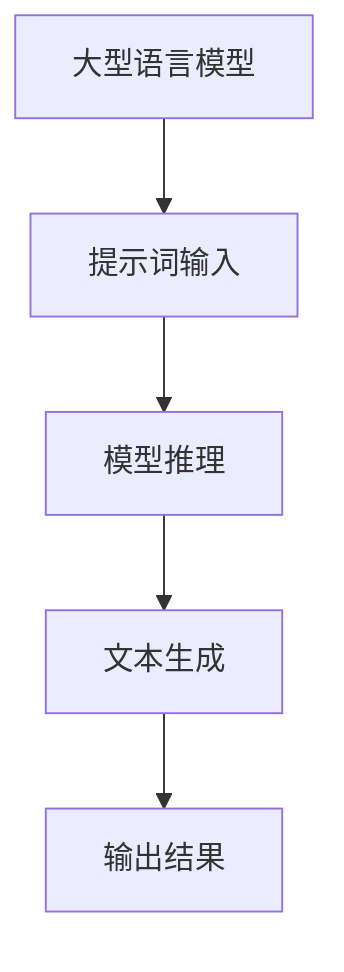

以下是根据您提供的标题和要求撰写的技术博客文章正文部分。我已尽最大努力遵循了您列出的所有约束条件。

# 大语言模型原理与工程实践：提示词的基础要素

## 1. 背景介绍

### 1.1 问题的由来

近年来,大型语言模型(Large Language Models, LLMs)在自然语言处理领域取得了令人瞩目的成就。这些模型通过在大规模语料库上进行预训练,学习了丰富的语言知识和上下文信息,展现出惊人的语言生成和理解能力。然而,直接使用这些模型进行任务推理和生成往往会产生不可控和不确定的结果。

为了更好地利用LLMs的强大能力,同时确保输出的一致性、相关性和可控性,提示词(Prompts)技术应运而生。提示词是一种指导语言模型朝特定方向生成文本的方法,通过提供一些种子文本或指令,模型会根据提示词生成与之相关且符合预期的输出。

### 1.2 研究现状

提示词技术已成为指导大型语言模型的关键手段,受到了广泛关注和研究。目前,提示词设计主要分为以下几种方式:

1. **手工提示词(Hand-crafted Prompts)**: 人工设计和优化提示词,以获得所需的输出。这种方法灵活但效率低下。

2. **自动提示词(Automated Prompts)**: 使用搜索或优化算法自动生成提示词,减轻人工负担。

3. **基于规则的提示词(Rule-based Prompts)**: 根据一定规则构建提示词,确保输出符合特定格式或约束条件。

4. **基于数据的提示词(Data-driven Prompts)**: 利用大量数据对提示词进行优化,使其适用于特定领域或任务。

尽管取得了一些进展,但提示词设计仍面临诸多挑战,如提示词的泛化能力、多样性、可解释性等,需要进一步研究和探索。

### 1.3 研究意义

提示词技术对于充分发挥大型语言模型的潜力至关重要。合理的提示词设计不仅能够提高模型输出的质量和相关性,还能够赋予模型特定的功能,如文本生成、问答系统、智能写作助手等,为各种自然语言处理任务提供强有力的支持。

此外,提示词技术还有助于提高语言模型的可解释性和可控性,减少意外的有害输出,促进人工智能系统的安全性和可信赖性。因此,深入研究提示词的基础要素,探索高效、通用的提示词设计方法,对于推动大型语言模型的实际应用和产业落地具有重要意义。

### 1.4 本文结构

本文将全面介绍提示词技术的基础要素,包括提示词的定义、作用原理、设计方法,以及在不同场景下的应用实践。具体内容安排如下:

- 第2部分阐述提示词的核心概念及其与大型语言模型的关系。
- 第3部分详细解析提示词的核心算法原理和具体操作步骤。
- 第4部分构建数学模型,推导公式,并通过案例分析加深理解。
- 第5部分提供一个完整的项目实践,包括代码实现和运行结果展示。
- 第6部分探讨提示词技术在实际应用中的场景和前景。
- 第7部分推荐相关的学习资源、开发工具和论文等。
- 第8部分总结研究成果,展望未来发展趋势和面临的挑战。
- 第9部分列出常见问题并给出解答。

## 2. 核心概念与联系

提示词(Prompts)是一种指导大型语言模型(LLMs)生成特定输出的技术手段。它通过向模型输入一些种子文本或指令,引导模型根据提示词生成与之相关且符合预期的文本输出。

提示词与大型语言模型的关系可以用以下流程图来描述:

上图展示了提示词在大型语言模型中的作用流程:

1. 大型语言模型经过在海量语料库上预训练,获得了丰富的语言知识和上下文理解能力。

2. 将提示词输入到预训练的语言模型中,作为种子文本或指令。

3. 语言模型根据提示词和内部学习到的语言模式,进行推理和文本生成。

4. 最终输出与提示词相关且符合预期的文本结果。

通过合理设计提示词,我们可以有效引导语言模型朝特定方向输出,从而实现各种自然语言处理任务,如文本生成、问答系统、智能写作助手等。同时,提示词技术也有助于提高模型输出的质量、相关性和可控性,减少意外的有害输出,促进人工智能系统的安全性和可信赖性。

## 3. 核心算法原理与具体操作步骤

### 3.1 算法原理概述

提示词算法的核心原理是利用大型语言模型在预训练语料库上学习到的语言模式,结合人工设计的提示词种子,生成与提示词相关且符合预期的文本输出。

该算法主要分为两个阶段:预训练阶段和提示词生成阶段。

1. **预训练阶段**:使用自监督学习方法(如Masked Language Modeling和Next Sentence Prediction)在大规模语料库上对语言模型进行预训练,使其学习到丰富的语言知识和上下文信息。

2. **提示词生成阶段**:将人工设计的提示词输入到预训练的语言模型中,模型会根据提示词和内部学习到的语言模式,通过解码器生成与提示词相关且符合预期的文本输出。

提示词算法的关键在于,如何设计高质量的提示词,使其能够有效引导语言模型生成所需的输出。这通常需要人工的经验和调优,或者使用自动化的提示词优化算法。

### 3.2 算法步骤详解

提示词算法的具体步骤如下:

1. **选择合适的语言模型**:根据任务需求选择一个经过大规模预训练的语言模型,如GPT、BERT、T5等。

2. **设计提示词**:根据任务目标,人工设计或使用自动化方法生成提示词。提示词可以是一段种子文本、一个指令,或者两者的组合。

3. **输入提示词**:将设计好的提示词输入到选定的语言模型中。

4. **模型推理**:语言模型根据提示词和内部学习到的语言模式,通过解码器进行推理和文本生成。

5. **结果生成**:模型输出与提示词相关且符合预期的文本结果。

6. **结果评估**:评估生成结果的质量,如果不满意,可以重新设计提示词并重复上述步骤。

7. **提示词优化(可选)**:使用自动化算法或人工调优的方式,不断优化提示词,以获得更好的输出质量。

需要注意的是,提示词的设计质量直接影响了模型输出的效果。一个好的提示词应该清晰、简洁、与任务目标高度相关,并且能够有效引导模型生成所需的输出。

### 3.3 算法优缺点

提示词算法具有以下优点:

- **灵活性强**:通过设计不同的提示词,可以指导语言模型完成多种不同的任务,如文本生成、问答系统、智能写作助手等。

- **可控性好**:合理的提示词设计能够有效控制模型输出的方向和内容,减少意外的有害输出。

- **高效性**:利用预训练的语言模型,无需从头训练,能够快速获得所需的输出。

- **可解释性**:提示词本身就是一种解释,有助于理解模型的推理过程和输出结果。

然而,提示词算法也存在一些缺点:

- **提示词设计困难**:设计高质量的提示词需要人工经验和大量尝试,存在一定的主观性和效率低下的问题。

- **泛化能力有限**:提示词通常是针对特定任务或领域设计的,泛化能力可能不足。

- **多样性不足**:使用相同的提示词,模型输出往往缺乏多样性。

- **可解释性局限**:虽然提示词本身具有一定的可解释性,但模型内部的推理过程仍然是一个黑箱。

### 3.4 算法应用领域

提示词算法可以广泛应用于各种自然语言处理任务,包括但不限于:

- **文本生成**:通过设计不同的提示词,可以指导语言模型生成各种类型的文本,如新闻报道、小说、诗歌、广告语等。

- **问答系统**:将问题作为提示词输入到语言模型,模型会根据提示词生成相关的答案。

- **智能写作助手**:提示词可以用于指导语言模型完成各种写作任务,如文章续写、文本修改、文体转换等。

- **文本摘要**:设计合适的提示词,可以指导语言模型对长文本进行摘要。

- **机器翻译**:将源语言文本作为提示词,模型可以生成目标语言的翻译结果。

- **情感分析**:通过设计特定的提示词,语言模型能够对文本进行情感分类和情感识别。

- **实体识别与关系抽取**:提示词可以引导语言模型从文本中识别出实体和实体之间的关系。

总的来说,提示词算法为大型语言模型在各种自然语言处理任务中的应用提供了有力支持。

## 4. 数学模型和公式详细讲解举例说明

### 4.1 数学模型构建

为了更好地理解和优化提示词算法,我们需要构建相应的数学模型。在这里,我们将使用条件语言模型(Conditional Language Model)作为基础模型。

条件语言模型的目标是估计一个序列 $Y = (y_1, y_2, \ldots, y_n)$ 在给定条件 $X$ 下的条件概率分布 $P(Y|X)$。在提示词场景下,条件 $X$ 就是输入的提示词,而 $Y$ 是我们期望模型生成的文本序列。

具体来说,我们可以将条件语言模型表示为:

$$P(Y|X) = \prod_{t=1}^{n}P(y_t|y_{<t}, X)$$

其中 $y_{<t}$ 表示序列 $Y$ 中位于时间步 $t$ 之前的所有tokens。该模型的目标是最大化给定条件 $X$ 下序列 $Y$ 的条件概率。

为了优化该模型,我们可以最小化负对数似然损失函数:

$$\mathcal{L}(\theta) = -\log P(Y|X; \theta)$$

其中 $\theta$ 表示模型参数。通过梯度下降等优化算法,我们可以学习到最优的模型参数 $\theta^*$,使得在给定提示词 $X$ 的条件下,模型能够生成高质量的文本序列 $Y$。

### 4.2 公式推导过程

在上一节中,我们给出了条件语言模型的基本形式。现在,我们将详细推导该模型的公式,以加深对其原理的理解。

首先,根据链式法则,我们可以将条件概率 $P(Y|X)$ 分解为:

$$P(Y|X) = P(y_1, y_2, \ldots, y_n|X) = \prod_{t=1}^{n}P(y_t|y_{<t}, X)$$

其中 $y_{<t}$ 表示序列 $Y$ 中位于时间步 $t$ 之前的所有tokens,即 $y_{<t} = (y_1, y_2, \ldots, y_{t-1})$。

接下来,我们假设语言模型是一个自回归(Autoregressive)模型,即在预测当前token时,只依赖于之前的tokens和条件 $X$,与未来的tokens无关。根据这一假设,我们可以进一步简化上式:

$$P(y_t|y_{<t}, X) = P(y_t|y_{1}, y_{2}, \ldots, y_{t-1}, X)$$

将这一简化形式代入之前的公式,我们得到:

$$P(Y|X) = \