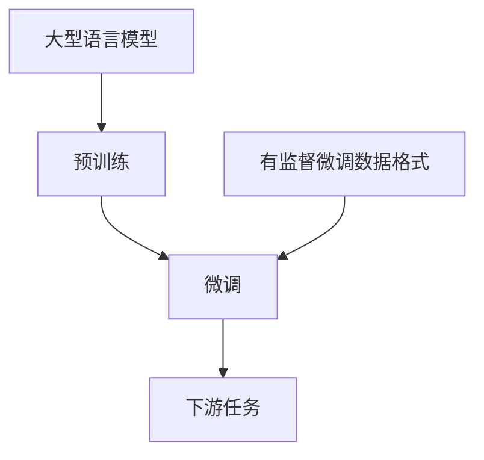

# 大语言模型原理与工程实践：有监督微调数据的格式

## 1. 背景介绍

### 1.1 问题的由来

随着人工智能技术的快速发展，大型语言模型已经成为自然语言处理领域的核心技术之一。这些模型通过在海量文本数据上进行预训练,学习到了丰富的语言知识和上下文信息,从而在下游任务上展现出了强大的泛化能力。然而,这种预训练的方式也带来了一些挑战,例如模型在特定领域的性能可能不尽如人意,或者存在不确定性和偏差等问题。

为了解决这些问题,研究人员提出了微调(Fine-tuning)的方法。微调是指在预训练的大型语言模型基础上,利用特定领域的标注数据进行进一步训练,以提高模型在该领域的性能表现。这种方法不仅可以充分利用预训练模型中蕴含的语言知识,还能够有效地将领域知识融入模型中,从而获得更加精确和专业化的语言理解和生成能力。

然而,微调过程中使用的数据格式对于模型性能的影响至关重要。不同的数据格式可能会导致模型学习到不同的知识表示,进而影响其在下游任务上的表现。因此,探索和优化有监督微调数据的格式,对于提高大型语言模型的性能和泛化能力至关重要。

### 1.2 研究现状

在过去几年中,研究人员已经对有监督微调数据的格式进行了一些初步探索。一些常见的数据格式包括:

1. **序列到序列格式(Sequence-to-Sequence)**: 这种格式将输入和输出都表示为文本序列,常用于机器翻译、文本摘要等任务。
2. **分类格式(Classification)**: 将输入文本映射到一个或多个预定义的类别标签,常用于情感分析、主题分类等任务。
3. **生成式问答格式(Generative Question Answering)**: 将问题和上下文文本作为输入,模型需要生成自然语言形式的答案。
4. **掩码语言模型格式(Masked Language Modeling)**: 在输入文本中随机掩码部分词元,模型需要预测被掩码的词元。

这些格式各有优缺点,并且对于不同的任务和领域可能表现不同。因此,探索和优化有监督微调数据的格式仍然是一个值得深入研究的课题。

### 1.3 研究意义

优化有监督微调数据的格式对于提高大型语言模型的性能和泛化能力具有重要意义:

1. **提高模型在特定领域的性能**: 通过设计合理的数据格式,可以更好地将领域知识融入模型,从而提高模型在该领域的理解和生成能力。
2. **减少模型偏差和不确定性**: 合理的数据格式有助于模型学习到更加准确和一致的知识表示,从而减少模型在推理过程中的偏差和不确定性。
3. **提高模型的可解释性**: 一些数据格式(如分类格式)可以使模型的决策过程更加透明和可解释,有助于人们理解模型的内部工作机制。
4. **促进人工智能技术的发展**: 优化有监督微调数据的格式有助于推动大型语言模型技术的进步,进而促进人工智能技术在各个领域的应用和发展。

### 1.4 本文结构

本文将全面探讨有监督微调数据的格式问题,内容安排如下:

1. 介绍大型语言模型的基本原理和微调技术的背景知识。
2. 分析和比较常见的有监督微调数据格式,包括它们的优缺点和适用场景。
3. 详细阐述核心算法原理和具体操作步骤,包括数学模型和公式的推导过程。
4. 提供代码实例和详细解释,帮助读者深入理解实现细节。
5. 探讨不同格式在实际应用场景中的表现和挑战。
6. 介绍相关工具和学习资源,方便读者进一步学习和实践。
7. 总结研究成果,并展望未来发展趋势和面临的挑战。

## 2. 核心概念与联系

在深入探讨有监督微调数据的格式之前,我们需要先了解一些核心概念和它们之间的联系。

1. **大型语言模型(Large Language Model, LLM)**: 这是一种基于深度学习技术训练的模型,能够学习和表示丰富的语言知识和上下文信息。常见的大型语言模型包括 GPT、BERT、XLNet 等。

2. **预训练(Pre-training)**: 将大型语言模型在海量文本数据上进行无监督训练的过程,使模型学习到通用的语言知识和表示能力。

3. **微调(Fine-tuning)**: 在预训练模型的基础上,利用特定领域的标注数据进行进一步训练,以提高模型在该领域的性能表现。

4. **下游任务(Downstream Task)**: 指利用微调后的大型语言模型解决实际应用中的各种自然语言处理任务,如机器翻译、文本摘要、问答系统等。

5. **有监督微调数据格式(Supervised Fine-tuning Data Format)**: 指在微调过程中使用的数据格式,它决定了模型如何学习和表示领域知识。合理的数据格式对于提高模型性能至关重要。

这些概念之间存在紧密的联系:大型语言模型通过预训练获得通用的语言表示能力,然后通过微调将特定领域的知识融入模型中,最终应用于解决下游任务。而有监督微调数据的格式则决定了模型在微调过程中如何学习和表示领域知识,对模型的性能和泛化能力产生重要影响。

## 3. 核心算法原理 & 具体操作步骤

### 3.1 算法原理概述

微调大型语言模型的核心算法原理是基于迁移学习(Transfer Learning)的思想。迁移学习旨在利用在源域(Source Domain)学习到的知识,来帮助目标域(Target Domain)的学习过程。在大型语言模型的场景中,预训练过程可以看作是在通用语料库(源域)上学习通用的语言知识,而微调过程则是将这些知识迁移并适应到特定领域(目标域)的任务上。

具体来说,微调算法的步骤如下:

1. 加载预训练好的大型语言模型,作为初始模型参数。
2. 准备特定领域的标注数据集,并按照预定义的格式进行处理和转换。
3. 在标注数据集上对预训练模型进行进一步的有监督训练,同时冻结部分层的参数以保留通用语言知识。
4. 通过反向传播算法和优化器(如 Adam)更新模型参数,使模型在特定领域的任务上达到最优性能。
5. 评估微调后模型在验证集上的性能,根据需要调整超参数和训练策略。
6. 在测试集上评估最终模型的泛化能力,并将其应用于实际场景。

在这个过程中,有监督微调数据的格式对模型性能的影响主要体现在第 2 步和第 3 步。不同的数据格式会影响模型如何理解和表示输入数据,进而影响模型在学习过程中获取领域知识的方式。因此,合理设计有监督微调数据的格式是提高模型性能的关键。

### 3.2 算法步骤详解

下面我们将详细解释微调算法的每一个步骤:

1. **加载预训练模型**

   首先,我们需要加载一个预训练好的大型语言模型,如 BERT、GPT-2 等。这些模型通常是在海量通用语料库上进行无监督预训练的,因此已经学习到了丰富的语言知识和表示能力。加载预训练模型的目的是利用这些通用知识作为初始参数,为后续的微调过程提供基础。

2. **准备标注数据集**

   接下来,我们需要准备特定领域的标注数据集,用于微调模型。这个数据集应该覆盖目标领域的各种语言现象和任务,并且数据量应该足够大,以确保模型能够有效地学习到领域知识。

   在这一步,我们还需要将标注数据转换为预定义的格式。不同的格式会影响模型如何理解和表示输入数据,因此格式的选择对模型性能至关重要。常见的格式包括序列到序列、分类、生成式问答等,我们将在后续章节详细讨论这些格式。

3. **有监督微调训练**

   有了预训练模型和格式化的标注数据集,我们就可以进行有监督微调训练了。在这个过程中,我们将预训练模型的参数作为初始值,并在标注数据集上进行进一步的训练。

   为了保留预训练模型中学习到的通用语言知识,我们通常会冻结模型的部分层(如 BERT 的编码器层),只对其他层(如分类层)进行微调。这种策略可以平衡通用知识和领域知识的重要性,从而获得更好的性能。

   训练过程中,我们使用反向传播算法和优化器(如 Adam)来更新模型参数,目标是最小化模型在标注数据集上的损失函数(如交叉熵损失)。通过多次迭代,模型将逐步学习到目标领域的知识和表示能力。

4. **评估和调优**

   在训练过程中,我们需要定期评估模型在验证集上的性能,以监控模型的收敛情况和泛化能力。根据评估结果,我们可以调整超参数(如学习率、批大小等)和训练策略(如早停、梯度裁剪等),以获得更好的性能。

   一旦模型在验证集上达到满意的性能,我们就可以在测试集上进行最终评估,以衡量模型的真实泛化能力。

5. **应用于实际场景**

   经过上述步骤,我们就获得了一个在特定领域表现出色的微调语言模型。我们可以将这个模型部署到实际的应用场景中,如机器翻译系统、问答系统、内容生成系统等,为用户提供高质量的语言服务。

需要注意的是,在实际应用中,我们还需要考虑模型的在线服务、更新策略、隐私和安全等方面的问题,以确保系统的可靠性和可维护性。

### 3.3 算法优缺点

微调大型语言模型的算法具有以下优缺点:

**优点**:

1. **利用预训练知识**: 通过利用预训练模型中学习到的通用语言知识,微调算法可以在相对较小的标注数据集上获得良好的性能,减少了从头训练模型的数据需求。

2. **高效和灵活**: 与从头训练模型相比,微调算法更加高效和灵活。我们可以快速地针对不同领域和任务进行微调,并根据需要调整微调策略和超参数。

3. **知识迁移**: 微调算法实现了知识从通用领域到特定领域的迁移,有助于模型在新领域快速适应并获得良好的泛化能力。

4. **可解释性**: 一些微调数据格式(如分类格式)可以使模型的决策过程更加透明和可解释,有助于人们理解模型的内部工作机制。

**缺点**:

1. **领域偏差**: 微调过程中使用的标注数据集可能存在一定的偏差,导致模型在某些方面的表现不尽如人意。

2. **灾难性遗忘**: 在微调过程中,模型可能会遗忘部分预训练时学习到的通用知识,从而影响其在其他领域的表现。

3. **计算资源需求**: 虽然相比从头训练模型来说更加高效,但微调过程仍然需要大量的计算资源,尤其是对于大型模型和数据集。

4. **超参数调优**: 微调过程涉及多个超参数(如学习率、批大小等),调优这些超参数以获得最佳性能可能需要大量的试验和经验。

5. **安全和隐私风险**: 由于大型语言模型具有强大的生成能力,在实