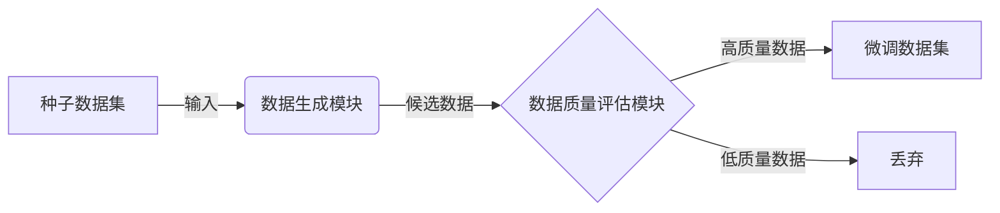
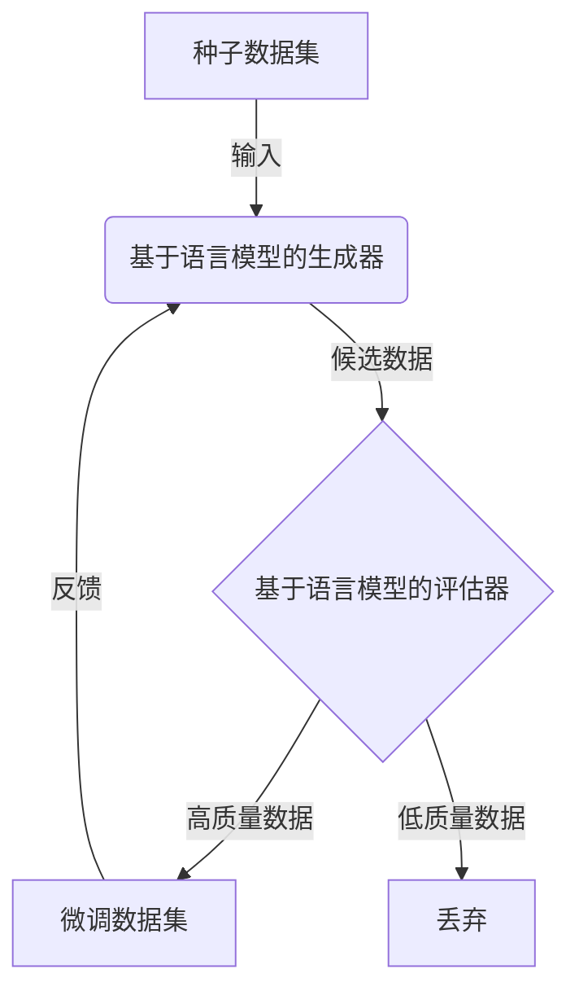

# 大语言模型原理与工程实践：有监督微调数据的自动化构建

## 1. 背景介绍

### 1.1 问题的由来

在自然语言处理(NLP)领域,大型语言模型已经取得了令人瞩目的成就。这些模型通过在海量文本数据上进行预训练,学习到了丰富的语言知识,并可以通过微调(fine-tuning)等方法,将这些知识迁移到下游任务中。然而,微调过程需要大量高质量的标注数据,而手工标注数据的过程往往耗时耗力且成本高昂。因此,如何高效地构建有监督微调数据集,成为了提高大型语言模型性能的关键瓶颈之一。

### 1.2 研究现状

目前,构建有监督微调数据集主要有以下几种方法:

1. **人工标注**: 由专业的人工标注员根据任务需求,手动标注原始文本数据。这种方法虽然可以保证数据质量,但耗时耗力且成本高昂。

2. **远程众包标注**: 通过众包平台,将标注任务分发给大量远程工作者。这种方法可以降低成本,但数据质量难以保证,且存在隐私和安全风险。

3. **自动标注**: 利用规则或模型,自动从原始数据中生成标注数据。这种方法高效且成本低廉,但生成的数据质量往往参差不齐,需要人工审核和修正。

4. **数据增强**: 通过对现有数据进行变换(如翻译、实体替换等),生成新的标注数据。这种方法可以扩充数据量,但生成的数据往往缺乏多样性。

### 1.3 研究意义

构建高质量的有监督微调数据集,对于提高大型语言模型的性能至关重要。一个自动化、高效、低成本且可控的数据构建方法,不仅可以为语言模型的微调提供充足的数据支持,还可以推动NLP技术在更多领域的应用。因此,研究有监督微调数据的自动化构建方法,具有重要的理论意义和应用价值。

### 1.4 本文结构

本文将详细介绍一种基于大型语言模型的有监督微调数据自动化构建方法。文章首先阐述了该方法的核心概念和原理,然后介绍了具体的算法步骤和数学模型。接下来,通过实际项目实践,展示了该方法的代码实现和运行结果。最后,探讨了该方法在不同场景下的应用,并对未来的发展趋势和挑战进行了展望。

## 2. 核心概念与联系

该方法的核心思想是利用大型语言模型的强大生成能力,自动构建有监督微调数据集。具体来说,我们首先定义一个种子数据集,其中包含少量高质量的人工标注数据。然后,利用语言模型对种子数据进行扩展,生成大量新的候选数据。最后,通过一个基于语言模型的数据质量评估模块,从候选数据中筛选出高质量的数据,构建最终的微调数据集。

该方法的关键在于,利用语言模型的生成能力和评估能力,实现了数据构建的自动化和质量控制。与传统的人工标注或规则标注方法相比,这种方法更加高效、灵活,且可以根据需求动态调整数据的质量和数量。

该方法可以概括为一个由三个核心模块组成的流水线系统:

1. **种子数据集**:少量高质量的人工标注数据,用于初始化系统。
2. **数据生成模块**:利用语言模型对种子数据进行扩展,生成大量候选数据。
3. **数据质量评估模块**:基于语言模型,对候选数据进行质量评估,筛选出高质量数据。

通过这种流水线方式,我们可以高效地构建大规模、高质量的有监督微调数据集,为大型语言模型的微调提供数据支持。

## 3. 核心算法原理 & 具体操作步骤

### 3.1 算法原理概述

该算法的核心原理是基于语言模型的生成-评估循环。具体来说,算法首先利用一个基于语言模型的生成器,对种子数据进行扩展,生成大量候选数据。然后,利用一个基于语言模型的评估器,对这些候选数据进行质量评估,筛选出高质量的数据,构建最终的微调数据集。

该算法的关键在于,生成器和评估器都是基于同一个大型语言模型构建的。这种设计可以确保生成的数据与评估标准保持一致,从而提高数据质量。同时,由于语言模型具有强大的生成和理解能力,该算法可以生成多样化的数据,并对数据质量进行精准评估。

算法的整体流程如下所示:

1. 从种子数据集出发,利用基于语言模型的生成器生成大量候选数据。
2. 利用基于语言模型的评估器,对候选数据进行质量评估,筛选出高质量数据,构建微调数据集。
3. 将筛选出的高质量数据反馈回生成器,作为新的种子数据,进行下一轮迭代。

通过不断迭代这个生成-评估-反馈循环,算法可以逐步扩大微调数据集的规模,并持续提高数据质量。

### 3.2 算法步骤详解

1. **初始化种子数据集**

   算法需要一个初始的种子数据集作为起点。这个数据集应该包含少量高质量的人工标注数据,用于初始化生成器和评估器。种子数据集的质量和多样性将直接影响后续生成数据的质量。

2. **构建基于语言模型的生成器**

   利用大型语言模型,构建一个基于语言模型的生成器。生成器的作用是根据种子数据,生成大量新的候选数据。

   生成器可以采用不同的生成策略,如基于模板的生成、基于规则的生成、基于上下文的生成等。不同的生成策略可以产生不同类型的候选数据,以满足不同任务的需求。

3. **构建基于语言模型的评估器**

   利用同一个大型语言模型,构建一个基于语言模型的评估器。评估器的作用是对生成器生成的候选数据进行质量评估,筛选出高质量的数据。

   评估器可以采用不同的评估指标,如语义相关性、语法正确性、逻辑一致性等。不同的评估指标可以捕捉数据质量的不同方面,以满足不同任务的需求。

4. **生成-评估-反馈循环**

   进入生成-评估-反馈循环的迭代过程:

   a. 生成器基于当前的种子数据集,生成大量新的候选数据。
   
   b. 评估器对这些候选数据进行质量评估,筛选出高质量的数据,构建微调数据集。
   
   c. 将筛选出的高质量数据反馈回生成器,作为新的种子数据,进行下一轮迭代。

5. **终止条件**

   算法可以根据预设的终止条件(如目标数据量、质量阈值等)来决定是否终止迭代。如果满足终止条件,则输出最终的微调数据集;否则,继续下一轮迭代。

通过上述步骤,算法可以自动化地构建大规模、高质量的有监督微调数据集,为大型语言模型的微调提供数据支持。

### 3.3 算法优缺点

**优点**:

1. **自动化**:算法可以自动化地生成和评估数据,大大提高了数据构建的效率。

2. **高质量**:由于生成器和评估器都基于同一个大型语言模型,生成的数据质量可以得到有效保证。

3. **可扩展性**:通过调整生成策略和评估指标,算法可以适应不同类型的任务和数据需求。

4. **低成本**:相比人工标注,该算法的成本更低,且可以根据需求动态调整数据量。

**缺点**:

1. **种子数据依赖**:算法的性能在一定程度上依赖于初始种子数据的质量和多样性。

2. **评估偏差**:评估器可能存在一定的偏差,导致一些高质量数据被错误地丢弃。

3. **计算资源需求**:训练和运行大型语言模型需要大量的计算资源。

4. **潜在风险**:生成的数据可能存在一定的偏差或不当内容,需要进一步的审核和过滤。

### 3.4 算法应用领域

该算法可以广泛应用于需要大规模有监督微调数据的自然语言处理任务,包括但不限于:

1. **文本分类**:构建文本分类数据集,用于训练文本分类模型。

2. **机器翻译**:构建平行语料库,用于训练机器翻译模型。

3. **问答系统**:构建问答对数据集,用于训练问答系统。

4. **情感分析**:构建情感标注数据集,用于训练情感分析模型。

5. **实体识别**:构建实体标注数据集,用于训练实体识别模型。

6. **关系抽取**:构建关系标注数据集,用于训练关系抽取模型。

7. **事件抽取**:构建事件标注数据集,用于训练事件抽取模型。

8. **对话系统**:构建对话数据集,用于训练对话系统模型。

总的来说,该算法可以为各种自然语言处理任务提供高质量的微调数据支持,促进这些任务的模型性能提升。

## 4. 数学模型和公式 & 详细讲解 & 举例说明

在该算法中,我们需要构建两个关键的基于语言模型的模块:生成器和评估器。这两个模块都可以建模为条件语言模型,其数学表示如下:

$$P(y|x;\theta)$$

其中:

- $x$表示输入序列(如种子数据或候选数据)
- $y$表示输出序列(如生成的数据或评估结果)
- $\theta$表示模型参数

### 4.1 数学模型构建

#### 生成器模型

生成器模型的目标是根据输入的种子数据$x$,生成新的候选数据$y$。我们可以将其建模为一个条件语言模型:

$$P_\text{gen}(y|x;\theta_\text{gen})$$

其中$\theta_\text{gen}$表示生成器模型的参数。

在训练阶段,我们可以最大化生成器在种子数据集$\mathcal{D}_\text{seed}$上的条件对数似然:

$$\max_{\theta_\text{gen}}\sum_{(x,y)\in\mathcal{D}_\text{seed}}\log P_\text{gen}(y|x;\theta_\text{gen})$$

在生成阶段,给定种子数据$x$,我们可以通过贪婪搜索或束搜索等方法,生成最可能的候选数据序列$y^*$:

$$y^*=\arg\max_y P_\text{gen}(y|x;\theta_\text{gen})$$

#### 评估器模型

评估器模型的目标是对生成器生成的候选数据$y$进行质量评估,给出一个评分$s$。我们可以将其建模为另一个条件语言模型:

$$P_\text{eval}(s|y;\theta_\text{eval})$$

其中$\theta_\text{eval}$表示评估器模型的参数。

在训练阶段,我们可以最大化评估器在标注数据集$\mathcal{D}_\text{eval}$上的条件对数似然:

$$\max_{\theta_\text{eval}}\sum_{(y,s)\in\mathcal{D}_\text{eval}}\log P_\text{eval}(s|y;\theta_\text{eval})$$

其中$\mathcal{D}_\text{eval}$包