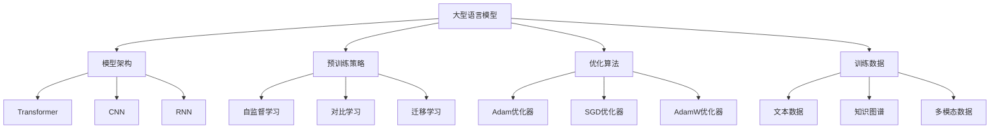

# 大语言模型原理与工程实践：组成模块选型

## 1. 背景介绍

### 1.1 问题的由来

随着深度学习技术的不断发展,大型语言模型(Large Language Models, LLMs)已经成为自然语言处理(NLP)领域的核心技术之一。这些模型通过在海量文本数据上进行预训练,学习语言的语义和上下文信息,从而获得强大的语言理解和生成能力。然而,构建一个高质量的大型语言模型并非易事,需要考虑诸多因素,如模型架构、训练数据、优化算法等,这对模型的性能和效率有着深远影响。

### 1.2 研究现状 

目前,学术界和工业界都在积极探索大型语言模型的构建方法。一些知名的大型语言模型,如GPT-3、BERT、XLNet等,已经在自然语言处理任务中取得了卓越的成绩。然而,这些模型往往需要耗费大量的计算资源进行训练,并且对于特定任务的性能仍有提升空间。因此,如何高效地构建和优化大型语言模型,成为了当前研究的重点。

### 1.3 研究意义

大型语言模型在自然语言处理领域扮演着越来越重要的角色,它们可以应用于机器翻译、文本摘要、问答系统、对话系统等多个领域。优化大型语言模型的构建过程,不仅可以提高模型的性能和效率,还能降低训练和推理的计算成本,从而推动自然语言处理技术在实际应用中的落地。此外,探索大型语言模型的构建方法,也有助于深入理解深度学习模型的内在机制,为未来的模型创新提供启发。

### 1.4 本文结构

本文将全面探讨大型语言模型的构建原理和工程实践。首先介绍大型语言模型的核心概念和关键组成模块,并分析它们之间的联系。接下来,详细阐述核心算法原理和具体操作步骤,包括模型架构、预训练策略、优化算法等。然后,从数学角度建立模型公式,并通过案例分析进行详细讲解。此外,还将提供一个完整的项目实践,包括开发环境搭建、源代码实现、运行结果展示等。最后,探讨大型语言模型在实际应用中的场景,并总结未来的发展趋势和面临的挑战。

## 2. 核心概念与联系

大型语言模型是一种基于深度学习的自然语言处理模型,它通过在海量文本数据上进行预训练,学习语言的语义和上下文信息,从而获得强大的语言理解和生成能力。构建一个高质量的大型语言模型需要考虑多个关键组成模块,包括模型架构、预训练策略、优化算法、训练数据等,这些模块相互关联,共同影响着模型的性能和效率。

模型架构决定了模型的基本结构和计算方式,常见的架构包括Transformer、CNN、RNN等。预训练策略则决定了模型如何从大规模数据中学习语言知识,包括自监督学习、对比学习、迁移学习等方法。优化算法负责调整模型参数,以最小化损失函数,常用的优化器有Adam、SGD、AdamW等。训练数据是模型学习的基础,可以包括文本数据、知识图谱、多模态数据等。这些组成模块相互影响,需要综合考虑和权衡,才能构建出高质量的大型语言模型。

## 3. 核心算法原理与具体操作步骤

### 3.1 算法原理概述

大型语言模型的核心算法原理主要包括两个方面:自注意力机制(Self-Attention Mechanism)和掩码语言模型(Masked Language Model, MLM)。

自注意力机制是Transformer模型的核心,它允许模型在计算每个单词的表示时,同时关注整个输入序列中的所有单词,捕捉长距离依赖关系。这种机制克服了传统RNN和CNN模型在处理长序列时的局限性,大大提高了模型的表现力。

掩码语言模型则是一种自监督预训练策略,它通过随机掩码输入序列中的部分单词,要求模型根据上下文预测被掩码的单词。这种方式可以有效利用大规模无标注数据进行预训练,使模型学习到丰富的语言知识,为下游任务提供良好的初始化参数。

### 3.2 算法步骤详解

1. **输入表示**:首先将输入文本序列转换为向量表示,通常使用词嵌入(Word Embedding)或子词嵌入(Subword Embedding)的方式。

2. **位置编码**:为了捕捉单词在序列中的位置信息,需要为每个单词添加位置编码(Position Encoding)。

3. **多头注意力**:将输入向量序列输入到多头注意力层(Multi-Head Attention),计算每个单词与其他单词的注意力权重,得到加权和的注意力表示。

4. **前馈网络**:将注意力表示输入到前馈网络(Feed-Forward Network),进行非线性变换,得到该层的输出表示。

5. **残差连接**:将前馈网络的输出与输入相加,实现残差连接(Residual Connection),帮助梯度传播。

6. **层归一化**:对残差连接的结果进行层归一化(Layer Normalization),加速收敛。

7. **堆叠编码器**:重复上述步骤,堆叠多个编码器层(Encoder Layer),提取更高层次的语义表示。

8. **掩码语言模型**:在预训练阶段,随机掩码部分输入单词,将编码器的输出作为掩码语言模型的输入,预测被掩码的单词。

9. **微调**:在下游任务上,根据任务目标对预训练模型进行微调(Fine-tuning),得到特定任务的模型。

### 3.3 算法优缺点

**优点**:

- 自注意力机制能够有效捕捉长距离依赖关系,提高模型的表现力。
- 掩码语言模型可以充分利用大规模无标注数据进行预训练,学习丰富的语言知识。
- 模型结构高度并行化,可以利用GPU/TPU等硬件加速训练。
- 预训练模型可以通过微调应用于多种下游任务,具有很强的通用性。

**缺点**:

- 训练过程计算量大,对硬件资源要求高,训练成本昂贵。
- 模型参数巨大,推理时的内存占用和延迟较高,不利于部署。
- 存在一定的偏见和不公平性,生成的文本可能包含有害内容。
- 缺乏真正的理解能力,只是基于统计模式进行预测。

### 3.4 算法应用领域

大型语言模型由于其强大的语言理解和生成能力,在自然语言处理领域有着广泛的应用前景:

- **机器翻译**:可以将一种语言的文本准确翻译成另一种语言。
- **文本摘要**:能够自动生成文本的摘要,提高信息获取效率。
- **问答系统**:根据提问和背景知识,生成准确的答案。
- **对话系统**:可以与人进行自然的多轮对话交互。
- **文本生成**:用于新闻报道、小说创作、广告文案等文本生成任务。
- **情感分析**:分析文本的情感倾向,用于舆情监测、客户服务等。
- **实体识别**:识别文本中的人名、地名、组织机构等实体。
- **关系抽取**:从文本中抽取实体之间的语义关系。

## 4. 数学模型和公式详细讲解与举例说明

### 4.1 数学模型构建

大型语言模型的数学模型主要基于自注意力机制和掩码语言模型,可以用以下公式表示:

$$J(\theta) = \frac{1}{N}\sum_{i=1}^N\sum_{t=1}^T-\log P(x_t^{(i)}|x_{\neg t}^{(i)};\theta)$$

其中:

- $J(\theta)$是需要最小化的损失函数
- $N$是训练样本的数量
- $T$是每个序列的长度
- $x_t^{(i)}$是第$i$个样本序列中的第$t$个单词
- $x_{\neg t}^{(i)}$是除去$x_t^{(i)}$的其余单词
- $\theta$是模型的参数

目标是最小化损失函数$J(\theta)$,使模型能够最大化预测被掩码单词$x_t^{(i)}$的条件概率$P(x_t^{(i)}|x_{\neg t}^{(i)};\theta)$。

### 4.2 公式推导过程

我们先定义注意力分数(Attention Score)$e_{ij}$,表示查询向量(Query Vector)$q_i$对键向量(Key Vector)$k_j$的注意力程度:

$$e_{ij} = \frac{q_i^Tk_j}{\sqrt{d_k}}$$

其中$d_k$是缩放因子,用于防止点积过大导致梯度消失。

然后通过Softmax函数将注意力分数归一化为概率值:

$$a_{ij} = \text{softmax}(e_{ij}) = \frac{\exp(e_{ij})}{\sum_k \exp(e_{ik})}$$

最后,将注意力概率$a_{ij}$与值向量(Value Vector)$v_j$相乘,得到加权和的注意力表示$z_i$:

$$z_i = \sum_j a_{ij}v_j$$

通过堆叠多个注意力层和前馈网络层,模型可以学习到输入序列的高层次语义表示,从而预测被掩码的单词。

### 4.3 案例分析与讲解

假设我们有一个输入序列"The cat sat on the ___ mat",其中"___"表示被掩码的单词。我们希望模型能够根据上下文预测出被掩码的单词是"red"。

首先,将输入序列转换为向量表示,并添加位置编码。然后,将这些向量输入到自注意力层,计算每个单词与其他单词的注意力分数。

例如,对于单词"cat",它需要关注"The"和"sat"这两个单词,以捕捉主语和动词的信息。而对于被掩码的单词"___",它需要关注"the"、"on"和"mat"这三个单词,以推测出它可能是形容词修饰"mat"。

通过多头注意力机制,模型可以从不同的子空间捕捉不同的注意力模式,提高表示能力。前馈网络则允许模型对注意力表示进行非线性变换,提取更高层次的语义信息。

最终,模型会输出一个概率分布,表示被掩码单词是词表中每个单词的概率。如果模型训练得当,它应该会给出较高的$P(\text{red}|x_{\neg t})$概率,正确预测被掩码的单词是"red"。

### 4.4 常见问题解答

**Q1:为什么需要位置编码?**

A1:由于自注意力机制是无序的,单词的顺序信息会丢失。位置编码可以为每个单词添加位置信息,使模型能够捕捉单词在序列中的相对位置,从而更好地理解语义。

**Q2:多头注意力的作用是什么?**

A2:单一的注意力机制只能从一个子空间捕捉注意力模式,而多头注意力则允许模型从不同的子空间捕捉不同的注意力模式,提高了模型的表示能力。

**Q3:为什么需要残差连接和层归一化?**

A3:残差连接可以更好地传递梯度信息,缓解梯度消失或爆炸问题。层归一化则能够加速模型的收敛,提高训练稳定性。

**Q4:掩码语言模型与其他预训练任务(如下一句预测)有何