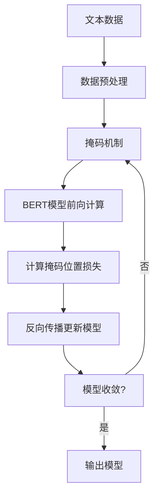

以下是题为《大语言模型原理与工程实践：训练目标》的技术博客文章正文内容：

# 大语言模型原理与工程实践：训练目标

## 1. 背景介绍

### 1.1 问题的由来

在自然语言处理(NLP)领域,大型语言模型已成为推动技术进步的核心驱动力。随着计算能力的不断提高和海量数据的积累,训练大规模语言模型成为可能。然而,训练高质量的大型语言模型面临诸多挑战,需要对训练目标、算法和工程实现等多方面进行深入探究。

### 1.2 研究现状  

目前,以GPT、BERT、XLNet等为代表的大型语言模型已在多项NLP任务上取得了令人瞩目的成绩。但这些模型在训练过程中仍存在一些问题,如训练数据质量参差不齐、目标函数设计不合理、模型容量有限等,导致生成质量和泛化能力受到一定影响。

### 1.3 研究意义

深入探讨大型语言模型的训练目标具有重要的理论和实践意义。合理设计训练目标有助于提高模型的生成质量和泛化性能,从而推动NLP技术在机器翻译、对话系统、问答系统等领域的应用。同时,训练目标的研究也将为语言模型的可解释性和可控性提供新的思路。

### 1.4 本文结构

本文将从训练目标的角度出发,全面剖析大型语言模型的原理和工程实践。我们将首先介绍核心概念,阐明训练目标与模型性能之间的内在联系;然后深入探讨训练目标的设计原理,并给出具体的算法步骤;接着构建数学模型,推导公式并结合案例进行讲解;再通过项目实践展示代码实现细节;最后分析实际应用场景,并对未来发展趋势和挑战进行展望。

## 2. 核心概念与联系

大型语言模型的训练目标通常可分为两大类:生成目标(generative objective)和判别目标(discriminative objective)。

生成目标旨在最大化语言模型对训练语料的生成概率,即模型需要学会生成与训练数据相似的自然语句。常见的生成目标包括语言模型目标(language modeling objective)和掩码语言模型目标(masked language modeling objective)等。

判别目标则要求模型能够区分真实数据与虚假数据,即对正确的文本样本赋予较高分值,对错误样本赋予较低分值。这类目标包括下一句预测(Next Sentence Prediction)、句子排序(Sentence Order Prediction)等。

不同的训练目标对应不同的模型偏好,生成目标更关注语言的流畅性,而判别目标则更重视语义的一致性。合理设计和权衡这两类目标对于获得高质量的语言模型至关重要。

## 3. 核心算法原理 & 具体操作步骤

### 3.1 算法原理概述

大型语言模型的训练算法主要基于自编码器(Autoencoder)和自回归(Autoregressive)两大范式。前者将输入文本编码为连续向量表示,再由解码器重建原始文本;后者则按照自然语序生成文本,每个时间步的输出都作为下一步的输入。

常见的自编码器算法包括BERT和XLNet等,它们通过掩码机制和下一句预测等判别目标,学习文本的双向语义表示。而GPT系列模型则采用自回归范式,以语言模型目标作为主要训练目标。

此外,一些工作尝试将自编码器和自回归有机结合,如BART、T5等,以期获得更优的性能表现。

### 3.2 算法步骤详解

以BERT的掩码语言模型目标为例,其训练步骤可概括为:

1. **数据预处理**:将文本切分为词元序列,并执行子词切分、词元位置编码等预处理操作。

2. **掩码机制**:随机选取15%的词元进行掩码,其中80%替换为特殊token [MASK],10%保持不变,10%替换为随机词元。

3. **前向传播**:将掩码后的序列输入BERT模型,获得每个位置的上下文向量表示。

4. **计算损失**:对于被掩码的词元位置,计算其预测值与真实值之间的交叉熵损失。

5. **反向传播**:根据损失值更新BERT模型参数。

6. **模型更新**:重复以上步骤,直至模型收敛。

该算法的关键在于掩码机制,它迫使模型充分利用上下文信息来预测被掩码的词元,从而学习到双向语义表示。



### 3.3 算法优缺点

掩码语言模型目标的优点在于:

1. 充分利用上下文信息,学习双向语义表示。
2. 掩码机制迫使模型专注于难以预测的位置。
3. 相比完形填空,掩码比例更高,学习难度更大。

但也存在一些不足:

1. 训练过程中需要引入噪声,增加了训练难度。
2. 预测目标为离散词元,无法直接优化生成质量。
3. 缺乏全局语义一致性建模。

### 3.4 算法应用领域

掩码语言模型目标广泛应用于各类NLP任务,如文本分类、序列标注、阅读理解等。BERT及其变体模型在多项公开测评中表现出色,成为通用语义表示学习的主流方法。

除NLP外,该算法也可扩展至计算机视觉、音频处理等其他领域,用于学习模态间的统一表示。

## 4. 数学模型和公式 & 详细讲解 & 举例说明

### 4.1 数学模型构建

我们将语言模型的生成过程建模为条件概率 $P(X)$,其中 $X=(x_1,x_2,\ldots,x_n)$ 表示长度为 $n$ 的词元序列。根据链式法则,该概率可分解为:

$$P(X)=\prod_{t=1}^{n}P(x_t|x_1,\ldots,x_{t-1})$$

即当前词元 $x_t$ 的概率条件于之前所有词元的出现。我们的目标是最大化语料库 $\mathcal{D}$ 中所有序列的生成概率:

$$\max_{\theta}\sum_{X\in\mathcal{D}}\log P_{\theta}(X)$$

其中 $\theta$ 为模型参数。

对于判别目标,我们将其形式化为二分类问题。以下一句预测为例,令 $X=(x_1,x_2)$ 和 $Y=(y_1,y_2)$ 分别表示两个连续句子,目标是最大化它们是否为连续句子对的概率:

$$\max_{\theta}\sum_{(X,Y)\in\mathcal{D}}\log P_{\theta}(X\sim Y)$$

其中 $X\sim Y$ 表示 $X$ 和 $Y$ 为连续句子对,否则为 $X\nsim Y$。

### 4.2 公式推导过程

我们以语言模型目标为例,推导其对数似然目标函数。首先,基于链式法则,语言模型的生成概率为:

$$\begin{aligned}
P(X) &= P(x_1,x_2,\ldots,x_n)\\
     &= P(x_1)P(x_2|x_1)\cdots P(x_n|x_1,\ldots,x_{n-1})\\
     &= \prod_{t=1}^{n}P(x_t|x_1,\ldots,x_{t-1})
\end{aligned}$$

对数似然目标函数为:

$$\begin{aligned}
\mathcal{L}(\theta) &= \log P_{\theta}(X)\\
                   &= \log\prod_{t=1}^{n}P_{\theta}(x_t|x_1,\ldots,x_{t-1})\\
                   &= \sum_{t=1}^{n}\log P_{\theta}(x_t|x_1,\ldots,x_{t-1})
\end{aligned}$$

在训练时,我们最大化语料库 $\mathcal{D}$ 中所有序列的对数似然:

$$\max_{\theta}\sum_{X\in\mathcal{D}}\mathcal{L}(\theta)=\max_{\theta}\sum_{X\in\mathcal{D}}\sum_{t=1}^{n}\log P_{\theta}(x_t|x_1,\ldots,x_{t-1})$$

### 4.3 案例分析与讲解

考虑一个简单的例子,假设我们的语料库只包含两个句子:"the cat sat on the mat"和"i am a student"。令模型参数 $\theta$ 为词元的概率分布,我们将计算第一个句子的对数似然 $\mathcal{L}(\theta)$。

首先,我们需要知道每个词元的条件概率,例如:

$$\begin{aligned}
P_{\theta}(\text{the}|\varnothing) &= 0.3\\  
P_{\theta}(\text{cat}|\text{the}) &= 0.6\\
P_{\theta}(\text{sat}|\text{the,cat}) &= 0.2\\
&\vdots
\end{aligned}$$

则第一个句子的对数似然为:

$$\begin{aligned}
\mathcal{L}(\theta) &= \log P_{\theta}(\text{the}|\varnothing) + \log P_{\theta}(\text{cat}|\text{the}) + \log P_{\theta}(\text{sat}|\text{the,cat}) + \cdots\\
                   &= \log 0.3 + \log 0.6 + \log 0.2 + \cdots\\
                   &= -1.2 - 0.51 - 1.61 + \cdots
\end{aligned}$$

在训练过程中,我们将最大化语料库中所有句子的对数似然之和,从而获得最优的参数 $\theta$。

### 4.4 常见问题解答

**Q1:为什么要最大化生成概率,而不是判别概率?**

A1:生成概率更能反映语言模型对文本的建模能力。判别任务往往过于理想化,无法完全捕捉语言的复杂性。但判别目标也有其优势,如BERT中的掩码语言模型目标,能够学习双向语义表示。合理结合两者往往能取得更好的效果。

**Q2:为什么要对数似然目标,而不是直接最大化生成概率?**

A2:由于生成概率往往是个很小的数值,直接最大化可能会由于下溢出(underflow)而失败。对数似然目标能够将乘法转化为加法,避免了这一问题。此外,对数运算也能缩小数值范围,有利于优化算法的收敛。

**Q3:生成目标与判别目标的关系是什么?**

A3:生成目标和判别目标实际上是密切相关的。判别模型也可以用于生成任务,例如通过对比真实数据和虚假数据的分数差异来指导生成。而生成模型也可用于判别任务,例如通过生成概率的高低来判别样本质量。二者在本质上是统一的,只是侧重点不同。

## 5. 项目实践:代码实例和详细解释说明  

### 5.1 开发环境搭建

我们使用PyTorch作为深度学习框架,并基于Hugging Face的Transformers库实现BERT的掩码语言模型训练。首先,我们需要安装相关依赖:

```bash
pip install transformers
```

然后下载BERT预训练权重和词表文件:

```python
from transformers import BertTokenizer, BertForMaskedLM

tokenizer = BertTokenizer.from_pretrained('bert-base-uncased')
model = BertForMaskedLM.from_pretrained('bert-base-uncased')
```

### 5.2 源代码详细实现

以下是BERT掩码语言模型训练的核心代码:

```python
import torch

sentences = ["This is a great [MASK] movie.","I enjoyed the [MASK] last night."]
inputs = tokenizer(sentences, return_tensors="pt", padding=True)
labels = inputs.input_ids.clone()

# 创建掩码
mask_token_index = tokenizer.mask_token_id
probability_matrix = torch.full(labels.shape, 0.15)
mask_indices = torch.bernoulli(probability_matrix).bool()
labels[~mask_indices] = -100  # 忽略非掩码位置的损失

inputs.input_ids[mask_indices] = mask_token_index

outputs = model(**inputs, labels=