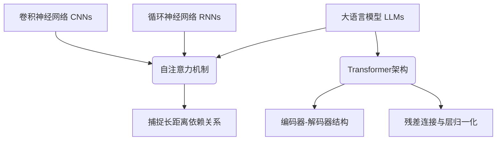

# 大语言模型原理基础与前沿 人工智能加速器

## 1. 背景介绍

### 1.1 问题的由来

在过去的几年中,自然语言处理(NLP)领域取得了令人瞩目的进展,很大程度上归功于大型语言模型(Large Language Models, LLMs)的出现和发展。LLMs是一种基于深度学习的人工智能模型,旨在从大量文本数据中学习语言的模式和结构,从而生成看似人类编写的自然语言输出。

传统的NLP系统通常依赖于手工设计的规则和特征,需要大量的人工干预和领域知识。然而,随着数据量和计算能力的不断增长,基于深度学习的方法开始占据主导地位,尤其是自注意力(Self-Attention)机制的引入,使得Transformer模型在捕捉长距离依赖关系方面表现出色,从而推动了LLMs的发展。

最初,LLMs主要用于生成高质量的文本,如机器翻译、文本摘要等。但随着模型规模和训练数据的不断扩大,LLMs展现出了惊人的泛化能力,可以应用于广泛的下游任务,如问答系统、代码生成、文本分类等,成为通用的人工智能基础模型。

### 1.2 研究现状

近年来,LLMs的发展可谓日新月异,不断刷新着模型规模和性能的记录。以GPT(Generative Pre-trained Transformer)系列模型为代表,从GPT-1(1.5亿参数)到GPT-3(1750亿参数),参数规模增长了数千倍,展现出了强大的语言生成能力。

除了参数规模的扩大,LLMs的训练数据和方法也在不断优化。一方面,训练语料库从开放网络数据扩展到包括书籍、论文等高质量数据;另一方面,采用了更加高效的训练策略,如反向语言模型(Reversed Language Model)、前馈语言模型(Prefix Language Model)等,进一步提高了模型的性能。

值得一提的是,LLMs不仅在英语等主流语言上取得了卓越成绩,在多语种场景下也展现出了强大的能力。例如,Meta AI推出的LLM模型可以支持100多种语言,为不同语言社区提供了强大的语言智能支持。

### 1.3 研究意义

LLMs的发展对于推动人工智能技术的进步具有重要意义:

1. **通用智能基础**:LLMs作为通用的语言智能基础模型,可以支持广泛的下游应用,为构建通用人工智能系统奠定基础。
2. **降低开发门槛**:LLMs的强大泛化能力,使得开发人员无需从头构建复杂的NLP系统,而是可以直接基于LLMs进行微调和开发,大大降低了开发门槛。
3. **促进人机协作**:LLMs可以与人类进行自然的语言交互,为人机协作提供了新的途径,有助于提高工作效率和决策质量。
4. **推动科技发展**:LLMs在自然语言理解、生成、推理等方面的卓越表现,为推动人工智能、认知科学、语言学等学科的发展提供了新的视角和动力。

### 1.4 本文结构

本文将全面介绍LLMs的基础原理、核心算法、数学模型,以及在实际应用中的实践和案例分析。文章结构安排如下:

- 第2章将阐述LLMs的核心概念,包括自注意力机制、Transformer架构等,并探讨它们与其他模型的联系。
- 第3章将深入剖析LLMs的核心算法原理,包括自回归(Auto-Regressive)语言模型、掩码语言模型(Masked Language Model)等,并详细讲解具体的操作步骤。
- 第4章将介绍LLMs的数学模型和公式推导,包括自注意力计算、损失函数优化等,并通过案例分析加深理解。
- 第5章将提供LLMs的实际代码实现,包括开发环境搭建、源代码解读、运行结果展示等,帮助读者掌握实践技能。
- 第6章将探讨LLMs在各个领域的实际应用场景,如机器翻译、问答系统、代码生成等,并展望未来的发展方向。
- 第7章将为读者推荐相关的学习资源、开发工具、论文等,帮助进一步深入学习和研究。
- 第8章将总结LLMs的研究成果,分析未来的发展趋势和面临的挑战,并对未来的研究方向进行展望。
- 第9章将回答一些常见的问题,帮助读者更好地理解和掌握LLMs的相关知识。

## 2. 核心概念与联系

大语言模型(LLMs)的核心概念主要包括自注意力机制(Self-Attention Mechanism)和Transformer架构。

### 2.1 自注意力机制

自注意力机制是LLMs中一个关键的创新,它允许模型在计算表示时关注输入序列中的不同位置,从而捕捉长距离依赖关系。与传统的循环神经网络(RNNs)和卷积神经网络(CNNs)相比,自注意力机制具有以下优势:

1. **并行计算**:自注意力机制可以同时关注输入序列的所有位置,而不需要递归计算,因此具有更好的并行计算能力。
2. **长距离依赖**:自注意力机制可以直接建立任意两个位置之间的关联,而不受距离限制,从而更好地捕捉长距离依赖关系。
3. **可解释性**:自注意力机制可以通过注意力权重直观地解释模型的决策过程,提高了模型的可解释性。

自注意力机制的计算过程可以概括为三个步骤:

1. **计算注意力分数**:通过查询(Query)、键(Key)和值(Value)之间的相似度计算,获得每个位置对应的注意力分数。
2. **归一化注意力分数**:使用Softmax函数对注意力分数进行归一化,得到注意力权重。
3. **加权求和**:将注意力权重与值(Value)相乘,再对所有位置的加权值求和,得到最终的表示。

### 2.2 Transformer架构

Transformer是一种全新的序列到序列(Seq2Seq)模型架构,它完全基于自注意力机制,不依赖于RNNs或CNNs。Transformer架构主要包括两个核心组件:

1. **编码器(Encoder)**:将输入序列映射为连续的表示,用于捕捉输入的语义信息。
2. **解码器(Decoder)**:基于编码器的输出和前一时间步的输出,生成目标序列的下一个元素。

编码器和解码器都由多个相同的层组成,每一层包含了多头自注意力(Multi-Head Attention)和前馈神经网络(Feed-Forward Neural Network)两个子层。此外,Transformer还引入了残差连接(Residual Connection)和层归一化(Layer Normalization)等技术,有助于提高模型的性能和稳定性。

Transformer架构的优势在于:

1. **并行计算**:完全基于自注意力机制,可以高效利用现代硬件(如GPU)的并行计算能力。
2. **长距离依赖**:自注意力机制可以有效捕捉长距离依赖关系,适用于长序列建模。
3. **灵活性**:编码器-解码器结构使得Transformer可以应用于广泛的序列到序列任务,如机器翻译、文本摘要等。

Transformer架构的提出,为LLMs的发展奠定了坚实的基础,使得训练大规模语言模型成为可能。随着模型规模和训练数据的不断扩大,LLMs展现出了惊人的泛化能力,成为通用的人工智能基础模型。

## 3. 核心算法原理 & 具体操作步骤

### 3.1 算法原理概述

LLMs的核心算法原理主要包括两个方面:自回归语言模型(Auto-Regressive Language Model)和掩码语言模型(Masked Language Model)。

#### 3.1.1 自回归语言模型

自回归语言模型旨在学习一个条件概率分布 $P(x_t|x_{<t})$,即给定前面的词 $x_{<t}$,预测下一个词 $x_t$ 的概率。这种模型通常采用序列生成的方式,每次生成一个词,然后将其作为输入,继续生成下一个词。

自回归语言模型的训练目标是最大化给定训练数据的似然函数:

$$\mathcal{L}_\text{AR} = \sum_{x \in \mathcal{D}} \log P(x) = \sum_{x \in \mathcal{D}} \sum_{t=1}^{T} \log P(x_t | x_{<t}; \theta)$$

其中 $\mathcal{D}$ 表示训练数据集, $T$ 表示序列长度, $\theta$ 表示模型参数。

在推理阶段,自回归语言模型可以通过贪婪搜索或beam search等策略生成新的序列。

#### 3.1.2 掩码语言模型

掩码语言模型则采用了不同的训练方式。它将一部分词随机掩码(替换为特殊标记),然后训练模型预测这些被掩码的词。这种方式可以并行训练,提高了计算效率。

掩码语言模型的训练目标是最大化被掩码词的条件概率:

$$\mathcal{L}_\text{MLM} = \sum_{x \in \mathcal{D}} \sum_{t \in \mathcal{M}} \log P(x_t | x_{\backslash t}; \theta)$$

其中 $\mathcal{M}$ 表示被掩码词的位置集合, $x_{\backslash t}$ 表示除去位置 $t$ 的其他词。

在推理阶段,掩码语言模型通常用于填充被掩码的词,而不是生成完整的序列。

自回归语言模型和掩码语言模型各有优缺点,前者更适合于生成任务,但训练效率较低;后者训练效率更高,但不太适合于生成长序列。实际应用中,常常会结合两种模型的优势,采用多任务学习的方式进行联合训练。

### 3.2 算法步骤详解

#### 3.2.1 自回归语言模型训练

1. **数据预处理**:将训练语料进行标记化(tokenization)和编码(encoding),将文本转换为模型可以处理的数字序列。
2. **模型初始化**:初始化Transformer模型的参数,包括embedding层、编码器层、解码器层等。
3. **前向传播**:给定输入序列 $x_{<t}$,模型计算出下一个词 $x_t$ 的条件概率分布 $P(x_t|x_{<t})$。
4. **计算损失**:根据目标词 $x_t$ 和预测的概率分布 $P(x_t|x_{<t})$,计算交叉熵损失。
5. **反向传播**:计算损失对模型参数的梯度,并使用优化器(如Adam)更新模型参数。
6. **迭代训练**:重复步骤3-5,对训练数据进行多次迭代,直到模型收敛或达到预期性能。

在训练过程中,需要注意以下几点:

- **Teacher Forcing**:为了加速训练过程,可以采用Teacher Forcing策略,即在每个时间步使用ground truth作为输入,而不是模型的预测结果。
- **梯度裁剪**:由于序列长度的变化,梯度值可能会出现爆炸或消失的情况。因此需要进行梯度裁剪,控制梯度的范围。
- **学习率调度**:合理的学习率调度策略可以提高模型的收敛速度和性能,如warmup、cosine annealing等。

#### 3.2.2 掩码语言模型训练

1. **数据预处理**:将训练语料进行标记化和编码,并随机掩码一部分词(通常15%左右)。
2. **模型初始化**:初始化Transformer编码器的参数。
3. **前向传播**:输入掩码后的序列,模型计算出被掩码词的条件