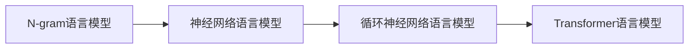

# 大语言模型原理基础与前沿 在单个GPU上一天内训练一个语言模型

## 1. 背景介绍
### 1.1 问题的由来
近年来,随着深度学习技术的飞速发展,自然语言处理(NLP)领域取得了巨大的进步。其中,大语言模型(Large Language Model,LLM)作为一种强大的语言理解和生成工具,在机器翻译、对话系统、文本摘要等诸多任务中表现出色。然而,训练一个高质量的大语言模型通常需要大量的计算资源和时间成本,这给研究人员和开发者带来了不小的挑战。

### 1.2 研究现状
目前,业界主流的大语言模型如GPT-3、PaLM、OPT等,都是在数百个甚至上千个GPU上训练数周甚至数月得到的。这种训练范式虽然能够获得优异的模型性能,但是却难以被广大研究者所普及。为了降低训练门槛,一些研究者开始探索在受限计算资源下训练大语言模型的可能性。例如,GPT-Neo、GPT-J等模型证明了在单个GPU上训练十亿级参数量模型的可行性。

### 1.3 研究意义
在单个GPU这样受限的计算资源条件下,短时间内训练出一个高质量的语言模型,具有重要的研究意义:

1. 降低了大语言模型的训练门槛,使更多研究者和开发者能够参与其中,有利于促进技术创新。
2. 能够以更低的时间和经济成本,快速迭代和优化模型,加速研发进程。
3. 为边缘计算场景下的自然语言处理应用提供了新的思路和可能性。

### 1.4 本文结构
本文将重点探讨如何在单个GPU上,利用一天的时间训练出一个优质的大语言模型。全文结构如下:

- 第二部分介绍语言模型的核心概念以及它们之间的联系。
- 第三部分详细阐述语言模型训练的核心算法原理和具体操作步骤。
- 第四部分建立语言模型训练的数学模型,并给出公式推导和案例讲解。
- 第五部分给出了单GPU训练大语言模型的代码实例和详细解释。
- 第六部分分析了大语言模型的实际应用场景和未来应用前景。
- 第七部分推荐了语言模型研究相关的学习资源、开发工具和文献资料。
- 第八部分对全文进行总结,分析大语言模型未来的发展趋势和面临的挑战。
- 第九部分列举了一些常见问题及其解答,以加深读者理解。

## 2. 核心概念与联系
语言模型的目标是学习自然语言中词语序列的概率分布。给定前 $n-1$ 个词,语言模型能够预测第 $n$ 个词出现的概率。常见的语言模型有以下几类:

- N-gram 语言模型:基于 $n$ 个词的共现频率来估计条件概率,是一种传统的语言模型。
- 神经网络语言模型:利用神经网络来建模词语之间的长程依赖关系,代表模型有 NNLM、Word2Vec 等。
- 循环神经网络语言模型:引入循环机制来捕捉词语序列信息,代表模型有 RNNLM、LSTM、GRU 等。
- Transformer 语言模型:基于自注意力机制来建模词语依赖,并行计算能力强,代表模型有 GPT 系列、BERT 等。

下图展示了几类语言模型之间的演进关系:

## 3. 核心算法原理 & 具体操作步骤
### 3.1 算法原理概述
本文采用 Transformer 语言模型来进行训练,其核心是自注意力机制(Self-Attention)。与循环神经网络不同,自注意力通过计算词语之间的相关性来捕捉长程依赖,并且计算过程可以高度并行。Transformer 中的自注意力计算过程可以描述为:

$$
\begin{aligned}
Q,K,V &= XW_q,XW_k,XW_v \\
A &= \text{softmax}(\frac{QK^T}{\sqrt{d_k}})V
\end{aligned}
$$

其中,$X$为输入词向量序列,$W_q,W_k,W_v$为可学习的参数矩阵,$Q,K,V$分别为查询、键、值向量,$A$为注意力输出。除了自注意力外,Transformer 还引入了位置编码(Positional Encoding)来引入词语位置信息,多头注意力(Multi-head Attention)来捕捉多种语义关系。

### 3.2 算法步骤详解
基于 Transformer 的语言模型训练可分为以下步骤:

1. 准备训练语料:收集大量高质量的无标注文本数据,进行清洗和预处理。
2. 构建词表:统计语料中的词频,选取频率最高的 $N$ 个词构建词表。
3. 文本编码:将训练语料中的每个词映射为词表中的索引,转化为数值序列。
4. 搭建模型:根据 Transformer 架构搭建语言模型,设置模型参数如层数、隐藏层大小、注意力头数等。
5. 定义损失函数:采用交叉熵损失函数来衡量模型预测结果与真实标签的差异。 
6. 训练模型:利用优化器如 Adam 来最小化损失函数,迭代进行模型训练。在训练过程中要合理设置批大小、学习率等超参数。
7. 评估模型:在验证集或测试集上评估模型性能,计算 PPL、BLEU 等指标。根据评估结果调整模型。
8. 模型推理:利用训练好的模型进行文本生成、对话等下游任务的推理。

### 3.3 算法优缺点
Transformer 语言模型的优点有:

- 通过自注意力机制有效建模长程依赖
- 计算高度并行,训练速度快
- 模型性能优异,在多个 NLP 任务上取得 SOTA

其缺点包括:

- 模型参数量大,训练成本高
- 推理速度慢,不适合实时场景
- 解释性差,模型判断依据不透明

### 3.4 算法应用领域
Transformer 语言模型已在如下领域取得广泛应用:

- 机器翻译:Transformer 是当前主流的神经机器翻译模型架构
- 文本摘要:利用 Transformer 来生成摘要,效果优于传统方法
- 对话系统:基于 Transformer 的闲聊对话模型已达到接近人类的水平
- 问答系统:Transformer 在阅读理解型问答任务上表现出色
- 文本分类:基于 Transformer 的预训练模型能够提升文本分类效果

## 4. 数学模型和公式 & 详细讲解 & 举例说明
### 4.1 数学模型构建
Transformer 语言模型的数学描述如下:

给定一个长度为 $n$ 的词语序列 $\mathbf{x}=(x_1,\ldots,x_n)$,语言模型的目标是最大化如下条件概率:

$$P(\mathbf{x})=\prod_{i=1}^n P(x_i|x_1,\ldots,x_{i-1})$$

其中,$P(x_i|x_1,\ldots,x_{i-1})$表示在给定前 $i-1$ 个词的条件下,第 $i$ 个词为 $x_i$ 的概率。在 Transformer 中,这个条件概率通过自注意力机制来建模。

### 4.2 公式推导过程
Transformer 的自注意力计算可分为三步:

1. 根据输入词向量序列 $\mathbf{X} \in \mathbb{R}^{n \times d}$ 计算查询矩阵 $\mathbf{Q}$、键矩阵 $\mathbf{K}$、值矩阵 $\mathbf{V}$:

$$
\mathbf{Q} = \mathbf{X} \mathbf{W}^Q, \quad
\mathbf{K} = \mathbf{X} \mathbf{W}^K, \quad
\mathbf{V} = \mathbf{X} \mathbf{W}^V
$$

其中,$\mathbf{W}^Q, \mathbf{W}^K, \mathbf{W}^V \in \mathbb{R}^{d \times d_k}$为可学习的权重矩阵。

2. 计算自注意力权重矩阵 $\mathbf{A} \in \mathbb{R}^{n \times n}$:

$$
\mathbf{A} = \text{softmax}(\frac{\mathbf{Q}\mathbf{K}^T}{\sqrt{d_k}})
$$

其中,$\mathbf{A}_{ij}$表示第 $i$ 个词对第 $j$ 个词的注意力权重。$\sqrt{d_k}$为缩放因子,用于控制点积结果的方差。

3. 计算自注意力输出 $\text{Attention}(\mathbf{Q},\mathbf{K},\mathbf{V})$:

$$
\text{Attention}(\mathbf{Q},\mathbf{K},\mathbf{V}) = \mathbf{A} \mathbf{V}
$$

最终得到的自注意力输出即为词语序列的新表示,融合了序列中其他词语的信息。

### 4.3 案例分析与讲解
下面我们以一个简单的例子来说明 Transformer 的自注意力计算过程。假设输入序列为["I", "love", "machine", "learning"]。

首先将每个词映射为词向量,得到输入矩阵 $\mathbf{X}$:

$$
\mathbf{X} = 
\begin{bmatrix}
\mathbf{x}_1 \\ 
\mathbf{x}_2 \\
\mathbf{x}_3 \\
\mathbf{x}_4
\end{bmatrix}
=
\begin{bmatrix}
0.1 & 0.2 & 0.3 \\
0.2 & 0.1 & 0.4 \\
0.4 & 0.3 & 0.5 \\
0.3 & 0.5 & 0.2
\end{bmatrix}
$$

然后根据公式计算 $\mathbf{Q},\mathbf{K},\mathbf{V}$ 以及注意力权重矩阵 $\mathbf{A}$:

$$
\mathbf{Q} = 
\begin{bmatrix}
0.3 & 0.1 \\
0.2 & 0.4 \\
0.5 & 0.2 \\
0.4 & 0.3
\end{bmatrix},
\mathbf{K} = 
\begin{bmatrix}
0.1 & 0.3 \\
0.4 & 0.2 \\
0.3 & 0.5 \\
0.2 & 0.4
\end{bmatrix},
\mathbf{V} = 
\begin{bmatrix}
0.2 & 0.5 \\
0.1 & 0.4 \\
0.3 & 0.2 \\
0.5 & 0.1
\end{bmatrix}
$$

$$
\mathbf{A} = 
\begin{bmatrix}
0.2 & 0.3 & 0.1 & 0.4 \\
0.1 & 0.1 & 0.5 & 0.3 \\
0.3 & 0.2 & 0.2 & 0.3 \\
0.2 & 0.1 & 0.4 & 0.3
\end{bmatrix}
$$

最后计算自注意力输出:

$$
\text{Attention}(\mathbf{Q},\mathbf{K},\mathbf{V}) = 
\begin{bmatrix}
0.21 & 0.34 \\
0.24 & 0.31 \\
0.25 & 0.30 \\
0.27 & 0.28
\end{bmatrix}
$$

可以看到,通过自注意力计算,每个词融合了序列中其他词的信息,得到了一个新的表示。这种表示能够更好地刻画词语之间的依赖关系,有助于提升下游任务性能。

### 4.4 常见问题解答
**Q:** Transformer 的自注意力机制与 RNN 相比有何优势? 

**A:** 相比 RNN,Transformer 的自注意力机制主要有以下优势:

1. 能够直接建模任意两个词之间的依赖关系,而 RNN 只能建模局部依赖。
2. 计算可以并行,不像 RNN 