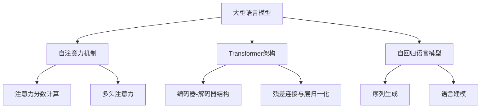
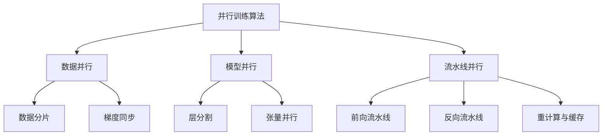

以下是题为《大语言模型原理基础与前沿 并行》的技术博客文章正文部分：

# 大语言模型原理基础与前沿 并行

## 1. 背景介绍

### 1.1 问题的由来

随着人工智能技术的快速发展，大型语言模型已经成为自然语言处理领域的核心技术之一。这些模型能够通过大规模的预训练数据学习语言的内在规律和知识表示,从而在下游任务中表现出卓越的性能。然而,训练这些庞大的模型需要消耗大量的计算资源和能源,这不仅造成了昂贵的成本,而且对环境也产生了不利影响。因此,如何高效地训练和部署大型语言模型成为了一个亟待解决的问题。

### 1.2 研究现状 

目前,业界和学术界已经提出了多种并行化策略来加速大型语言模型的训练过程。这些策略主要包括数据并行、模型并行和流水线并行等。数据并行通过将训练数据分散到多个设备上进行并行计算;模型并行则将模型的参数分散到不同的设备上,每个设备只需要计算和存储部分参数;而流水线并行则将前向和反向传播过程分解为多个阶段,并行执行这些阶段。

虽然这些并行化策略已经取得了一定的成功,但它们也面临着一些挑战。例如,数据并行需要解决通信开销的问题,模型并行需要解决参数分布和通信的问题,而流水线并行则需要解决计算资源利用率低和训练不稳定的问题。因此,如何有效地结合和优化这些并行化策略,以最大限度地提高大型语言模型的训练效率,仍然是一个值得深入研究的课题。

### 1.3 研究意义

高效训练大型语言模型不仅可以降低计算成本和能源消耗,还可以促进人工智能技术在更多领域的应用和发展。例如,在自然语言处理领域,高质量的语言模型可以显著提升机器翻译、问答系统、文本摘要等任务的性能。在其他领域,如医疗、金融和教育等,语言模型也可以用于智能辅助系统、风险管理和个性化学习等应用场景。

此外,研究高效的并行化策略也将推动硬件和系统架构的创新。为了更好地支持大型语言模型的训练和部署,我们需要设计出更加强大和高效的计算硬件,如专用的AI加速器芯片和异构计算系统。同时,我们也需要优化分布式系统架构和通信协议,以最大限度地利用硬件资源。

### 1.4 本文结构  

本文将全面介绍大型语言模型的并行训练原理和前沿技术。我们将首先阐述核心概念和算法,包括注意力机制、Transformer架构和自回归语言模型等。接下来,我们将详细讲解并行训练的核心算法原理和具体操作步骤,包括数据并行、模型并行和流水线并行等策略。然后,我们将介绍相关的数学模型和公式推导,并通过案例分析加深理解。此外,我们还将提供一个完整的项目实践,包括代码实现、运行结果展示和详细解释说明。最后,我们将探讨大型语言模型的实际应用场景、未来发展趋势和面临的挑战。

## 2. 核心概念与联系

大型语言模型是基于自注意力机制和Transformer架构构建的自回归模型。这些概念是理解并行训练原理的基础,我们将在这一部分进行详细介绍。

### 2.1 自注意力机制

自注意力机制是Transformer架构的核心,它允许模型捕捉输入序列中任意两个位置之间的依赖关系。与传统的循环神经网络和卷积神经网络不同,自注意力机制不需要按顺序处理序列,而是通过计算注意力分数来捕捉全局依赖关系。

注意力分数的计算过程如下:

$$
\begin{aligned}
\text{Attention}(Q, K, V) &= \text{softmax}\left(\frac{QK^T}{\sqrt{d_k}}\right)V \\
\text{where} \quad Q &= XW_Q \\
K &= XW_K \\
V &= XW_V
\end{aligned}
$$

其中,$Q$、$K$和$V$分别表示查询(Query)、键(Key)和值(Value)。$W_Q$、$W_K$和$W_V$是可学习的线性变换矩阵。注意力分数通过查询和键的点积来计算,然后对分数进行软最大化操作,最后将注意力分数与值进行加权求和,得到注意力输出。

为了进一步捕捉不同表示子空间的信息,Transformer还引入了多头注意力机制。多头注意力将查询、键和值分别投影到不同的子空间,并在每个子空间中计算注意力输出,最后将所有子空间的输出进行拼接。

### 2.2 Transformer架构

Transformer是一种全新的序列到序列(Seq2Seq)模型架构,它完全基于注意力机制,不使用循环或卷积操作。Transformer由编码器(Encoder)和解码器(Decoder)两部分组成,两者都是基于自注意力和前馈神经网络构建的多层结构。

编码器的作用是将输入序列映射到一系列连续的表示,而解码器则根据这些表示生成目标序列。编码器和解码器之间通过注意力机制建立连接,解码器可以选择性地关注编码器输出的不同部分。

为了更好地训练模型,Transformer还引入了残差连接和层归一化等技术。残差连接可以缓解深层网络的梯度消失问题,而层归一化则有助于加速模型收敛和提高泛化能力。

### 2.3 自回归语言模型

自回归语言模型是一种特殊的序列生成模型,它通过最大化给定上文的下一个词的条件概率来学习语言的概率分布。形式化地,自回归语言模型的目标是最大化以下条件概率:

$$
P(x_1, x_2, \dots, x_T) = \prod_{t=1}^T P(x_t | x_1, x_2, \dots, x_{t-1})
$$

其中,$x_1, x_2, \dots, x_T$是长度为$T$的词序列。自回归语言模型通过学习上下文和目标词之间的条件概率分布,可以捕捉语言的长期依赖关系和语义信息。

大型语言模型通常采用Transformer解码器作为自回归语言模型的骨干网络。在训练过程中,模型会根据输入的上文生成下一个词的概率分布,并与真实标签进行对比,通过反向传播算法更新模型参数。在推理阶段,模型则可以通过贪婪搜索或束搜索等方法生成连贯的文本序列。

## 3. 核心算法原理与具体操作步骤

### 3.1 算法原理概述

大型语言模型的并行训练算法主要包括三种策略:数据并行、模型并行和流水线并行。这三种策略可以单独使用,也可以相互结合,以进一步提高训练效率。

- **数据并行**:将训练数据分散到多个设备上进行并行计算,每个设备只需要处理一部分数据。在前向传播阶段,每个设备计算本地数据的模型输出和损失;在反向传播阶段,每个设备计算本地数据的梯度,然后通过全减操作将梯度汇总,最后更新模型参数。
- **模型并行**:将模型的参数分散到不同的设备上,每个设备只需要计算和存储部分参数。模型并行可以进一步分为层分割和张量并行两种策略。层分割将模型的层分配到不同设备,而张量并行则将单个层的张量切分到多个设备上进行并行计算。
- **流水线并行**:将前向和反向传播过程分解为多个阶段,并行执行这些阶段。在前向流水线中,每个设备处理一个小批量数据的特定阶段计算;在反向流水线中,梯度计算也被划分为多个阶段并行执行。为了减少计算开销,流水线并行通常采用重计算或者缓存中间结果的策略。

### 3.2 算法步骤详解

#### 3.2.1 数据并行

数据并行算法的主要步骤如下:

1. **数据分片**:将训练数据均匀分割到$N$个设备上,每个设备获得$1/N$的数据。
2. **前向传播**:每个设备并行计算本地数据的模型输出和损失函数。
3. **梯度计算**:每个设备并行计算本地数据的梯度。
4. **梯度同步**:使用全减操作将所有设备的梯度汇总,得到全局梯度。
5. **参数更新**:使用优化器(如SGD或Adam)根据全局梯度更新模型参数。
6. **参数广播**:将更新后的模型参数广播到所有设备。

为了提高通信效率,我们可以采用技术如梯度压缩、计算与通信重叠等策略。此外,数据并行还需要解决数据不平衡问题,即不同设备上的数据量可能不完全相同,从而导致计算负载不均衡。

#### 3.2.2 模型并行

模型并行算法的步骤取决于具体的策略(层分割或张量并行)。以层分割为例,主要步骤如下:

1. **层分割**:将模型的层均匀分配到$N$个设备上,每个设备负责计算部分层的前向和反向传播。
2. **前向传播**:第一个设备计算输入数据的前几层,然后将中间结果发送到下一个设备。每个设备依次计算分配给自己的层,并将结果传递给下一个设备,直到最后一个设备得到模型输出。
3. **反向传播**:最后一个设备计算输出层的梯度,然后将梯度和中间结果传递给前一个设备。每个设备依次计算分配给自己的层的梯度,并将结果传递给前一个设备,直到第一个设备得到输入层的梯度。
4. **参数更新**:所有设备使用本地梯度和优化器更新各自的模型参数。

模型并行需要解决参数分布、通信开销和计算负载不均衡等问题。张量并行则采用类似的思路,但是将单个层的张量切分到多个设备上进行并行计算,从而进一步提高并行度。

#### 3.2.3 流水线并行

流水线并行算法的主要步骤如下:

1. **前向流水线**:将前向传播过程划分为$N$个阶段,每个设备负责计算一个阶段。第一个设备计算第一个小批量数据的第一阶段,然后将中间结果传递给下一个设备进行第二阶段计算,依次类推。当第一个设备完成第一阶段的计算后,它就可以开始处理下一个小批量数据的第一阶段计算,从而实现流水线并行。
2. **反向流水线**:反向传播过程也被划分为$N$个阶段并行执行。最后一个设备计算输出层的梯度,然后将梯度和中间结果传递给前一个设备进行反向传播计算,依次类推,直到第一个设备得到输入层的梯度。
3. **重计算或缓存**:为了减少内存开销,流水线并行通常采用重计算或缓存中间结果的策略。重计算会增加计算开销,但可以节省