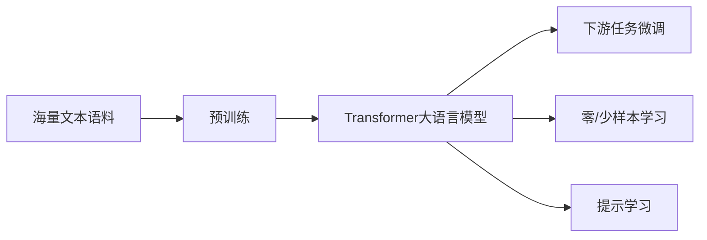

# 大语言模型原理基础与前沿 未来发展方向

关键词：大语言模型, Transformer, 预训练, 微调, 零样本学习, 提示学习, 多模态, 知识蒸馏, 模型压缩, 持续学习, 隐私保护, 可解释性, 鲁棒性, 公平性, 效率优化

## 1. 背景介绍
### 1.1  问题的由来
自然语言处理(NLP)是人工智能的重要分支,旨在让计算机像人一样理解和生成自然语言。近年来,随着深度学习的发展,尤其是Transformer[1]等注意力机制模型的出现,NLP领域取得了突破性进展。大语言模型(Large Language Model,LLM)作为NLP的前沿方向,通过在海量文本语料上进行无监督预训练,可以学习到丰富的语言知识,在多个下游任务上取得了优异表现,引领了NLP技术的新浪潮。

### 1.2  研究现状 
目前,业界主流的大语言模型包括GPT系列[2]、BERT系列[3]、XLNet[4]、T5[5]等,它们都采用了Transformer作为骨干网络。这些模型在机器翻译、问答系统、文本分类、命名实体识别等任务上不断刷新性能记录。同时,大语言模型也催生了新的应用形态,如对话交互、内容生成、知识问答等。微软、谷歌、OpenAI等科技巨头和研究机构纷纷投入巨资,构建更大规模、性能更强的语言模型,推动NLP技术不断向前发展。

### 1.3  研究意义
大语言模型代表了NLP技术的前沿,对学术界和工业界都具有重要意义:
- 学术价值:大语言模型为NLP基础研究提供了新的思路,有助于探索语言的本质规律,推动人工智能走向通用智能。
- 应用价值:大语言模型可以显著提升NLP系统的性能,催生智能对话、知识图谱、语义搜索等创新应用,为产业智能化升级赋能。
- 社会价值:大语言模型有望实现更自然流畅的人机交互,提供个性化的信息服务,提升人们的工作和生活质量。

### 1.4  本文结构
本文将全面介绍大语言模型的原理基础与前沿进展。第2节阐述大语言模型的核心概念;第3节详解模型的核心算法原理;第4节建立数学模型并推导关键公式;第5节通过代码实例讲解模型的实现细节;第6节分析模型的实际应用场景;第7节推荐相关的学习资源;第8节总结全文并展望未来;第9节列举常见问题解答。

## 2. 核心概念与联系
- 语言模型:刻画文本序列概率分布的统计模型,可以计算一个句子出现的概率,常用条件概率公式表示:
$P(w_1,\dots,w_n)=\prod_{i=1}^nP(w_i|w_1,\dots,w_{i-1})$
其中,$w_i$为句子中第$i$个单词。
- Transformer:基于自注意力机制的神经网络结构,通过计算词之间的相关性来提取特征。包含编码器和解码器两部分,广泛应用于大语言模型中。
- 预训练(Pre-training):在大规模无标注语料上进行自监督学习,让模型学习通用的语言知识,为下游任务提供良好的初始化参数。常见的预训练任务有语言模型、去噪自编码、对比学习等。
- 微调(Fine-tuning):在特定任务的标注数据上,以较小的学习率在预训练模型的基础上进一步训练,使其适应具体任务。微调可以显著提升模型在下游任务上的表现。
- 零/少样本学习(Zero/Few-shot Learning):只需极少量或零训练样本,即可让预训练模型适应新任务。通过设计输入提示,引导模型进行推理。这种范式使大语言模型具备快速学习和泛化的能力。
- 提示学习(Prompt Learning):通过设计自然语言提示模版,引导预训练模型执行特定任务。分为离散提示和连续提示两种形式[6]。

下图展示了大语言模型的关键概念之间的逻辑联系:

## 3. 核心算法原理 & 具体操作步骤
### 3.1 算法原理概述
大语言模型的核心是基于Transformer的自注意力机制。相比RNN等结构,Transformer可以更有效地建模长距离依赖,且计算高度并行。模型主要包含两大部分:
- 编码器(Encoder):将输入文本映射为隐向量表示,捕捉词与词之间的交互信息。
- 解码器(Decoder):根据编码器的输出,自回归地生成目标文本序列。

### 3.2 算法步骤详解
以BERT为例,其预训练过程分为以下步骤:

(1) 输入表示:将句子转换为词嵌入向量,并加入位置编码和片段嵌入。

(2) 多层Transformer编码:
- 多头自注意力:计算不同词之间的相关性,生成权重矩阵,加权求和得到新的词表示。
$$Attention(Q,K,V)=softmax(\frac{QK^T}{\sqrt{d_k}})V$$
其中,$Q,K,V$分别为查询、键、值向量,$d_k$为向量维度。
- 残差连接与层归一化:
$$LayerNorm(x+Sublayer(x))$$
- 前馈网络:使用两层全连接网络,增强特征交互。
$$FFN(x)=max(0,xW_1+b_1)W_2+b_2$$

(3) 预训练任务:
- 掩码语言模型(MLM):随机掩盖部分词,预测被掩盖词。损失函数为:
$$\mathcal{L}_{MLM}=-\sum_{i\in masked}\log P(w_i|w_{\backslash i})$$
- 下一句预测(NSP):判断两个句子在原文中是否相邻。损失函数为:
$$\mathcal{L}_{NSP}=-\log P(y|s_1,s_2)$$
其中$y\in{0,1}$表示两句是否相邻。

(4) 微调与推理:在下游任务数据上微调,然后进行推理预测。

### 3.3 算法优缺点
优点:
- 注意力机制可以有效建模长距离依赖,捕捉全局信息。
- 预训练范式使模型可以从海量无标注语料中学习通用语言知识。
- Transformer结构计算高度并行,训练速度快。
- 微调和提示学习使模型可以快速适应新任务。

缺点:  
- 模型参数量巨大,训练和推理成本高。
- 需要大规模高质量语料进行预训练,对计算资源要求高。
- 模型是黑盒子,缺乏可解释性。
- 在特定领域任务上,需要结合先验知识进行优化。

### 3.4 算法应用领域
大语言模型已在多个NLP任务上取得瞩目成绩,主要应用包括:
- 机器翻译:将源语言文本翻译成目标语言,如谷歌翻译。
- 智能对话:让机器能够与人自然流畅地对话互动,如微软小冰。
- 问答系统:根据用户问题从大规模知识库中自动找到答案,如IBM Watson。 
- 文本分类:对文本的主题、情感等进行自动分类,如新闻分类、情感分析等。
- 信息抽取:从非结构化文本中提取结构化知识,如实体识别、关系抽取等。
- 文本生成:自动撰写文章、诗歌、代码等,如GPT-3的创意写作能力。

## 4. 数学模型和公式 & 详细讲解 & 举例说明
### 4.1 数学模型构建
大语言模型的数学基础是统计语言模型。给定一个文本序列$w=(w_1,\dots,w_n)$,语言模型的目标是估计其概率分布$P(w)$。根据链式法则,可以将联合概率分解为一系列条件概率的乘积:

$$P(w)=\prod_{i=1}^nP(w_i|w_1,\dots,w_{i-1})$$

其中,$P(w_i|w_1,\dots,w_{i-1})$表示在给定前$i-1$个词的条件下,第$i$个词$w_i$出现的概率。

大语言模型使用神经网络来拟合这个条件概率分布。设$f_\theta$为参数为$\theta$的神经网络,则有:

$$P(w_i|w_1,\dots,w_{i-1})=f_\theta(w_1,\dots,w_{i-1})$$

模型的训练目标是最大化训练语料的对数似然概率:

$$\mathcal{L}(\theta)=\sum_{w\in\mathcal{D}}\log P(w)=\sum_{w\in\mathcal{D}}\sum_{i=1}^n\log f_\theta(w_1,\dots,w_{i-1})$$

其中,$\mathcal{D}$为训练语料集合。

### 4.2 公式推导过程
以Transformer中的自注意力机制为例,详细推导其数学公式。

(1) 输入表示:将输入序列$w=(w_1,\dots,w_n)$通过词嵌入矩阵$E$映射为实值向量表示$X=(x_1,\dots,x_n)$,其中$x_i\in\mathbb{R}^{d_e}$,$d_e$为词嵌入维度。再加上位置编码向量$P=(p_1,\dots,p_n)$,得到最终的输入表示:

$$H^0=X+P$$

其中,$H^0\in\mathbb{R}^{n\times d_e}$为初始隐状态矩阵。

(2) 自注意力计算:对于第$l$层自注意力,首先将$H^{l-1}$通过三个线性变换得到查询矩阵$Q^l$、键矩阵$K^l$和值矩阵$V^l$:

$$Q^l=H^{l-1}W_Q^l,\ K^l=H^{l-1}W_K^l,\ V^l=H^{l-1}W_V^l$$

其中,$W_Q^l,W_K^l,W_V^l\in\mathbb{R}^{d_e\times d_k}$为可学习参数矩阵,$d_k$为自注意力的维度。

然后,计算自注意力权重矩阵$A^l$:

$$A^l=softmax(\frac{Q^l(K^l)^T}{\sqrt{d_k}})$$

其中,$softmax$函数对每一行进行归一化,使得每行的元素和为1。$\sqrt{d_k}$为缩放因子,用于控制点积结果的方差。

最后,将权重矩阵$A^l$与值矩阵$V^l$相乘,得到自注意力输出$Z^l$:

$$Z^l=A^lV^l$$

其中,$Z^l\in\mathbb{R}^{n\times d_k}$为新的隐状态表示。

(3) 多头自注意力:将步骤(2)重复$h$次,得到$h$个自注意力输出$Z_1^l,\dots,Z_h^l$,然后拼接起来并经过线性变换得到多头自注意力输出$MZ^l$:

$$MZ^l=Concat(Z_1^l,\dots,Z_h^l)W_O^l$$

其中,$W_O^l\in\mathbb{R}^{hd_k\times d_e}$为可学习参数矩阵。

(4) 前馈网络:使用两层全连接前馈网络增强特征交互:

$$FFN(x)=max(0,xW_1+b_1)W_2+b_2$$

其中,$W_1\in\mathbb{R}^{d_e\times d_{ff}},b_1\in\mathbb{R}^{d_{ff}},W_2\in\mathbb{R}^{d_{ff}\times d_e},b_2\in\mathbb{R}^{d_e}$为可学习参数,$d_{ff}$为前馈网络的隐藏层维度。

(5) 残差连接与层归一化:在每个子层(自注意力层和前馈网络层)之后,加入残差连接和层归一化以促进训练:

$$