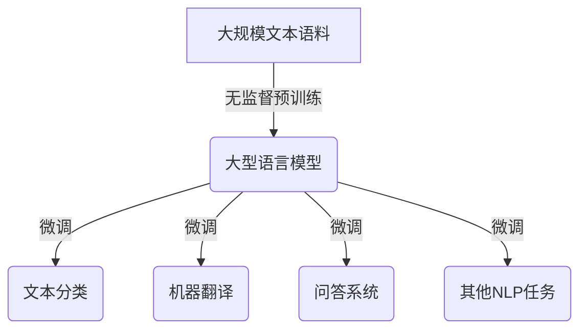

# 大语言模型原理基础与前沿模型架构

## 1. 背景介绍

### 1.1 问题的由来

在过去的几年里,自然语言处理(NLP)领域取得了长足的进步,这在很大程度上归功于大型神经网络模型的兴起,特别是基于Transformer架构的大型语言模型。这些模型通过在大量文本数据上进行预训练,学习了丰富的语言知识,并展现出令人印象深刻的性能。然而,训练这些庞大的模型需要大量的计算资源,并且存在一些固有的缺陷和局限性。

### 1.2 研究现状

目前,研究人员一直在努力探索更高效、更精确的大型语言模型架构。一些突破性的工作包括:

- **稀疏注意力机制**:通过引入稀疏注意力机制,可以显著降低注意力计算的复杂度,从而提高模型的计算效率。
- **高效的参数初始化**:合理的参数初始化策略可以加速模型训练,提高收敛速度。
- **参数高效化**:通过参数剪枝、量化等技术,可以减小模型的存储占用和计算开销。
- **模型并行化**:通过模型并行化技术,可以在多个加速器上并行训练大型模型。
- **新型架构探索**:一些全新的架构如Transformer-XL、Reformer等,试图从根本上解决Transformer的局限性。

### 1.3 研究意义

大型语言模型在自然语言处理任务中扮演着越来越重要的角色,对于构建通用人工智能系统也具有重要意义。然而,现有的模型还存在一些缺陷和局限性,因此探索更高效、更精确的大型语言模型架构,对于推动NLP领域的发展至关重要。本文将系统地介绍大型语言模型的基础原理、前沿架构以及相关的优化技术,为读者提供全面的理解。

### 1.4 本文结构

本文首先介绍大型语言模型的核心概念和基本原理,包括自注意力机制、Transformer架构等。接下来,详细阐述几种前沿的大型语言模型架构,如Sparse Transformer、Reformer等,并分析它们的创新之处。然后,探讨一些优化大型语言模型的关键技术,包括稀疏注意力、参数高效化等。最后,总结大型语言模型的发展趋势和未来挑战。

## 2. 核心概念与联系

大型语言模型的核心思想是通过在大量文本数据上进行无监督预训练,学习丰富的语言知识表示,从而为下游的自然语言任务提供有力的语义支持。这种预训练-微调的范式已经成为NLP领域的主流做法。

大型语言模型的核心部件是**Transformer**,它是一种全新的基于注意力机制的神经网络架构。Transformer包含了两个关键组件:多头自注意力(Multi-Head Self-Attention)和位置编码(Positional Encoding)。

### 2.1 多头自注意力

自注意力机制允许模型在计算目标词的表示时,直接捕获整个输入序列的信息,而不需要通过序列递归或卷积操作。这种长程依赖建模能力是Transformer的一大优势。

多头注意力机制通过线性投影将查询(Query)、键(Key)和值(Value)映射到不同的子空间,并在每个子空间内计算缩放点积注意力,最后将所有子空间的注意力结果进行拼接,从而提高了注意力机制的表达能力。

$$\begin{aligned}
\text{MultiHead}(Q,K,V) &= \text{Concat}(\text{head}_1, \ldots, \text{head}_h)W^O\\
\text{where}\,\text{head}_i &= \text{Attention}(QW_i^Q, KW_i^K, VW_i^V)
\end{aligned}$$

其中, $W_i^Q$、$W_i^K$、$W_i^V$和$W^O$是可学习的线性投影参数。

### 2.2 位置编码

由于Transformer没有像RNN或CNN那样的顺序操作,因此需要一种机制来注入序列的位置信息。位置编码就是通过将每个位置与一个位置向量相加,从而赋予序列信息位置属性。

$$\text{PE}_{(pos, 2i)} = \sin\left(pos/10000^{2i/d_{\text{model}}}\right)$$
$$\text{PE}_{(pos, 2i+1)} = \cos\left(pos/10000^{2i/d_{\text{model}}}\right)$$

其中$pos$是词的位置索引,而$i$是维度索引。

通过自注意力机制和位置编码,Transformer成功地解决了长期依赖的建模问题,并在多个NLP任务上取得了卓越的表现。这为后来的大型语言模型奠定了基础。

## 3. 核心算法原理 & 具体操作步骤

### 3.1 算法原理概述

大型语言模型的核心算法原理是**自监督预训练**。与监督学习不同,自监督预训练不需要人工标注的数据,而是直接利用原始文本语料,通过设计合理的预训练目标,让模型自主学习文本中蕴含的语义和语法知识。

常见的自监督预训练目标包括:

1. **掩码语言模型(Masked Language Modeling, MLM)**: 随机掩蔽部分输入词,并让模型基于上下文预测被掩蔽的词。
2. **下一句预测(Next Sentence Prediction, NSP)**: 判断两个句子是否为连续句子。
3. **替换语言模型(Replaced Token Detection, RTD)**: 随机替换部分输入词,并让模型判断哪些词被替换了。

通过预训练,模型可以学习到丰富的语义和语法知识,从而为下游任务提供强大的迁移能力。

### 3.2 算法步骤详解

以BERT(Bidirectional Encoder Representations from Transformers)为例,其预训练算法步骤如下:

1. **数据预处理**:将原始文本切分为词块序列,并进行词汇映射、位置编码等预处理。
2. **掩码语言模型**:随机选择15%的输入词进行掩码,其中80%直接用`[MASK]`标记替换,10%用随机词替换,剩余10%保持不变。
3. **下一句预测**:为50%的数据构造相邻句子对作为正例,另外50%通过随机采样构造不相邻句子对作为负例。
4. **前向计算**:将预处理后的序列输入Transformer编码器,计算每个位置的上下文表示。
5. **MLM损失计算**:对于被掩码的词,基于其上下文表示和词表计算掩码词的概率分布,并与实际词计算交叉熵损失。
6. **NSP损失计算**:基于两个句子的首尾表示,通过二分类得到句子是否相邻的概率,并与真实标签计算损失。
7. **损失回传与优化**:将MLM损失和NSP损失相加,并通过反向传播算法更新模型参数。

通过大量文本语料的预训练,BERT等大型语言模型可以学习到通用的语义和语法知识,为下游任务提供强大的迁移能力。在下游任务的微调阶段,只需要根据任务目标对模型进行少量参数调整,即可取得良好的性能表现。

### 3.3 算法优缺点

**优点**:

- 充分利用了大量无标注的文本数据,学习到丰富的语言知识。
- 预训练-微调范式具有极强的迁移能力,可广泛应用于各种NLP任务。
- 自注意力机制有效解决了长期依赖建模问题。

**缺点**:

- 训练过程计算量大、内存消耗高,需要大量的计算资源。
- 对于长文本,自注意力计算复杂度会快速增长。
- 预训练目标MLM和NSP的合理性存在争议。

### 3.4 算法应用领域

大型语言模型预训练算法可广泛应用于自然语言处理的各个领域,包括但不限于:

- 文本分类
- 机器翻译
- 文本摘要
- 问答系统
- 对话系统
- 关系抽取
- 情感分析
- ...

通过将预训练模型在特定任务上进行微调,可以显著提升性能表现。大型语言模型已经成为NLP领域的基础设施,对推动人工智能的发展起到了重要作用。

## 4. 数学模型和公式 & 详细讲解 & 举例说明

### 4.1 数学模型构建

在介绍大型语言模型的数学模型之前,首先需要了解注意力机制(Attention Mechanism)的基本原理。注意力机制是一种将查询(Query)与一系列键值对(Key-Value Pairs)相关联的方法,常用于序列建模任务。

对于给定的查询$q$和键值对$(k_i, v_i)$序列,注意力机制首先计算查询与每个键之间的相关性分数,即:

$$\text{score}(q, k_i) = q^T k_i$$

然后,通过对分数进行软最大化操作,得到每个值的权重:

$$\alpha_i = \text{softmax}(\text{score}(q, k_i)) = \frac{\exp(\text{score}(q, k_i))}{\sum_j \exp(\text{score}(q, k_j))}$$

最后,将值序列根据权重$\alpha_i$进行加权求和,得到注意力输出:

$$\text{attn}(q, (k_i, v_i)) = \sum_i \alpha_i v_i$$

注意力机制允许模型动态地为不同的查询分配不同的注意力权重,从而更好地捕获输入序列中的重要信息。

在Transformer中,自注意力层(Self-Attention Layer)是通过将查询、键和值全部设置为同一个输入序列,从而实现对输入序列的自注意力计算。具体来说,给定输入序列$X = (x_1, x_2, \ldots, x_n)$,自注意力层的计算过程为:

1. 线性投影,得到查询$Q$、键$K$和值$V$:

$$\begin{aligned}
Q &= XW^Q\\
K &= XW^K\\
V &= XW^V
\end{aligned}$$

其中,$W^Q$、$W^K$和$W^V$是可学习的线性投影参数。

2. 计算注意力权重:

$$\text{Attn}(Q, K, V) = \text{softmax}\left(\frac{QK^T}{\sqrt{d_k}}\right)V$$

其中,$d_k$是缩放因子,用于防止点积过大导致的梯度饱和问题。

3. 多头注意力机制通过独立学习$h$组投影矩阵,并将它们的注意力输出拼接起来,从而提高了模型的表达能力:

$$\begin{aligned}
\text{head}_i &= \text{Attn}(QW_i^Q, KW_i^K, VW_i^V)\\
\text{MultiHead}(Q, K, V) &= \text{Concat}(\text{head}_1, \ldots, \text{head}_h)W^O
\end{aligned}$$

其中,$W_i^Q$、$W_i^K$、$W_i^V$和$W^O$均为可学习参数。

多头自注意力机制赋予了Transformer强大的长程依赖建模能力,是大型语言模型取得卓越表现的关键所在。

### 4.2 公式推导过程

在上一小节中,我们介绍了注意力机制和自注意力层的基本原理。现在,我们将推导出Transformer编码器(Encoder)的完整前向计算过程。

Transformer编码器由多个相同的层组成,每一层包含两个子层:多头自注意力层(Multi-Head Attention, MHA)和前馈全连接层(Position-wise Feed-Forward, FFN)。

对于给定的输入序列$X = (x_1, x_2, \ldots, x_n)$,第$l$层的计算过程为:

1. **多头自注意力子层**:

$$\begin{aligned}
\text{MHA}(X_l) &= \text{SublayerNorm}(X_l + \text{MultiHead}(Q_l, K_l, V_l))\\
Q_l &= X_lW_l