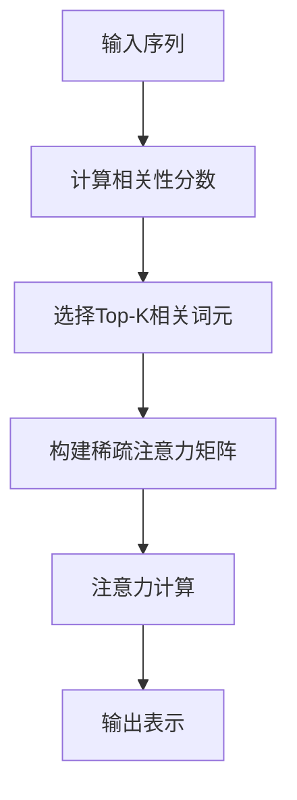

# 大语言模型原理基础与前沿：每个专家选择top-k个词元

## 1. 背景介绍

### 1.1 问题的由来

在自然语言处理(NLP)领域中,大型语言模型已经成为一种强大的工具,能够捕捉丰富的语义和语法信息。然而,这些模型通常包含数十亿个参数,导致了巨大的计算和存储开销。为了解决这个问题,研究人员提出了"每个专家选择top-k个词元"(Select Top-K Experts)的方法,旨在减小模型的计算复杂度,同时保持其性能。

### 1.2 研究现状

目前,基于Transformer的大型语言模型,如GPT-3、BERT等,已经在各种NLP任务中取得了卓越的成绩。然而,这些模型的计算复杂度通常与输入序列的长度成正比,这使得它们在处理长序列时面临挑战。为了缓解这个问题,研究人员提出了多种稀疏注意力机制,其中"每个专家选择top-k个词元"就是一种有前景的方法。

### 1.3 研究意义

"每个专家选择top-k个词元"方法能够显著降低模型的计算复杂度,从而提高模型的效率和可扩展性。此外,该方法还可以提高模型的解释性,因为它允许模型专注于输入序列中最相关的部分。这对于一些需要高度解释性的应用领域(如医疗、金融等)非常有价值。

### 1.4 本文结构

本文将首先介绍"每个专家选择top-k个词元"方法的核心概念和原理,然后详细阐述其算法步骤和数学模型。接下来,我们将通过代码实例和实际应用场景,深入探讨该方法的实现细节和应用前景。最后,我们将总结该方法的发展趋势和面临的挑战,并提供相关的学习资源和工具推荐。

## 2. 核心概念与联系

"每个专家选择top-k个词元"方法是一种稀疏注意力机制,它基于这样一个观察:在自然语言处理任务中,输入序列的每个位置通常只与序列中的少数几个位置高度相关。因此,我们可以为每个位置分配一个"专家",该专家只需要关注输入序列中最相关的top-k个词元,从而大大降低计算复杂度。

该方法的核心思想是将注意力矩阵分解为两个低秩矩阵的乘积,其中一个矩阵捕捉全局信息,另一个矩阵捕捉局部信息。具体来说,对于每个查询位置,我们首先计算它与所有键的相关性分数,然后选择top-k个最相关的键,并将其余键的相关性分数设置为0。这样,我们就得到了一个稀疏的注意力矩阵,其中大部分元素为0。

"每个专家选择top-k个词元"方法与其他稀疏注意力机制(如局部注意力、稀疏变换等)有着密切的联系,但它的优势在于能够自适应地选择最相关的词元,而不需要预先定义注意力模式。此外,该方法还可以与其他注意力机制(如多头注意力)相结合,进一步提高模型的表现。

## 3. 核心算法原理 & 具体操作步骤

### 3.1 算法原理概述

"每个专家选择top-k个词元"算法的核心思想是将注意力矩阵分解为两个低秩矩阵的乘积,从而降低计算复杂度。具体来说,对于每个查询位置,我们首先计算它与所有键的相关性分数,然后选择top-k个最相关的键,并将其余键的相关性分数设置为0。这样,我们就得到了一个稀疏的注意力矩阵,其中大部分元素为0。

该算法的优势在于能够自适应地选择最相关的词元,而不需要预先定义注意力模式。此外,它还可以与其他注意力机制(如多头注意力)相结合,进一步提高模型的表现。

### 3.2 算法步骤详解

1. **计算相关性分数**:对于每个查询位置$q_i$和所有键$\{k_1, k_2, \ldots, k_n\}$,计算它们之间的相关性分数$s_{i,j}$,通常使用点积或缩放点积注意力:

$$s_{i,j} = \frac{q_i^T k_j}{\sqrt{d_k}}$$

其中$d_k$是键的维度。

2. **选择Top-K相关词元**:对于每个查询位置$q_i$,选择与之最相关的top-k个键$\{k_{i,1}, k_{i,2}, \ldots, k_{i,k}\}$,并将其余键的相关性分数设置为$-\infty$:

$$\hat{s}_{i,j} = \begin{cases}
s_{i,j}, & \text{if } k_j \in \{k_{i,1}, k_{i,2}, \ldots, k_{i,k}\} \\
-\infty, & \text{otherwise}
\end{cases}$$

3. **构建稀疏注意力矩阵**:使用修改后的相关性分数$\hat{s}_{i,j}$计算注意力权重$\alpha_{i,j}$:

$$\alpha_{i,j} = \frac{\exp(\hat{s}_{i,j})}{\sum_{j'=1}^n \exp(\hat{s}_{i,j'})}$$

由于大部分$\hat{s}_{i,j}$为$-\infty$,因此对应的$\alpha_{i,j}$将为0,从而得到一个稀疏的注意力矩阵$\boldsymbol{\alpha}$。

4. **注意力计算**:使用稀疏注意力矩阵$\boldsymbol{\alpha}$和值$\{v_1, v_2, \ldots, v_n\}$计算输出表示$o_i$:

$$o_i = \sum_{j=1}^n \alpha_{i,j} v_j$$

由于$\boldsymbol{\alpha}$是稀疏的,因此这一步的计算复杂度大大降低。

### 3.3 算法优缺点

**优点**:

- 降低计算复杂度,提高模型效率和可扩展性。
- 自适应地选择最相关的词元,无需预先定义注意力模式。
- 提高模型的解释性,有助于理解模型的决策过程。
- 可与其他注意力机制(如多头注意力)相结合,进一步提高性能。

**缺点**:

- 引入了超参数k,需要根据具体任务和数据进行调优。
- 在某些情况下,可能会丢失一些重要的上下文信息。
- 对于非常长的序列,即使使用稀疏注意力,计算复杂度仍然较高。

### 3.4 算法应用领域

"每个专家选择top-k个词元"算法可以应用于各种自然语言处理任务,包括但不限于:

- **机器翻译**:在机器翻译任务中,该算法可以帮助模型更好地捕捉源语言和目标语言之间的对应关系。
- **文本生成**:在文本生成任务中,该算法可以帮助模型更好地捕捉上下文信息,生成更加连贯和自然的文本。
- **文本分类**:在文本分类任务中,该算法可以帮助模型更好地关注输入文本中的关键词和短语,提高分类准确性。
- **阅读理解**:在阅读理解任务中,该算法可以帮助模型更好地捕捉问题和上下文之间的关联,从而提高答案的准确性。

此外,由于该算法提高了模型的解释性,因此它也可以应用于一些需要高度解释性的领域,如医疗、金融等。

## 4. 数学模型和公式 & 详细讲解 & 举例说明

### 4.1 数学模型构建

为了更好地理解"每个专家选择top-k个词元"算法的数学原理,我们需要首先构建一个数学模型。假设我们有一个输入序列$\boldsymbol{x} = (x_1, x_2, \ldots, x_n)$,其中每个$x_i$是一个词嵌入向量。我们的目标是计算一个输出序列$\boldsymbol{y} = (y_1, y_2, \ldots, y_n)$,其中每个$y_i$是一个上下文表示向量,捕捉了$x_i$与其他相关词元之间的关系。

在传统的自注意力机制中,我们计算$y_i$的方式如下:

$$y_i = \sum_{j=1}^n \alpha_{i,j} v_j$$

其中$\alpha_{i,j}$是注意力权重,表示$x_i$对$x_j$的注意力程度,$v_j$是$x_j$对应的值向量。注意力权重$\alpha_{i,j}$通常通过计算查询$q_i$和键$k_j$之间的相关性分数$s_{i,j}$来获得:

$$s_{i,j} = q_i^T k_j$$

$$\alpha_{i,j} = \frac{\exp(s_{i,j})}{\sum_{j'=1}^n \exp(s_{i,j'})}$$

在"每个专家选择top-k个词元"算法中,我们对上述过程进行了修改。具体来说,对于每个查询位置$q_i$,我们首先计算它与所有键$\{k_1, k_2, \ldots, k_n\}$的相关性分数$\{s_{i,1}, s_{i,2}, \ldots, s_{i,n}\}$,然后选择top-k个最相关的键,并将其余键的相关性分数设置为$-\infty$:

$$\hat{s}_{i,j} = \begin{cases}
s_{i,j}, & \text{if } k_j \in \text{top-k}(s_{i,1}, s_{i,2}, \ldots, s_{i,n}) \\
-\infty, & \text{otherwise}
\end{cases}$$

接下来,我们使用修改后的相关性分数$\hat{s}_{i,j}$计算注意力权重$\alpha_{i,j}$:

$$\alpha_{i,j} = \frac{\exp(\hat{s}_{i,j})}{\sum_{j'=1}^n \exp(\hat{s}_{i,j'})}$$

由于大部分$\hat{s}_{i,j}$为$-\infty$,因此对应的$\alpha_{i,j}$将为0,从而得到一个稀疏的注意力矩阵$\boldsymbol{\alpha}$。最后,我们使用这个稀疏注意力矩阵计算输出表示$y_i$:

$$y_i = \sum_{j=1}^n \alpha_{i,j} v_j$$

由于$\boldsymbol{\alpha}$是稀疏的,因此这一步的计算复杂度大大降低。

### 4.2 公式推导过程

接下来,我们将详细推导"每个专家选择top-k个词元"算法中涉及的数学公式。

首先,我们定义查询向量$\boldsymbol{q} = (q_1, q_2, \ldots, q_n)$,键向量$\boldsymbol{k} = (k_1, k_2, \ldots, k_n)$和值向量$\boldsymbol{v} = (v_1, v_2, \ldots, v_n)$,其中$q_i, k_i, v_i \in \mathbb{R}^d$。我们的目标是计算输出表示$\boldsymbol{y} = (y_1, y_2, \ldots, y_n)$,其中$y_i$捕捉了$q_i$与其他相关键之间的关系。

1. **计算相关性分数**

对于每个查询位置$q_i$和所有键$\{k_1, k_2, \ldots, k_n\}$,我们计算它们之间的相关性分数$s_{i,j}$,通常使用点积或缩放点积注意力:

$$s_{i,j} = q_i^T k_j$$

或

$$s_{i,j} = \frac{q_i^T k_j}{\sqrt{d}}$$

其中$d$是向量维度。

2. **选择Top-K相关词元**

对于每个查询位置$q_i$,我们选择与之最相关的top-k个键$\{k_{i,1}, k_{i,2}, \ldots, k_{i,k}\}$,并将其余键的相关性分数设置为$-\infty$:

$$\hat{s}_{i,j} = \