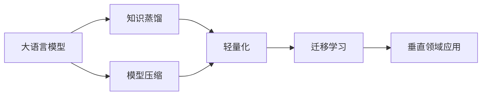

# 大语言模型原理基础与前沿 轻量级适配

关键词：大语言模型、自然语言处理、迁移学习、轻量化、知识蒸馏、模型压缩

## 1. 背景介绍
### 1.1 问题的由来
随着人工智能技术的飞速发展,自然语言处理(NLP)领域取得了突破性进展。大语言模型(Large Language Model, LLM)作为 NLP 的重要分支,在机器翻译、对话系统、文本生成等任务中展现出卓越的性能。然而,LLM 往往需要海量的训练数据和计算资源,模型体积庞大,难以在资源受限的场景下部署应用。因此,如何在保证性能的同时,实现 LLM 的轻量化,成为了一个亟待解决的问题。

### 1.2 研究现状 
近年来,学术界和工业界都在 LLM 轻量化方面进行了广泛探索。主流的方法包括知识蒸馏、模型剪枝、量化、低秩分解等。其中知识蒸馏通过训练一个小模型来学习大模型的行为,在精度损失较小的情况下大幅降低模型复杂度。剪枝和量化则分别从结构和数值表示的角度对模型进行压缩。一些最新进展如 MiniLM、TinyBERT 等工作,在标准数据集上取得了与大模型相当甚至更优的效果。

### 1.3 研究意义
LLM 轻量化的研究意义重大。首先,它大大降低了 LLM 的部署门槛,使其可以在移动端、IoT 等资源受限环境中应用,推动 NLP 技术的普及。其次,轻量化有助于提升推理速度、节约能耗,对于实时性要求高的场景至关重要。此外,轻量级模型更容易进行个性化适配和增量学习,有利于垂直领域的精细化应用。总之,LLM 轻量化研究对于学术探索和产业应用都有着重要价值。

### 1.4 本文结构
本文将重点探讨 LLM 轻量化的原理、方法和应用。第2部分阐述 LLM 轻量化涉及的核心概念。第3部分详细介绍几种主流的轻量化算法。第4部分建立轻量化的数学模型并给出理论分析。第5部分提供代码实例,演示轻量化流程。第6部分讨论轻量级 LLM 的应用场景。第7部分推荐相关工具和学习资源。第8部分总结全文,展望未来研究方向与挑战。第9部分列举常见问题解答。

## 2. 核心概念与联系

在探讨 LLM 轻量化之前,我们首先需要理解其中涉及的几个核心概念:

- 大语言模型(LLM):以 Transformer 为代表的大规模预训练语言模型,通过在海量无标注语料上进行自监督学习,掌握了丰富的语言知识和建模能力,可以应用于下游的各种 NLP 任务。代表模型包括 BERT、GPT、T5 等。

- 知识蒸馏(Knowledge Distillation):一种将大模型的知识迁移到小模型的技术。通过让小模型学习大模型的输出分布或中间表示,使其在参数量大幅减少的情况下,仍能达到与大模型相近的性能水平。

- 模型压缩(Model Compression):在尽量保持模型性能的前提下,降低模型复杂度的一系列方法,包括剪枝、量化、低秩分解、参数共享等。其目标是生成体积更小、推理更快的模型。

- 迁移学习(Transfer Learning):将源领域学习到的知识迁移到目标领域,提高目标任务的学习效率和效果。对于 LLM,预训练模型蕴含了丰富的通用语言知识,可以在特定垂直领域进行微调,实现快速适配。

- 轻量化(Lightweight):指在不显著损失性能的情况下,降低模型尺寸和计算量,使其能够在资源受限的环境中高效运行。轻量级模型更加环保、经济,易于落地应用。

这些概念之间环环相扣。大语言模型通过预训练掌握了强大的语言理解和生成能力,但其参数量巨大。知识蒸馏和模型压缩技术可用于减小模型体积,生成轻量级的学生模型。学生模型不仅继承了教师模型的知识,还能通过迁移学习快速适应新领域。轻量化使得 LLM 的应用范围大为拓宽。下图展示了这些概念间的联系:



## 3. 核心算法原理 & 具体操作步骤
### 3.1 算法原理概述
LLM 轻量化的核心是在模型性能和效率之间寻求平衡。主要思路可分为两类:知识蒸馏和模型压缩。前者利用教师-学生范式,通过软目标或特征回归传递知识;后者则从结构和数值两个层面简化模型。二者可以结合使用,形成完整的轻量化流程。

### 3.2 算法步骤详解
1. 知识蒸馏
   1. 训练一个大规模的教师模型,作为知识的源泉
   2. 构建一个小型学生模型,其结构参数远少于教师模型  
   3. 学生模型在教师模型的指导下学习,目标是最小化二者输出的 KL 散度,或特征表示的 L2 距离
   4. 蒸馏过程可以在预训练或微调阶段进行,也可以二者兼顾
   5. 学生模型最终实现精度与效率的兼得

2. 模型压缩
   1. 剪枝:去除冗余和不重要的神经元连接,生成稀疏的网络结构
      - 非结构化剪枝:独立修剪每个权重,灵活性高但不规则,加速有限
      - 结构化剪枝:按整个神经元或通道剪枝,加速明显但准确率下降risk更大
   2. 量化:降低参数和激活值的数值精度,比如从 FP32 到 INT8,显著降低带宽和计算量
      - 训练后量化:离线量化,不需要重训练,但精度损失risk较大
      - 量化感知训练:将量化误差引入训练过程,准确率更高但训练时间长  
   3. 低秩分解:将大矩阵近似为若干个小矩阵的乘积,减小存储和计算代价
   4. 参数共享:跨层共享矩阵分解后的因子,进一步降低参数量
   5. 重参数化:无损转换网络结构,提高训练和推理效率

### 3.3 算法优缺点
- 知识蒸馏:
  - 优点:继承教师模型的知识,泛化能力强;可灵活调节学生模型大小;适用于各种架构
  - 缺点:需要额外的蒸馏训练,流程较繁琐;教师模型的缺陷也可能被继承
- 模型压缩:
  - 优点:直接从结构和数值层面压缩,加速明显;部分方法可即插即用;与硬件友好  
  - 缺点:对精度的影响需要仔细权衡;超参数(如稀疏度)选择有难度;可能引入不稳定性
  
总的来说,知识蒸馏和模型压缩是互补的,前者重在传递知识,后者重在简化结构,二者结合可发挥协同增益。

### 3.4 算法应用领域  
LLM 轻量化技术可广泛应用于各种需要高效自然语言处理的场景:

- 移动端智能助手:将 LLM 部署到手机、智能音箱等终端设备,实现实时对话、语音交互等功能
- 边缘计算:在工业、医疗、安防等领域,将 LLM 用于本地的数据分析和决策,节省传输带宽,提升反应速度  
- 低资源语言:对于小语种、方言等训练数据稀缺的语言,通过迁移学习和轻量化,构建实用的 NLP 模型
- 千人千面的个性化服务:针对不同用户的口语习惯、关注点,定制轻量级垂直领域模型,提供定制化体验

## 4. 数学模型和公式 & 详细讲解 & 举例说明
### 4.1 数学模型构建
我们以知识蒸馏为例,建立 LLM 轻量化的数学模型。设教师模型为 $T$,学生模型为 $S$,训练样本为 $(x_i, y_i)$,其中 $x_i$ 为输入文本,$y_i$ 为真实标签。

教师模型 $T$ 的输出概率分布为:

$$
P_T(y|x) = \text{softmax}(\frac{z_T(x)}{t}) 
$$

其中 $z_T(x)$ 为 logits,$t$ 为温度系数。学生模型 $S$ 的输出概率分布 $P_S(y|x)$ 定义与之类似。

蒸馏的目标是最小化学生模型和教师模型输出分布的 KL 散度:

$$
\mathcal{L}_{KD} = \sum_{i=1}^N \text{KL}(P_T(y|x_i) || P_S(y|x_i))
$$

同时,学生模型也要尽量拟合真实标签,因此还需优化交叉熵损失:

$$
\mathcal{L}_{CE} = -\sum_{i=1}^N \sum_{j=1}^C y_{ij} \log P_S(y_j|x_i)
$$

最终的蒸馏损失为二者的加权和:

$$
\mathcal{L} = \alpha \mathcal{L}_{KD} + (1-\alpha) \mathcal{L}_{CE}
$$

其中 $\alpha$ 为平衡系数,控制软目标和硬目标的相对重要性。

### 4.2 公式推导过程
KL 散度衡量了两个概率分布之间的差异:

$$
\text{KL}(P||Q) = \sum_x P(x) \log \frac{P(x)}{Q(x)}
$$

将教师和学生模型的输出分布代入,展开可得:

$$
\begin{aligned}
\mathcal{L}_{KD} &= \sum_{i=1}^N \sum_{j=1}^C P_T(y_j|x_i) \log \frac{P_T(y_j|x_i)}{P_S(y_j|x_i)} \\
&= \sum_{i=1}^N \sum_{j=1}^C P_T(y_j|x_i) (\log P_T(y_j|x_i) - \log P_S(y_j|x_i)) \\  
&= \sum_{i=1}^N \Big(\text{CE}(P_T(y|x_i), P_T(y|x_i)) - \text{CE}(P_T(y|x_i), P_S(y|x_i))\Big)
\end{aligned}
$$

由于第一项与学生模型无关,是常数,因此最小化 KL 散度等价于最小化交叉熵 $\text{CE}(P_T(y|x_i), P_S(y|x_i))$,即软目标。

### 4.3 案例分析与讲解
下面我们以情感分类任务为例,说明知识蒸馏的过程。假设训练集有 10000 个样本,每个样本是一段文本,标签为正面或负面情感。

1. 首先在大规模语料上预训练一个 BERT-large 作为教师模型,然后在情感分类数据集上微调,准确率达到 90%。

2. 构建一个 BERT-small 作为学生模型,层数和隐藏单元数是教师模型的一半。

3. 将训练集输入教师模型,得到样本在各个类别上的概率分布。以其中一个样本为例:
   ```
   [CLS] 这部电影很好看,演技和剧情都很精彩。[SEP]
   ```  
   教师模型输出:
   ```
   Positive: 0.8, Negative: 0.2
   ```

4. 学生模型以教师模型的输出分布为软目标,同时也学习真实标签。设真实标签为:
   ```
   Positive: 1, Negative: 0
   ```
   总的