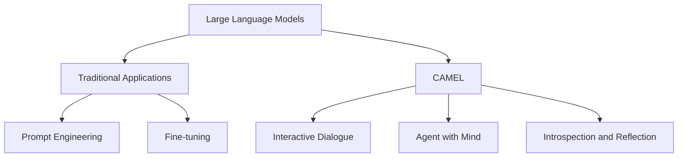

# 大语言模型应用指南：CAMEL

关键词：大语言模型、CAMEL、应用指南、自然语言处理、人工智能

## 1. 背景介绍
### 1.1 问题的由来
随着人工智能技术的飞速发展，大语言模型(Large Language Models, LLMs)在自然语言处理(Natural Language Processing, NLP)领域取得了突破性进展。LLMs 能够在海量文本数据上进行预训练，从而具备强大的语言理解和生成能力。然而，如何有效地应用 LLMs 来解决实际问题，仍然是一个值得探讨的话题。

### 1.2 研究现状
目前，业界已经提出了多种 LLMs 的应用方法，如提示工程(Prompt Engineering)、参数高效微调(Parameter-Efficient Fine-tuning)等。其中，CAMEL(Communicative Agents for "Mind" Exploration of Large Language Models)是一种新颖的 LLMs 应用范式，旨在通过对话式交互来探索和利用 LLMs 的潜力。

### 1.3 研究意义
CAMEL 为 LLMs 的应用提供了新的思路和方法。通过与 LLMs 进行多轮对话，我们可以更深入地了解模型的能力边界，挖掘其在不同任务上的潜力。这不仅有助于改进 LLMs 的性能，也为开发更智能、更自然的人机交互系统奠定了基础。

### 1.4 本文结构
本文将首先介绍 CAMEL 的核心概念和原理，然后详细阐述其算法步骤和数学模型。接着，我们将通过代码实例和应用场景来展示 CAMEL 的实际应用。最后，本文将总结 CAMEL 的研究成果，并展望其未来发展趋势和挑战。

## 2. 核心概念与联系

CAMEL 的核心理念是将 LLMs 视为一个智能体(Agent)，通过与其进行多轮对话来探索其"心智"(Mind)。这里的"心智"指的是 LLMs 在语言理解、知识表示、推理决策等方面的能力。CAMEL 的目标是通过引导 LLMs 进行自我探索和反思，从而更好地理解和利用其内在的语言智能。

CAMEL 与传统的 LLMs 应用方法(如提示工程)的主要区别在于：

1. CAMEL 强调双向交互。不同于单向地给 LLMs 提供提示并获取输出，CAMEL 允许用户与 LLMs 进行多轮对话，双方可以就某个话题深入探讨。

2. CAMEL 重视 LLMs 的主动性。在对话过程中，LLMs 不仅被动地响应用户的问题，还能够主动提出问题、发表见解，展现出一定的主动性和创造力。

3. CAMEL 关注 LLMs 的内在机制。通过巧妙设计对话引导，CAMEL 试图揭示 LLMs 在语言生成背后的知识表示和推理过程，为我们理解其工作原理提供新的视角。

下图展示了 CAMEL 的核心概念及其与传统 LLMs 应用方法的联系：

## 3. 核心算法原理 & 具体操作步骤
### 3.1 算法原理概述
CAMEL 的核心算法基于强化学习(Reinforcement Learning, RL)的思想。具体而言，我们将 LLMs 视为一个智能体，用户的输入视为环境状态，LLMs 的输出视为动作。通过设计合适的奖励函数，我们可以引导 LLMs 朝着期望的方向进行探索和优化。

### 3.2 算法步骤详解
CAMEL 的算法步骤可以概括为以下几点：

1. 初始化 LLMs 和对话历史。选择一个预训练的 LLMs 作为初始模型，并将对话历史初始化为空。

2. 用户输入问题。用户向 LLMs 提出一个问题或话题，作为对话的起点。

3. LLMs 生成回答。LLMs 根据当前的对话历史和用户输入，生成一个回答。

4. 计算奖励。根据预设的奖励函数，计算 LLMs 生成回答的奖励值。奖励函数可以考虑回答的相关性、连贯性、创新性等因素。

5. 更新对话历史。将用户输入和 LLMs 回答添加到对话历史中。

6. 判断是否结束。如果达到预设的对话轮数或满足终止条件，则结束对话；否则，返回步骤 2。

7. 优化 LLMs。根据累积的奖励值，使用 RL 算法(如 PPO、REINFORCE 等)对 LLMs 的参数进行优化，使其能够生成更高质量的回答。

### 3.3 算法优缺点
CAMEL 算法的主要优点包括：

1. 能够通过对话探索 LLMs 的能力边界，发现其在不同任务上的潜力。
2. 通过引入 RL 优化，可以使 LLMs 的回答更加符合人类偏好，提高对话质量。
3. 对话式交互更加自然，有利于建立人机之间的信任和理解。

但 CAMEL 算法也存在一些局限性：

1. 对话过程中的探索可能偏离主题，导致对话效率降低。
2. RL 优化需要大量的对话数据和计算资源，实现成本较高。
3. 奖励函数的设计需要仔细考虑，不当的奖励设计可能导致 LLMs 生成低质量或有害的回答。

### 3.4 算法应用领域
CAMEL 算法可以应用于以下几个领域：

1. 智能客服：通过与客户进行多轮对话，CAMEL 可以更好地理解客户需求，提供更精准、人性化的服务。

2. 教育助手：CAMEL 可以扮演学习伙伴的角色，与学生就不同主题进行深入探讨，激发学生的好奇心和创造力。

3. 医疗咨询：CAMEL 可以与患者进行对话，了解其症状和病史，为医生诊断提供辅助。

4. 创意生成：通过与 CAMEL 进行头脑风暴式的对话，可以激发人类的创意灵感，促进创新思维。

## 4. 数学模型和公式 & 详细讲解 & 举例说明
### 4.1 数学模型构建
CAMEL 的数学模型可以用一个元组 $(\mathcal{S}, \mathcal{A}, \mathcal{P}, \mathcal{R}, \gamma)$ 来表示，其中：

- $\mathcal{S}$ 表示对话状态空间，包括对话历史和用户当前输入。
- $\mathcal{A}$ 表示 LLMs 的动作空间，即生成回答的所有可能性。
- $\mathcal{P}$ 表示状态转移概率，即在当前对话状态下，LLMs 生成某个回答的概率。
- $\mathcal{R}$ 表示奖励函数，用于评估 LLMs 生成回答的质量。
- $\gamma$ 表示折扣因子，用于平衡短期奖励和长期奖励。

LLMs 的策略可以用一个条件概率分布 $\pi(a|s)$ 来表示，即在对话状态 $s$ 下采取动作 $a$ 的概率。CAMEL 的目标是找到一个最优策略 $\pi^*$，使得期望累积奖励最大化：

$$
\pi^* = \arg\max_\pi \mathbb{E}_{\tau \sim \pi} \left[ \sum_{t=0}^T \gamma^t r_t \right]
$$

其中，$\tau$ 表示一个完整的对话轨迹，$r_t$ 表示第 $t$ 轮对话获得的奖励。

### 4.2 公式推导过程
为了优化策略 $\pi$，我们可以使用策略梯度定理(Policy Gradient Theorem)。定义状态-动作值函数 $Q^\pi(s, a)$ 为在状态 $s$ 下采取动作 $a$，并在之后遵循策略 $\pi$ 的期望累积奖励：

$$
Q^\pi(s, a) = \mathbb{E}_{\tau \sim \pi} \left[ \sum_{t=0}^T \gamma^t r_t | s_0 = s, a_0 = a \right]
$$

根据策略梯度定理，策略 $\pi$ 的梯度可以表示为：

$$
\nabla_\theta J(\pi_\theta) = \mathbb{E}_{\tau \sim \pi_\theta} \left[ \sum_{t=0}^T \nabla_\theta \log \pi_\theta(a_t|s_t) Q^{\pi_\theta}(s_t, a_t) \right]
$$

其中，$\theta$ 表示策略 $\pi$ 的参数，$J(\pi_\theta)$ 表示在策略 $\pi_\theta$ 下的期望累积奖励。

根据上述梯度公式，我们可以使用随机梯度上升(Stochastic Gradient Ascent)的方法来更新策略参数：

$$
\theta \leftarrow \theta + \alpha \nabla_\theta J(\pi_\theta)
$$

其中，$\alpha$ 表示学习率。

### 4.3 案例分析与讲解
下面我们通过一个简单的例子来说明 CAMEL 的数学模型和优化过程。

考虑一个简化的对话场景，用户可以问 LLMs 两类问题：开放式问题和是非题。LLMs 的回答可以分为三类：相关、不相关和模棱两可。我们定义对话状态空间 $\mathcal{S} = \{s_1, s_2\}$，动作空间 $\mathcal{A} = \{a_1, a_2, a_3\}$，奖励函数如下：

- 如果用户问开放式问题，LLMs 回答相关，则奖励为 +1；回答不相关，则奖励为 -1；回答模棱两可，则奖励为 0。
- 如果用户问是非题，LLMs 回答相关，则奖励为 +1；回答不相关或模棱两可，则奖励为 -1。

假设 LLMs 的初始策略为随机策略，即在每个状态下均匀地选择动作。我们可以通过与用户进行多轮对话，收集对话数据，并使用策略梯度算法来优化 LLMs 的策略。

例如，假设我们收集到以下三条对话数据：

1. 用户：What is the meaning of life?
   LLMs：The meaning of life is subjective and varies from person to person.
   奖励：+1

2. 用户：Is the earth flat?
   LLMs：There is no scientific evidence supporting the flat earth theory.
   奖励：+1
   
3. 用户：What is the capital of France?
   LLMs：Paris is the capital and largest city of France.
   奖励：+1

根据这些数据，我们可以估计 $Q^{\pi_\theta}(s, a)$ 的值，并计算策略梯度 $\nabla_\theta J(\pi_\theta)$。通过多次迭代更新，LLMs 的策略会逐渐优化，生成更高质量的回答。

### 4.4 常见问题解答
1. Q: CAMEL 中的奖励函数如何设计？
   A: 奖励函数的设计需要考虑对话的目标和用户偏好。一般而言，奖励函数应该鼓励 LLMs 生成相关、连贯、有信息量的回答，惩罚无意义、矛盾或冒犯性的回答。奖励函数可以基于人工评分、用户反馈等信息来构建。

2. Q: CAMEL 优化过程中的探索-利用权衡如何处理？
   A: 探索-利用权衡是 RL 中的经典问题。在 CAMEL 中，我们可以使用 $\epsilon$-greedy 策略或 Upper Confidence Bound (UCB) 算法来平衡探索和利用。前者以 $\epsilon$ 的概率随机选择动作，以 $1-\epsilon$ 的概率选择当前最优动作；后者选择具有最高置信上界的动作。

3. Q: CAMEL 对计算资源和数据量的要求高吗？
   A: CAMEL 的优化过程需要大量的对话数据和计算资源。为了提高采样效率，我们可以使用 Off-Policy 算法(如 Q-Learning、DDPG 等)，利用历史数据来更新策略。此外，我们还可以使用并行计