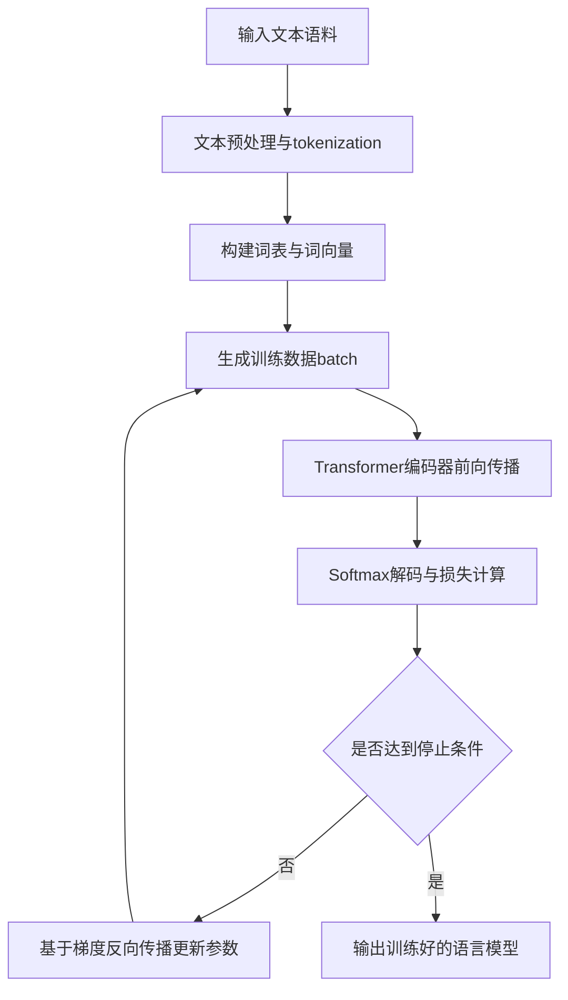

# 大语言模型应用指南：人工智能的起源

## 1. 背景介绍
### 1.1 问题的由来
人工智能(Artificial Intelligence, AI)是计算机科学领域最令人兴奋和充满挑战的分支之一。自从1956年达特茅斯会议首次提出"人工智能"这一概念以来,AI经历了从早期的符号主义、专家系统,到机器学习、深度学习,再到如今大语言模型的多个发展阶段。尤其是近年来,以ChatGPT、LaMDA等为代表的大语言模型引发了新一轮AI热潮,展现出通用人工智能(AGI)的曙光。

大语言模型的出现,使AI在自然语言理解与生成、知识表示、常识推理等方面取得了突破性进展,为智能对话、内容创作、信息检索、决策辅助等众多领域带来了变革性的应用前景。然而,大语言模型的原理、训练、部署与应用仍面临诸多技术难题与伦理挑战,亟需系统性的理论指导和实践探索。

### 1.2 研究现状 
目前,学术界和工业界对大语言模型的研究如火如荼。谷歌、OpenAI、DeepMind、微软等科技巨头纷纷投入巨资,构建出GPT-3、PaLM、Chinchilla、Megatron-Turing NLG等百亿级乃至千亿级参数量级的超大规模语言模型。这些模型在标准NLP基准测试中刷新了多项纪录,展现出接近甚至超越人类的语言理解与生成能力。

学术界对大语言模型的内在机理、训练方法、评估手段、应用拓展等方面也展开了深入研究。一方面,研究者们致力于探索语言模型的知识获取、常识推理、因果理解等认知能力的边界,提出指令微调、思维链等新型范式以增强其可控性。另一方面,研究者们也在积极探索语言模型在机器翻译、文本摘要、信息抽取、对话系统、内容生成等垂直领域的应用。

### 1.3 研究意义
系统梳理大语言模型的发展脉络、技术原理与应用实践,对于推动AI从感知智能走向认知智能、从专用智能走向通用智能具有重要意义。一方面,这有助于厘清大语言模型蕴含的认知科学启示,为探索类人智能、构建可解释AI提供理论参考。另一方面,这也有利于指导大语言模型在垂直行业的落地应用,为企业数字化转型、产业智能化升级提供新思路、新动能。

同时,大语言模型的广泛应用也带来了诸多伦理与安全隐患,如隐私泄露、算法偏见、版权侵犯等。系统梳理大语言模型的发展现状,有助于厘清其潜在风险,推动相关法律法规和伦理规范的完善,促进大语言模型在造福人类的同时最大限度规避负面影响。

### 1.4 本文结构
本文将围绕大语言模型的起源与发展、核心概念与原理、训练方法与开源工具、应用实践与案例分析、未来趋势与挑战等方面展开系统梳理。

第2章介绍大语言模型的核心概念,如Transformer、Attention、预训练、微调等,厘清其与传统语言模型、知识图谱的异同。

第3章深入剖析大语言模型的核心算法,包括自回归语言建模、Masked Language Modeling、Prefix Language Modeling等,并给出详细的流程图与伪代码。

第4章介绍大语言模型蕴含的数学原理,包括Softmax函数、交叉熵损失、LayerNorm等,并给出公式推导与案例分析。

第5章介绍大语言模型的开源工具与平台,如Hugging Face Transformers、DeepSpeed、Megatron-LM等,并给出详细的代码实例与运行结果。

第6章梳理大语言模型在智能对话、内容创作、语义检索、知识图谱等领域的应用现状与实践案例。

第7章推荐大语言模型的学习资源、开发工具与前沿论文,供读者进一步研究参考。

第8章总结大语言模型取得的研究进展,展望其未来发展趋势,分析其面临的技术挑战与伦理风险。

第9章附录中列举了大语言模型的常见问题与解答,以飨读者。

## 2. 核心概念与联系

大语言模型是以Transformer为基础架构、以海量文本语料为训练数据,通过自监督学习方式训练得到的语言模型。其核心是通过Attention机制建模文本序列的长程依赖,从而学习到语言的内在统计规律和隐含语义。与传统的N-gram语言模型、RNN语言模型相比,大语言模型具有参数量更大、语境理解更强、生成质量更高等特点。

大语言模型的训练通常分为两个阶段:预训练和微调。预训练阶段采用自监督学习,利用无标注的海量文本数据,通过自回归、Masked Language Modeling等任务学习通用语言知识。微调阶段在特定任务的小规模标注数据上进行有监督学习,使模型适配下游任务。这种"预训练+微调"范式打破了任务孤岛,实现了语言知识的迁移和复用。

大语言模型与知识图谱是AI时代两大知识表示范式。知识图谱以结构化三元组的形式显式地表示概念及其关联,而大语言模型以分布式词向量的形式隐式地编码语义知识。二者在知识获取、知识存储、知识推理等方面既有互补性也有竞争性。近年来,研究者们致力于将二者结合,探索基于知识的语言模型、面向语言的知识图谱等新方向。

## 3. 核心算法原理 & 具体操作步骤
### 3.1 算法原理概述
大语言模型的核心是利用深度神经网络学习文本序列的概率分布。给定一个文本序列 $X=(x_1,x_2,...,x_T)$,语言模型的目标是估计其概率:
$$P(X)=\prod_{t=1}^TP(x_t|x_1,...,x_{t-1})$$

传统的N-gram语言模型和RNN语言模型分别利用马尔科夫假设和RNN的状态向量来建模序列的条件概率。而大语言模型利用Transformer的Self-Attention机制来建模任意长度范围内词之间的依赖关系,其计算公式为:

$$Attention(Q,K,V)=softmax(\frac{QK^T}{\sqrt{d_k}})V$$

其中$Q$、$K$、$V$分别表示查询、键、值向量,$d_k$为向量维度。Self-Attention通过查询向量与所有键向量的相似度加权值向量,得到注意力权重,进而聚合上下文信息。Transformer中的Multi-Head Attention和Feedforward Network进一步增强了特征提取与非线性表达能力。

大语言模型的训练通常采用极大似然估计,即最小化负对数似然损失:

$$\mathcal{L}=-\sum_{t=1}^T\log P(x_t|x_1,...,x_{t-1})$$

其优化算法主要有随机梯度下降(SGD)及其变体,如Adam、AdamW等。

### 3.2 算法步骤详解
以下是基于Transformer的大语言模型的核心算法步骤:

1. 输入编码:将离散的词汇映射为连续的词向量,并加入位置编码以引入序列位置信息。
2. Self-Attention:通过缩放点积注意力计算词之间的相关性,并在多头注意力中并行计算多个注意力函数。
3. Feedforward Network:通过两层全连接网络和非线性激活函数(如ReLU)增强特征表示能力。 
4. Layer Normalization:在每一个子层之后对特征进行归一化,加速训练收敛并提高泛化能力。
5. 残差连接:将每一个子层的输入与输出相加,构成残差连接,缓解深层网络的优化难题。
6. Softmax输出:通过Softmax层将特征映射为下一个词的概率分布。
7. 损失计算:基于标签词和预测概率计算交叉熵损失。
8. 梯度优化:利用反向传播算法计算梯度,并用优化器更新模型参数以最小化损失函数。

以下是大语言模型训练的流程图:

### 3.3 算法优缺点
大语言模型相比传统语言模型的优势在于:

1. 长程依赖建模能力强,可以捕捉跨越数十乃至上百词的语义关联。
2. 语言理解与生成效果好,在多项NLP任务上接近甚至超越人类水平。 
3. 通过预训练学习通用语言知识,可低成本迁移至下游任务。
4. 模型参数量大,有利于刻画海量语料中的语言模式。

但大语言模型也存在一些局限性:

1. 模型参数量大,训练与推理成本高,需要大规模算力支持。
2. 模型容量有限,难以存储人类海量的知识,易出现幻觉。
3. 模型是黑盒,缺乏可解释性,难以对其行为进行约束与控制。
4. 模型易受训练数据偏见影响,在应用中可能产生伦理与安全风险。

### 3.4 算法应用领域
大语言模型可广泛应用于NLP的各个领域,主要包括:

1. 自然语言理解:如命名实体识别、关系抽取、文本分类、阅读理解等。
2. 自然语言生成:如机器翻译、文本摘要、对话生成、故事创作等。
3. 信息检索:如问答系统、语义搜索、推荐系统等。
4. 知识图谱:如实体链接、关系预测、图谱补全等。

此外,大语言模型与计算机视觉、语音识别的多模态融合,也衍生出图像描述、语音对话、视频问答等新应用。

## 4. 数学模型和公式 & 详细讲解 & 举例说明
### 4.1 数学模型构建
大语言模型的核心是Transformer架构,其数学原理可概括为三个关键公式:

1. Self-Attention:
$$Attention(Q,K,V)=softmax(\frac{QK^T}{\sqrt{d_k}})V$$

其中$Q$、$K$、$V$分别表示查询、键、值矩阵,$d_k$为矩阵维度。该公式通过查询向量与键向量的点积相似度对值向量加权求和,得到注意力矩阵。

2. 残差连接与Layer Normalization:
$$y=LayerNorm(x+Sublayer(x))$$

其中$x$和$y$分别为子层的输入和输出,$Sublayer$为子层函数(如Self-Attention、Feedforward Network)。该公式在子层之后引入残差连接与Layer Normalization,既能缓解深层网络的优化难题,又能加速训练收敛。

3. 损失函数:
$$\mathcal{L}=-\sum_{t=1}^T\log P(x_t|x_1,...,x_{t-1})$$

其中$x_t$为第$t$个位置的标签词,$P(x_t|x_1,...,x_{t-1})$为语言模型在给定前$t-1$个词的条件下预测$x_t$的概率。该公式基于极大似然估计,最小化负对数似然损失,以优化语言模型的生成效果。

### 4.2 公式推导过程
以下推导Self-Attention的前向计算过程:

给定输入序列的词向量矩阵$X\in \mathbb{R}^{n \times d}$,其中$n$为序列长度,$d$为词向量维度。首先通过线性变换得到查询矩阵$Q$、键矩阵$K$和值矩阵$V$:

$$Q=XW_Q, \quad K=XW_K, \quad V=XW_V$$

其中$W