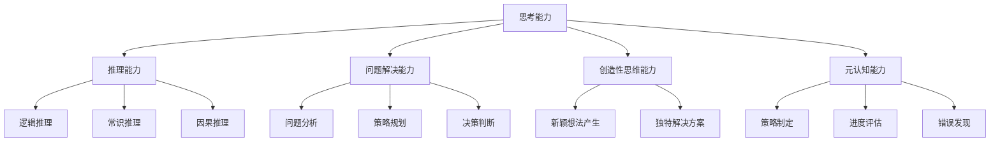

# 大语言模型应用指南：关于大语言模型的思考能力

## 1. 背景介绍

### 1.1 问题的由来

在过去几年中,大型语言模型(Large Language Models,LLMs)在自然语言处理(NLP)领域取得了令人瞩目的进展。这些模型通过在海量文本数据上进行预训练,学习了丰富的语言知识,展现出惊人的生成能力和理解能力。然而,除了生成流畅的自然语言之外,LLMs是否真正具备"思考"能力,能够像人类一样进行推理、分析和解决复杂问题,这一直是业界广泛关注和探讨的焦点问题。

### 1.2 研究现状

目前,已有大量研究工作致力于探索和评估LLMs的思考能力。一些研究人员设计了特定的基准测试(benchmark)来评估LLMs在逻辑推理、常识reasoning、数学推导等方面的表现。另一些研究则关注LLMs在特定领域(如科学、法律等)的应用,探索它们在解决实际问题中的能力。

然而,现有研究结果存在一定分歧。部分研究表明,当前的LLMs在某些任务上表现出色,接近甚至超过人类水平。但也有研究发现,LLMs在更复杂、更抽象的推理任务上存在明显缺陷,容易产生不合理或矛盾的输出。

### 1.3 研究意义

深入探索LLMs的思考能力,不仅有助于我们更好地了解这一前沿技术的能力边界,也将为LLMs在现实世界中的应用提供重要参考。如果LLMs真正具备强大的思考能力,它们将在辅助决策、智能问答、自动化编程等领域发挥重要作用。反之,如果LLMs的思考能力仍然有限,我们需要设计新的模型架构或训练方法来弥补这一缺陷。

### 1.4 本文结构

本文将全面探讨大语言模型的思考能力。我们将首先介绍思考能力的核心概念,并与相关概念(如推理、解决问题等)进行区分和联系。接下来,我们将深入探讨大语言模型思考能力的核心算法原理,包括注意力机制、序列到序列建模等,并给出具体的操作步骤。

然后,我们将介绍支撑大语言模型思考能力的数学模型,如transformer模型、自注意力机制等,并详细推导相关公式。为了帮助读者更好地理解,我们将提供大量案例分析和常见问题解答。

在项目实践部分,我们将展示如何利用开源工具搭建大语言模型,并提供详细的代码实现和运行结果展示。接下来,我们将探讨大语言模型在实际应用场景中的表现,如问答系统、文本摘要、代码生成等,并对未来应用前景进行展望。

最后,我们将总结大语言模型思考能力的研究成果、发展趋势和面临的挑战,并提供学习资源、开发工具和相关论文等推荐,以帮助读者进一步深入学习。

## 2. 核心概念与联系

思考能力(Thinking Capability)是指一个智能体(无论是人类还是人工智能系统)进行推理、分析、解决问题的能力。它是一个复杂的高级认知过程,涉及多种认知技能的综合运用,如逻辑推理、创造性思维、决策判断等。

对于大语言模型而言,思考能力主要体现在以下几个方面:

1. **推理能力(Reasoning Capability)**: 根据已有信息,推导出新的结论或发现新的知识。这包括逻辑推理、常识推理、因果推理等多种推理形式。

2. **问题解决能力(Problem-Solving Capability)**: 面对复杂问题时,能够进行分析、规划和决策,最终得出解决方案。

3. **创造性思维能力(Creative Thinking Capability)**: 能够产生新颖、独特的想法和解决方案,而不仅仅是重复已有的知识。

4. **元认知能力(Metacognitive Capability)**: 能够监控和调节自身的认知过程,包括制定策略、评估进度、发现错误等。

这些能力相互关联、相互影响。例如,有效的问题解决往往需要推理和创造性思维的支持;而元认知能力可以监控和优化推理、解决问题等过程。

值得注意的是,思考能力并不等同于简单的知识获取或语言生成。大语言模型之所以备受关注,正是因为它们有望在一定程度上模拟人类的思考过程,而不仅仅是存储和检索知识。

## 3. 核心算法原理 & 具体操作步骤

### 3.1 算法原理概述

大语言模型的思考能力主要源自两个核心算法:自注意力机制(Self-Attention Mechanism)和转换器模型(Transformer Model)。

**自注意力机制**使模型能够捕捉输入序列中任意两个位置之间的依赖关系,从而更好地建模长距离依赖。这为模型赋予了一定的推理和建模能力。

**转换器模型**则通过堆叠多个编码器-解码器层,使模型能够有效地捕捉输入和输出序列之间的复杂映射关系。这种序列到序列的建模方式,使得模型可以在给定的上下文中生成新的、相关的输出,体现了一定的思考和推理能力。

这两种算法相互配合,赋予了大语言模型强大的语言理解和生成能力,为展现思考能力奠定了基础。

### 3.2 算法步骤详解

#### 3.2.1 自注意力机制

自注意力机制的核心思想是,对于输入序列中的每个单词,计算其与该序列中所有其他单词的"注意力"分数,然后将这些注意力分数与对应的单词表示相加,作为该单词的新表示。

具体操作步骤如下:

1. 将输入序列 $X = (x_1, x_2, ..., x_n)$ 映射为一系列向量 $\boldsymbol{h}_1, \boldsymbol{h}_2, ..., \boldsymbol{h}_n$。

2. 对每个向量 $\boldsymbol{h}_i$,计算其与所有 $\boldsymbol{h}_j$ 的注意力分数:

$$
e_{ij} = \frac{(\boldsymbol{h}_i \boldsymbol{W}^Q)(\boldsymbol{h}_j \boldsymbol{W}^K)^T}{\sqrt{d_k}}
$$

其中 $\boldsymbol{W}^Q$ 和 $\boldsymbol{W}^K$ 分别是可学习的查询向量和键向量的线性投影矩阵,用于计算注意力分数;$d_k$ 是缩放因子,用于防止过大的内积导致梯度消失。

3. 对注意力分数 $e_{ij}$ 执行 softmax 操作,得到归一化的注意力权重:

$$
\alpha_{ij} = \mathrm{softmax}(e_{ij}) = \frac{e^{e_{ij}}}{\sum_{k=1}^n e^{e_{ik}}}
$$

4. 将注意力权重 $\alpha_{ij}$ 与值向量 $\boldsymbol{h}_j \boldsymbol{W}^V$ 相乘并求和,得到 $\boldsymbol{h}_i$ 的新表示 $\boldsymbol{h}_i^{'}$:

$$
\boldsymbol{h}_i^{'} = \sum_{j=1}^n \alpha_{ij}(\boldsymbol{h}_j \boldsymbol{W}^V)
$$

其中 $\boldsymbol{W}^V$ 是可学习的值向量线性投影矩阵。

通过这种方式,每个单词的表示都融合了其与输入序列中所有其他单词的关系信息,使模型能够更好地建模长距离依赖,提高了推理能力。

#### 3.2.2 转换器模型

转换器模型由编码器(Encoder)和解码器(Decoder)两部分组成,用于序列到序列的建模任务。

**编码器**的作用是将输入序列映射为一系列向量表示,捕捉输入序列的上下文信息。编码器由多个相同的层组成,每一层都包含两个子层:多头自注意力机制(Multi-Head Self-Attention)和前馈神经网络(Feed-Forward Neural Network)。

**解码器**的作用是根据编码器的输出和之前生成的输出tokens,生成新的输出序列。解码器的结构与编码器类似,不同之处在于它还包含一个额外的注意力子层,用于关注编码器的输出。

具体操作步骤如下:

1. **输入embedding**:将输入序列和输出序列分别映射为向量表示。

2. **编码器**:
    - 对输入序列执行多头自注意力操作,捕捉单词之间的依赖关系。
    - 通过前馈神经网络,对上一步的输出进行非线性变换。
    - 重复上述两个步骤,构成一个编码器层。堆叠多个编码器层,得到输入序列的编码表示。

3. **解码器**:
    - 对输出序列执行掩码多头自注意力操作,只允许关注之前的输出tokens。
    - 执行编码器-解码器注意力操作,关注编码器的输出,融合输入序列的上下文信息。
    - 通过前馈神经网络,对上一步的输出进行非线性变换。
    - 重复上述三个步骤,构成一个解码器层。堆叠多个解码器层,得到输出序列。

4. **输出**:对解码器的输出执行线性变换和softmax操作,生成概率分布,选取概率最大的token作为输出。

通过编码器捕捉输入序列的上下文信息,解码器结合输入信息生成新的相关输出,体现了一定的推理和思考能力。

### 3.3 算法优缺点

**优点**:

1. **长距离依赖建模**:自注意力机制使模型能够直接捕捉任意距离的单词依赖关系,有利于长序列的处理和推理。
2. **并行计算**:自注意力机制和前馈神经网络都是高度并行化的,有利于GPU等加速器的利用,提高计算效率。
3. **灵活性**:转换器模型可以应用于多种序列到序列的任务,如机器翻译、文本摘要、对话系统等。

**缺点**:

1. **计算复杂度高**:自注意力机制的计算复杂度为 $O(n^2 \cdot d)$,对长序列来说代价较大。
2. **缺乏结构化知识**:大语言模型主要是通过预训练学习文本模式,缺乏对结构化知识(如逻辑规则、常识等)的显式建模。
3. **存在偏见和不一致性**:由于预训练数据的局限性,大语言模型可能存在一定的偏见和不一致性。
4. **缺乏解释性**:大语言模型的内部运作机制较为"黑箱",输出结果的解释性较差。

### 3.4 算法应用领域

基于自注意力机制和转换器模型的大语言模型,已经在多个领域展现出优异的性能,主要包括:

1. **自然语言生成(NLG)**:如机器翻译、文本摘要、对话系统、创作写作等。
2. **自然语言理解(NLU)**:如文本分类、情感分析、阅读理解、问答系统等。
3. **代码生成和代码理解**:如自动代码补全、代码修复、代码迁移等。
4. **知识图谱构建和推理**:从自然语言文本中提取结构化知识,并进行推理。
5. **多模态任务**:如视觉问答、图像描述、视频描述等,结合视觉和语言信息。

未来,大语言模型在更多领域