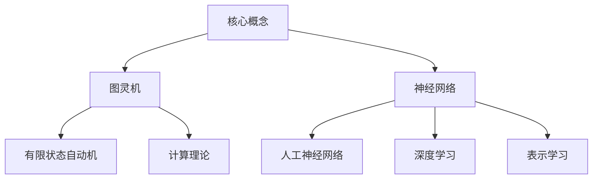
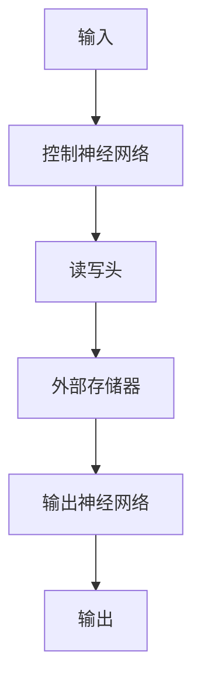

以下是根据您的要求撰写的技术博客文章正文：

# 大语言模型应用指南：图灵机与神经网络

## 1. 背景介绍

### 1.1 问题的由来

在过去几年中，自然语言处理(NLP)领域取得了长足的进步,很大程度上归功于大型神经网络模型(如GPT、BERT等)的出现。这些模型通过在大规模文本语料库上进行预训练,学习到了丰富的语义和上下文信息,从而在下游任务中表现出色。然而,这些模型也存在一些明显的缺陷,例如:

1. **缺乏解释性和可解释性**:大型神经网络模型通常是一个黑箱,难以解释其内部工作机制和决策过程。
2. **缺乏系统性和一致性**:这些模型可能在某些任务上表现良好,但在其他任务上却表现不佳,缺乏全面的系统性能力。
3. **缺乏鲁棒性和可控性**:模型的输出可能存在偏差、不确定性和不一致性,难以控制和调整。

为了解决这些问题,研究人员提出了将神经网络模型与符号系统(如图灵机)相结合的思路,旨在构建具有更强解释性、一致性和可控性的新一代大型语言模型。

### 1.2 研究现状 

目前,已有多项研究探索了神经网络与图灵机相结合的方法。一些典型的工作包括:

- **神经图灵机(NTM)**: 将神经网络与外部可读写存储器(类似于图灵机的带)相结合,赋予模型更强的记忆和推理能力。
- **神经程序解释器(NPI)**: 将神经网络与程序执行引擎相结合,使模型能够学习和执行类似于图灵机指令的程序。
- **神经符号机(NSM)**: 将神经网络与符号推理系统相结合,使模型能够在连续和离散空间中进行推理。

这些尝试取得了一定的进展,但仍然存在一些局限性,如计算效率低下、泛化能力有限等。因此,如何更好地将神经网络与符号系统相结合,成为当前研究的重点和挑战。

### 1.3 研究意义

将神经网络与图灵机相结合,有望构建出一种新型的大型语言模型,具有以下潜在优势:

1. **增强解释性和可解释性**:通过将神经网络与符号系统相结合,模型的决策过程和内部机制将更加透明和可解释。
2. **提高系统性和一致性**:符号系统为模型提供了清晰的逻辑和规则,有助于提高模型的系统性和一致性。
3. **增强鲁棒性和可控性**:符号系统的规则和约束可以帮助控制和调整模型的输出,提高其鲁棒性和可控性。
4. **拓展应用场景**:具有更强解释性和可控性的大型语言模型,可以在一些对可解释性和可控性要求较高的领域(如医疗、法律等)得到更广泛的应用。

因此,探索神经网络与图灵机相结合的新型大型语言模型,对于推动自然语言处理领域的发展具有重要意义。

### 1.4 本文结构

本文将从以下几个方面探讨神经网络与图灵机相结合的大型语言模型:

1. 介绍相关的核心概念,包括图灵机、神经网络等。
2. 阐述核心算法原理和具体操作步骤。 
3. 构建相关的数学模型,并详细推导公式。
4. 通过代码实例,展示具体的项目实践。
5. 讨论实际应用场景和未来发展趋势。
6. 推荐相关的工具和学习资源。

## 2. 核心概念与联系

在探讨神经网络与图灵机相结合的大型语言模型之前,我们首先需要了解一些核心概念,包括图灵机和神经网络。

### 2.1 图灵机

图灵机是一种抽象的计算模型,由英国计算机科学家艾伦·图灵在1936年提出。它由一个无限长的带(tape)、一个读写头(read/write head)和一组状态转移规则(state transition rules)组成。

图灵机的工作原理如下:

1. 带上初始包含一个输入字符串。
2. 读写头读取当前位置的字符。
3. 根据当前状态和读取的字符,按照状态转移规则执行相应的操作(写入字符、移动读写头、切换状态)。
4. 重复步骤2和3,直到达到某个终止状态。

图灵机具有"图灵完备"的性质,即它可以计算任何可计算的函数。这使得图灵机成为研究计算理论和计算复杂性的重要工具。

### 2.2 神经网络

神经网络是一种受生物神经系统启发的计算模型,广泛应用于机器学习和深度学习领域。它由大量互连的节点(神经元)组成,每个节点对输入信号进行加权求和,并通过激活函数产生输出。

神经网络的基本工作原理如下:

1. 输入层接收原始输入数据。
2. 隐藏层对输入数据进行非线性转换和特征提取。
3. 输出层根据隐藏层的输出,产生最终的预测或决策结果。
4. 通过反向传播算法调整网络权重,使模型在训练数据上的预测误差最小化。

神经网络擅长从大量数据中自动学习特征表示,并在许多任务上表现出色,如图像识别、自然语言处理等。然而,神经网络也存在解释性差、缺乏系统性等问题。

### 2.3 神经网络与图灵机的联系

虽然图灵机和神经网络看似截然不同,但它们之间存在一些内在联系:

1. **计算能力**:图灵机和神经网络(在理论上)都具有"图灵完备"的性质,即它们都可以计算任何可计算的函数。
2. **序列处理**:图灵机和循环神经网络(如LSTM、GRU)都擅长处理序列数据,如自然语言等。
3. **可微分编程**:神经网络可以被视为一种"可微分程序",其中权重就相当于程序的参数。通过梯度下降优化这些参数,神经网络可以"学习"执行特定任务。

基于这些联系,研究人员提出了将神经网络与图灵机相结合的想法,旨在构建出一种新型的大型语言模型,结合了两者的优势:神经网络的强大表示学习能力,以及图灵机的解释性、系统性和可控性。

在接下来的章节中,我们将详细探讨这种新型大型语言模型的核心算法原理、数学模型、项目实践等内容。

## 3. 核心算法原理 & 具体操作步骤

### 3.1 算法原理概述

将神经网络与图灵机相结合的核心思想是:使用神经网络来学习执行图灵机指令的策略,从而赋予模型更强的解释性、系统性和可控性。具体来说,该算法由以下几个主要组成部分:

1. **控制神经网络(Controller)**:一个递归神经网络(如LSTM、GRU等),负责根据当前状态和输入,生成图灵机的下一步操作。
2. **外部存储器(External Memory)**:类似于图灵机的带,用于存储和操作数据。
3. **读写头(Read/Write Head)**:根据控制神经网络的输出,在外部存储器上执行读写操作。
4. **输出神经网络(Output Network)**:根据外部存储器的内容和控制神经网络的状态,生成最终的输出。

在训练过程中,该算法通过端到端的方式,学习控制神经网络生成正确的图灵机指令序列,以最小化在训练数据上的损失函数。经过训练后,模型不仅能够在下游任务上表现出色,而且其内部的执行过程也更加透明和可解释。

### 3.2 算法步骤详解

下面我们详细介绍该算法的具体执行步骤:

1. **初始化**:
   - 将输入数据馈送到控制神经网络。
   - 初始化外部存储器为全零状态。
   - 将读写头指向外部存储器的起始位置。

2. **循环执行**:
   - 控制神经网络根据当前状态和输入,输出下一步的操作,包括:
     - 写入外部存储器的值和位置。
     - 移动读写头的方向和距离。
     - 切换控制神经网络的内部状态。
   - 读写头根据控制神经网络的输出,在外部存储器上执行相应的读写操作。
   - 重复上述过程,直到控制神经网络进入终止状态。

3. **输出生成**:
   - 输出神经网络根据外部存储器的内容和控制神经网络的最终状态,生成最终的输出。

在训练过程中,我们定义一个损失函数,衡量模型输出与ground truth之间的差异。然后,通过反向传播算法,更新控制神经网络、读写头和输出神经网络的参数,使损失函数最小化。

值得注意的是,在推理阶段,该算法的执行过程是完全可解释和可控的。我们可以追踪控制神经网络生成的每一步图灵机指令,以及这些指令在外部存储器上的具体执行过程,从而更好地理解模型的内部工作机制。

### 3.3 算法优缺点

该算法相对于传统的神经网络模型,具有以下优点:

1. **增强解释性**:模型的执行过程更加透明,我们可以追踪其内部的图灵机指令序列。
2. **提高系统性**:由于引入了图灵机的概念,模型的行为更加规范和一致。
3. **增强可控性**:我们可以通过设计特定的图灵机指令,来控制和调整模型的输出。

然而,该算法也存在一些潜在的缺点和挑战:

1. **计算效率**:由于需要维护外部存储器和执行图灵机指令,该算法的计算开销可能较大。
2. **训练稳定性**:控制神经网络需要同时学习生成正确的指令序列和维护内部状态,训练过程可能不太稳定。
3. **指令设计**:设计一套合理的图灵机指令集是一个挑战,需要权衡表达能力和简洁性。

### 3.4 算法应用领域

将神经网络与图灵机相结合的大型语言模型,具有广泛的潜在应用前景:

1. **自然语言处理**:在机器翻译、对话系统、文本生成等任务中,该模型可以提供更加可解释和可控的输出。
2. **推理与规划**:该模型可用于执行逻辑推理、决策规划等任务,并提供可解释的推理过程。
3. **程序合成**:通过设计合适的图灵机指令集,该模型可用于自动生成计算机程序。
4. **可解释AI**:在一些对可解释性要求较高的领域(如医疗、法律等),该模型可以提供更加透明和可信的决策支持。

总的来说,将神经网络与图灵机相结合的大型语言模型,为构建更加可解释、可控和系统化的人工智能系统提供了一种有前景的方法。

## 4. 数学模型和公式 & 详细讲解 & 举例说明

在前面的章节中,我们介绍了将神经网络与图灵机相结合的大型语言模型的核心思想和算法原理。在这一章节中,我们将构建该模型的数学形式化描述,并详细推导相关公式。

### 4.1 数学模型构建

我们将该模型的主要组成部分用数学符号表示如下