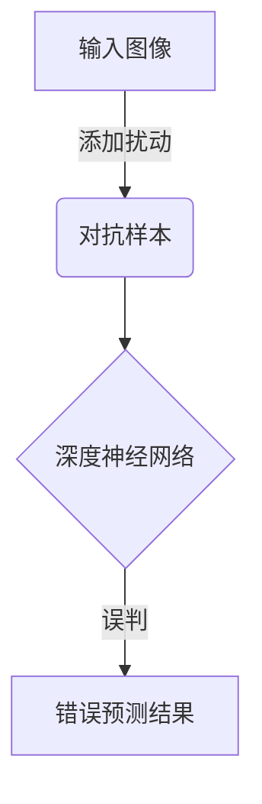
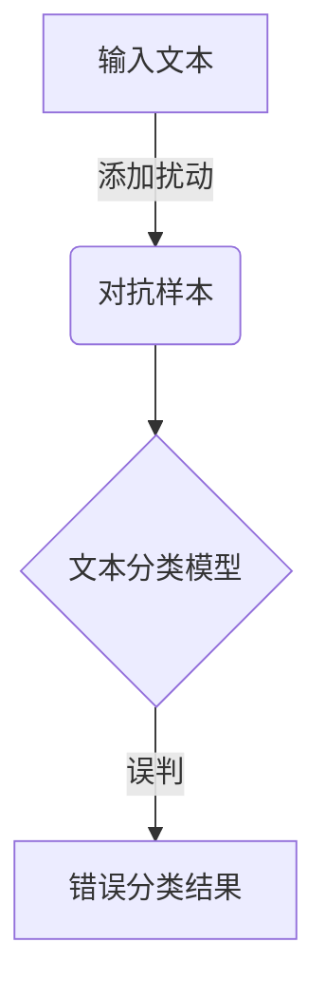

# 大语言模型应用指南：对抗样本

## 1. 背景介绍

### 1.1 问题的由来

随着深度学习和大型语言模型的兴起,自然语言处理(NLP)领域取得了长足的进步。然而,这些模型也面临着一个严峻的挑战:对抗样本(Adversarial Examples)。对抗样本是指在原始输入数据中添加了一些微小的扰动,使得模型的预测结果发生了明显的变化。这种现象不仅存在于计算机视觉领域,在NLP任务中也同样存在。

对抗样本的存在暴露了当前模型的脆弱性,模型过于依赖输入数据的表面特征,缺乏对底层语义的理解能力。一个看似无害的小扰动就能轻易地误导模型,这在安全敏感的应用场景下是难以容忍的。因此,提高模型对抗对抗样本攻击的鲁棒性,已经成为NLP领域的一个重要研究课题。

### 1.2 研究现状

早期的对抗攻击方法主要集中在对输入进行添加扰动,如字符级别的扰动(如将"好"替换为"
g00d")、词级别的扰动(如将"好"替换为"优秀")等。这些攻击方式虽然有一定的破坏性,但也过于简单和人为。

近年来,研究人员提出了一些更加高级的对抗攻击方法,如基于梯度的攻击、基于语义的攻击等。这些攻击方式能够生成看似无害但实际上对模型有很强攻击性的对抗样本。

与此同时,提高模型鲁棒性的防御方法也在不断探索中,包括对抗训练、数据增强、模型修剪等多种策略。但目前的防御方法还没有完全解决对抗样本的问题,在提高鲁棒性的同时,也可能导致模型性能的下降。

### 1.3 研究意义  

对抗样本不仅是一个理论上的挑战,更是实际应用中的一个安全隐患。以下是一些对抗样本可能带来的风险:

- 在机器翻译系统中,对抗样本可能导致错误的翻译结果,造成信息传递失真;
- 在聊天机器人中,对抗样本可能诱使机器人做出不当回应,影响用户体验;  
- 在内容审核系统中,对抗样本可能逃过审核,导致有害信息泄露;
- 在自动驾驶系统中,对抗样本可能干扰交通标识的识别,威胁行车安全。

因此,研究对抗样本攻击和防御机制,不仅有助于提高模型的鲁棒性,更能增强实际应用系统的安全性,保障人工智能系统的可靠运行。

### 1.4 本文结构

本文将全面介绍大语言模型中对抗样本的相关研究,包括:

- 对抗样本的核心概念及其与其他领域的联系(第2节)
- 常见的对抗攻击算法原理及具体实现步骤(第3节)
- 对抗样本生成的数学模型及公式推导(第4节)
- 实际应用中的代码实例和详细解释(第5节)
- 对抗样本在不同场景下的应用(第6节)
- 相关工具和学习资源推荐(第7节)
- 对抗样本研究的未来趋势和面临的挑战(第8节)

## 2. 核心概念与联系

对抗样本(Adversarial Examples)是指在原始输入数据中添加了一些看似无关紧要的扰动,但这些扰动能够显著改变模型的预测结果。形式化地定义如下:

给定一个机器学习模型 $f: \mathcal{X} \rightarrow \mathcal{Y}$ 和原始输入样本 $x \in \mathcal{X}$,满足 $f(x) = y$。对抗样本 $x^{adv}$ 是一个在 $x$ 附近的样本,且 $f(x^{adv}) \neq y$,但 $x$ 和 $x^{adv}$ 在人眼看来几乎没有区别。

对抗样本最早是在计算机视觉领域被发现和研究的。Szegedy等人在2013年发现,通过向输入图像添加一些人眼难以察觉的噪声扰动,就能够轻易地欺骗深度神经网络模型,使其将熊猫图像误判为纽扣钩。这一发现引发了机器学习领域对模型鲁棒性的广泛关注和探讨。

后来研究人员发现,对抗样本这一现象不仅存在于计算机视觉领域,在自然语言处理任务中也同样存在。比如在文本分类任务中,通过在输入文本中添加一些看似无关的词语或者微调词序,就能够诱使模型做出完全不同的分类预测。

对抗样本的存在暴露了当前深度学习模型的一个重大缺陷:模型过于依赖输入数据的表面特征,缺乏对底层语义的理解能力。一个看似无害的小扰动就能轻易地误导模型,这在安全敏感的应用场景下是难以容忍的。

因此,提高模型对抗对抗样本攻击的鲁棒性,已经成为机器学习领域的一个重要研究课题。在自然语言处理领域,对抗样本的研究主要集中在以下几个方面:

1. **对抗攻击算法**: 设计有效的对抗攻击算法,能够高效地生成对抗样本,从而评估和检测模型的脆弱性。

2. **鲁棒性防御机制**: 提出各种防御策略,提高模型对抗对抗样本攻击的鲁棒性,保证模型在对抗环境下的可靠运行。

3. **对抗样本的解释性**: 探索对抗样本的内在机制,揭示模型为什么会被对抗样本所欺骗,从而更好地理解模型的局限性。

4. **对抗训练**: 利用对抗样本对模型进行对抗训练,提高模型的泛化能力,增强其对抗性。

5. **对抗样本的应用**: 除了作为评估和提高模型鲁棒性的工具,对抗样本在一些其他领域也有潜在的应用价值,如数据增强、模型压缩等。

总的来说,对抗样本不仅是一个理论上的挑战,更是实际应用中的一个安全隐患。研究对抗样本攻击和防御机制,不仅有助于提高模型的鲁棒性,更能增强实际应用系统的安全性,保障人工智能系统的可靠运行。

## 3. 核心算法原理 & 具体操作步骤  

### 3.1 算法原理概述

生成对抗样本的核心思想是:在原始输入样本的附近寻找一个扰动向量,使得加上这个扰动后的新样本能够诱使模型做出错误的预测。形式化地,给定一个输入样本 $x$,目标是找到一个扰动向量 $\delta$,使得:

$$\arg\max_{y \neq f(x)} f(x + \delta) = y$$

其中 $f$ 是待攻击的模型, $y$ 是我们期望模型做出的错误预测结果。

根据扰动向量 $\delta$ 的计算方式不同,目前主要有以下几种对抗攻击算法:

1. **基于梯度的攻击算法** (Gradient-based Attack)
2. **基于优化的攻击算法** (Optimization-based Attack) 
3. **基于生成模型的攻击算法** (Generative Model Attack)
4. **基于规则的攻击算法** (Rule-based Attack)

其中,基于梯度和基于优化的攻击算法是当前最常用和最有效的两大类。我们将在接下来详细介绍它们的原理和实现步骤。

### 3.2 算法步骤详解

#### 3.2.1 基于梯度的攻击算法

基于梯度的攻击算法利用了神经网络模型的反向传播机制,通过计算输入对模型输出的梯度,从而找到一个能够最大化模型预测误差的扰动向量。

**快速梯度符号攻击(FGSM)**

快速梯度符号攻击(Fast Gradient Sign Method, FGSM)是最早也是最简单的一种基于梯度的攻击算法。它的基本思路是:沿着输入数据梯度的正方向对输入进行扰动,从而使得模型的预测误差最大化。具体操作步骤如下:

1. 计算模型输出相对于输入数据的梯度 $\nabla_x J(x, y_{true})$
2. 计算符号梯度 $g = \text{sign}(\nabla_x J(x, y_{true}))$
3. 生成对抗样本 $x^{adv} = x + \epsilon \cdot g$

其中 $\epsilon$ 是扰动的强度,控制着扰动的大小。

FGSM算法简单高效,但其生成的对抗样本也比较容易被防御。因此,后来研究者提出了多种改进版本,如目标攻击(Targeted Attack)、迭代攻击(Iterative Attack)等,以提高攻击的有效性。

**投射梯度下降攻击(PGD)** 

投射梯度下降攻击(Projected Gradient Descent, PGD)是一种迭代的攻击算法,它通过多次迭代优化,生成更加强有力的对抗样本。PGD算法的步骤如下:

1. 初始化对抗样本 $x^{adv}_0 = x$
2. 对于迭代次数 $i=1,2,...,k$:
    - 计算梯度 $g_i = \nabla_{x} J(x^{adv}_{i-1}, y_{true})$  
    - 更新对抗样本 $x^{adv}_i = \Pi_{x+\epsilon}(x^{adv}_{i-1} + \alpha \cdot \text{sign}(g_i))$
3. 输出最终的对抗样本 $x^{adv} = x^{adv}_k$

其中 $\Pi_{x+\epsilon}$ 表示将样本投影回 $x$ 的 $\epsilon$ 邻域,以控制扰动的大小; $\alpha$ 是步长,控制每次迭代的更新幅度。

PGD攻击相比FGSM更加强大,能够生成更有针对性的对抗样本。但同时,它的计算代价也更高,需要多次迭代优化。

#### 3.2.2 基于优化的攻击算法

基于优化的攻击算法将对抗样本的生成问题建模为一个优化问题,通过优化算法求解得到最优扰动。

**C&W攻击**

C&W攻击(Carlini & Wagner Attack)是一种典型的基于优化的攻击算法,它将对抗样本的生成问题建模为以下优化问题:

$$\underset{\delta}{\text{minimize}} \quad \|\delta\|_p + c \cdot f(x+\delta)$$
$$\text{subject to} \quad x+\delta \in [0,1]^n$$

其中 $\|\delta\|_p$ 是扰动向量的 $L_p$ 范数, $c$ 是一个权重参数,控制扰动大小和攻击成功率之间的权衡。$f(x+\delta)$ 是一个损失函数,衡量生成的对抗样本 $x+\delta$ 与目标标签之间的差异。

这个优化问题可以通过梯度下降等优化算法来求解。得到的最优扰动向量 $\delta^*$ 就是我们需要的对抗扰动。

C&W攻击能够生成视觉上无法分辨的高质量对抗样本,攻击效果非常强。但它也存在一些缺点,如计算代价高、针对性不够灵活等。

**ElasticAttack**

ElasticAttack是一种新颖的基于优化的攻击算法,它结合了统计建模和优化技术,能够生成高质量的语义对抗样本。

ElasticAttack的基本思路是:首先通过统计建模捕捉输入数据的语义和句法特征,然后将这些