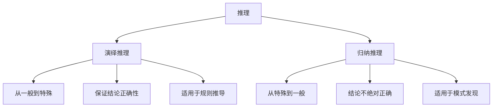
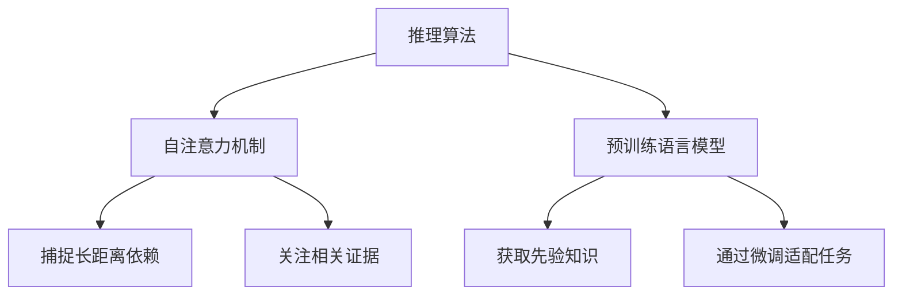

# 大语言模型应用指南：演绎推理与归纳推理

## 1. 背景介绍

### 1.1 问题的由来

在人工智能领域,推理是一个核心问题。推理是从已知信息中得出新的结论或知识的过程。传统的机器学习方法主要关注数据驱动的模式识别和预测,但对于需要复杂推理的任务,它们的能力仍然有限。

随着大型语言模型(如GPT-3、PaLM等)的出现,基于大规模预训练的语言模型展现出了强大的推理能力,能够在看似不相关的信息之间建立联系,并产生令人惊讶的见解和结论。这种推理能力主要来自两个方面:演绎推理(deductive reasoning)和归纳推理(inductive reasoning)。

### 1.2 研究现状 

演绎推理是从一般原理出发,按照严格的逻辑推导规则得出特定结论的过程。它保证了结论的正确性,但受限于已知前提的范围。而归纳推理则是从具体案例中总结规律,形成一般化的结论。它能够发现新的知识,但结论的正确性无法百分之百保证。

目前,大型语言模型在演绎推理和归纳推理方面都取得了长足进展,但仍存在一些挑战:

- 如何评估和提高推理的正确性和一致性?
- 如何确保推理过程的可解释性和可控性?
- 如何将先验知识和常识引入推理过程?
- 如何处理推理中的矛盾和不确定性?

### 1.3 研究意义

提高大型语言模型的推理能力,对于构建通用人工智能(AGI)至关重要。高质量的推理不仅能够帮助模型更好地理解和生成自然语言,还能够支持更复杂的任务,如问答系统、自动化规划和决策等。此外,可解释和可控的推理过程也有助于提高人工智能系统的安全性和可信度。

### 1.4 本文结构

本文将全面介绍大型语言模型在演绎推理和归纳推理方面的应用。我们将首先阐述两种推理方式的核心概念和联系,然后深入探讨相关算法原理、数学模型和公式,并通过实际案例进行详细分析。此外,我们还将分享项目实践经验、应用场景、工具和资源推荐,最后总结未来发展趋势和面临的挑战。

## 2. 核心概念与联系

演绎推理(deductive reasoning)和归纳推理(inductive reasoning)是两种基本的推理方式,它们在逻辑基础、应用场景和推理过程上存在明显差异,但又存在内在联系。

演绎推理是从一般原理或公理出发,通过严格的逻辑推理规则得出特定结论的过程。它遵循"从一般到特殊"的思路,确保结论在给定前提下是绝对正确的。典型的应用场景包括定理证明、规则推导和专家系统等。

而归纳推理则是从具体的观察或案例中总结规律,形成一般化的结论。它遵循"从特殊到一般"的思路,结论虽然合理但无法百分之百保证正确性。归纳推理常用于模式发现、概念形成和科学理论构建等领域。

尽管两种推理方式在逻辑基础上存在差异,但它们在实际应用中往往是相辅相成的。一方面,演绎推理可以为归纳推理提供理论基础和验证手段;另一方面,归纳推理也能为演绎推理提供新的前提和启发。大型语言模型能够灵活地结合这两种推理方式,在更广泛的领域发挥作用。

## 3. 核心算法原理与具体操作步骤

### 3.1 算法原理概述

大型语言模型在进行演绎推理和归纳推理时,主要依赖于自注意力机制(Self-Attention Mechanism)和预训练语言模型(Pre-trained Language Model)等核心技术。

自注意力机制能够捕捉输入序列中任意两个位置之间的关系,从而更好地建模长距离依赖。在推理过程中,它可以帮助模型关注到相关的证据和前提,并据此进行有效推导。

而预训练语言模型则通过在大规模语料库上进行无监督预训练,获得了丰富的语言知识和推理能力。这种通过自监督学习获得的先验知识,可以作为推理的基础,并在特定任务上通过微调进一步提高性能。

基于这些核心技术,大型语言模型可以在演绎推理和归纳推理中发挥作用。具体来说,演绎推理更多地依赖于自注意力机制捕捉前提和规则,并通过严格的逻辑推导得出结论;而归纳推理则更多地利用预训练语言模型中蕴含的知识,从大量案例中发现潜在的模式和规律。

### 3.2 算法步骤详解

以下是大型语言模型在进行演绎推理和归纳推理时的典型算法步骤:

**演绎推理算法步骤:**

1. **输入处理:** 将推理问题和相关前提/规则表示为文本序列输入到语言模型中。
2. **自注意力计算:** 通过自注意力机制捕捉输入序列中不同位置之间的关系,关注到相关的前提和规则。
3. **逻辑推导:** 基于自注意力权重,按照严格的逻辑推理规则(如命题逻辑、谓词逻辑等)进行推导,得出中间结论。
4. **结果生成:** 将推导出的结论序列化为自然语言输出。

**归纳推理算法步骤:**  

1. **案例输入:** 将需要进行归纳的案例集合表示为文本序列输入到语言模型中。
2. **模式发现:** 利用预训练语言模型中蕴含的知识,从大量案例中发现潜在的模式和规律。
3. **规律总结:** 基于发现的模式,通过自注意力机制关注到相关的证据,总结出一般化的规律或原理。  
4. **结果生成:** 将总结出的规律序列化为自然语言输出。

在实际应用中,这些算法步骤可能会根据具体任务和模型架构进行调整和优化。例如,可以引入外部知识库、规则库等先验知识,以提高推理的正确性和可解释性。

### 3.3 算法优缺点

**优点:**

- **泛化能力强:** 基于大规模预训练,语言模型能够掌握丰富的语言知识和推理能力,可以较好地推广到新的领域和任务。
- **端到端学习:** 将推理过程建模为序列到序列的生成任务,可以直接通过神经网络端到端地学习,无需人工设计复杂的规则。
- **融合不同推理:** 能够灵活地结合演绎推理和归纳推理,发挥各自的优势。

**缺点:**

- **缺乏严格的逻辑保证:** 虽然能够产生看似合理的推理结果,但缺乏严格的逻辑保证,存在不确定性和不一致性风险。
- **推理过程黑盒操作:** 由于是通过端到端学习,推理过程往往难以解释和控制。
- **依赖大规模数据:** 需要大量高质量的训练数据来支持有效的推理能力。

### 3.4 算法应用领域

基于大型语言模型的推理算法可以应用于多个领域,包括但不限于:

- **自然语言理解:** 通过推理能力提高对自然语言的理解和推断能力,支持问答系统、文本摘要等任务。
- **规划与决策:** 利用推理生成合理的规划方案和决策,应用于智能助理、自动化决策等场景。
- **科学发现:** 通过归纳推理发现新的模式和规律,推动科学理论和假说的形成。
- **知识图谱构建:** 基于推理从大量文本中提取实体、关系和事实知识,构建知识图谱。
- **定理证明:** 应用于数学和逻辑领域,通过演绎推理证明定理和公理。

## 4. 数学模型和公式详细讲解与举例说明

在大型语言模型的推理过程中,数学模型和公式扮演着重要角色。它们不仅为推理提供了理论基础,还能够量化和优化推理的效果。本节将详细介绍一些核心的数学模型和公式,并结合实际案例进行讲解和分析。

### 4.1 数学模型构建

**注意力分数(Attention Score):**

注意力分数用于量化输入序列中不同位置之间的关联程度,是自注意力机制的核心。对于输入序列 $X = (x_1, x_2, \dots, x_n)$,注意力分数 $\alpha_{ij}$ 表示位置 $i$ 对位置 $j$ 的注意力权重,可以通过以下公式计算:

$$\alpha_{ij} = \frac{\exp(e_{ij})}{\sum_{k=1}^n \exp(e_{ik})}$$

其中 $e_{ij}$ 为注意力能量,通常由查询向量 $q_i$、键向量 $k_j$ 和值向量 $v_j$ 计算得到:

$$e_{ij} = f(q_i, k_j, v_j)$$

不同的自注意力机制可能会采用不同的注意力能量计算函数 $f$,如点积注意力、加性注意力等。

**语言模型概率(Language Model Probability):**

语言模型概率用于量化生成序列的概率,是评估推理结果质量的重要指标。对于需要生成的目标序列 $Y = (y_1, y_2, \dots, y_m)$,其概率可以通过链式法则分解为:

$$P(Y) = \prod_{t=1}^m P(y_t | y_1, \dots, y_{t-1}, X)$$

其中 $X$ 为输入序列,每个条件概率 $P(y_t | y_1, \dots, y_{t-1}, X)$ 可以由语言模型计算得到。通过最大化该概率,可以生成最可能的推理结果序列。

### 4.2 公式推导过程

**注意力分数推导:**

注意力分数的计算公式源自软最大(Softmax)操作,用于将注意力能量 $e_{ij}$ 转化为概率分布。具体推导过程如下:

$$\begin{aligned}
\alpha_{ij} &= \frac{\exp(e_{ij})}{\sum_{k=1}^n \exp(e_{ik})} \\
           &= \frac{1}{\sum_{k=1}^n \exp(e_{ik} - e_{ij})} \exp(e_{ij})
\end{aligned}$$

由于指数函数满足 $\exp(x + y) = \exp(x)\exp(y)$ 的性质,上式可以进一步化简为:

$$\alpha_{ij} = \frac{\exp(e_{ij})}{\sum_{k=1}^n \exp(e_{ik})}$$

这样,注意力分数 $\alpha_{ij}$ 就构成了一个合法的概率分布,即对所有 $j$ 有 $\sum_j \alpha_{ij} = 1$。

**语言模型概率推导:**

语言模型概率的推导基于贝叶斯公式和链式法则。对于目标序列 $Y$ 和输入序列 $X$,根据贝叶斯公式有:

$$P(Y|X) = \frac{P(X|Y)P(Y)}{P(X)}$$

由于 $P(X)$ 是一个常数,最大化 $P(Y|X)$ 等价于最大化 $P(X|Y)P(Y)$。进一步应用链式法则,可以得到:

$$\begin{aligned}
P(X|Y)P(Y) &= P(X) \prod_{t=1}^m P(y_t | y_1