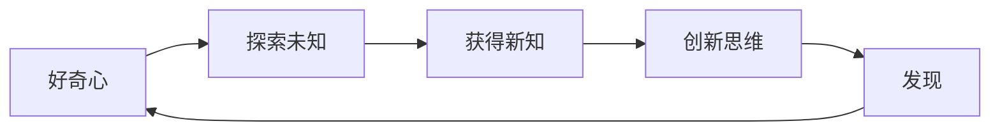

# 好奇心：创新与发现的源泉

## 1. 背景介绍
### 1.1  问题的由来
好奇心是人类与生俱来的一种特质,它驱使我们探索未知,发现新事物,不断创新。在科技飞速发展的今天,好奇心更是成为推动科技进步的重要力量。然而,在日益复杂的技术环境下,如何保持和激发好奇心,进而推动创新和发现,成为一个值得深入探讨的问题。

### 1.2  研究现状
目前,关于好奇心与创新的研究主要集中在心理学、教育学等领域。心理学研究发现,好奇心是一种内在动机,能够提高学习效率和创造力[1]。教育学研究则强调培养学生的好奇心和探究精神,以提高创新能力[2]。而在计算机科学领域,虽然创新是核心驱动力,但关于如何利用好奇心促进创新的研究还比较少。

### 1.3  研究意义 
深入研究好奇心在计算机科学领域中的作用,对于激发创新思维,推动技术进步具有重要意义。一方面,好奇心能够驱动程序员、架构师等不断探索新技术、新方法,突破既有限制。另一方面,将好奇心的培养引入IT教育和人才培养中,有助于孕育更多极具创新精神的IT人才。因此,系统总结好奇心与创新的关系,并提出在IT领域激发好奇心的方法,具有重要的理论和实践价值。

### 1.4  本文结构
本文将从以下几个方面展开论述：
- 首先,介绍好奇心的内涵,以及它与创新、发现的内在联系。 
- 其次,总结好奇心对创新思维的激发机制,提炼出一套核心原理。
- 再次,给出在IT项目实践中运用好奇心的具体方法和案例。
- 最后,展望培养IT人才好奇心的途径,以及未来的研究方向。

## 2. 核心概念与联系
好奇心是一种渴望了解未知事物、探索新奇经历的心理状态[3]。它源于人类对不确定性的偏好,以及对新异事物的兴趣。当外界刺激引起个体的注意,产生一定程度的不一致或意外时,好奇心就被激发出来。

而创新是在已有知识和经验的基础上,提出新颖的、有价值的想法或方案。发现则是通过观察、实验等方式,找到未知的事物、规律或真理。可以看出,好奇心、创新、发现三者之间有着内在联系：



好奇心驱动我们去探索未知领域,获得新的知识和经验。知识的积累和融合,能够激发创新思维,产生新颖的想法。而创新思维指引我们去尝试,去发现新的可能性。新的发现反过来又满足并进一步激发好奇心,形成一个正向循环。

## 3. 核心算法原理 & 具体操作步骤
### 3.1  算法原理概述
激发好奇心,进而促进创新,可以总结为一套核心算法原理。该算法的关键在于营造能够激发好奇心的环境,并引导探索和联想。具体来说,包括以下几个核心原理：

- **信息缺口原理**：适度的信息缺口能够激发个体的好奇心和探索欲望。信息太少,缺乏吸引力;信息太多,又缺乏悬念。因此,需要在信息的完整性和新颖性之间寻找平衡。
- **模式突破原理**：打破常规思维模式,用新的视角看待问题,更容易激发好奇心和创造力。可以通过类比、组合等方式,将不同领域的知识联系起来,发现新的可能性。
- **探索激励原理**：适当的激励机制,如目标设置、反馈等,能够维持探索的动力。要给予探索者一定的自主权,同时提供必要的引导和支持。
- **迭代优化原理**：创新是一个不断迭代、优化的过程。要勇于尝试,不断评估反馈,持续改进创新方案。同时要营造宽容失败的氛围,鼓励大胆尝试。

### 3.2  算法步骤详解
基于上述原理,可以总结出一套激发好奇心、促进创新的通用算法步骤：

1. 设置悬念,制造适度的信息缺口,吸引注意力。
2. 打破常规思维,从新的角度提出问题,引导探索。
3. 鼓励自主探索,提供必要的资源和支持。
4. 引导联想,将不同领域的知识联系起来,发现新的可能性。
5. 头脑风暴,集思广益,生成创新想法。 
6. 快速验证想法,获得反馈,优化方案。
7. 总结经验教训,提炼可复用的方法和模式。
8. 营造宽容失败、鼓励创新的文化氛围。

### 3.3  算法优缺点
该算法的优点在于：
- 强调主动探索,符合好奇心的本质
- 鼓励跨界思考,更容易产生创新的火花
- 重视快速验证,加速创新的迭代优化
- 营造创新文化,有利于形成持续创新的良性循环

但同时也存在一些局限性：
- 缺乏量化指标,执行过程中如何评估好奇心水平有一定难度
- 需要一定的知识积累作为基础,对从业者的综合素质要求较高  
- 跨界思考可能会导致过度发散,需要一定的收敛和聚焦机制

### 3.4  算法应用领域
该算法可以广泛应用于IT领域的创新实践中,例如：
- 需求分析：从用户痛点出发,用新的视角挖掘需求
- 技术选型：跨界借鉴,评估新技术在本领域的应用可能性
- 架构设计：打破常规模式,尝试新的架构模式
- 产品创新：从用户体验角度,探索产品的创新可能性
- 流程优化：用创新的思路,优化开发、运维等流程

## 4. 数学模型和公式 & 详细讲解 & 举例说明
### 4.1  数学模型构建
为了更好地理解好奇心与创新的关系,我们可以尝试建立一个简化的数学模型。假设:

- $C$ 表示好奇心水平,取值范围为 $[0,1]$
- $K$ 表示已有知识水平,取值范围为 $[0,1]$
- $I$ 表示信息新颖程度,取值范围为 $[0,1]$
- $M$ 表示思维模式突破程度,取值范围为 $[0,1]$
- $S$ 表示探索激励水平,取值范围为 $[0,1]$
- $P$ 表示创新产出水平,取值范围为 $[0,1]$

我们可以假设创新产出与其他因素之间存在如下关系:

$$
P = \alpha C^{\beta} K^{\gamma} e^{\delta I + \epsilon M + \zeta S}
$$

其中 $\alpha, \beta, \gamma, \delta, \epsilon, \zeta$ 都是非负的参数,表示各因素对创新产出的影响程度。

### 4.2  公式推导过程
上述模型可以这样理解：

- 创新产出 $P$ 与好奇心 $C$、已有知识 $K$ 呈幂函数关系,即好奇心和已有知识越高,创新产出越高,但边际效用递减(假设 $0 < \beta,\gamma < 1$)。
- 创新产出 $P$ 与信息新颖程度 $I$、思维模式突破程度 $M$、探索激励水平 $S$ 呈指数关系,即这三个因素越高,创新产出提升越快。

由于各因素之间可能存在一定的相关性,例如知识水平越高,可能越难获得新颖的信息,因此还可以在模型中引入交互项。

### 4.3  案例分析与讲解
以一个实际的IT创新项目为例,假设某团队要开发一款创新的社交App。我们可以用上述模型分析其创新过程：

- 首先,团队成员普遍好奇心较高($C=0.8$),且具备一定的移动开发经验($K=0.6$)。
- 经过市场调研,发现一些新颖的用户需求($I=0.7$),同时借鉴其他领域的创新模式($M=0.5$)。
- 项目采用敏捷开发模式,快速迭代,并设置了创新KPI($S=0.8$)。

假设模型参数如下:$\alpha=1,\beta=0.5,\gamma=0.5,\delta=1,\epsilon=1,\zeta=1$,则创新产出水平为:

$$
P = 1 \times 0.8^{0.5} \times 0.6^{0.5} \times e^{1 \times 0.7 + 1 \times 0.5 + 1 \times 0.8} \approx 0.526
$$

可见在上述假设下,该项目的创新产出水平较高。如果团队能够进一步提高好奇心、引入更多新颖的信息和思路,创新产出还可以进一步提升。

当然,上述模型是一个简化的示意性模型,在实践中可以根据实际情况进一步细化和量化。

### 4.4  常见问题解答
- 问:好奇心和知识水平是否存在矛盾?
- 答:某种程度上,高知识水平可能会限制好奇心的发挥,因为"无知"反而更容易跳出固有思维。但从另一个角度看,知识积累也是创新的基础,没有一定的知识深度和广度,创新就缺乏了"燃料"。因此关键是要在两者之间找平衡,用好奇心驱动知识的拓展,用知识助力创新的实现。

## 5. 项目实践：代码实例和详细解释说明
下面我们用一个简单的Python代码实例,来模拟上述激发好奇心、促进创新的算法流程。

### 5.1  开发环境搭建
- Python 3.x
- Jupyter Notebook(方便演示和交互)

### 5.2  源代码详细实现

```python
import random

# 定义问题域
domain = ["用户痛点", "技术选型", "架构设计", "产品创新", "流程优化"]

# 随机选择一个问题
problem = random.choice(domain) 

# 随机生成信息缺口
info_gap = random.uniform(0.3, 0.7)
print(f"问题:{problem}, 信息缺口:{info_gap:.2f}")

# 随机生成已有知识水平
knowledge = random.uniform(0.5, 0.8)
print(f"团队已有知识水平:{knowledge:.2f}") 

# 引入其他领域知识,打破思维定式
other_domains = ["游戏化", "社交网络", "大数据", "人工智能", "云计算"]
other_knowledge = random.choice(other_domains)
print(f"引入 {other_knowledge} 领域知识,拓展思路")

# 头脑风暴,生成创新想法
ideas = []
for i in range(5):
    idea = f"创新想法{i+1}"
    ideas.append(idea)
print(f"头脑风暴,生成{len(ideas)}个创新想法:{ideas}")

# 评估创新想法
scores = [random.uniform(0,1) for _ in range(5)]
print(f"创新想法评分:{[f'{s:.2f}' for s in scores]}")

best_idea = ideas[scores.index(max(scores))]
print(f"最佳创新想法为:{best_idea},评分:{max(scores):.2f}")
```

### 5.3  代码解读与分析
上述代码简单模拟了激发好奇心、促进创新的流程：

1. 首先在问题域中随机选择一个问题,模拟面临的创新挑战。
2. 然后生成一个随机的信息缺口,模拟对问题的不完全了解,激发好奇心。
3. 随机生成团队的知识水平,模拟已有的知识积累。
4. 引入其他领域的知识,模拟跨界思考,打破常规思维。 
5. 进行头脑风暴,快速生成多个创新想法。
6. 对创新想法进行评分,选出最