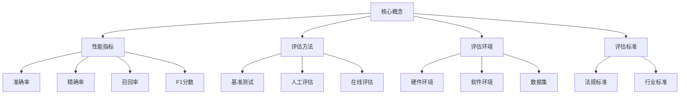

# 如何评估AI系统的性能

## 1. 背景介绍

### 1.1 问题的由来

随着人工智能(AI)技术的快速发展,AI系统已经广泛应用于各个领域,包括计算机视觉、自然语言处理、决策系统等。然而,评估AI系统的性能并非一件易事。与传统软件系统不同,AI系统通常具有复杂的内部结构和决策过程,其性能取决于多个因素,如算法选择、模型架构、训练数据等。因此,如何全面、客观地评估AI系统的性能,成为了一个亟待解决的问题。

### 1.2 研究现状

目前,评估AI系统性能的主要方法包括:

1. **基准测试(Benchmarking)**: 使用标准数据集和评估指标对AI系统进行测试,比较不同系统在相同任务上的表现。
2. **人工评估**: 由人工专家对AI系统的输出进行评估,通常用于评估系统的可解释性和可靠性。
3. **在线评估**: 将AI系统部署在实际环境中,收集系统运行数据进行分析和评估。

然而,这些方法都存在一定局限性。基准测试往往无法完全模拟实际应用场景;人工评估成本高且缺乏一致性;在线评估则需要大量实际运行数据。因此,需要一种更加全面和系统的评估方法。

### 1.3 研究意义

全面评估AI系统的性能对于以下几个方面具有重要意义:

1. **系统优化**: 通过评估,可以发现系统的薄弱环节,从而进行针对性优化,提高系统性能。
2. **模型选择**: 评估结果可以为选择最佳AI模型提供依据,避免盲目尝试。
3. **风险控制**: 及时发现系统存在的安全隐患和偏差,从而采取措施降低风险。
4. **用户体验**: 优化系统性能有助于提升用户体验,增强用户对AI技术的信心。

### 1.4 本文结构

本文将全面介绍如何评估AI系统的性能。首先阐述评估所需的核心概念和度量指标,然后详细讲解评估的核心算法原理和具体操作步骤。接下来,将构建数学模型并推导相关公式,辅以案例分析加深理解。此外,还将介绍实际项目中的代码实现,并探讨AI系统在不同场景下的应用。最后,本文将总结AI系统性能评估的发展趋势和面临的挑战,并推荐相关学习资源和工具。

## 2. 核心概念与联系

评估AI系统性能涉及多个核心概念,包括:

1. **性能指标(Performance Metrics)**: 用于衡量系统性能的一系列定量或定性指标,如准确率、精确率、召回率、F1分数等。
2. **评估方法(Evaluation Methods)**: 指评估系统性能的具体方法,如基准测试、人工评估、在线评估等。
3. **评估环境(Evaluation Environment)**: 指进行评估时所使用的硬件、软件、数据集等环境条件。
4. **评估标准(Evaluation Criteria)**: 指评估结果是否合格的判断标准,通常由相关法规或行业标准规定。

这些概念相互关联且环环相扣。性能指标为评估提供了量化依据,评估方法则规定了具体的评估流程,而评估环境和标准则确保了评估的一致性和可靠性。只有将这些概念有机结合,才能全面、客观地评估AI系统的性能。



## 3. 核心算法原理 & 具体操作步骤

### 3.1 算法原理概述

评估AI系统性能的核心算法原理可概括为以下三个主要步骤:

1. **数据准备**: 根据评估目的选择合适的数据集,对数据进行预处理,划分为训练集、验证集和测试集。
2. **模型训练**: 在训练集上训练AI模型,使用验证集对模型进行调优,选择最优模型。
3. **性能评估**: 在测试集上运行最优模型,计算预定义的性能指标,并根据评估标准判断模型性能是否合格。

### 3.2 算法步骤详解

1. **数据准备**
    - 步骤1: 确定评估目的,选择合适的数据集
    - 步骤2: 对原始数据进行清洗和标注
    - 步骤3: 将数据随机划分为训练集、验证集和测试集,比例通常为6:2:2
    - 步骤4: 对数据进行必要的预处理,如归一化、增强等

2. **模型训练**
    - 步骤1: 选择合适的AI模型架构,如卷积神经网络(CNN)、循环神经网络(RNN)等
    - 步骤2: 在训练集上训练模型,使用验证集监控模型性能,进行超参数调优
    - 步骤3: 根据验证集上的性能指标,选择最优模型

3. **性能评估**
    - 步骤1: 在测试集上运行最优模型,获取模型输出
    - 步骤2: 计算预定义的性能指标,如准确率、精确率、召回率等
    - 步骤3: 将计算结果与评估标准进行对比,判断模型性能是否合格
    - 步骤4: 根据评估结果,对模型进行必要的调整和优化

### 3.3 算法优缺点

**优点**:

1. 科学合理,遵循机器学习的标准流程
2. 通过训练集、验证集和测试集的分离,避免了过拟合问题
3. 可以根据具体任务选择合适的性能指标
4. 评估结果具有一定的客观性和可重复性

**缺点**:

1. 评估结果受数据集质量的影响较大
2. 部分性能指标难以量化,需要人工评估辅助
3. 评估过程耗时较长,需要大量计算资源
4. 难以评估AI系统在实际应用场景中的性能

### 3.4 算法应用领域

该算法可广泛应用于各种AI系统的性能评估,包括但不限于:

- 计算机视觉系统,如图像分类、目标检测、语义分割等
- 自然语言处理系统,如机器翻译、文本生成、情感分析等
- 决策系统,如推荐系统、金融风控系统、自动驾驶系统等
- 其他AI系统,如医疗诊断系统、天气预报系统等

## 4. 数学模型和公式 & 详细讲解 & 举例说明

### 4.1 数学模型构建

在评估AI系统性能时,我们需要构建数学模型来量化系统的输出与期望输出之间的差异。常用的数学模型包括:

1. **分类模型**
    
    对于分类任务,我们可以使用混淆矩阵(Confusion Matrix)来描述模型的预测结果。混淆矩阵是一个 $N \times N$ 的矩阵,其中 $N$ 是类别数量。矩阵的第 $i$ 行第 $j$ 列元素 $C_{ij}$ 表示被预测为第 $j$ 类的样本中,实际属于第 $i$ 类的样本数量。

    基于混淆矩阵,我们可以计算多个性能指标,如准确率(Accuracy)、精确率(Precision)、召回率(Recall)和F1分数(F1 Score)等。

2. **回归模型**

    对于回归任务,我们可以使用均方误差(Mean Squared Error, MSE)或平均绝对误差(Mean Absolute Error, MAE)来衡量模型预测值与真实值之间的差异。

    $$MSE = \frac{1}{n}\sum_{i=1}^{n}(y_i - \hat{y}_i)^2$$
    $$MAE = \frac{1}{n}\sum_{i=1}^{n}|y_i - \hat{y}_i|$$

    其中 $n$ 是样本数量, $y_i$ 是第 $i$ 个样本的真实值, $\hat{y}_i$ 是第 $i$ 个样本的预测值。

3. **生成模型**

    对于生成任务(如图像生成、文本生成等),我们可以使用对数似然(Log-likelihood)或其他基于分布的评估指标来衡量生成结果的质量。

    $$\log P(x) = \sum_{i=1}^{n}\log P(x_i)$$

    其中 $x$ 是待评估的样本序列, $P(x_i)$ 是第 $i$ 个元素的生成概率。

### 4.2 公式推导过程

以二分类问题为例,我们推导准确率(Accuracy)、精确率(Precision)、召回率(Recall)和F1分数的计算公式。

假设我们有以下混淆矩阵:

```
          Predicted
         +------+------+
         |  0   |  1   |
    +------+------+------+
True |  0   |  TN  |  FP  |
    +------+------+------+
     |  1   |  FN  |  TP  |
    +------+------+------+
```

其中:

- TN (True Negative): 实际为负类且被正确预测为负类的样本数
- FP (False Positive): 实际为负类但被错误预测为正类的样本数
- FN (False Negative): 实际为正类但被错误预测为负类的样本数
- TP (True Positive): 实际为正类且被正确预测为正类的样本数

1. **准确率(Accuracy)**

    准确率表示被正确预测的样本数占总样本数的比例:

    $$Accuracy = \frac{TP + TN}{TP + TN + FP + FN}$$

2. **精确率(Precision)**

    精确率表示被正确预测为正类的样本数占预测为正类样本总数的比例:

    $$Precision = \frac{TP}{TP + FP}$$

3. **召回率(Recall)**

    召回率表示被正确预测为正类的样本数占实际正类样本总数的比例:

    $$Recall = \frac{TP}{TP + FN}$$

4. **F1分数(F1 Score)**

    F1分数是精确率和召回率的加权调和平均数,通常使用以下公式计算:

    $$F1 = 2 \cdot \frac{Precision \cdot Recall}{Precision + Recall}$$

### 4.3 案例分析与讲解

假设我们有一个二分类图像识别任务,需要识别图像中是否包含猫。我们使用一个CNN模型在测试集上进行评估,得到以下混淆矩阵:

```
          Predicted
         +------+------+
         |  0   |  1   |
    +------+------+------+
True |  0   | 8200 | 1300 |
    +------+------+------+
     |  1   |  500 | 6000 |
    +------+------+------+
```

根据上述公式,我们可以计算出该模型在测试集上的性能指标:

1. 准确率(Accuracy)

    $$Accuracy = \frac{8200 + 6000}{8200 + 1300 + 500 + 6000} = 0.875$$

2. 精确率(Precision)

    $$Precision = \frac{6000}{6000 + 1300} = 0.822$$

3. 召回率(Recall)

    $$Recall = \frac{6000}{6000 + 500} = 0.923$$ 

4. F1分数(F1 Score)

    $$F1 = 2 \cdot \frac{0.822 \cdot 0.923}{0.822 + 0.923} = 0.869$$

从结果可以看出,该模型在测试集上的准确率为87.5%,精确率为82.2%,召回率为92.3%,F1分数为86.9%。根据具体应用场景和评估标准,我们可以判断该模型的性能是否合格。

如果模型性能不合格,我们可以进一步分析混淆矩阵,发现模型在将负类(不含猫的图像)错误预测为正类时存在一定问题。因此,我们可以通过增加负类样本的训练数据、调整模型架构或超参数等方