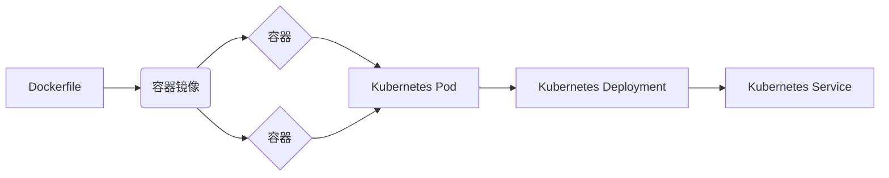

# 容器 原理与代码实例讲解

## 1. 背景介绍
### 1.1  问题的由来
在软件开发和部署过程中,环境配置和依赖管理一直是一个棘手的问题。不同的操作系统、库版本、配置等差异,导致了应用在开发、测试和生产环境中的行为不一致,增加了维护和调试的难度。为了解决这些问题,容器技术应运而生。
### 1.2  研究现状
容器技术经过多年发展,已经日趋成熟。Docker作为容器领域的代表,提供了一整套容器管理和编排的解决方案,极大地推动了容器技术的普及。Kubernetes作为容器编排的事实标准,为大规模容器集群管理提供了强大的支持。目前各大云厂商都提供了基于容器的云服务,容器已成为云原生时代的关键技术之一。
### 1.3  研究意义 
容器为应用提供了一致的运行环境,极大地简化了环境配置和依赖管理。通过容器镜像,可以将应用及其依赖打包在一起,实现"一次构建,到处运行"。容器的轻量级和快速启动特性,也为微服务架构、DevOps等现代软件开发实践提供了有力支持。深入研究容器技术,对于优化软件开发和部署流程,提高系统可维护性和可移植性具有重要意义。
### 1.4  本文结构
本文将从容器的核心概念出发,深入剖析容器的工作原理。通过数学建模和算法分析,揭示容器背后的理论基础。结合代码实例,演示容器的实际应用和开发实践。最后,展望容器技术的未来发展趋势和挑战。

## 2. 核心概念与联系
容器是一种操作系统级虚拟化技术,通过namespace和cgroup等机制,在宿主机上创建相互隔离的运行环境。一个容器包含了应用程序及其所有的依赖,如二进制文件、库、配置等。多个容器共享宿主机操作系统内核,但在用户空间相互隔离,就像在独立的机器上运行一样。

容器镜像是容器的静态表示,包含了容器运行所需的文件系统和配置。通过Dockerfile定义构建步骤,将应用和依赖打包成一个独立的镜像。容器是镜像的运行实例,可以基于同一个镜像创建多个容器实例。

容器编排是管理大规模容器集群的关键。Kubernetes提供了声明式的API,用于定义和管理容器的部署、调度、伸缩、负载均衡等。通过将容器划分为Pod,引入Service、Deployment等高层抽象,Kubernetes极大地简化了容器集群的管理。

下图展示了容器、镜像和编排之间的关系:



## 3. 核心算法原理 & 具体操作步骤
### 3.1  算法原理概述
容器的隔离是通过Linux内核的namespace和cgroup实现的。Namespace提供了资源隔离的基本单元,将全局系统资源划分为独立的命名空间,使得容器内的进程看起来拥有自己独立的资源视图。常见的namespace包括:

- Mount namespace:文件系统挂载点隔离
- UTS namespace:主机名和域名隔离 
- IPC namespace:进程间通信隔离
- PID namespace:进程ID隔离
- Network namespace:网络设备、协议栈、端口等隔离
- User namespace:用户和组ID隔离

Cgroup(Control Group)提供了资源限制和审计的机制。通过将进程划分到不同的cgroup,可以对CPU、内存、IO等资源进行配额和限制,防止容器之间相互影响。

容器运行时(如Docker)在创建容器时,会调用系统调用clone()启动一个新进程,并传入CLONE_NEWNS、CLONE_NEWUTS等flag,将该进程加入不同的namespace。然后通过写入cgroup文件系统,将进程加入预先配置好的资源限制cgroup中。

### 3.2  算法步骤详解
1. 容器创建时,首先根据镜像元数据准备容器的根文件系统,并使用pivot_root或chroot切换到容器的根目录。

2. 调用clone()系统调用,传入namespace flag,创建一个隔离的进程。该进程拥有独立的namespace视图。常见的flag有:
   ```c
   CLONE_NEWNS   // 挂载点隔离
   CLONE_NEWUTS  // 主机名和域名隔离
   CLONE_NEWIPC  // IPC隔离
   CLONE_NEWPID  // PID隔离 
   CLONE_NEWNET  // 网络隔离
   CLONE_NEWUSER // 用户和组隔离
   ```

3. 根据容器配置,将进程加入预先创建的cgroup中,对资源使用进行限制。通过修改cgroup文件系统中的文件,可以动态调整容器的资源配额:
   ```bash
   # 限制容器可用内存为100M
   echo "100000000" > /sys/fs/cgroup/memory/docker/容器ID/memory.limit_in_bytes
   
   # 限制容器CPU使用率为30%
   echo "30000" > /sys/fs/cgroup/cpu/docker/容器ID/cpu.cfs_quota_us
   ```

4. 容器引擎为容器准备其他必要的资源和环境,如网络接口、环境变量、volume挂载等。

5. 使用exec()系列系统调用,在容器进程中启动应用进程,应用进程继承了父进程的namespace和cgroup配置。

6. 应用进程运行在与宿主机隔离的容器环境中,不会影响其他容器和宿主机进程。

### 3.3  算法优缺点
优点:
- 轻量级虚拟化:容器不需要模拟硬件,启动速度快,资源占用少。
- 环境一致性:通过镜像封装应用和依赖,容器提供了一致的运行环境。
- 进程隔离:每个容器运行在独立的namespace中,具有独立的资源视图。
- 资源限制:cgroup实现了对容器资源使用的限制和审计,避免了相互干扰。

缺点:
- 隔离性不如虚拟机:容器共享宿主机内核,存在一定的安全风险。
- 跨平台支持有限:容器依赖于Linux内核特性,对Windows等系统支持不完善。

### 3.4  算法应用领域
容器技术广泛应用于现代软件开发和部署领域,如:
- 微服务架构:每个微服务独立部署在容器中,便于单独开发、测试和伸缩。
- DevOps持续交付:容器镜像作为交付标准,实现从开发到部署的一致性。
- 云原生应用:容器成为云平台的标准运行时,结合Kubernetes等编排工具,实现应用的弹性伸缩和高可用。
- 大数据处理:容器为Hadoop、Spark等大数据框架提供了隔离的运行环境。
- 机器学习平台:Kubeflow等基于容器的机器学习平台,简化了模型训练和服务部署。

## 4. 数学模型和公式 & 详细讲解 & 举例说明
### 4.1  数学模型构建
我们可以使用集合论来描述容器的隔离特性。假设有两个容器 $C_1$ 和 $C_2$,它们的进程集合分别为 $P_1$ 和 $P_2$,文件系统视图为 $F_1$ 和 $F_2$,网络协议栈为 $N_1$ 和 $N_2$,则容器隔离的数学模型可表示为:

$$
\begin{aligned}
P_1 \cap P_2 &= \varnothing \\
F_1 \cap F_2 &= \varnothing \\
N_1 \cap N_2 &= \varnothing
\end{aligned}
$$

即不同容器的进程、文件系统和网络相互隔离,没有交集。

### 4.2  公式推导过程
对于资源限制,可以用线性规划模型来表示。假设宿主机有 $m$ 个CPU核心和 $n$ GB内存,有 $k$ 个容器 $C_1, C_2, ..., C_k$,每个容器 $C_i$ 的CPU需求为 $cpu_i$核,内存需求为 $mem_i$ GB,则资源分配问题可建模为:

$$
\begin{aligned}
\max \quad & \sum_{i=1}^k (cpu_i + mem_i) \\
\textrm{s.t.} \quad & \sum_{i=1}^k cpu_i \leq m \\
& \sum_{i=1}^k mem_i \leq n \\
& cpu_i, mem_i \geq 0, i=1,2,...,k
\end{aligned}
$$

目标是在满足CPU和内存容量限制的情况下,最大化容器的资源利用率。可以使用单纯形法等优化算法求解该线性规划模型,得到最优的资源分配方案。

### 4.3  案例分析与讲解
以一个简单的Web应用为例,演示容器的隔离和资源限制特性。假设该Web应用由前端服务和数据库服务组成,我们将它们分别部署在两个容器中。

前端容器 $C_1$ 的配置如下:
- CPU限制: 1核
- 内存限制: 500MB
- 端口映射: 宿主机8080端口映射到容器80端口
- Volume挂载: 宿主机/var/www/html目录挂载到容器/usr/share/nginx/html

数据库容器 $C_2$ 的配置如下:  
- CPU限制: 2核
- 内存限制: 1GB
- 端口映射: 宿主机3306端口映射到容器3306端口
- Volume挂载: 宿主机/var/lib/mysql目录挂载到容器/var/lib/mysql

两个容器都使用Docker的bridge网络,通过容器名字相互访问。前端容器通过链接数据库容器的3306端口来访问数据库服务。

在这个案例中,前端容器和数据库容器运行在独立的namespace中,它们有自己的进程空间、网络协议栈和文件系统视图。宿主机无法直接访问容器内的进程和文件。同时,两个容器的资源使用受到cgroup的限制,互不影响。

### 4.4  常见问题解答
Q: 多个容器之间如何通信?
A: 可以使用Docker的bridge网络或overlay网络,通过容器名或服务名来相互访问。也可以使用宿主机网络,通过暴露的端口访问容器服务。

Q: 容器的文件系统是如何实现的?
A: 容器使用UnionFS(如AUFS、OverlayFS)等技术实现分层文件系统。镜像是只读层,启动容器时会在镜像层之上添加一个可写层。多个容器可以共享底层的只读镜像层,节省了存储空间。

Q: 如何限制容器的磁盘IO?
A: 可以使用cgroup的blkio子系统,通过配置blkio.throttle.read_bps_device和blkio.throttle.write_bps_device参数,限制容器对特定设备的IO速率。

## 5. 项目实践：代码实例和详细解释说明
### 5.1  开发环境搭建
以下示例使用Docker和Python Flask框架来演示容器的开发和部署。首先需要安装Docker环境:

- Linux系统可以使用发行版的包管理器安装,如Ubuntu下执行:
  ```bash
  sudo apt-get install docker.io
  ```
- Windows和macOS可以下载Docker Desktop:
  https://www.docker.com/products/docker-desktop

然后创建一个Python虚拟环境,安装Flask:
```bash
python3 -m venv venv
source venv/bin/activate
pip install flask
```

### 5.2  源代码详细实现
创建一个简单的Flask应用,提供HTTP GET接口,返回容器的主机名。

app.py:
```python
from flask import Flask
import socket

app = Flask(__name__)

@app.route('/')
def hello():
    hostname = socket.gethostname()
    return f'Hello from {hostname}!'

if __name__ == '__main__':
    app.run(host='0.0.0.0', port=8080)
```

然后编写Dockerfile,描述如何构建容器镜像:

Dockerfile:
```dockerfile
FROM python:3.8-slim

WORKDIR /app

COPY requirements.txt .
RUN pip install -r requirements.txt

COPY app.py .

EXPOSE 8080

CMD ["python", "app.py"]
```

### 5.3  代码解读与分析
- Dockerfile以Python 3.8的轻量级镜像为基础,减小了