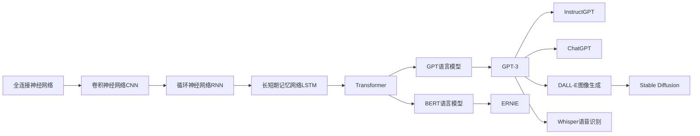

# 2023年AI大模型时代的新变革

关键词：AI大模型、深度学习、自然语言处理、多模态学习、Transformer、GPT、BERT、ChatGPT、Stable Diffusion、Whisper

## 1. 背景介绍
### 1.1  问题的由来
人工智能(Artificial Intelligence, AI)自1956年被提出以来，经历了几次大的发展浪潮。近年来，随着深度学习技术的突破，尤其是Transformer模型的出现，AI进入了大模型时代。AI大模型以其强大的学习能力和惊人的性能，正在深刻改变着人类社会的方方面面。

### 1.2  研究现状
当前，AI大模型已经在自然语言处理(NLP)、计算机视觉(CV)、语音识别等领域取得了显著成果。以OpenAI的GPT系列语言模型、Google的BERT等为代表的NLP大模型，在文本生成、问答、对话、翻译等任务上达到甚至超越了人类的水平。以Stable Diffusion、DALL-E为代表的多模态大模型，可以根据文本描述生成逼真的图像。Whisper等语音大模型也使得语音识别、语音合成等应用空前发展。

### 1.3  研究意义
研究AI大模型具有重大意义：
1. 推动人工智能基础理论研究的发展，揭示智能的本质。
2. 促进人机交互、知识管理、决策支持等应用领域的革新。
3. 为教育、医疗、金融、制造等行业带来变革性的影响。
4. 引发科技伦理、就业结构等社会问题的思考。

### 1.4  本文结构
本文将围绕AI大模型展开探讨。第2部分介绍大模型的核心概念；第3部分阐述大模型的原理和训练方法；第4部分给出大模型涉及的关键数学模型和公式；第5部分以代码实例演示大模型的实现；第6部分讨论大模型的应用场景；第7部分推荐相关工具和资源；第8部分总结全文并展望未来。

## 2. 核心概念与联系
AI大模型是指参数量巨大(一般在亿级以上)、性能卓越的人工智能模型。与传统的小模型相比，大模型具有更强大的学习能力，能够从海量数据中学习到丰富的知识和规律。大模型的概念源自自然语言处理领域，但目前已扩展到计算机视觉、语音识别、强化学习等多个领域。

大模型的核心是深度学习技术，它模仿人脑的信息处理机制，通过多层神经网络学习数据的内在联系。深度学习的发展大致经历了三个阶段：
1. 全连接神经网络(Fully Connected Neural Network)和卷积神经网络(CNN)：主要应用于图像识别等领域。
2. 循环神经网络(RNN)和长短期记忆网络(LSTM)：主要应用于序列建模如语音识别、机器翻译等。  
3. Transformer模型：革命性地提出了自注意力(Self-attention)机制，抛弃了RNN中的循环结构，实现了更高效的并行计算。Transformer在NLP领域大放异彩，奠定了当前大模型的基础。

在Transformer的基础上，AI大模型进一步引入了一些创新的架构，如GPT的Decoder-only结构，BERT的Encoder-only结构，以及后来的Encoder-Decoder结构等。同时，大模型的训练也从传统的监督学习，发展到半监督学习和自监督学习，使得大模型可以从更大规模的无标注数据中学习知识。

下图展示了AI大模型的发展脉络和主要里程碑：

总的来说，AI大模型代表了人工智能发展的新高度。它融合了深度学习、自然语言处理、计算机视觉、多模态学习等多个领域的前沿成果，为人类认知和应用智能开辟了广阔的前景。理解大模型的原理和应用，对于把握人工智能的发展方向至关重要。

## 3. 核心算法原理 & 具体操作步骤
### 3.1  算法原理概述
当前主流的AI大模型基本上都基于Transformer架构。Transformer的核心是自注意力机制和位置编码。自注意力允许模型的每个位置关注输入序列的任意位置，从而能够捕捉到长距离的依赖关系。位置编码则为模型引入了单词的顺序信息。Transformer同时包含编码器(Encoder)和解码器(Decoder)，分别用于理解输入和生成输出。

以GPT模型为例，它使用Decoder-only的Transformer结构。GPT的训练采用了语言模型的范式，即用前面的词预测下一个词。这使得GPT可以从海量无标注文本数据中学习语言知识。GPT训练的目标是最大化如下的对数似然函数：

$$\mathcal{L}(\theta)=\sum_{i=1}^{n} \log P\left(x_{i} \mid x_{1}, \ldots, x_{i-1} ; \theta\right)$$

其中$\theta$为模型参数，$x_i$为第$i$个词，$n$为句子长度。直观地说，就是最大化正确预测下一个词的概率。

### 3.2  算法步骤详解
以GPT模型的前向传播为例，其主要步骤如下：

1. 输入编码：将输入的词转化为嵌入向量，并加上位置编码。
2. 多头自注意力：通过Self-Attention捕捉词之间的关系。对于第$i$个词，计算其与所有词的注意力分数：
$$ \alpha_{i j}=\frac{\exp \left(\left\langle\mathbf{q}_{i}, \mathbf{k}_{j}\right\rangle\right)}{\sum_{j=1}^{n} \exp \left(\left\langle\mathbf{q}_{i}, \mathbf{k}_{j}\right\rangle\right)} $$
其中$\mathbf{q}_i$是第$i$个词的查询向量，$\mathbf{k}_j$是第$j$个词的键向量。然后根据注意力分数计算第$i$个词的新表示：
$$ \mathbf{v}_{i}=\sum_{j=1}^{n} \alpha_{i j} \mathbf{v}_{j} $$
其中$\mathbf{v}_j$是第$j$个词的值向量。多头注意力即并行计算多组$\mathbf{q},\mathbf{k},\mathbf{v}$。

3. 前馈神经网络：使用两层全连接网络增强特征表示能力。

4. Layer Normalization和残差连接：归一化特征并与输入相加，提高训练稳定性。

5. 重复2-4步骤多次(即Transformer的多个Decoder Block)，得到最终的特征表示。

6. 输出层：将特征表示映射为下一个词的概率分布。

以上是GPT前向传播的基本过程。在训练时，还需要计算损失函数并通过反向传播更新模型参数。推理时，则根据前面生成的词不断预测下一个词，直到遇到终止符。

### 3.3  算法优缺点
AI大模型的主要优点包括：
1. 强大的建模能力，可以学习海量数据中蕴含的复杂模式。
2. 优异的泛化性能，在许多下游任务上表现出色，减少了对任务特定训练数据的依赖。 
3. 灵活的应用方式，可以通过提示工程(Prompt Engineering)引导模型执行不同的任务。

但大模型也存在一些局限性：
1. 训练和推理成本高昂，需要大量算力支持。  
2. 容易产生幻觉(Hallucination)，即生成看似合理但实际错误的内容。
3. 可能放大数据中的偏见，产生伦理和安全隐患。
4. 缺乏常识推理和因果理解的能力。

### 3.4  算法应用领域
AI大模型已经在多个领域得到广泛应用，包括但不限于：
1. 自然语言处理：如智能问答、机器翻译、文本摘要、情感分析等。
2. 计算机视觉：如图像分类、目标检测、图像生成、视频理解等。
3. 语音处理：如语音识别、语音合成、说话人识别等。
4. 多模态学习：如视觉问答、图像描述、语音对话等。
5. 推荐系统：如个性化推荐、广告投放等。

未来大模型有望在更多领域发挥重要作用，如科学研究、教育、医疗、金融、制造等。同时，大模型与知识图谱、因果推理等技术的结合，也是一个值得探索的方向。

## 4. 数学模型和公式 & 详细讲解 & 举例说明
### 4.1  数学模型构建
Transformer作为AI大模型的核心架构，其数学模型可以用如下公式表示。

对于第$l$层Transformer Block，设其输入为$\mathbf{x}^{(l)}=\left(x_{1}^{(l)}, \ldots, x_{n}^{(l)}\right)$，其中$x_i^{(l)}\in \mathbb{R}^{d}$为第$i$个词的$d$维特征向量。则自注意力的计算过程为：

$$
\begin{aligned}
\mathbf{q}_{i}^{(l)} &=\mathbf{x}_{i}^{(l)} \mathbf{W}_{q}^{(l)} \\
\mathbf{k}_{i}^{(l)} &=\mathbf{x}_{i}^{(l)} \mathbf{W}_{k}^{(l)} \\
\mathbf{v}_{i}^{(l)} &=\mathbf{x}_{i}^{(l)} \mathbf{W}_{v}^{(l)} \\
\alpha_{i j}^{(l)} &=\frac{\exp \left(\left\langle\mathbf{q}_{i}^{(l)}, \mathbf{k}_{j}^{(l)}\right\rangle / \sqrt{d}\right)}{\sum_{j=1}^{n} \exp \left(\left\langle\mathbf{q}_{i}^{(l)}, \mathbf{k}_{j}^{(l)}\right\rangle / \sqrt{d}\right)} \\
\mathbf{z}_{i}^{(l)} &=\sum_{j=1}^{n} \alpha_{i j}^{(l)} \mathbf{v}_{j}^{(l)}
\end{aligned}
$$

其中$\mathbf{W}_q^{(l)}, \mathbf{W}_k^{(l)}, \mathbf{W}_v^{(l)}\in \mathbb{R}^{d\times d}$为可学习的权重矩阵，$\langle\cdot,\cdot\rangle$表示向量内积，$\sqrt{d}$用于缩放点积结果。$\mathbf{z}_i^{(l)}$即为第$i$个词的新特征表示。

多头注意力相当于并行计算$h$组不同的$\mathbf{q},\mathbf{k},\mathbf{v}$，然后将结果拼接：

$$\operatorname{MultiHead}(\mathbf{x}^{(l)})=\operatorname{Concat}\left(\mathbf{z}_{1}^{(l)}, \ldots, \mathbf{z}_{h}^{(l)}\right) \mathbf{W}_{o}^{(l)}$$

其中$\mathbf{W}_o^{(l)}\in \mathbb{R}^{hd\times d}$为可学习的权重矩阵。

前馈神经网络的计算为：

$$\operatorname{FFN}(\mathbf{z}^{(l)})=\operatorname{ReLU}(\mathbf{z}^{(l)}\mathbf{W}_1^{(l)}+\mathbf{b}_1^{(l)})\mathbf{W}_2^{(l)}+\mathbf{b}_2^{(l)}$$

其中$\mathbf{W}_1^{(l)}\in \mathbb{R}^{d\times d_f},\mathbf{W}_2^{(l)}\in \mathbb{R}^{d_f\times d}$为权重矩阵，$\mathbf{b}_1^{(l)}\in \mathbb{R}^{d_f},\mathbf{b}_2^{(l)}\in