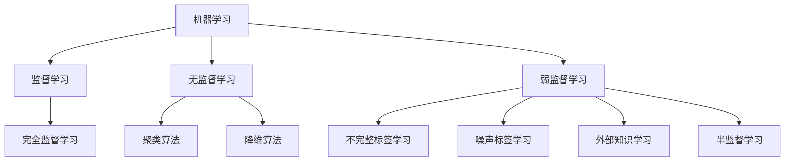

# 弱监督学习 原理与代码实例讲解

## 1. 背景介绍

### 1.1 问题的由来

在现代数据密集型应用中，获取高质量的标记数据是一个巨大的挑战。手动标记大量数据是一项耗时且昂贵的过程。这就引出了弱监督学习(Weakly Supervised Learning)的概念,旨在利用较少的人工标记数据,结合其他形式的弱监督信号,来训练有效的机器学习模型。

### 1.2 研究现状

传统的监督学习需要大量精确标记的训练数据,而弱监督学习则利用更易获取的弱标签(Weak Labels)或其他形式的弱监督信号,如:

- 不完整的标签(Incomplete Labels)
- 噪声标签(Noisy Labels)
- 无标签数据(Unlabeled Data)
- 外部知识(External Knowledge)

近年来,弱监督学习在计算机视觉、自然语言处理等领域取得了长足进展,展现出巨大的应用潜力。

### 1.3 研究意义

弱监督学习的关键优势在于降低了数据标注成本,扩大了可用训练数据的范围。它能够利用大量未标记或弱标记的数据,结合少量高质量标记数据,训练出性能卓越的模型。这对于数据标注成本高昂的领域尤为重要。

### 1.4 本文结构

本文将系统地介绍弱监督学习的核心概念、算法原理、数学模型,并通过代码实例详细解释其实现细节。最后,我们将探讨弱监督学习在实际应用中的场景,以及未来的发展趋势和挑战。

## 2. 核心概念与联系

弱监督学习是机器学习领域的一个重要分支,它与半监督学习(Semi-Supervised Learning)和无监督学习(Unsupervised Learning)都有一定的联系和区别。

- **监督学习**(Supervised Learning)利用大量精确标记的训练数据,学习映射函数,以预测未知数据的标签。
- **无监督学习**(Unsupervised Learning)则不需要任何标记数据,通过发现数据内在的模式和结构,进行聚类、降维等任务。
- **弱监督学习**(Weakly Supervised Learning)介于监督学习和无监督学习之间,利用少量精确标记数据和大量弱标签数据进行训练。

弱监督学习可以看作是一种**泛化的监督学习**,它利用多种形式的弱监督信号,如不完整标签、噪声标签、外部知识等,来补充有限的精确标记数据。这种方法能够显著降低数据标注成本,扩大可用训练数据的范围。

与**半监督学习**相比,弱监督学习更加灵活,可以利用多种形式的弱监督信号,而半监督学习仅利用未标记数据。因此,弱监督学习被认为是一种更加通用的学习范式。

## 3. 核心算法原理 & 具体操作步骤

### 3.1 算法原理概述

弱监督学习的核心思想是利用多种形式的弱监督信号,结合少量精确标记数据,训练出性能良好的模型。常见的弱监督算法包括:

1. **不完整标签学习**(Learning from Incomplete Labels):利用部分标记的训练数据,如图像级标签、单词级标签等。
2. **噪声标签学习**(Learning from Noisy Labels):利用含有噪声的标记数据进行训练,通过鲁棒性策略降低噪声影响。
3. **外部知识学习**(Learning from External Knowledge):利用外部知识库、规则、约束等作为弱监督信号。
4. **半监督学习**(Semi-Supervised Learning):结合少量标记数据和大量未标记数据进行训练。

这些算法通常采用以下几种策略:

- **正则化策略**(Regularization Strategies):引入正则项,将弱监督信号作为先验知识,约束模型学习过程。
- **生成对抗训练**(Generative Adversarial Training):利用生成模型捕获数据分布,并与判别模型进行对抗训练。
- **自训练**(Self-Training):使用模型在未标记数据上产生伪标签,并利用这些伪标签进行迭代训练。
- **多实例学习**(Multiple Instance Learning):利用包级标签训练实例级分类器。

### 3.2 算法步骤详解

以**不完整标签学习**为例,我们将详细介绍其算法步骤:

1. **数据准备**:收集包含不完整标签的训练数据,如图像级标签、单词级标签等。
2. **模型初始化**:使用少量精确标记数据,初始化模型参数。
3. **伪标签生成**:在未标记数据上,利用当前模型生成伪标签。
4. **损失函数设计**:设计包含监督损失项和正则化项的损失函数。监督损失项基于精确标记数据计算,正则化项则利用伪标签和不完整标签作为弱监督信号。
5. **模型优化**:使用优化算法(如梯度下降)最小化损失函数,更新模型参数。
6. **迭代训练**:重复步骤3-5,直至模型收敛或达到预设迭代次数。

在每次迭代中,模型会利用新生成的伪标签和不完整标签作为弱监督信号,逐步改进自身性能。

### 3.3 算法优缺点

**优点**:

- 降低了数据标注成本,扩大了可用训练数据范围。
- 利用多种形式的弱监督信号,提高了模型的泛化能力。
- 适用于各种机器学习任务,如分类、检测、分割等。

**缺点**:

- 算法性能依赖于弱监督信号的质量,低质量的弱监督信号可能导致模型性能下降。
- 算法设计和实现相对复杂,需要专门的策略来利用弱监督信号。
- 对于某些任务,仍然需要一定量的精确标记数据作为种子。

### 3.4 算法应用领域

弱监督学习已被广泛应用于多个领域,包括但不限于:

- **计算机视觉**:图像分类、目标检测、语义分割等。
- **自然语言处理**:文本分类、情感分析、关系抽取等。
- **推荐系统**:基于隐式反馈(如点击、浏览历史)进行个性化推荐。
- **生物信息学**:基因序列分析、蛋白质结构预测等。
- **金融**:欺诈检测、风险评估等。

## 4. 数学模型和公式 & 详细讲解 & 举例说明

### 4.1 数学模型构建

我们以**不完整标签学习**为例,构建其数学模型。假设我们有一个图像分类任务,训练数据包含精确标记的图像$\mathcal{D}_l=\{(x_i, y_i)\}_{i=1}^{N_l}$和仅有图像级标签的图像$\mathcal{D}_u=\{(x_j, \mathcal{Y}_j)\}_{j=1}^{N_u}$,其中$y_i$是精确标签,$\mathcal{Y}_j$是图像级标签集合。

我们的目标是学习一个分类器$f(x;\theta)$,其中$\theta$是模型参数。为此,我们定义以下损失函数:

$$\mathcal{L}(\theta) = \mathcal{L}_l(\theta) + \lambda \mathcal{L}_u(\theta)$$

其中:

- $\mathcal{L}_l(\theta)$是监督损失项,基于精确标记数据计算:

$$\mathcal{L}_l(\theta) = \frac{1}{N_l}\sum_{i=1}^{N_l}\ell(f(x_i;\theta), y_i)$$

其中$\ell$是交叉熵损失函数。

- $\mathcal{L}_u(\theta)$是正则化项,利用图像级标签作为弱监督信号:

$$\mathcal{L}_u(\theta) = \frac{1}{N_u}\sum_{j=1}^{N_u}\max_{y\in\mathcal{Y}_j}\ell(f(x_j;\theta), y)$$

该项最小化了预测标签与图像级标签集合中任一标签的损失。

- $\lambda$是一个超参数,用于平衡两个损失项的权重。

通过最小化总损失函数$\mathcal{L}(\theta)$,我们可以同时利用精确标记数据和图像级标签进行训练,获得性能良好的分类器。

### 4.2 公式推导过程

我们将详细推导$\mathcal{L}_u(\theta)$的形式,说明它如何利用图像级标签作为弱监督信号。

假设一个图像$x_j$的图像级标签集合为$\mathcal{Y}_j=\{y_1, y_2, \dots, y_K\}$,其中$y_k$是可能的精确标签。由于我们不知道$x_j$的精确标签,我们希望模型对任一可能标签的预测概率都足够大。形式化地,我们定义:

$$\mathcal{L}_u(x_j;\theta) = \max_{y\in\mathcal{Y}_j}\ell(f(x_j;\theta), y)$$

其中$\ell$是交叉熵损失函数。这个目标函数要求模型对于$\mathcal{Y}_j$中任一标签$y$,其预测概率$f(x_j;\theta)_y$都足够大,从而最小化与$y$的损失。

对于整个未标记数据集$\mathcal{D}_u$,我们取平均:

$$\mathcal{L}_u(\theta) = \frac{1}{N_u}\sum_{j=1}^{N_u}\max_{y\in\mathcal{Y}_j}\ell(f(x_j;\theta), y)$$

这就是$\mathcal{L}_u(\theta)$的形式,它将图像级标签作为弱监督信号,约束模型学习过程。

### 4.3 案例分析与讲解

假设我们有一个图像分类任务,需要将图像分为`狗`、`猫`、`鸟`三类。我们有一些精确标记的图像,以及一些仅有图像级标签的图像,如下所示:

- 精确标记数据:
  - $(x_1, \text{狗})$
  - $(x_2, \text{猫})$
  - $(x_3, \text{鸟})$

- 图像级标签数据:
  - $(x_4, \{\text{狗}, \text{猫}\})$
  - $(x_5, \{\text{猫}, \text{鸟}\})$
  - $(x_6, \{\text{狗}, \text{鸟}\})$

对于图像$x_4$,我们知道它属于`狗`或`猫`类,但不知道确切的标签。因此,在训练过程中,我们希望模型对`狗`和`猫`两个类别的预测概率都足够大,即:

$$\max\{\ell(f(x_4;\theta), \text{狗}), \ell(f(x_4;\theta), \text{猫})\}$$

对于整个图像级标签数据集,我们取平均:

$$\mathcal{L}_u(\theta) = \frac{1}{3}\Big(\max\{\ell(f(x_4;\theta), \text{狗}), \ell(f(x_4;\theta), \text{猫})\} + \max\{\ell(f(x_5;\theta), \text{猫}), \ell(f(x_5;\theta), \text{鸟})\} + \max\{\ell(f(x_6;\theta), \text{狗}), \ell(f(x_6;\theta), \text{鸟})\}\Big)$$

通过最小化$\mathcal{L}_u(\theta)$,模型将被约束去学习图像级标签提供的弱监督信号,从而提高分类性能。

### 4.4 常见问题解答

**Q1: 为什么要使用弱监督学习,而不是直接使用完全监督学习?**

A1: 在许多实际应用中,获取大量精确标记数据是一项极其昂贵和耗时的过程。弱监督学习能够利用更易获取的弱标签数据和其他形式的弱监督信号,降低数据标注成本,扩大可用训练数据范围。