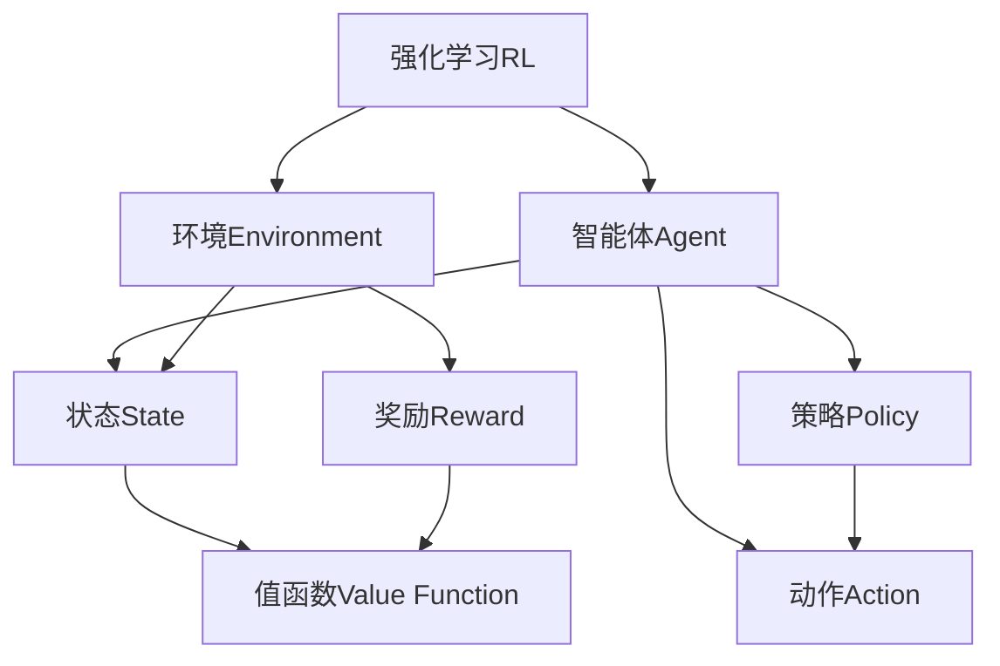
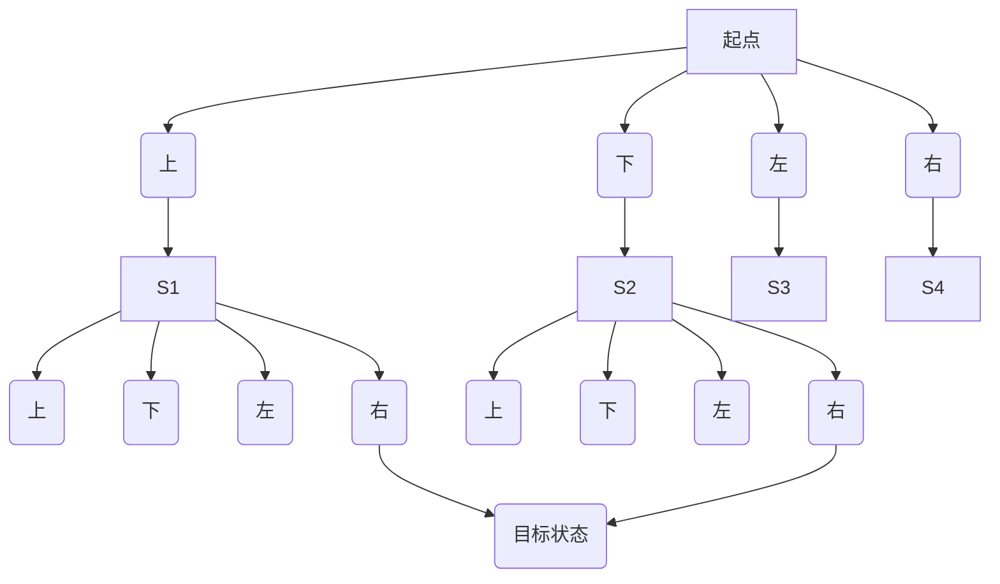

好的，我会按照您的要求，以"强化学习RL原理与代码实例讲解"为主题，撰写一篇专业的技术博客文章。文章将遵循您提供的结构模板，包含背景介绍、核心概念、算法原理、数学模型、代码实例、应用场景、资源推荐、总结和附录等章节。我会尽最大努力确保文章逻辑清晰、内容深入、实例丰富，并运用适当的可视化工具如Mermaid流程图来帮助读者理解。同时，我会注意使用专业但通俗易懂的语言，让文章既有深度又具有可读性。请给我一些时间来完成这篇高质量的技术文章，我会严格遵守您提出的所有约束条件。

# 强化学习RL原理与代码实例讲解

## 1. 背景介绍

### 1.1 问题的由来

在传统的机器学习领域中,监督学习和无监督学习长期占据主导地位。监督学习需要大量标注好的训练数据,而无监督学习则从未标注的原始数据中挖掘潜在规律。然而,这两种学习范式都存在一定局限性,难以很好地解决一些现实复杂问题。

强化学习(Reinforcement Learning,RL)作为机器学习的一个新兴分支,为解决此类问题提供了一种全新的思路。不同于监督学习和无监督学习,强化学习的目标是让智能体(Agent)通过与环境(Environment)的交互作用来学习获取最大化预期累积奖励的最优策略。

### 1.2 研究现状 

早期的强化学习研究可以追溯到20世纪50年代,但由于理论和算力的限制,长期未能取得实质性突破。直到近年来,依托于算力的飞速提升和深度学习技术的兴起,强化学习研究才开始蓬勃发展。

2013年,深度强化学习(Deep Reinforcement Learning)首次展现出在视频游戏领域超越人类的能力。2016年,AlphaGo战胜了世界顶级围棋手李世乭,成为强化学习走向主流的一个里程碑。随后,强化学习在机器人控制、自动驾驶、智能调度等诸多领域取得了卓越的应用成果。

### 1.3 研究意义

强化学习的核心思想是让智能体通过不断试错,从环境反馈的奖惩信号中学习获取最优策略。这种学习方式更加贴近现实世界,具有很强的通用性和实用价值。

- 无需事先标注的训练数据,可从环境中自主探索学习
- 能够处理连续状态和动作空间,解决复杂的序列决策问题 
- 可以通过奖惩机制来调整策略,实现自我优化和自主学习
- 具备很强的泛化能力,可以应用于众多领域的实际问题

因此,强化学习被认为是人工智能领域最具前景和挑战的研究方向之一,对于推动智能系统的发展具有重要意义。

### 1.4 本文结构

本文将全面介绍强化学习的核心理论和实践技术,主要内容包括:

- 强化学习的基本概念、数学模型和核心算法原理
- 值函数估计、策略梯度等主流方法的理论基础和实现细节
- 结合深度学习的深度强化学习框架及代码实例分析
- 强化学习在不同领域的实际应用案例剖析
- 常用工具、学习资源和未来发展趋势探讨

通过全面深入的介绍,读者能够充分掌握强化学习的本质,并能运用其解决实际问题。

## 2. 核心概念与联系

强化学习(RL)主要涉及以下几个核心概念:

- **智能体(Agent)**: 在环境中与外界交互并学习的主体,需要根据当前状态选择动作。
- **环境(Environment)**: 智能体所处的外部世界,描述问题需要解决的情景。
- **状态(State)**: 环境的instantaneous snapshot,用于描述当前的情况。
- **动作(Action)**: 智能体对环境的反应,会导致环境状态的转移。
- **奖励(Reward)**: 环境对智能体当前行为的反馈评价,指导智能体朝着正确方向学习。
- **策略(Policy)**: 智能体根据状态选择动作的行为准则,是需要学习优化的核心对象。
- **值函数(Value Function)**: 评估当前状态或状态-动作对在遵循某策略时的预期累积奖励。

这些概念相互关联、环环相扣:

1. 智能体根据当前状态,通过策略选择一个动作。
2. 智能体执行该动作,环境转移到新状态并给出对应奖励。
3. 智能体根据奖励信号,调整策略和值函数估计,以获得更大的累积奖励。

通过不断的试错与学习,智能体逐步优化策略,最终获得在该环境下的最优策略。

## 3. 核心算法原理 & 具体操作步骤  

### 3.1 算法原理概述

强化学习算法的核心思想是通过最大化预期累积奖励来学习最优策略。具体来说,给定一个马尔可夫决策过程(MDP),我们需要找到一个策略$\pi$,使得在该策略指导下,智能体从初始状态$s_0$开始,获得的预期累积奖励最大:

$$J(\pi) = \mathbb{E}_\pi\left[\sum_{t=0}^\infty \gamma^t r_t\right]$$

其中$r_t$为时间步$t$获得的即时奖励,$\gamma \in [0,1]$为折现因子,用于权衡当前奖励和未来奖励的重要性。

根据策略是显式定义的还是需要从经验中学习,主流强化学习算法可分为两大类:

1. **基于值函数的算法**: 首先估计出最优值函数,然后由此导出最优策略。包括时序差分(TD)学习、Q-学习、Sarsa等。
2. **基于策略梯度的算法**: 直接对策略进行参数化,并通过梯度上升等优化方法学习最优参数。如REINFORCE、Actor-Critic等。

此外,结合深度神经网络的深度强化学习(Deep RL),能够处理高维观测和连续动作空间,显著提高了算法的泛化能力和性能表现。

### 3.2 算法步骤详解

以Q-Learning为例,算法的基本步骤如下:

1. **初始化**: 初始化Q函数(状态-动作值函数),可使用任意有限值。
2. **采样**: 智能体根据当前状态$s_t$和策略(如$\epsilon$-贪婪策略)选择动作$a_t$,执行后获得奖励$r_{t+1}$并转移到新状态$s_{t+1}$。
3. **更新Q函数**:
   $$Q(s_t, a_t) \leftarrow Q(s_t, a_t) + \alpha\left[r_{t+1} + \gamma\max_a Q(s_{t+1}, a) - Q(s_t, a_t)\right]$$
   其中$\alpha$为学习率。
4. **重复步骤2-3**,直到收敛或达到终止条件。

Q-Learning的核心在于通过时序差分(TD)目标修正Q函数,使其逐步接近最优Q函数。在学习过程中,智能体不断探索,获取新的经验并更新Q函数。当Q函数收敛后,由$\pi^*(s) = \arg\max_a Q^*(s, a)$可得最优策略$\pi^*$。

### 3.3 算法优缺点

Q-Learning的优点:

- 无需建模环境的转移概率,只需环境可观测即可
- 离线学习,无需在线交互即可学习
- 收敛性理论较为完善,能够证明收敛于最优Q函数

缺点:

- 面临维数灾难,无法应对高维状态和动作空间
- 探索与利用两难困境,需要权衡
- 不适用于连续动作空间的问题

### 3.4 算法应用领域

基于值函数的强化学习算法广泛应用于:

- 经典控制问题:小车、摆杆、机器人路径规划等
- 棋类游戏:国际跳棋、黑白棋、五子棋等
- 网络通信:信道分配、路由选择等
- 运筹优化:工厂调度、资源分配等

## 4. 数学模型和公式 & 详细讲解 & 举例说明

### 4.1 数学模型构建

强化学习问题通常建模为马尔可夫决策过程(MDP):

$$\langle \mathcal{S}, \mathcal{A}, \mathcal{P}, \mathcal{R}, \gamma \rangle$$

- $\mathcal{S}$是状态空间的集合
- $\mathcal{A}$是智能体可选动作空间的集合  
- $\mathcal{P}$是转移概率函数,定义了$\mathcal{P}_{ss'}^a = \Pr(s_{t+1}=s'|s_t=s, a_t=a)$
- $\mathcal{R}$是奖励函数,定义了$\mathcal{R}_s^a = \mathbb{E}[r_{t+1}|s_t=s, a_t=a]$
- $\gamma \in [0, 1]$是折现因子,权衡当前和未来奖励

在MDP中,智能体的目标是找到一个最优策略$\pi^*$,使得从任意初始状态$s_0$开始,其预期累积奖励最大化:

$$\pi^* = \arg\max_\pi J(\pi) = \arg\max_\pi \mathbb{E}_\pi\left[\sum_{t=0}^\infty \gamma^t r_t\right]$$

### 4.2 公式推导过程

在值函数方法中,定义状态值函数$V^\pi(s)$和动作值函数$Q^\pi(s, a)$:

$$\begin{align*}
V^\pi(s) &= \mathbb{E}_\pi\left[\sum_{k=0}^\infty \gamma^k r_{t+k+1} \big| s_t=s\right] \\
Q^\pi(s, a) &= \mathbb{E}_\pi\left[\sum_{k=0}^\infty \gamma^k r_{t+k+1} \big| s_t=s, a_t=a\right]
\end{align*}$$

利用贝尔曼方程,可以推导出$V^\pi$和$Q^\pi$的更新形式:

$$\begin{align*}
V^\pi(s) &= \sum_a \pi(a|s)\sum_{s'} \mathcal{P}_{ss'}^a \left[ \mathcal{R}_s^a + \gamma V^\pi(s')\right] \\
Q^\pi(s, a) &= \sum_{s'} \mathcal{P}_{ss'}^a \left[ \mathcal{R}_s^a + \gamma \sum_{a'} \pi(a'|s')Q^\pi(s', a')\right]
\end{align*}$$

当值函数收敛时,由$\pi^*(s) = \arg\max_a Q^*(s, a)$可得最优策略$\pi^*$。

### 4.3 案例分析与讲解

考虑一个简单的网格世界,智能体需要从起点出发,到达目标状态。每个状态都有若干可选动作,执行动作会获得相应的奖励或惩罚。

对于状态S0,可以计算出其在不同策略下的状态值函数:

- 始终向右移动: $V(S0) = -0.1 - 0.9 \times 0.1 - 0.9^2 \times 0.1 - ... = -1$
- 始终向下移动: $V(S0) = -0.1 