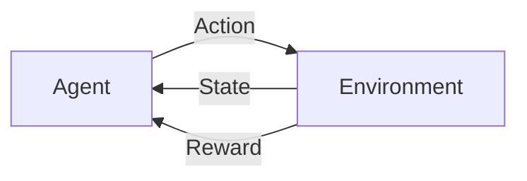

# 强化学习Reinforcement Learning与传统机器学习方法对比

作者：禅与计算机程序设计艺术 / Zen and the Art of Computer Programming

关键词：强化学习、监督学习、无监督学习、马尔可夫决策过程、Q-learning、Deep Q-Network、策略梯度、模仿学习、元学习

## 1. 背景介绍
### 1.1  问题的由来
人工智能和机器学习近年来取得了巨大的进展，各种新的算法和模型不断涌现，应用领域也在不断扩大。传统的机器学习方法主要包括监督学习和无监督学习，前者需要标注数据来训练模型，后者则利用数据本身的统计特性来发现模式。然而在很多实际场景中，获取标注数据是非常困难和昂贵的，环境也可能是动态变化的。强化学习作为一种全新的机器学习范式，为这些问题提供了新的解决思路。

### 1.2  研究现状
强化学习自20世纪90年代以来一直是机器学习领域的研究热点，近年来随着深度学习的发展，深度强化学习取得了很多令人瞩目的成果，在围棋、视频游戏、机器人控制等领域都达到了超越人类的水平。代表性的工作包括Deep Q-Network[1]、AlphaGo[2]、PPO[3]等。同时，强化学习在工业界也有广泛应用，如自动驾驶、推荐系统、智能电网等。

### 1.3  研究意义
强化学习与传统机器学习方法相比，有其独特的优势。它不需要预先准备大量的标注数据，而是通过智能体与环境的交互来学习最优策略。因此强化学习在很多难以获取标注数据的场景中有着重要的应用价值。此外，强化学习考虑了决策的长期回报，更符合很多实际问题的特点。深入研究和理解强化学习与传统机器学习方法的异同，对于设计和应用机器学习算法具有重要的指导意义。

### 1.4  本文结构
本文将首先介绍强化学习的核心概念，包括智能体、环境、状态、动作、奖励等，并阐述其与监督学习、无监督学习的联系与区别。然后重点介绍几种经典的强化学习算法，包括Q-learning、Sarsa、Policy Gradient等，分析其原理、优缺点和适用场景。接着通过几个具体的案例来说明如何应用强化学习解决实际问题。最后总结强化学习的研究现状和未来发展趋势，探讨其面临的机遇与挑战。

## 2. 核心概念与联系
强化学习的核心思想是通过智能体(agent)与环境(environment)的交互来学习最优策略(policy)，以获得最大的累积奖励(reward)。具体而言：
- 智能体：可以执行动作(action)来影响环境状态的决策主体。
- 环境：智能体所处的外部环境，接收智能体的动作并反馈新的状态和奖励。
- 状态(state)：环境的完整描述，反映了环境的特征信息。
- 动作：智能体对环境采取的行为，会导致状态的改变。
- 奖励：环境对智能体动作的即时反馈，表示该动作的优劣程度。
- 策略：智能体的决策函数，将状态映射为动作的概率分布。
- 价值函数(value function)：评估某状态或动作的长期累积奖励。

强化学习可以看作一个连续的马尔可夫决策过程(Markov Decision Process, MDP)，每个时刻t智能体根据当前环境状态$s_t$采取动作$a_t$，环境反馈奖励$r_t$并转移到新状态$s_{t+1}$，如此循环往复。智能体的目标是学习一个最优策略$\pi^*$，使得从任意状态出发能获得的期望累积奖励最大化：

$$
\pi^* = \arg\max_{\pi} \mathbb{E}_{\pi}\left[\sum_{t=0}^{\infty} \gamma^t r_t \right]
$$

其中$\gamma \in [0,1]$是折扣因子，用于平衡当前和未来奖励的重要性。

与监督学习和无监督学习相比，强化学习的特点在于：
- 没有预先准备好的标注数据，而是通过与环境交互来学习
- 考虑动作的长期影响，优化累积奖励而非即时奖励
- 环境通常是随机且动态变化的，需要不断探索

但强化学习与监督学习和无监督学习也有一定的联系，比如：
- 从经验数据中学习，并优化某个目标函数
- 使用函数逼近等机器学习方法来表示策略和价值函数
- 结合深度学习可以处理原始高维状态，如图像、文本等

下图展示了强化学习智能体与环境交互的基本流程：

## 3. 核心算法原理 & 具体操作步骤
### 3.1  算法原理概述
强化学习有多种不同的算法，主要可以分为以下三类：
1. 基于价值(value-based)：学习状态价值函数或动作价值函数，如Q-learning
2. 基于策略(policy-based)：直接学习最优策略函数，如Policy Gradient 
3. 基于模型(model-based)：学习环境的转移概率和奖励函数，基于模型来规划，如Dyna-Q

不同类型的算法各有优缺点，实践中常常会将它们结合起来使用。比较经典的算法包括：
- Q-learning：通过贪婪策略和时序差分学习动作价值函数
- Sarsa：同策略算法，基于当前策略的动作来更新动作价值函数
- Deep Q-Network(DQN)：结合深度学习逼近动作价值函数
- Policy Gradient：基于梯度上升直接优化策略函数
- Actor-Critic：结合价值和策略，用critic估计价值，actor学习策略

此外还有一些前沿的算法和方法，如：
- 逆强化学习(Inverse RL)：从专家示范中学习奖励函数
- 模仿学习(Imitation Learning)：通过模仿专家行为来学习策略
- 元强化学习(Meta RL)：学习在新环境上快速适应的元策略
- 多智能体强化学习(Multi-agent RL)：多个智能体在同一环境中学习协作与竞争

### 3.2  算法步骤详解
下面以Q-learning为例，详细介绍其算法步骤。Q-learning是一种异策略的时序差分学习算法，通过不断估计和更新动作价值函数$Q(s,a)$来学习最优策略。$Q(s,a)$表示在状态s下采取动作a的长期期望回报。

Q-learning的核心更新公式为：

$$
Q(s_t,a_t) \leftarrow Q(s_t,a_t) + \alpha \left[r_t + \gamma \max_{a'} Q(s_{t+1},a') - Q(s_t,a_t)\right]
$$

其中$\alpha \in (0,1]$为学习率，$\gamma$为折扣因子。这个公式的含义是，$Q(s_t,a_t)$朝着基于最优动作价值函数$\max_{a'} Q(s_{t+1},a')$的目标值$r_t + \gamma \max_{a'} Q(s_{t+1},a')$更新，目标值和当前值的差即为时序差分(TD)误差。

具体的算法步骤如下：
1. 随机初始化Q函数，对所有s,a, $Q(s,a)=0$
2. 对每个episode循环：
   1. 初始化起始状态$s_0$
   2. 对每个step循环：
      1. 根据$\epsilon$-贪婪策略选择动作$a_t$，即以$\epsilon$的概率随机选择动作，否则选择$\arg\max_a Q(s_t,a)$
      2. 执行动作$a_t$，观察奖励$r_t$和新状态$s_{t+1}$
      3. 根据公式更新$Q(s_t,a_t)$
      4. $s_t \leftarrow s_{t+1}$
   3. 直到$s_t$为终止状态

重复以上步骤直到Q函数收敛或达到预设的训练轮数。在测试阶段，智能体完全根据学到的Q函数来选择动作，不再进行探索。

### 3.3  算法优缺点
Q-learning的主要优点包括：
- 简单易实现，对环境的转移概率没有要求
- 能够收敛到最优策略，有理论保证
- 通过函数逼近可以处理大规模状态空间

但Q-learning也存在一些局限性：
- 难以处理连续动作空间
- 容易过拟合，对探索策略敏感
- 在稀疏奖励环境中学习效率低

为了克服这些问题，研究者提出了很多改进和变体，如Double Q-learning、Dueling DQN、Prioritized Experience Replay等。

### 3.4  算法应用领域
Q-learning在很多领域都有成功的应用，例如：
- 智能体寻路：在格子世界中学习最短路径
- 游戏AI：Atari视频游戏[1]，星际争霸微操[4]等
- 机器人控制：倒立摆、机械臂、四足机器人等
- 自然语言处理：对话系统[5]，机器阅读理解[6]等
- 推荐系统：电商推荐[7]，广告投放等

随着深度强化学习的发展，Q-learning及其变体被广泛应用于更加复杂的决策场景中，展现出了强大的智能学习能力。

## 4. 数学模型和公式 & 详细讲解 & 举例说明
### 4.1  数学模型构建
强化学习的数学模型通常基于马尔可夫决策过程(MDP)。一个MDP由以下元素组成：
- 状态空间$\mathcal{S}$
- 动作空间$\mathcal{A}$
- 转移概率$\mathcal{P}(s'|s,a)$：在状态s下采取动作a转移到状态s'的概率
- 奖励函数$\mathcal{R}(s,a)$：在状态s下采取动作a获得的即时奖励
- 折扣因子$\gamma \in [0,1]$：未来奖励的衰减率

MDP的目标是寻找一个最优策略$\pi^*: \mathcal{S} \rightarrow \mathcal{A}$，使得从任意状态s出发，采取该策略能获得的期望累积奖励最大：

$$
V^{\pi}(s) = \mathbb{E}_{\pi} \left[ \sum_{t=0}^{\infty} \gamma^t r_t | s_0=s \right]
$$

$$
\pi^* = \arg\max_{\pi} V^{\pi}(s), \forall s \in \mathcal{S}
$$

为了获得最优策略，需要学习状态价值函数$V^{\pi}(s)$或动作价值函数$Q^{\pi}(s,a)$：

$$
Q^{\pi}(s,a) = \mathbb{E}_{\pi} \left[ \sum_{t=0}^{\infty} \gamma^t r_t | s_0=s, a_0=a \right]
$$

它们满足贝尔曼方程(Bellman Equation)：

$$
V^{\pi}(s) = \sum_{a \in \mathcal{A}} \pi(a|s) \left( \mathcal{R}(s,a) + \gamma \sum_{s' \in \mathcal{S}} \mathcal{P}(s'|s,a) V^{\pi}(s') \right)
$$

$$
Q^{\pi}(s,a) = \mathcal{R}(s,a) + \gamma \sum_{s' \in \mathcal{S}} \mathcal{P}(s'|s,a) \sum_{a' \in \mathcal{A}} \pi(a'|s') Q^{\pi}(s',a')
$$

最优价值函数$V^*(s)$和$Q^*(s,a)$满足最优贝尔曼方程：

$$
V^*(s) = \max_{a \in \mathcal{A}} \left( \mathcal{R}(s,a) + \gamma \sum_{s' \in \mathcal{S}} \mathcal{P}(s'|s,a) V^*(s') \right)
$$

$$
Q^*(s,a) = \mathcal{R}(s,a) + \gamma \sum_{s' \in \mathcal{S}} \mathcal{P}(s'|s,a) \max_{a' \in \mathcal{A}} Q^*(s',a')
$$

通过不