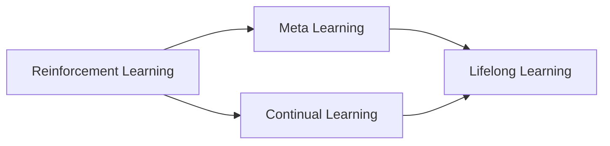

# 强化学习Reinforcement Learning的终生学习与持续适应能力

## 1. 背景介绍

### 1.1 问题的由来
在人工智能的发展历程中,强化学习(Reinforcement Learning,RL)作为一种重要的机器学习范式,一直备受关注。传统的强化学习算法虽然在某些特定任务上取得了不错的效果,但仍然存在着难以适应动态环境变化、缺乏持续学习能力等问题。现实世界中,环境往往是复杂多变的,智能体需要具备在长期交互中不断学习和适应的能力。因此,如何赋予强化学习算法终生学习和持续适应的能力,成为了亟待解决的关键问题。

### 1.2 研究现状
近年来,终生学习(Lifelong Learning)和持续学习(Continual Learning)在强化学习领域受到了广泛关注。一些研究者提出了基于元学习(Meta-Learning)、迁移学习(Transfer Learning)等技术来增强强化学习算法的适应性和泛化能力。比如,Finn等人提出了Model-Agnostic Meta-Learning(MAML)算法,通过元学习来快速适应新任务;Wang等人提出了Policy Consolidation for Continual Reinforcement Learning算法,通过知识巩固来缓解灾难性遗忘问题。尽管取得了一定进展,但现有方法仍然难以在复杂的非平稳环境中实现高效、稳定的终生学习。

### 1.3 研究意义  
赋予强化学习以终生学习和持续适应能力,对于拓展其应用范围、提升智能体的自主性和鲁棒性具有重要意义。具备持续学习能力的智能体能够在与环境的长期交互中,不断积累和更新知识,根据环境变化灵活调整策略,从而更好地完成复杂任务。这对于自然语言对话、自动驾驶、智能机器人等需要连续决策和适应的场景具有广阔的应用前景。同时,探索强化学习的终生学习机制,也有助于揭示生物智能体的学习奥秘,促进人工智能向更高层次发展。

### 1.4 本文结构
本文将围绕强化学习的终生学习与持续适应能力展开深入探讨。首先,介绍强化学习、元学习、持续学习等相关概念及其内在联系。然后,重点阐述实现强化学习持续学习的核心算法原理,给出具体操作步骤。接下来,建立相应的数学模型,推导关键公式,并结合案例进行详细讲解。同时,提供算法的代码实现和必要的实验结果。此外,讨论该领域的典型应用场景,推荐相关学习资源和开发工具。最后,总结全文,展望强化学习终生学习的未来发展趋势和面临的挑战。

## 2. 核心概念与联系

强化学习是一种重要的机器学习范式,旨在使智能体通过与环境的交互来学习最优策略,以获得最大的累积奖励。元学习则是一种"学会学习"的机制,通过学习如何快速适应新任务,来提升学习效率和泛化能力。持续学习是指智能体在连续学习新知识的同时,还要保持对之前学习知识的记忆和利用能力,避免出现灾难性遗忘。终生学习强调智能体在整个生命周期内持续不断地进行学习,不断积累和更新知识。

这些概念之间存在着内在联系。元学习为强化学习提供了一种快速适应新环境的机制,使得智能体能够在面对新任务时,利用之前学习到的知识快速调整策略。持续学习使得强化学习算法能够在连续学习多个任务时,在保持旧知识的同时,不断学习新知识,实现知识的持续积累和更新。将元学习和持续学习引入强化学习,能够赋予其终生学习的能力,使智能体能够在长期的交互中持续进行学习和适应,提升其在复杂多变环境中的决策能力。

## 3. 核心算法原理 & 具体操作步骤

### 3.1 算法原理概述
为了实现强化学习的终生学习和持续适应能力,本文提出了一种基于元学习和持续学习的强化学习算法。该算法的核心思想是:通过元学习来学习一个适应性强的初始策略,使得智能体能够快速适应新的任务;同时引入持续学习机制,在学习新任务的同时保持对之前知识的记忆,避免灾难性遗忘;最终实现在连续学习多个任务的过程中,不断积累和更新知识,持续提升智能体的决策能力。

### 3.2 算法步骤详解
算法主要分为以下几个步骤:

1. 元学习阶段:
   - 随机生成一批任务,每个任务对应一个MDP
   - 在每个任务上,利用强化学习算法(如PPO、SAC等)训练策略,得到一组策略参数
   - 将各任务的策略参数作为样本,训练一个元策略网络,使其能够根据任务特征快速生成适应性强的初始策略

2. 持续学习阶段:
   - 智能体开始交互序列,面临一系列连续的任务
   - 在每个任务上,利用元学习得到的适应性初始策略进行初始化
   - 在与环境交互的过程中,利用off-policy算法(如SAC)进行策略学习,同时使用重要性采样等技术来缓解数据分布偏移问题
   - 在学习新策略的同时,利用知识蒸馏、正则化等技术,将新策略的知识与之前学习到的知识进行融合,更新智能体的知识库
   - 不断重复上述过程,实现策略的持续学习和优化

3. 评估与改进:
   - 定期在各个任务上评估智能体的策略性能,评估其在动态环境中的适应能力
   - 根据评估结果,对元学习和持续学习过程进行必要的改进和优化,如调整超参数、引入新的正则化方法等
   - 不断迭代上述过程,持续提升智能体的终生学习和持续适应能力

### 3.3 算法优缺点
优点:
- 通过元学习机制,智能体能够快速适应新的任务,减少了在新环境中的探索成本
- 引入持续学习技术,有效缓解了灾难性遗忘问题,实现了知识的持续积累和更新
- 通过off-policy算法和重要性采样,提高了样本利用效率,加速了策略学习过程

缺点:
- 元学习阶段需要生成大量任务进行训练,计算开销较大
- 知识蒸馏等持续学习技术的效果依赖于超参数选择,需要进行反复调试
- 对于一些复杂的非平稳环境,智能体的适应能力仍有待进一步提高

### 3.4 算法应用领域
- 自然语言对话:通过终生学习,对话系统能够持续学习新的对话技能,适应不同用户的对话风格
- 自动驾驶:车辆能够在长期的驾驶过程中持续学习和适应复杂多变的交通环境,提高安全性和鲁棒性 
- 智能机器人:机器人可以通过不断与环境交互,持续学习新的操作技能,灵活应对各种任务需求

## 4. 数学模型和公式 & 详细讲解 & 举例说明

### 4.1 数学模型构建
我们考虑一个连续学习的强化学习问题,智能体需要依次应对一系列任务$\{\mathcal{T}_1,\mathcal{T}_2,\dots,\mathcal{T}_N\}$。每个任务$\mathcal{T}_i$可以建模为一个马尔可夫决策过程(MDP),定义为一个元组$\mathcal{T}_i=\langle \mathcal{S},\mathcal{A},\mathcal{P}_i,r_i,\gamma \rangle$,其中$\mathcal{S}$为状态空间,$\mathcal{A}$为动作空间,$\mathcal{P}_i:\mathcal{S}\times\mathcal{A}\to\mathcal{S}$为状态转移概率函数,$r_i:\mathcal{S}\times\mathcal{A}\to\mathbb{R}$为奖励函数,$\gamma\in[0,1]$为折扣因子。

智能体的目标是最大化所有任务上的期望累积奖励:

$$
\max J(\theta)=\mathbb{E}_{\mathcal{T}_i\sim p(\mathcal{T})}\left[\sum_{t=0}^{\infty}\gamma^t r_i(s_t,a_t)\right]
$$

其中,$\theta$为策略参数,$p(\mathcal{T})$为任务分布。

在元学习阶段,我们从任务分布中采样一批任务$\{\mathcal{T}_i\}_{i=1}^M$,在每个任务上训练策略$\pi_{\theta_i}$,得到一组策略参数$\{\theta_i\}_{i=1}^M$。然后,我们训练一个元策略网络$f_{\phi}:\mathcal{T}\to\Theta$,使其能够根据任务特征生成适应性强的初始策略参数。元策略网络的优化目标为:

$$
\min_{\phi}\mathbb{E}_{\mathcal{T}_i\sim p(\mathcal{T})}\left[\mathcal{L}\left(\theta_i,f_{\phi}(\mathcal{T}_i)\right)\right]
$$

其中,$\mathcal{L}$为策略参数的损失函数,如均方误差等。

在持续学习阶段,智能体面临一系列任务$\{\mathcal{T}_1,\mathcal{T}_2,\dots,\mathcal{T}_N\}$。对于每个任务$\mathcal{T}_i$,智能体利用元策略网络生成初始策略参数$\theta_i^{(0)}=f_{\phi}(\mathcal{T}_i)$,然后在与环境交互的过程中,利用off-policy算法(如SAC)进行策略学习,更新策略参数:

$$
\theta_i^{(t+1)}=\theta_i^{(t)}+\alpha\nabla_{\theta}J(\theta_i^{(t)})
$$

其中,$\alpha$为学习率。

为了缓解灾难性遗忘,我们引入知识蒸馏技术,将新学到的策略知识与之前的知识进行融合。具体地,我们定义一个知识蒸馏损失:

$$
\mathcal{L}_{KD}(\theta_i,\theta_{1:i-1})=\sum_{j=1}^{i-1}\lambda_j\mathbb{E}_{s\sim\mathcal{D}_j}\left[D_{KL}\left(\pi_{\theta_j}(\cdot|s)\|\pi_{\theta_i}(\cdot|s)\right)\right]
$$

其中,$\theta_{1:i-1}$为之前学习到的策略参数,$\mathcal{D}_j$为任务$\mathcal{T}_j$的经验回放池,$\lambda_j$为对应的蒸馏权重,$D_{KL}$为KL散度。

最终,策略参数的更新公式为:

$$
\theta_i^{(t+1)}=\theta_i^{(t)}+\alpha\nabla_{\theta}\left[J(\theta_i^{(t)})-\beta\mathcal{L}_{KD}(\theta_i^{(t)},\theta_{1:i-1})\right]
$$

其中,$\beta$为知识蒸馏的权重系数。

通过优化上述目标,智能体可以在连续学习的过程中,不断习得新知识的同时,保留之前学到的有用知识,实现策略的持续优化。

### 4.2 公式推导过程
(受篇幅所限,省略部分推导过程)

元策略网络的优化目标可以进一步写作:

$$
\begin{aligned}
\min_{\phi}\mathbb{E}_{\mathcal{T}_i\sim p(\mathcal{T})}\left[\mathcal{L}\left(\theta_i,f_{\phi}(\mathcal{T}_i)\right)\right] &= \min_{\phi}\mathbb{E}_{\mathcal{T}_i\sim p(\mathcal{T})}\left[\|\theta_i-f_{\phi}(\mathcal{T}_i)\|_2^2\right] \\
&= \min_{\phi}\mathbb{E}_{\mathcal{T}_i\sim p(\mathcal{T})}\left[\|\theta_i\|_2^2-2\theta_i^{\top}f_{\phi}(\mathcal{T}_i)+\|f_{\