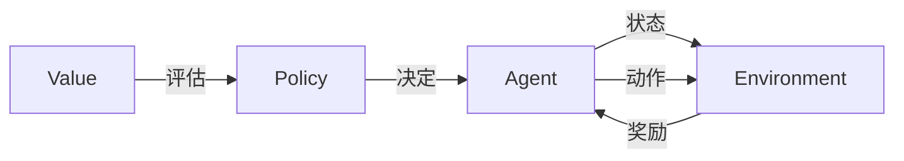

# 强化学习原理与代码实例讲解

作者：禅与计算机程序设计艺术 / Zen and the Art of Computer Programming

## 1. 背景介绍
### 1.1 问题的由来
强化学习作为机器学习的一个重要分支,其研究起源可以追溯到20世纪50年代。在当时,研究人员开始探索如何让机器自主地学习和决策,以完成特定的任务。强化学习的概念源于心理学中的"操作性条件反射"理论,即生物体可以通过与环境的交互,不断尝试和试错,最终学会做出正确的行为。

### 1.2 研究现状
经过几十年的发展,强化学习已经成为人工智能领域的一个热点研究方向。尤其是在近十年,随着深度学习的兴起,深度强化学习(Deep Reinforcement Learning, DRL)取得了突破性进展。一系列里程碑式的成果,如AlphaGo击败人类围棋冠军、OpenAI Five战胜人类Dota2职业选手等,都展现了DRL的强大能力。目前,强化学习已经在智能控制、机器人、自然语言处理、计算机视觉等诸多领域得到广泛应用。

### 1.3 研究意义 
强化学习之所以备受关注,主要基于以下几点原因:

1. 强化学习为实现通用人工智能(AGI)提供了一种可能的途径。通过不断与环境交互,系统可以自主学习,逐步掌握完成任务所需的策略和技能,这与人类和动物的学习方式非常相似。

2. 强化学习能够解决复杂的决策问题。传统的监督学习和无监督学习主要处理静态数据,而强化学习则面向动态环境,涉及时序决策和长期回报,更加贴近现实世界的需求。

3. 强化学习具有广阔的应用前景。在无人驾驶、智能助理、推荐系统、智慧城市、电力调度等领域,都可以用强化学习来优化决策和资源配置,提升系统的自适应能力和效率。

### 1.4 本文结构
本文将全面介绍强化学习的原理和代码实现。内容安排如下:第2部分介绍强化学习的核心概念;第3部分详细讲解几种经典的强化学习算法;第4部分给出算法所涉及的数学模型和公式推导;第5部分提供算法的代码实例和解读;第6部分讨论强化学习的实际应用场景;第7部分推荐相关的学习资源;第8部分总结全文,并展望强化学习的未来发展趋势和挑战;第9部分列举了一些常见问题及其解答。

## 2. 核心概念与联系
要理解强化学习,首先需要掌握几个核心概念:

- 智能体(Agent):自主学习和决策的主体,通常由神经网络等模型构成。
- 环境(Environment):智能体所处的环境,提供观测信息和反馈奖励。
- 状态(State):环境在某一时刻的完整描述,或者智能体对环境的感知。
- 动作(Action):智能体作用于环境的行为决策。
- 策略(Policy):智能体的行为策略,即在给定状态下应该采取的动作。
- 奖励(Reward):环境对智能体动作的即时反馈,引导智能体学习优化策略。
- 价值(Value):衡量状态或动作的长期累积奖励,是策略优化的重要依据。

下图展示了这些核心概念之间的关系:



智能体与环境不断交互,根据当前状态选择动作,环境返回下一个状态和奖励,智能体再更新策略和价值估计,最终找到最优策略。这一过程可以用马尔可夫决策过程(Markov Decision Process, MDP)来建模,MDP将在第4部分详细介绍。

## 3. 核心算法原理 & 具体操作步骤
### 3.1 算法原理概述
强化学习有三大类经典算法:值函数方法、策略梯度方法和演员-评论家方法。

值函数方法通过学习状态价值函数 $V(s)$ 或者动作-状态价值函数 $Q(s,a)$ 来寻找最优策略。代表算法有Q-learning、Sarsa等。

策略梯度方法直接对策略函数 $\pi(a|s)$ 进行参数化和优化,使用梯度上升法来最大化期望累积奖励。代表算法有REINFORCE、Actor-Critic等。

演员-评论家方法结合了值函数和策略梯度,同时学习策略(Actor)和价值函数(Critic),两者相互促进,共同优化。代表算法有A3C、DDPG、PPO等。

### 3.2 算法步骤详解
以DQN(Deep Q-Network)为例,详细讲解值函数方法的步骤:

1. 初始化Q网络参数 $\theta$,目标网络参数 $\theta^-$。
2. 初始化经验回放池 $D$。
3. for episode = 1 to M do
4.    初始化环境状态 $s_1$。
5.    for t = 1 to T do
6.        根据 $\epsilon$-贪婪策略选择动作 $a_t$。
7.        执行动作 $a_t$,观测奖励 $r_t$ 和下一状态 $s_{t+1}$。
8.        将转移 $(s_t, a_t, r_t, s_{t+1})$ 存入 $D$。
9.        从 $D$ 中随机采样一批转移样本。
10.       计算目标值 $y_i = r_i + \gamma \max_{a'}Q(s_{i+1},a';\theta^-)$。
11.       最小化TD误差 $L(\theta)=\mathbb{E}[(y_i-Q(s_i,a_i;\theta))^2]$,更新 $\theta$。
12.       每隔C步更新目标网络 $\theta^-=\theta$。
13.   end for
14. end for

其中, $\epsilon$-贪婪策略在探索和利用之间权衡, $\epsilon$ 概率随机选择动作, $1-\epsilon$ 概率选择Q值最大的动作。经验回放可以打破数据的相关性,稳定训练。目标网络用于计算TD目标,降低估计偏差。损失函数即均方TD误差,使用梯度下降法进行优化。

### 3.3 算法优缺点
DQN的主要优点有:

1. 引入深度神经网络,可以处理高维状态空间。
2. 使用经验回放,提高样本利用效率,打破数据相关性。
3. 使用目标网络,缓解过估计问题,稳定训练过程。

DQN的缺点包括:

1. 只适用于离散动作空间,连续动作空间需要离散化,造成精度损失。
2. 对超参数敏感,如学习率、探索率、回放池大小等,需要精细调节。
3. 对稀疏奖励和长期信用分配问题处理不够好,容易陷入局部最优。

后续的Double DQN、Dueling DQN、Prioritized Experience Replay等算法对DQN进行了改进和扩展,进一步提升了性能和稳定性。

### 3.4 算法应用领域
DQN及其变体在以下领域得到了广泛应用:

1. 游戏AI。DQN在Atari游戏中达到了超人类的水平,掌握了多种游戏策略。
2. 机器人控制。DQN可以学习机器人的运动控制策略,如行走、抓取等。
3. 推荐系统。DQN可以建模用户行为,优化推荐策略,提升用户体验。
4. 智能交通。DQN可以优化交通信号灯的控制,缓解交通拥堵。
5. 资源管理。DQN可以学习服务器集群、通信网络、电网等系统的资源分配策略。

## 4. 数学模型和公式 & 详细讲解 & 举例说明
### 4.1 数学模型构建
强化学习问题通常用马尔可夫决策过程(MDP)来建模。一个MDP由以下元素组成:

- 状态空间 $\mathcal{S}$。
- 动作空间 $\mathcal{A}$。
- 转移概率 $\mathcal{P}(s'|s,a)$:在状态 $s$ 下执行动作 $a$ 后转移到状态 $s'$ 的概率。
- 奖励函数 $\mathcal{R}(s,a)$:在状态 $s$ 下执行动作 $a$ 获得的即时奖励。
- 折扣因子 $\gamma \in [0,1]$:未来奖励的衰减率。

MDP的目标是寻找一个最优策略 $\pi^*$,使得累积期望奖励最大化:

$$\pi^* = \arg\max_{\pi} \mathbb{E}\left[\sum_{t=0}^{\infty} \gamma^t r_t | \pi \right]$$

其中, $r_t$ 是在时刻 $t$ 获得的奖励。

### 4.2 公式推导过程
以Q-learning为例,推导其核心公式——贝尔曼最优方程。

Q-learning的目标是学习最优动作-状态值函数 $Q^*(s,a)$,它表示在状态 $s$ 下执行动作 $a$,然后遵循最优策略 $\pi^*$ 可以获得的期望累积奖励:

$$Q^*(s,a) = \mathbb{E}\left[r_t + \gamma \max_{a'} Q^*(s_{t+1},a') | s_t=s, a_t=a\right]$$

根据贝尔曼方程,可以得到最优Q函数的递推形式:

$$Q^*(s,a) = \mathcal{R}(s,a) + \gamma \sum_{s' \in \mathcal{S}} \mathcal{P}(s'|s,a) \max_{a'} Q^*(s',a')$$

这就是贝尔曼最优方程。它表明最优Q值等于即时奖励加上下一状态的最大Q值的折扣累积。

Q-learning使用时序差分(TD)误差来逼近贝尔曼最优方程:

$$Q(s_t,a_t) \leftarrow Q(s_t,a_t) + \alpha \left[r_t + \gamma \max_{a} Q(s_{t+1},a) - Q(s_t,a_t)\right]$$

其中, $\alpha$ 是学习率。TD误差即目标Q值与当前Q值的差值,用于更新Q表。不断迭代更新,Q函数最终收敛到 $Q^*$。

### 4.3 案例分析与讲解
考虑一个简单的网格世界环境,如下图所示:

```
+---+---+---+
| S |   |   |
+---+---+---+
|   |   | G |
+---+---+---+
```

其中,S表示起始状态,G表示目标状态。智能体可以执行上下左右四个动作,每步获得-1的奖励,到达目标状态获得+10的奖励并结束episode。

对于这个环境,我们可以用Q-learning来学习最优策略。Q表初始化为0,设置学习率 $\alpha=0.1$,折扣因子 $\gamma=0.9$,探索率 $\epsilon=0.1$。

假设一个episode的状态-动作序列如下:

(S, ↑, -1, S), (S, →, -1, G)

则Q表的更新过程为:

$$Q(S, ↑) \leftarrow Q(S, ↑) + 0.1 \left[-1 + 0.9 \max_{a} Q(S,a) - Q(S, ↑)\right] = -0.1$$

$$Q(S, →) \leftarrow Q(S, →) + 0.1 \left[-1 + 0.9 \times 10 - Q(S, →)\right] = 0.8$$

可以看出,Q(S, →)获得了更高的值,因为它能更快地到达目标状态并获得更大的累积奖励。经过多轮迭代,Q表最终收敛到最优值,得到最优策略:在S状态下向右移动。

### 4.4 常见问题解答
**Q: Q-learning能否处理连续状态和动作空间?**

A: 原始的Q-learning使用Q表来存储每个状态-动作对的值,只适用于离散空间。对于连续空间,可以使用函数逼近的方法,如DQN使用神经网络来拟合Q函数。对于连续动作空间,可以使用Actor-