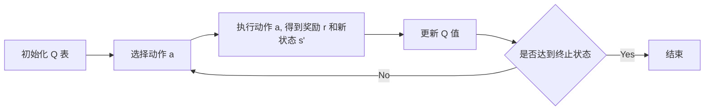
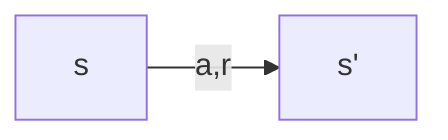
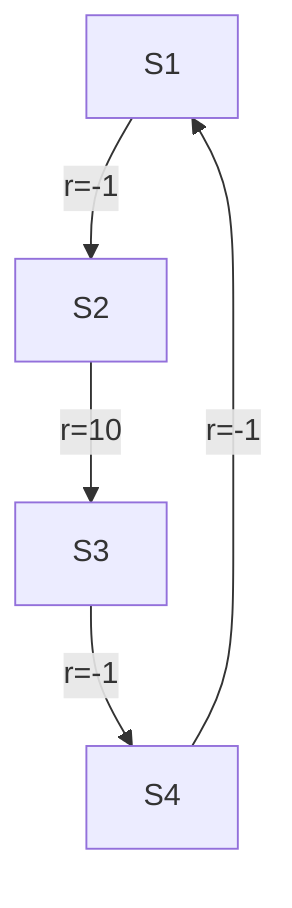

# 强化学习原理与代码实战案例讲解

关键词：强化学习、马尔可夫决策过程、Q-learning、深度强化学习、OpenAI Gym

## 1. 背景介绍
### 1.1 问题的由来
随着人工智能的快速发展,越来越多的领域开始应用智能算法来解决复杂问题。传统的机器学习方法如监督学习和非监督学习在许多场景下取得了巨大成功,但它们在面对 sequential decision making 问题时显得力不从心。强化学习作为一种全新的机器学习范式应运而生,并在近年来受到学术界和工业界的广泛关注。
### 1.2 研究现状
强化学习取得了许多令人瞩目的成就,例如 AlphaGo 击败世界围棋冠军、OpenAI Five 战胜 Dota2 职业选手、DeepMind 的 AlphaStar 在星际争霸 II 上达到人类顶尖水平等。这些里程碑式的事件标志着强化学习正在逐步走向成熟和实用化。同时,强化学习在自动驾驶、智能控制、金融交易、推荐系统等领域也展现出诱人的应用前景。
### 1.3 研究意义
尽管强化学习取得了诸多进展,但目前仍面临样本效率低、泛化能力差、探索效率低等诸多挑战。深入理解强化学习的内在机理,提出更高效的学习算法,将对于人工智能的发展具有重要意义。同时,如何将强化学习与深度学习、迁移学习、元学习等前沿方向进行有机结合,也是一个值得研究的方向。
### 1.4 本文结构
本文将分为9个部分,首先介绍强化学习的核心概念与基本要素。然后重点阐述几种典型的强化学习算法(如 Q-learning、Policy Gradient、Actor-Critic 等)的原理和实现细节。接着通过数学模型和案例分析加深读者理解。在实践部分,我们将手把手带领读者利用 Python 和 OpenAI Gym 构建强化学习项目。最后总结强化学习的研究现状、发展趋势与面临的挑战,并提供一些学习资源供读者进一步研究。

## 2. 核心概念与联系
强化学习的核心概念包括 agent、environment、state、action、reward 等。其中,agent 是学习和决策的主体,environment 即 agent 所处的环境,state 表示环境的状态,action 是 agent 与环境交互时采取的动作,reward 则是环境对 agent 行为的反馈。

强化学习可以用马尔可夫决策过程(MDP)来形式化描述。一个 MDP 由状态集合 $\mathcal{S}$、动作集合 $\mathcal{A}$、状态转移概率 $\mathcal{P}$ 和奖励函数 $\mathcal{R}$ 组成。agent 的目标是寻找一个最优策略 $\pi^*$,使得期望累积奖励最大化。

$$ \pi^* = \arg\max_{\pi} \mathbb{E}_{\pi} [\sum_{t=0}^{\infty} \gamma^t r_t] $$

其中 $\gamma \in [0,1]$ 为折扣因子。

## 3. 核心算法原理 & 具体操作步骤
### 3.1 算法原理概述
强化学习有三大类算法:基于价值(value-based)、基于策略(policy-based)和 actor-critic。

基于价值的方法通过学习价值函数(如 Q 函数)来选择动作,代表算法有 Q-learning 和 Sarsa。

基于策略的方法直接学习一个随机性策略,动作从该策略中采样得到,代表算法有 REINFORCE 和 PPO。

Actor-critic 同时学习一个策略(actor)和一个价值函数(critic),二者相互促进,代表算法有 A3C 和 SAC。

### 3.2 算法步骤详解
以 Q-learning 为例,其算法流程如下:



Q 值更新公式为:

$$Q(s,a) \leftarrow Q(s,a) + \alpha [r + \gamma \max_{a'} Q(s',a') - Q(s,a)]$$

其中 $\alpha$ 是学习率。

### 3.3 算法优缺点
Q-learning 的优点是简单易实现,且能保证收敛到最优策略。但其缺点是难以处理连续状态和动作空间,且在高维空间学习效率低下。

Policy Gradient 克服了 Q-learning 的不足,能很好地处理连续问题。但其方差较大,样本效率不高。

Actor-critic 结合了两者的优点,能有效平衡 bias 和 variance。但调参相对困难,对超参数较为敏感。

### 3.4 算法应用领域
* Q-learning 常用于离散控制问题,如 Atari 游戏、迷宫寻路等。
* Policy Gradient 和 Actor-critic 多用于连续控制,如机器人控制、自动驾驶等。
* 在计算机视觉、自然语言处理领域,强化学习与深度学习结合,催生出许多新的研究方向,如 Visual RL、Language RL 等。

## 4. 数学模型和公式 & 详细讲解 & 举例说明
### 4.1 数学模型构建
MDP 作为强化学习的标准模型,其构建要素包括:

* 状态空间 $\mathcal{S}$:所有可能的环境状态集合
* 动作空间 $\mathcal{A}$:agent 可采取的动作集合 
* 状态转移概率 $\mathcal{P}$:定义为 $\mathcal{P}(s'|s,a)$,表示在状态 $s$ 下执行动作 $a$ 后转移到状态 $s'$ 的概率
* 奖励函数 $\mathcal{R}$:定义为 $\mathcal{R}(s,a)$,表示在状态 $s$ 下执行动作 $a$ 能获得的即时奖励
* 折扣因子 $\gamma$:用于平衡即时奖励和长期奖励

一个 MDP 的状态转移可用如下图所示:



### 4.2 公式推导过程
Q-learning 的核心是学习动作-价值函数 $Q(s,a)$,其贝尔曼最优方程为:

$$Q^*(s,a) = \mathcal{R}(s,a) + \gamma \sum_{s' \in \mathcal{S}} \mathcal{P}(s'|s,a) \max_{a'} Q^*(s',a')$$

将 $Q^*$ 替换为 $Q$,即可得到 Q-learning 的更新公式:

$$Q(s,a) \leftarrow Q(s,a) + \alpha [r + \gamma \max_{a'} Q(s',a') - Q(s,a)]$$

Policy Gradient 定义一个参数化策略 $\pi_{\theta}(a|s)$,其性能指标定义为:

$$J(\theta) = \mathbb{E}_{\tau \sim \pi_{\theta}}[\sum_{t=0}^T \gamma^t r_t] $$

其中 $\tau$ 为一条轨迹。使用梯度上升法更新策略网络的参数:

$$\theta \leftarrow \theta + \alpha \nabla_{\theta} J(\theta)$$

而 $\nabla_{\theta} J(\theta)$ 可表示为:

$$\nabla_{\theta} J(\theta) = \mathbb{E}_{\tau \sim \pi_{\theta}}[\sum_{t=0}^T \nabla_{\theta} \log \pi_{\theta}(a_t|s_t) \sum_{t'=t}^T \gamma^{t'-t} r_{t'}]$$

### 4.3 案例分析与讲解
考虑一个简单的 2x2 的网格世界 MDP,如下图所示:



这里 S3 为终止状态,其余状态下执行任何动作都有 -1 的负奖励,S2 到 S3 的转移奖励为 10。折扣因子设为 1。

我们的目标是让 agent 学习一个最优策略,使得期望累积奖励最大化。

下面用 Q-learning 来求解该问题。

初始化 Q 表如下:

| State | Action | Q-value |
|-------|--------|---------|
| S1    | Left   | 0       |
| S1    | Right  | 0       |
| S2    | Left   | 0       |
| S2    | Right  | 0       |

假设第一轮 agent 执行了如下动作序列:S1->Right->S2->Right->S3,得到总奖励为 9。

则 Q 表更新如下(学习率 $\alpha$ 取 0.1):

| State | Action | Q-value |
|-------|--------|---------|
| S1    | Left   | 0       |
| S1    | Right  | 0.9     |
| S2    | Left   | 0       |
| S2    | Right  | 1.0     |

agent 会逐渐学到最优路径为 S1->Right->S2->Right->S3。

### 4.4 常见问题解答
**Q: 强化学习和监督学习、非监督学习有什么区别?**

A: 监督学习需要标注数据,非监督学习不需要奖励信号,而强化学习通过与环境交互获得延迟奖励来学习最优行为策略。此外,强化学习面临 exploration-exploitation tradeoff 问题,而监督学习和非监督学习没有该问题。

**Q: 强化学习能否处理部分可观察马尔可夫决策过程(POMDP)?**

A: 可以,将 POMDP 转化为 MDP 即可,一般通过引入 belief state 来表示状态的概率分布。另外,RNN 等循环神经网络也可用于处理 POMDP。 

**Q: 如何解决 Q-learning 中的 overestimation bias 问题?**

A: Double Q-learning 通过学习两个 Q 函数来解决该问题。此外,Dueling DQN 通过分解 Q 函数为状态值函数和优势函数来减小 overestimation。

## 5. 项目实践：代码实例和详细解释说明
### 5.1 开发环境搭建
首先安装必要的依赖包:

```bash
pip install numpy matplotlib gym
```

其中 numpy 用于数值计算,matplotlib 用于绘图,gym 是 OpenAI 提供的强化学习仿真环境库。

### 5.2 源代码详细实现
以 Q-learning 为例,在 gym 的 CliffWalking-v0 环境中实现 Q-learning 算法。

```python
import numpy as np
import matplotlib.pyplot as plt
import gym

# 超参数
NUM_EPISODES = 500
MAX_STEPS = 100
LEARNING_RATE = 0.1
GAMMA = 0.95
EPSILON = 0.1

class QLearning:
    def __init__(self, env):
        self.env = env
        self.Q = np.zeros((env.observation_space.n, env.action_space.n))
        
    def choose_action(self, state):
        if np.random.uniform() < EPSILON:
            action = self.env.action_space.sample()
        else:
            action = np.argmax(self.Q[state])
        return action
        
    def learn(self, state, action, reward, next_state, done):
        if done:
            target = reward
        else:
            target = reward + GAMMA * np.max(self.Q[next_state])
        self.Q[state][action] += LEARNING_RATE * (target - self.Q[state][action])
        
def train():
    env = gym.make("CliffWalking-v0")
    agent = QLearning(env)
    rewards = []
    
    for episode in range(NUM_EPISODES):
        state = env.reset()
        episode_reward = 0
        
        for _ in range(MAX_STEPS):
            action = agent.choose_action(state)
            next_state, reward, done, _ = env.step(action)
            agent.learn(state, action, reward, next_state, done)
            state = next_state
            episode_reward += reward
            
            if done:
                break
                
        rewards.append(episode_reward)
        if (episode + 1) % 50 == 0:
            print(f"Episode {episode + 1}: Average Reward = {np.mean(rewards[-50:])}")
            
    return rewards

rewards = train()
plt.plot(rewards)
plt.xlabel("Episode")
plt.ylabel("Reward")
plt.title("Q-learning on CliffWalking-v0")
plt.show()
```

### 5.3 代码解读与分析
1. 首先定义一些超参数,如 NUM