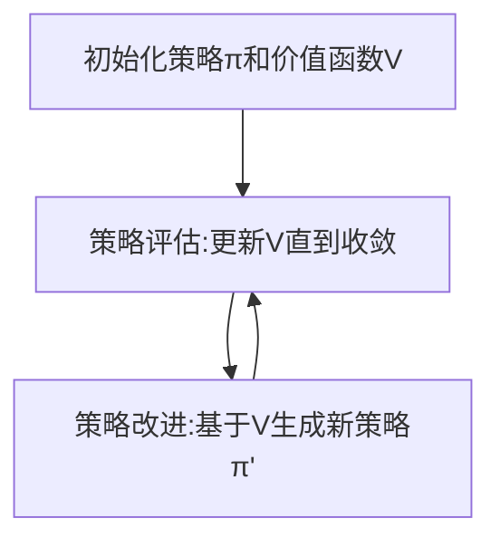

# 强化学习：价值函数的利用与更新

关键词：强化学习、价值函数、策略评估、策略改进、时序差分学习、蒙特卡洛方法、Q-Learning

## 1. 背景介绍
### 1.1 问题的由来
强化学习作为机器学习的一个重要分支,旨在研究如何让智能体通过与环境的交互来学习最优策略,从而获得最大的累积奖励。在强化学习中,价值函数扮演着至关重要的角色,它评估了在给定状态下采取某个动作的长期收益。因此,如何有效地利用和更新价值函数,成为强化学习领域一个核心研究问题。

### 1.2 研究现状
目前,强化学习在价值函数的利用与更新方面已经取得了显著进展。主要包括以下几个方面:

1. 基于表格的方法,如Q-Learning和Sarsa,通过存储和更新状态-动作值函数来学习最优策略。
2. 基于函数近似的方法,如DQN和DDPG,利用神经网络来拟合价值函数,可以处理高维连续状态空间。 
3. 基于搜索的方法,如蒙特卡洛树搜索(MCTS),通过在状态-动作树上进行仿真和评估来估计价值函数。
4. 基于模型的方法,如Dyna和MuZero,学习环境动力学模型,并利用模型进行规划和价值估计。

这些方法在不同的任务和场景中展现出了优异的性能,推动了强化学习的快速发展。

### 1.3 研究意义
价值函数是强化学习的核心,其利用与更新的有效性直接影响到智能体学习策略的质量和效率。深入研究价值函数,对于理解强化学习的内在机理,改进算法性能,拓展应用领域都具有重要意义。具体来说:

1. 理论意义:揭示价值函数的数学性质和更新规律,完善强化学习的理论框架。
2. 方法创新:设计新颖高效的价值函数估计和利用策略,突破现有算法的局限性。
3. 应用拓展:将价值函数学习应用到更广泛的实际问题中,如自动驾驶、机器人控制、推荐系统等。

### 1.4 本文结构
本文将围绕强化学习中价值函数的利用与更新展开深入探讨。第2部分介绍价值函数的核心概念和相关性质。第3部分重点阐述几种经典的价值函数学习算法。第4部分从数学角度对价值函数的模型和更新公式进行推导和分析。第5部分通过代码实例演示价值函数的具体实现和应用。第6部分讨论价值函数在实际场景中的应用案例。第7部分推荐价值函数相关的学习资源和工具。第8部分总结全文,展望价值函数的未来发展方向和挑战。

## 2. 核心概念与联系
在强化学习中,价值函数是一个估计在特定状态下执行某种策略可以获得的期望回报的函数。形式化地说,价值函数定义为:

$$V^{\pi}(s)=\mathbb{E}[G_t|S_t=s]$$

其中$\pi$表示策略,$s$表示状态,$G_t$表示从时刻$t$开始的累积回报。

与价值函数密切相关的另一个概念是动作-价值函数(Q函数),它评估在状态$s$下选择动作$a$然后遵循策略$\pi$的期望回报:

$$Q^{\pi}(s,a)=\mathbb{E}[G_t|S_t=s,A_t=a]$$

价值函数和Q函数满足一定的递归关系:

$$V^{\pi}(s)=\sum_{a}\pi(a|s)Q^{\pi}(s,a)$$

$$Q^{\pi}(s,a)=R(s,a)+\gamma\sum_{s'}P(s'|s,a)V^{\pi}(s')$$

其中$R(s,a)$是在状态$s$下执行动作$a$获得的即时奖励,$P(s'|s,a)$是状态转移概率,$\gamma$是折扣因子。

价值函数的学习可以分为策略评估和策略改进两个阶段:

1. 策略评估:在给定策略$\pi$下,利用上述递归关系更新价值函数,直到收敛到真实值函数$V^{\pi}$。
2. 策略改进:根据当前价值函数,通过贪婪法或softmax等方式生成一个更优的策略$\pi'$。

策略评估和策略改进交替进行,最终收敛到最优策略和对应的价值函数。这一过程可以用下图表示:



## 3. 核心算法原理 & 具体操作步骤
### 3.1 算法原理概述
强化学习中几种经典的价值函数学习算法包括:

1. 蒙特卡洛方法:通过采样完整的状态-动作序列来估计价值函数。
2. 时序差分学习:基于当前估计值和下一步估计值之间的差分误差来更新价值函数,代表算法有Sarsa和Q-Learning。
3. 函数近似方法:用参数化的函数(如神经网络)来表示价值函数,并用梯度下降等优化方法来学习函数参数,代表算法有DQN。

这些算法的核心原理是通过不断利用新的经验数据来更新价值函数估计,并最终收敛到真实的最优价值函数。

### 3.2 算法步骤详解
以Q-Learning为例,其具体算法步骤如下:

1. 初始化Q函数为任意值(一般为0)
2. 重复以下步骤直到收敛:
   1. 根据当前状态$s$,用$\epsilon-greedy$策略选择一个动作$a$
   2. 执行动作$a$,观察奖励$r$和下一个状态$s'$
   3. 更新Q函数:
      $$Q(s,a) \leftarrow Q(s,a)+\alpha[r+\gamma \max_{a'}Q(s',a')-Q(s,a)]$$
   4. $s \leftarrow s'$

其中$\alpha$是学习率,$\gamma$是折扣因子。Q-Learning的更新公式可以看作是时序差分误差的梯度下降,通过最小化当前Q值估计和目标Q值(基于下一状态的最大Q值和即时奖励)之间的均方误差来更新Q函数。

### 3.3 算法优缺点
Q-Learning的优点包括:
1. 简单易实现,适用于离散状态和动作空间
2. 能够学习到最优策略,收敛性有理论保证
3. 异策略学习,可以用行为策略的数据来学习目标策略

缺点包括:
1. 难以处理连续状态和动作空间
2. 在高维空间上收敛速度慢,易陷入局部最优
3. 对奖励函数和探索策略敏感

### 3.4 算法应用领域
Q-Learning及其变种在很多领域得到了成功应用,例如:
1. 游戏智能体:如Atari游戏、围棋等
2. 机器人控制:如倒立摆、机械臂操作等
3. 自然语言处理:如对话系统、文本生成等
4. 推荐系统:如电影推荐、广告投放等

## 4. 数学模型和公式 & 详细讲解 & 举例说明
### 4.1 数学模型构建
强化学习可以用马尔可夫决策过程(MDP)来建模,一个MDP由以下元素组成:
- 状态空间$\mathcal{S}$
- 动作空间$\mathcal{A}$  
- 奖励函数$R:\mathcal{S} \times \mathcal{A} \to \mathbb{R}$
- 状态转移概率$P:\mathcal{S} \times \mathcal{A} \to \mathcal{P}(\mathcal{S})$
- 折扣因子$\gamma \in [0,1]$

在MDP中,价值函数和Q函数满足贝尔曼方程:

$$V^{\pi}(s)=\sum_{a}\pi(a|s)(R(s,a)+\gamma \sum_{s'}P(s'|s,a)V^{\pi}(s'))$$

$$Q^{\pi}(s,a)=R(s,a)+\gamma \sum_{s'}P(s'|s,a)\sum_{a'}\pi(a'|s')Q^{\pi}(s',a')$$

最优价值函数$V^{*}$和$Q^{*}$满足最优贝尔曼方程:

$$V^{*}(s)=\max_{a}(R(s,a)+\gamma \sum_{s'}P(s'|s,a)V^{*}(s'))$$

$$Q^{*}(s,a)=R(s,a)+\gamma \sum_{s'}P(s'|s,a)\max_{a'}Q^{*}(s',a')$$

### 4.2 公式推导过程
以Q-Learning为例,我们推导其更新公式。定义Q函数的损失为:

$$L(Q)=\mathbb{E}[(r+\gamma \max_{a'}Q(s',a')-Q(s,a))^2]$$

根据梯度下降法,Q函数的更新公式为:

$$Q(s,a) \leftarrow Q(s,a)-\alpha \frac{\partial L(Q)}{\partial Q(s,a)}$$

$$\frac{\partial L(Q)}{\partial Q(s,a)}=-2(r+\gamma \max_{a'}Q(s',a')-Q(s,a))$$

代入得:

$$Q(s,a) \leftarrow Q(s,a)+\alpha(r+\gamma \max_{a'}Q(s',a')-Q(s,a))$$

这就是Q-Learning的更新公式。

### 4.3 案例分析与讲解
考虑一个简单的网格世界环境,如下图所示:

```
+---+---+---+
| S |   |   |
+---+---+---+
|   |   | G |
+---+---+---+
```

其中S表示起始状态,G表示目标状态,中间的空白格子表示可行走的状态。智能体在每个状态都有4个可选动作:上、下、左、右,执行动作后会以一定概率(取决于环境)转移到相应方向的相邻状态。如果智能体走到目标状态,则获得+1的奖励,否则奖励为0。

我们用Q-Learning来学习这个环境下的最优策略。初始化Q函数为全0,设置学习率$\alpha=0.1$,折扣因子$\gamma=0.9$,训练1000轮后得到收敛的Q函数如下:

|     | 上   | 下   | 左   | 右   |
|-----|------|------|------|------|
| S   | 0.73 | 0.00 | 0.00 | 0.81 |
| G   | 0.00 | 0.00 | 0.90 | 0.00 |
| 中间 | 0.00 | 0.90 | 0.00 | 0.90 |

可以看出,Q函数准确地估计了在每个状态下选择每个动作的长期收益,例如在起始状态选择"右"的Q值最高,这与最优策略(向右走两步到达目标)是一致的。Q-Learning成功学习到了该环境下的最优策略。

### 4.4 常见问题解答
1. Q: Q-Learning能否处理连续状态和动作空间?
   A: 原始的Q-Learning只适用于离散空间,对于连续空间需要引入函数近似,如DQN算法用神经网络来拟合Q函数。

2. Q: Q-Learning的收敛性如何保证?
   A: Q-Learning在适当的条件下(如探索充分、学习率满足一定条件等)可以收敛到最优Q函数,相关的理论证明可以参考Watkins和Dayan的论文。

3. Q: Q-Learning和Sarsa的区别是什么?
   A: 二者的主要区别在于更新Q函数时用到的动作选择:Q-Learning用下一状态的最大Q值(贪婪策略),属于异策略学习;Sarsa用下一状态实际选择的动作的Q值,属于同策略学习。

4. Q: 如何平衡Q-Learning的探索和利用?
   A: 常用的探索策略有$\epsilon-greedy$和Boltzmann探索等,前者以$\epsilon$的概率随机选择动作,后者根据Q值的指数函数计算动作的选择概率。探索率可以在训练过程中逐渐衰减,以平衡探索和利用。

## 5. 项目实践：代码实例和详细解释说明
### 5.1 开