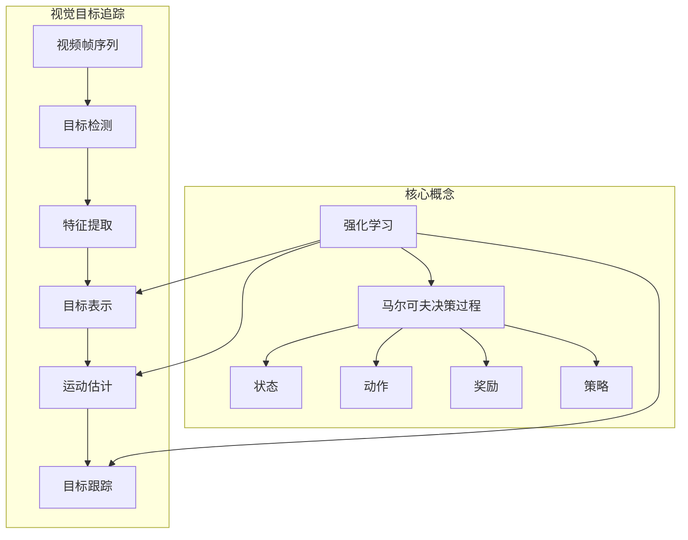

# 强化学习：在视觉目标追踪领域的应用

## 1. 背景介绍

### 1.1 问题的由来

视觉目标追踪是计算机视觉领域的一个重要研究方向,其目标是在连续视频帧中自动检测、识别和跟踪感兴趣的目标对象。随着监控系统、人机交互、增强现实等应用的快速发展,视觉目标追踪技术在无人驾驶、安防监控、人机交互等领域发挥着越来越重要的作用。

然而,由于目标出现形变、遮挡、光照变化、背景杂乱等因素的影响,实现鲁棒、精确的视觉目标追踪一直是该领域的一大挑战。传统的基于相关滤波、均值漂移等方法虽然在特定场景下表现不错,但难以适应复杂多变的实际环境。因此,需要探索新的视觉目标追踪范式来解决这一难题。

### 1.2 研究现状

近年来,随着深度学习技术在计算机视觉领域的广泛应用,基于深度神经网络的目标追踪算法取得了长足进展。这些方法通过利用大量标注数据对神经网络进行训练,能够自动学习目标的语义特征表示,显著提高了追踪的鲁棒性和精度。

与此同时,强化学习作为一种基于奖惩机制的有监督学习范式,也逐渐被引入视觉目标追踪任务中。不同于监督学习需要大量标注数据,强化学习通过与环境的交互来获取经验,可以在无监督或少量监督的情况下学习最优策略。这使得强化学习在视觉目标追踪领域展现出巨大的潜力。

### 1.3 研究意义

将强化学习引入视觉目标追踪任务,可以有效解决以下几个问题:

1. **数据标注成本高**。传统的监督学习方法需要大量人工标注数据,耗时耗力且难以覆盖所有情况。强化学习可在无监督或少量监督的情况下学习,降低数据标注成本。

2. **环境复杂多变**。实际场景中,目标可能出现形变、遮挡、背景干扰等复杂情况,难以事先构建统一模型。强化学习可根据环境在线调整策略,适应复杂多变环境。

3. **决策序列优化**。视觉目标追踪过程实际上是一个连续决策序列,需要根据当前状态作出最优响应。强化学习可通过奖惩机制优化整个决策序列。

综上所述,将强化学习引入视觉目标追踪任务有望突破传统方法的瓶颈,提升追踪的鲁棒性、精确性和适应性,对推动该领域的发展具有重要意义。

### 1.4 本文结构

本文将系统介绍强化学习在视觉目标追踪领域的应用。首先阐述核心概念与技术路线,然后详细分析核心算法原理和数学模型,并结合实际代码实例给出解释说明。接下来探讨强化学习在视觉目标追踪领域的实际应用场景,并推荐相关工具和学习资源。最后总结该领域的发展趋势与面临的挑战,并对未来研究方向进行展望。

## 2. 核心概念与联系

上图展示了强化学习与视觉目标追踪任务之间的关系。

- **强化学习**是一种基于奖惩机制的有监督学习范式,通过与环境交互来学习最优策略。其核心概念包括:
  - **马尔可夫决策过程(MDP)**: 用于描述决策序列问题的数学框架。
  - **状态**: 描述系统当前所处的环境状态。
  - **动作**: 智能体根据当前状态可执行的操作。
  - **奖励**: 对智能体执行动作的反馈,用于指导策略优化。
  - **策略**: 智能体根据当前状态选择动作的策略。

- **视觉目标追踪**旨在在连续视频帧中检测、识别并持续跟踪感兴趣的目标对象,包括以下关键步骤:
  - **目标检测**: 在单个视频帧中检测感兴趣目标的位置。 
  - **特征提取**: 提取目标的视觉特征表示,如HOG、SIFT等手工特征或基于CNN的深度特征。
  - **目标表示**: 根据提取的特征构建目标的表示模型。
  - **运动估计**: 估计目标在相邻帧之间的运动状态。
  - **目标跟踪**: 将检测结果和运动估计结合,实现目标的持续跟踪。

强化学习可以与视觉目标追踪任务紧密结合:

- 将目标追踪过程建模为马尔可夫决策过程,其中状态可由目标表示和上下文信息构成,动作为调整目标位置和尺度等追踪操作。
- 通过设计合理的奖励函数,根据追踪质量对智能体的操作给予反馈,引导策略朝着最优方向优化。
- 基于强化学习算法(如Q-Learning、策略梯度等)学习最优的目标追踪策略,自适应调整追踪框位置、尺度等参数。

将强化学习引入视觉目标追踪任务,能够有效应对目标形变、遮挡、背景干扰等复杂情况,提高追踪的鲁棒性和适应性。同时,无需大量标注数据,可在线持续优化决策序列,从而降低数据成本、提高追踪精度。

## 3. 核心算法原理与具体操作步骤

### 3.1 算法原理概述

基于强化学习的视觉目标追踪算法通常遵循以下原理:将目标追踪过程建模为马尔可夫决策过程,智能体(追踪器)与环境(视频序列)进行交互,根据当前状态执行追踪操作(动作),并获得相应的奖励反馈,目标是学习一个最优的追踪策略,使得在整个视频序列上的累积奖励最大化。

具体来说,算法主要包括以下几个核心组件:

1. **状态空间(State Space)**: 描述当前追踪状态的特征,通常包括目标表示(如目标框位置、尺度、特征等)和上下文信息(如背景特征等)。

2. **动作空间(Action Space)**: 定义智能体可执行的追踪操作,如调整目标框位置、尺度、更新目标表示等。

3. **奖励函数(Reward Function)**: 根据追踪质量(如与Ground Truth的重叠程度、目标特征一致性等)为智能体的追踪动作给出奖惩反馈。

4. **策略模型(Policy Model)**: 根据当前状态输出对应的追踪动作,通常使用深度神经网络或强化学习算法(如Q-Learning、策略梯度等)进行建模和优化。

5. **环境模拟器(Environment Simulator)**: 模拟视频序列,提供当前状态并根据智能体的动作更新下一状态。

在训练过程中,智能体与环境交互并根据奖励函数进行策略优化,目标是学习一个使累积奖励最大化的最优追踪策略。测试阶段则直接执行学习到的最优策略进行目标追踪。

### 3.2 算法步骤详解

基于强化学习的视觉目标追踪算法的具体执行步骤如下:

1. **初始化**
   - 构建状态空间、动作空间和奖励函数
   - 初始化策略模型(如随机初始化神经网络权重)
   - 给定初始状态(如第一帧的目标位置)

2. **交互环节**
   - 智能体根据当前状态,从策略模型输出追踪动作
   - 环境模拟器执行该动作,获取下一状态和奖励值
   - 存储(当前状态,动作,下一状态,奖励)作为经验样本

3. **策略优化**
   - 根据强化学习算法(如Q-Learning、策略梯度等)使用经验样本更新策略模型
   - 目标是最大化累积奖励(如最小化与Ground Truth的偏差)

4. **迭代优化**
   - 重复步骤2-3,不断优化策略模型
   - 直至达到终止条件(如训练轮次上限、奖励收敛等)

5. **目标追踪**
   - 使用学习到的最优策略模型
   - 在测试视频序列上执行目标追踪

需要注意的是,上述算法流程是一种通用范式,不同的具体算法在细节上可能有所差异,如使用不同的策略优化算法(Q-Learning、策略梯度等)、引入注意力机制、多尺度特征融合等。

### 3.3 算法优缺点

基于强化学习的视觉目标追踪算法相比传统方法具有以下优势:

- **无需大量标注数据**。传统监督学习方法需要大量人工标注数据,而强化学习可在无监督或少量监督的情况下通过与环境交互进行策略学习。

- **适应复杂多变环境**。通过与环境持续交互并根据奖励反馈调整策略,能够自适应应对目标形变、遮挡、背景干扰等复杂情况。

- **优化整个决策序列**。将目标追踪过程建模为马尔可夫决策过程,通过奖惩机制优化整个追踪决策序列,而非独立优化每一步。

- **灵活的策略表示**。可使用深度神经网络等强大的函数近似器对复杂的策略进行建模,提高策略的表达能力。

但同时,该类算法也存在一些需要关注的缺陷:

- **样本利用效率低**。由于需要大量与环境交互采样,样本利用效率较低,训练过程计算代价较大。

- **奖励函数设计困难**。合理设计奖励函数对算法性能至关重要,但在视觉目标追踪任务中很难手工设计出高质量的奖励函数。

- **收敛性能不稳定**。强化学习算法的收敛性能往往不稳定,很容易陷入次优解或发散,需要精心设计探索与利用的平衡策略。

- **泛化能力有限**。由于训练过程高度依赖于特定的环境模拟器,算法在新的环境下的泛化能力可能受到限制。

### 3.4 算法应用领域

基于强化学习的视觉目标追踪算法由于其自适应性和鲁棒性优势,在以下领域展现出广阔的应用前景:

- **无人驾驶**:准确跟踪行人、车辆、障碍物等目标,为自动驾驶决策提供重要依据。

- **机器人导航**:实时追踪感兴趣目标,指导机器人的运动控制和路径规划。

- **增强现实(AR)**:持续跟踪真实场景中的目标,为虚拟物体的渲染提供空间位置信息。

- **视频分析**:跟踪监控视频中的可疑目标,用于智能安防、行为分析等应用。

- **人机交互**:通过追踪人体关键点,实现手势识别、动作捕捉等自然交互方式。

- **生物医学**:在医学影像中追踪病灶、器官等目标,为诊断和手术规划提供支持。

此外,该类算法还可应用于无人机航拍、体育比赛分析、目标重识别等诸多领域。总的来说,基于强化学习的视觉目标追踪算法具有广阔的应用前景,将为众多领域带来革命性的影响。

## 4. 数学模型和公式详细讲解与举例说明

### 4.1 数学模型构建

将视觉目标追踪任务建模为马尔可夫决策过程(MDP),可以用