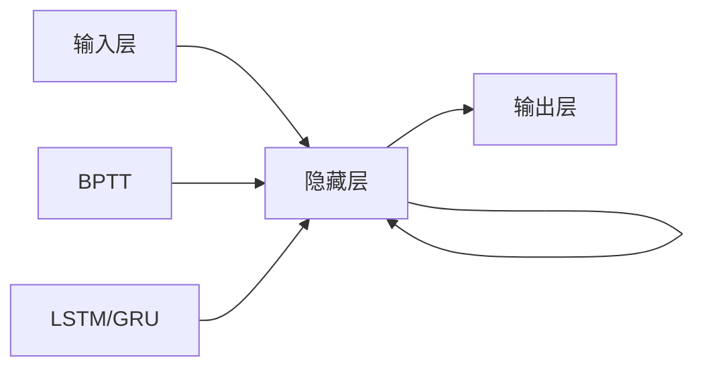

# 循环神经网络 (RNN) 原理与代码实例讲解

关键词：循环神经网络、RNN、时序数据、BPTT、LSTM、GRU、自然语言处理、语音识别

## 1. 背景介绍
### 1.1  问题的由来
在现实世界中,许多数据都是时序数据,即数据之间存在时间上的相关性和顺序关系。传统的前馈神经网络难以有效处理此类数据,因为它们无法捕捉数据之间的时序依赖关系。循环神经网络(Recurrent Neural Network, RNN)应运而生,它通过引入循环连接,使当前时刻的输出不仅取决于当前时刻的输入,还取决于之前时刻的状态,从而能够处理时序数据。

### 1.2  研究现状 
RNN自提出以来,在自然语言处理、语音识别、时间序列预测等领域取得了广泛的应用和巨大的成功。针对RNN训练过程中存在的梯度消失和梯度爆炸问题,研究者们提出了长短期记忆网络(LSTM)和门控循环单元(GRU)等改进模型。近年来,RNN与注意力机制、记忆网络等技术的结合,进一步提升了RNN处理长序列数据的能力。

### 1.3  研究意义
深入理解RNN的原理,掌握RNN的实现方法,对于从事AI领域的研究者和工程师来说至关重要。RNN是许多高级神经网络模型的基础,如序列到序列模型、注意力机制等。因此,学习RNN不仅能够解决实际问题,还为进一步学习更复杂的模型打下坚实基础。

### 1.4  本文结构
本文将从以下几个方面对RNN进行详细阐述:第2部分介绍RNN的核心概念;第3部分讲解RNN的核心算法原理和具体操作步骤;第4部分给出RNN的数学模型和公式推导过程;第5部分通过代码实例演示RNN的实现;第6部分介绍RNN的实际应用场景;第7部分推荐RNN相关的学习资源;第8部分对全文进行总结并展望RNN的未来发展方向;第9部分列出RNN相关的常见问题解答。

## 2. 核心概念与联系
RNN是一类用于处理序列数据的神经网络模型。与前馈神经网络不同,RNN引入了循环机制,使当前时刻的输出不仅取决于当前时刻的输入,还取决于之前时刻的状态。这种循环连接赋予了RNN记忆能力,使其能够捕捉数据中的时序关系。

RNN主要由三个部分组成:输入层、隐藏层和输出层。其中,隐藏层起到关键作用,它在不同时刻共享参数,并将前一时刻的状态传递给当前时刻,形成了循环连接。通过这种循环机制,RNN能够在序列的不同位置共享参数,从而减少了参数数量,提高了模型的泛化能力。

在训练RNN时,主要采用随时间反向传播算法(Backpropagation Through Time, BPTT)。BPTT本质上是将循环网络按时间展开,转化为一个超长的前馈网络,然后应用标准的反向传播算法进行训练。然而,由于梯度在很长的序列上传播时会出现梯度消失或梯度爆炸问题,因此常常需要对模型进行改进,如采用LSTM或GRU等变种模型。

下图展示了RNN的核心概念之间的联系:

## 3. 核心算法原理 & 具体操作步骤
### 3.1  算法原理概述
RNN的核心是隐藏层的循环连接。在每个时刻t,隐藏层的状态$h_t$不仅取决于当前时刻的输入$x_t$,还取决于上一时刻的隐藏状态$h_{t-1}$。数学表达式如下:

$$h_t = f(Ux_t + Wh_{t-1} + b)$$

其中,$U$是输入到隐藏状态的权重矩阵,$W$是隐藏状态到隐藏状态的权重矩阵,$b$是偏置项,$f$是激活函数(通常为tanh或ReLU)。

输出层的计算与传统神经网络类似,将隐藏状态$h_t$通过权重矩阵$V$映射到输出$y_t$:

$$y_t = g(Vh_t + c)$$

其中,$g$通常为softmax函数(用于多分类)或恒等函数(用于回归)。

### 3.2  算法步骤详解
RNN的前向传播和反向传播步骤如下:

1. 前向传播:
   - 初始化隐藏状态$h_0$为零向量。
   - 对于每个时刻$t=1,2,...,T$:
     - 根据公式$h_t = f(Ux_t + Wh_{t-1} + b)$计算隐藏状态$h_t$。
     - 根据公式$y_t = g(Vh_t + c)$计算输出$y_t$。
   - 计算损失函数$L$,如交叉熵损失或均方误差损失。

2. 反向传播:
   - 对于每个时刻$t=T,T-1,...,1$:
     - 计算损失函数$L$对输出$y_t$的梯度$\frac{\partial L}{\partial y_t}$。
     - 计算损失函数$L$对隐藏状态$h_t$的梯度$\frac{\partial L}{\partial h_t}$。
     - 根据BPTT算法,计算$\frac{\partial L}{\partial h_t}$对$h_{t-1}$、$U$、$W$、$b$的梯度。
   - 根据梯度下降法更新参数$U$、$W$、$b$、$V$、$c$。

### 3.3  算法优缺点
RNN的优点包括:
- 能够处理任意长度的序列数据。
- 通过参数共享,减少了参数数量,提高了模型的泛化能力。
- 能够捕捉数据中的长距离依赖关系。

RNN的缺点包括:  
- 训练过程中容易出现梯度消失和梯度爆炸问题,导致模型难以训练。
- 对长序列的建模能力有限,难以捕捉非常长距离的依赖关系。
- 训练速度较慢,计算复杂度较高。

### 3.4  算法应用领域
RNN广泛应用于以下领域:
- 自然语言处理:语言模型、机器翻译、情感分析、文本生成等。
- 语音识别:声学模型、语言模型等。
- 时间序列预测:股票预测、天气预测、销量预测等。
- 图像描述:根据图像生成自然语言描述。
- 手写识别:将手写文字转换为计算机可编辑的文本。

## 4. 数学模型和公式 & 详细讲解 & 举例说明
### 4.1  数学模型构建
RNN的数学模型可以用下面的公式表示:

- 隐藏状态的计算:
$$h_t = f(Ux_t + Wh_{t-1} + b)$$

- 输出的计算:  
$$y_t = g(Vh_t + c)$$

- 损失函数的计算(以交叉熵损失为例):
$$L = -\sum_{t=1}^{T} \sum_{k=1}^{K} y_{tk} \log \hat{y}_{tk}$$

其中,$y_{tk}$是真实标签(one-hot向量),$\hat{y}_{tk}$是模型预测的概率分布,$K$是类别数。

### 4.2  公式推导过程
以下是BPTT算法中关键梯度的推导过程:

1. 损失函数对输出的梯度:
$$\frac{\partial L}{\partial \hat{y}_{tk}} = -\frac{y_{tk}}{\hat{y}_{tk}}$$

2. 输出对隐藏状态的梯度:
$$\frac{\partial \hat{y}_{tk}}{\partial h_t} = \hat{y}_{tk}(1-\hat{y}_{tk})v_k$$

其中,$v_k$是矩阵$V$的第$k$列。

3. 隐藏状态对上一时刻隐藏状态的梯度:
$$\frac{\partial h_t}{\partial h_{t-1}} = diag(f'(Ux_t + Wh_{t-1} + b))W$$

其中,$diag(·)$表示将向量转换为对角矩阵,$f'$是激活函数的导数。

4. 隐藏状态对参数的梯度:
$$\frac{\partial h_t}{\partial U} = diag(f'(Ux_t + Wh_{t-1} + b))x_t^T$$
$$\frac{\partial h_t}{\partial W} = diag(f'(Ux_t + Wh_{t-1} + b))h_{t-1}^T$$
$$\frac{\partial h_t}{\partial b} = f'(Ux_t + Wh_{t-1} + b)$$

根据链式法则,可以计算损失函数对各个参数的梯度,并用梯度下降法更新参数。

### 4.3  案例分析与讲解
下面以一个简单的示例来说明RNN的前向传播和反向传播过程。假设我们有一个序列$x=[x_1,x_2,x_3]$,每个$x_t$是一个二维向量。模型的隐藏状态维度为3,输出维度为2。模型参数如下:

$$U=\begin{bmatrix} 0.1 & 0.2 \\ 0.3 & 0.4 \\ 0.5 & 0.6 \end{bmatrix}, W=\begin{bmatrix} 0.7 & 0.8 & 0.9 \\ 1.0 & 1.1 & 1.2 \\ 1.3 & 1.4 & 1.5\end{bmatrix}, b=\begin{bmatrix}0.1 \\ 0.2 \\ 0.3\end{bmatrix}$$
$$V=\begin{bmatrix}1.6 & 1.7 & 1.8 \\ 1.9 & 2.0 & 2.1\end{bmatrix}, c=\begin{bmatrix}0.4 \\ 0.5\end{bmatrix}$$

激活函数$f$为tanh函数,输出函数$g$为softmax函数。真实标签为$y=[y_1,y_2,y_3]$,其中$y_1=[1,0]$,$y_2=[0,1]$,$y_3=[1,0]$。

在前向传播中,我们首先计算隐藏状态:
$$h_1 = tanh(Ux_1 + b) = \begin{bmatrix}0.83 \\ 0.91 \\ 0.95\end{bmatrix}$$
$$h_2 = tanh(Ux_2 + Wh_1 + b) = \begin{bmatrix}0.97 \\ 0.99 \\ 1.00\end{bmatrix}$$
$$h_3 = tanh(Ux_3 + Wh_2 + b) = \begin{bmatrix}0.99 \\ 1.00 \\ 1.00\end{bmatrix}$$

然后计算输出:
$$\hat{y}_1 = softmax(Vh_1 + c) = \begin{bmatrix}0.65 \\ 0.35\end{bmatrix}$$
$$\hat{y}_2 = softmax(Vh_2 + c) = \begin{bmatrix}0.38 \\ 0.62\end{bmatrix}$$
$$\hat{y}_3 = softmax(Vh_3 + c) = \begin{bmatrix}0.35 \\ 0.65\end{bmatrix}$$

最后计算损失函数:
$$L = -\sum_{t=1}^{3} \sum_{k=1}^{2} y_{tk} \log \hat{y}_{tk} = 1.19$$

在反向传播中,我们首先计算损失函数对输出的梯度:
$$\frac{\partial L}{\partial \hat{y}_1} = \begin{bmatrix}-1.54 \\ 0.00\end{bmatrix}, \frac{\partial L}{\partial \hat{y}_2} = \begin{bmatrix}0.00 \\ -1.61\end{bmatrix}, \frac{\partial L}{\partial \hat{y}_3} = \begin{bmatrix}-2.86 \\ 0.00\end{bmatrix}$$

然后计算输出对隐藏状态的梯度,以及隐藏状态对上一时刻隐藏状态和参数的梯度,并用梯度下降法更新参数。限于篇幅,这里不再详细展开。

### 4.4  常见问题解答
1. 