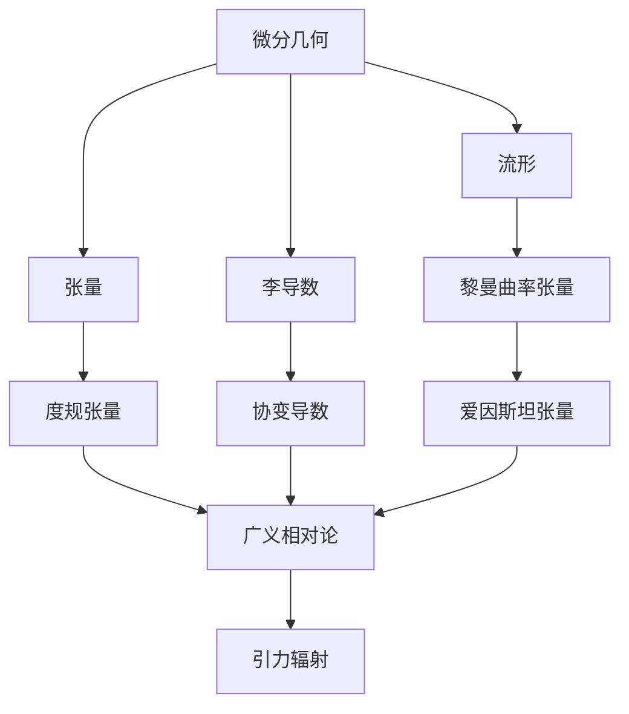
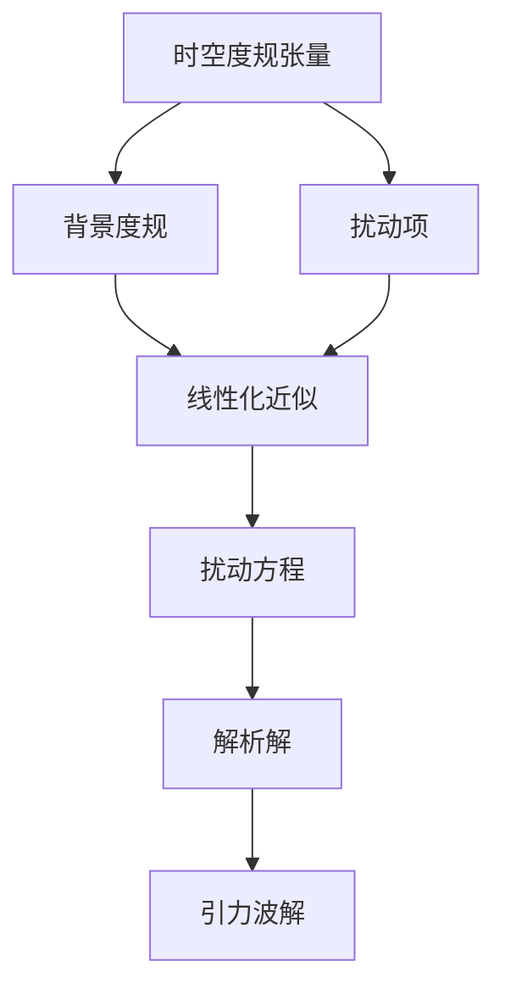

# 微分几何入门与广义相对论：引力辐射

## 1. 背景介绍

### 1.1 问题的由来

自古以来，人类对宇宙的奥秘充满了无尽的好奇与探索欲望。从牛顿万有引力定律到爱因斯坦广义相对论的诞生,我们对于宇宙的理解不断加深。然而,广义相对论所描述的是一个理想化的真空宇宙,而实际上宇宙中存在着各种复杂的物质和辐射场。因此,研究引力场与辐射场之间的相互作用,成为了探索宇宙本质的关键课题。

### 1.2 研究现状

近年来,随着观测技术的不断进步,人类对于引力波的探测也取得了重大突破。2015年,激光干涉仪引力波天文台(LIGO)首次直接探测到了两个黑洞并合产生的引力波信号,标志着引力波天文学时代的到来。然而,我们对于引力波的产生机制、传播特性以及与其他辐射场的相互作用等问题仍有许多未解之谜。

### 1.3 研究意义

深入研究引力辐射理论不仅有助于我们揭示广义相对论的本质,更有助于解开宇宙起源、黑洞、中子星等重大科学难题的谜团。同时,引力波探测技术的发展也为我们提供了一种全新的"望远镜",让我们能够更深入地观测和探索宇宙奥秘。

### 1.4 本文结构

本文将首先介绍微分几何和广义相对论的基本概念,然后深入探讨引力辐射的数学模型和理论框架。接下来,我们将详细阐述引力辐射的核心算法原理和具体计算步骤,并通过实例和代码实现加深理解。最后,我们将讨论引力辐射在实际应用中的场景,以及未来的发展趋势和挑战。

## 2. 核心概念与联系

微分几何为广义相对论和引力辐射奠定了坚实的数学基础。流形(Manifold)是一种抽象的几何概念,描述了时空的本质结构。张量(Tensor)则是一种几何对象,用于表示物理量在不同坐标系下的变换规律。李导数(Lie Derivative)和协变导数(Covariant Derivative)是描述张量在流形上的变化和微分的重要工具。

黎曼曲率张量(Riemann Curvature Tensor)描述了流形的内在曲率,是广义相对论中的核心概念之一。度规张量(Metric Tensor)则定义了时空的度量关系,决定了时间和空间的性质。爱因斯坦张量(Einstein Tensor)是广义相对论中的另一个关键张量,它描述了物质和能量对时空的曲率影响。

广义相对论将引力视为时空曲率的现象,通过爱因斯坦场方程将物质和能量与时空几何联系起来。引力辐射理论则进一步研究了引力场在真空中的传播行为,描述了引力波的产生、传播和探测等问题。

## 3. 核心算法原理 & 具体操作步骤

### 3.1 算法原理概述

引力辐射的核心算法原理是基于广义相对论中的扰动理论。我们将时空度规张量分解为背景度规和扰动项,并在线性化近似下求解扰动方程,从而获得引力波的解析解。

### 3.2 算法步骤详解

1. **选择背景度规**：首先,我们需要选择一个合适的背景度规,通常是平直或弱场近似下的度规。

2. **构造扰动项**：将时空度规张量分解为背景度规和扰动项,扰动项描述了引力波的微小振荡。

3. **线性化近似**：在弱场近似下,我们可以忽略扰动项的高阶项,从而将扰动方程线性化。

4. **求解扰动方程**：应用适当的边界条件和坐标系,求解线性化的扰动方程,获得扰动项的解析解。

5. **重构度规张量**：将背景度规和扰动项的解析解合并,重构出完整的时空度规张量。

6. **提取引力波解**：从重构的度规张量中提取出描述引力波的项,即为引力波的解析解。

在实际计算过程中,我们通常采用特定的坐标系和规范条件来简化计算。同时,也需要考虑边界条件和初始条件等因素,以确保解的唯一性和物理意义。

### 3.3 算法优缺点

**优点**:

- 理论基础坚实,源于广义相对论的基本原理。
- 计算过程清晰,具有良好的数学严谨性。
- 能够获得引力波的解析解,便于深入分析和理解。

**缺点**:

- 仅适用于弱场近似情况,无法描述强引力场的情况。
- 计算过程复杂,需要熟练掌握张量分析和微分几何知识。
- 解析解的形式可能过于复杂,难以直观理解物理意义。

### 3.4 算法应用领域

引力辐射算法广泛应用于以下领域:

- **理论物理**:用于研究黑洞、中子星等强引力天体的辐射特性。
- **数值相对论**:为数值模拟提供理论基础和初始边界条件。
- **引力波探测**:预测和分析引力波信号的形态和特征。
- **早期宇宙研究**:探索宇宙大爆炸和inflation理论等。

## 4. 数学模型和公式 & 详细讲解 & 举例说明

### 4.1 数学模型构建

在构建引力辐射的数学模型时,我们需要从广义相对论的基本原理出发。爱因斯坦场方程是整个理论的核心,它将时空几何与物质和能量联系起来:

$$
R_{\mu\nu} - \frac{1}{2}g_{\mu\nu}R = \frac{8\pi G}{c^4}T_{\mu\nu}
$$

其中,$$R_{\mu\nu}$$是黎曼曲率张量,$$g_{\mu\nu}$$是度规张量,$$R$$是黎曼曲率张量的迹,$$T_{\mu\nu}$$是能量动量张量,$$G$$是牛顿常数,$$c$$是光速。

为了描述引力波的传播,我们需要在真空情况下求解爱因斯坦场方程。这意味着能量动量张量$$T_{\mu\nu}=0$$,从而得到真空爱因斯坦场方程:

$$
R_{\mu\nu} = 0
$$

我们将度规张量$$g_{\mu\nu}$$分解为背景度规$$\eta_{\mu\nu}$$和扰动项$$h_{\mu\nu}$$:

$$
g_{\mu\nu} = \eta_{\mu\nu} + h_{\mu\nu}
$$

将上式代入真空爱因斯坦场方程,并在线性化近似下忽略高阶项,我们可以得到扰动方程:

$$
\Box h_{\mu\nu} = 0
$$

其中,$$\Box$$是波算子,描述了扰动项在背景度规下的波动行为。

### 4.2 公式推导过程

为了更好地理解引力辐射的数学模型,我们来详细推导一下扰动方程的具体形式。

首先,我们定义黎曼曲率张量$$R_{\mu\nu\rho\sigma}$$:

$$
R_{\mu\nu\rho\sigma} = \partial_\rho\Gamma_{\mu\nu\sigma} - \partial_\sigma\Gamma_{\mu\nu\rho} + \Gamma_{\mu\lambda\rho}\Gamma_{\nu\sigma}^\lambda - \Gamma_{\mu\lambda\sigma}\Gamma_{\nu\rho}^\lambda
$$

其中,$$\Gamma_{\mu\nu\rho}$$是引力系数(Christoffel Symbols),描述了度规张量的微分关系。

将度规张量$$g_{\mu\nu}$$分解为背景度规$$\eta_{\mu\nu}$$和扰动项$$h_{\mu\nu}$$后,我们可以得到引力系数的线性化表达式:

$$
\Gamma_{\mu\nu\rho} = \frac{1}{2}\eta^{\lambda\sigma}(\partial_\mu h_{\nu\sigma} + \partial_\nu h_{\mu\sigma} - \partial_\sigma h_{\mu\nu})
$$

代入黎曼曲率张量的定义,并在线性化近似下忽略高阶项,我们可以得到:

$$
R_{\mu\nu\rho\sigma} = \frac{1}{2}(\partial_\rho\partial_\nu h_{\mu\sigma} + \partial_\rho\partial_\sigma h_{\mu\nu} - \partial_\mu\partial_\nu h_{\rho\sigma} - \partial_\mu\partial_\sigma h_{\rho\nu})
$$

进一步对$$R_{\mu\nu\rho\sigma}$$做张量算子操作,我们可以得到扰动方程的最终形式:

$$
\Box h_{\mu\nu} = \eta^{\rho\sigma}\partial_\rho\partial_\sigma h_{\mu\nu} = 0
$$

这就是著名的Einstein's Field Equations of Linearized Gravity,描述了引力波在真空中的传播行为。

### 4.3 案例分析与讲解

为了更直观地理解引力辐射的数学模型,我们来分析一个具体的案例。

假设我们考虑一个平面单频引力波,它在$$z$$方向传播,并且只有$$+$$和$$\times$$两种极化模式。我们可以选择一个合适的横轴规范(Transverse Traceless Gauge),使得扰动项$$h_{\mu\nu}$$只有以下四个非零分量:

$$
h_{xx} = -h_{yy} = A_+\cos(kz-\omega t)\\
h_{xy} = h_{yx} = A_\times\sin(kz-\omega t)
$$

其中,$$A_+$$和$$A_\times$$分别表示$$+$$和$$\times$$极化模式的振幅,$$k$$是波矢,$$\omega$$是角频率。

将上述扰动项代入扰动方程,我们可以验证它们确实满足波动方程:

$$
\Box h_{\mu\nu} = \eta^{\rho\sigma}\partial_\rho\partial_\sigma h_{\mu\nu} = 0
$$

这意味着,上述扰动项描述了一个合法的平面单频引力波解。

我们可以进一步分析这个解的物理意义。由于$$h_{xx}$$和$$h_{yy}$$的符号相反,因此沿$$x$$和$$y$$方向会产生周期性的伸缩效应。而$$h_{xy}$$和$$h_{yx}$$则描述了沿$$xy$$方向的剪切效应。这种周期性的伸缩和剪切,就是引力波传播时对空间产生的"扰动"。

通过这个简单的案例,我们可以直观地感受到引力辐射数学模型所描述的物理图景。同时,也体现了引力波传播的一些基本特征,如横向性、无质量性等。

### 4.4 常见问题解答

**Q1: 为什么要引入扰动项?**

A1: 引入扰动项是为了将时空度规张量分解为背景部分和微扰部分。这种分解方式使得我们能够在弱场近似下线性化方程,从而获得解析解。如果直接求解完整的非线性爱因斯坦场方程,将会遇到极大的数学困难。

**Q2: 为什么要选择特定的坐标系和规范?**

A2: 选择合适的坐标系和规范条件可以大幅简化计算过程。例如,在横轴规范下,扰动项的形式会变得更加简洁,从而方便求解。不同的坐标系和规范对应着不同的物理图景,因此需要根据具体问题来选择。

**Q3: 引力波是如何被探测到的?**

A3:引力波的探测主要依赖于干涉仪原理。当引力波通过探测器时,会引起装置两臂长度