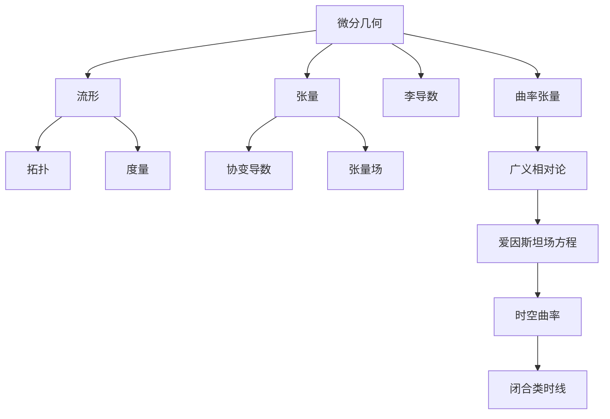

# 微分几何入门与广义相对论：闭合类时线

## 1. 背景介绍

### 1.1 问题的由来

在广义相对论中，时空的几何结构由物质分布决定。爱因斯坦的场方程描述了这种关系，将时空的曲率与物质和能量的分布联系起来。然而,在某些极端情况下,这个理论会遇到奇异性和不确定性的问题。其中之一就是闭合类时线(Closed Timelike Curves, CTCs)的出现。

闭合类时线是指在某些解决方案中,时空的几何结构允许一个物体沿着一条闭合的时间曲线运动,从而回到自己的过去。这种现象违背了因果律,并可能导致各种逻辑悖论和理论上的困难。

### 1.2 研究现状

虽然广义相对论的基本原理已经被广泛接受,但对于闭合类时线的存在及其物理意义,科学界仍存在激烈的争论。一些科学家认为,闭合类时线只是数学上的奇点,在物理现实中不可能出现。另一些人则认为,它们可能确实存在于某些极端的引力场中,如黑洞或宇宙大爆炸的奇点附近。

目前,理论物理学家们正在努力发展一种可以自洽地描述量子引力效应的理论,希望能够解决这一困境。但是,由于缺乏实验数据和观测证据,这个问题仍然存在很大的不确定性。

### 1.3 研究意义

探索闭合类时线的存在及其物理意义,不仅对于完善广义相对论理论具有重要意义,而且对于我们对时空本质的理解也有深远影响。如果闭合类时线确实存在,它将彻底改变我们对因果律和时间流逝的传统观念。

此外,研究闭合类时线也可能为解决一些基本物理学难题提供新的思路,如量子力学与广义相对论的统一、奇点的本质等。因此,这一领域的研究不仅具有理论价值,而且可能对未来的科技发展产生深远影响。

### 1.4 本文结构

本文将从微分几何的角度出发,介绍闭合类时线的基本概念和数学描述。接下来,我们将探讨广义相对论中出现闭合类时线的一些典型解,并分析它们的物理意义。然后,文章将讨论闭合类时线可能带来的一些逻辑悖论和理论困难,以及科学家们为解决这些问题所做的努力。最后,我们将展望闭合类时线研究的未来发展方向,并讨论它对基本物理学和科技发展的潜在影响。

## 2. 核心概念与联系

在探讨闭合类时线之前,我们需要先了解一些微分几何和广义相对论的基本概念。

微分几何是研究流形(Manifold)上的几何对象和结构的数学分支。一个流形是一种拓扑空间,在局部上类似于欧几里得空间,但在整体上可能具有更复杂的几何结构。

在流形上,我们可以定义张量(Tensor)这种几何对象,它是一种可以在不同坐标系之间转换的多线性函数。张量场(Tensor Field)是在流形上定义的张量值函数。

李导数(Lie Derivative)是微分几何中一种重要的微分算子,用于描述张量场沿着某个向量场的变化率。而曲率张量(Curvature Tensor)则描述了流形的内在曲率,是区分流形是否为欧几里得空间的关键量。

广义相对论将微分几何的概念应用于时空,将时空看作是一个四维的流形,其几何结构由物质和能量的分布决定。爱因斯坦场方程描述了时空曲率与物质能量张量之间的关系。在某些解下,时空的曲率可能导致闭合类时线的出现。

因此,闭合类时线的概念源于微分几何和广义相对论的相互结合,是时空几何结构的一种特殊表现形式。它不仅具有重要的理论意义,而且可能对我们对时间本质的理解产生深远影响。

## 3. 核心算法原理 & 具体操作步骤

### 3.1 算法原理概述

在广义相对论中,时空的几何结构由爱因斯坦场方程决定。这个方程将时空的曲率张量与物质和能量的分布联系起来。具体来说,它可以写成如下形式:

$$
R_{\mu\nu} - \frac{1}{2}g_{\mu\nu}R = \frac{8\pi G}{c^4}T_{\mu\nu}
$$

其中,左边是描述时空曲率的Einstein张量,右边是物质能量张量。这个方程表明,时空的曲率不仅取决于物质分布,也受到时空本身的影响。

为了解决这个耦合的非线性方程,我们需要引入一些近似和简化。一种常用的方法是假设时空具有某种对称性,从而简化计算。例如,对于球对称的情况,我们可以使用Schwarzschild度规来描述时空几何。

在得到解析解或数值解之后,我们需要检查解的性质,看是否存在闭合类时线。一种常用的方法是研究时间曲线的行为,尤其是它们是否会自交。如果存在这样的闭合时间曲线,就意味着物体可以回到自己的过去,从而导致逻辑悖论。

### 3.2 算法步骤详解

1. **建立物理模型**:根据具体的物理场景,选择合适的对称性和边界条件,建立描述时空几何的度规形式。

2. **求解爱因斯坦场方程**:将所选的度规代入爱因斯坦场方程,并结合已知的物质能量分布,求解这个耦合的非线性偏微分方程。可以使用分离变量、级数展开等数学技巧寻找解析解,或者采用数值计算的方法。

3. **分析解的性质**:对得到的解进行分析,研究它描述的时空几何结构。关注一些特殊的时间曲线,尤其是那些可能形成闭合环的曲线。

4. **检测闭合类时线**:沿着可疑的时间曲线积分,看它们是否会自交,形成闭合环。如果存在这样的闭合时间曲线,就意味着该解包含了闭合类时线。

5. **分析物理意义**:对于包含闭合类时线的解,需要仔细分析它们的物理意义。这些解是否合理?是否存在内在的矛盾或悖论?是否只是数学上的奇点,在物理现实中不可能出现?

6. **探索解决方案**:如果闭合类时线带来了严重的理论困难,需要探索解决这一问题的方法。可能的方向包括修改理论本身、引入新的物理概念或者重新检视一些基本假设等。

需要注意的是,求解爱因斯坦场方程并非一件易事,尤其是在缺乏对称性的情况下。即使得到了解析解,分析其性质也可能是一个艰巨的数学挑战。因此,这个算法往往需要综合运用解析和数值方法,以及微分几何和广义相对论的深入知识。

### 3.3 算法优缺点

**优点**:

- 直接源自广义相对论的基本原理,具有坚实的理论基础。
- 能够精确描述时空的几何结构,包括可能出现的奇异性和病理性。
- 为研究闭合类时线及其物理意义提供了有力的数学工具。
- 可以与其他理论(如量子论)相结合,探索更深层次的问题。

**缺点**:

- 求解爱因斯坦场方程通常非常困难,尤其是在缺乏对称性的情况下。
- 即使得到解析解,分析其性质也可能是一个数学上的挑战。
- 目前还缺乏足够的实验和观测数据,难以验证理论预言。
- 可能需要修改或扩展现有理论,以解决一些根本性的困难(如量子引力问题)。

总的来说,虽然存在一些技术上的困难,但这种基于广义相对论的算法仍然是研究闭合类时线最有力和最基础的方法之一。随着计算能力的提高和新的数学工具的发展,我们有望在未来获得更多的洞见。

### 3.4 算法应用领域

研究闭合类时线及其物理意义,不仅对于完善广义相对论理论具有重要意义,而且对于我们对时空本质的理解也有深远影响。因此,这一算法的应用领域主要集中在基础物理学的前沿,包括但不限于:

1. **引力理论**:作为广义相对论的核心,探索时空几何结构的奇特性是该领域的重点研究方向之一。闭合类时线就是其中一个具有挑战性的课题。

2. **量子引力**:统一量子论和广义相对论,建立一种描述微观量子效应和宏观引力现象的完整理论,是当代理论物理学的终极目标。研究闭合类时线可能为此提供新的线索。

3. **宇宙学**:在极端的引力场中,如宇宙大爆炸奇点附近,闭合类时线可能会出现。探索这一问题有助于我们了解宇宙的起源和演化。

4. **黑洞物理学**:黑洞内部的奇异性可能导致闭合类时线的形成。研究这一现象不仅有助于解开黑洞的神秘面纱,也可能为量子引力理论提供线索。

5. **时间理论**:闭合类时线的存在将彻底改变我们对时间流逝和因果律的传统观念。探索这一课题有助于建立对时间本质的新认识。

6. **计算复杂性理论**:如果闭合类时线确实存在,它们可能被用于构建"时间机器",从而影响计算复杂性的理论基础。

总之,闭合类时线这一看似奇特的概念,实际上与基础物理学的许多前沿领域都有着密切的联系。深入研究它不仅具有重要的理论价值,而且可能为解决一些根本性的难题提供新的思路。

## 4. 数学模型和公式 & 详细讲解 & 举例说明

### 4.1 数学模型构建

在广义相对论中,时空被描述为一个四维流形,其几何结构由物质和能量的分布决定。我们可以使用一个对称的度规(Metric)来近似描述这种时空几何。

对于球对称的情况,我们可以使用Schwarzschild度规:

$$
ds^2 = -\left(1-\frac{2M}{r}\right)dt^2 + \left(1-\frac{2M}{r}\right)^{-1}dr^2 + r^2d\Omega^2
$$

其中$M$是中心物体的质量,$r$是径向坐标,$d\Omega^2$是单位球面上的线元。这个度规描述了一个静态、球对称的时空几何,在远离中心时趋近于平直的Minkowski时空。

为了研究是否存在闭合类时线,我们需要考虑时间曲线在这种时空中的行为。一条时间曲线可以用参数方程$x^\mu(\tau)$来描述,其中$\tau$是某种仿射参数。根据广义相对论的基本原理,这条曲线必须满足规范条件:

$$
g_{\mu\nu}\frac{dx^\mu}{d\tau}\frac{dx^\nu}{d\tau} = -1
$$

对于径向运动的情况,我们可以将时间曲线的方程简化为:

$$
\left(\frac{dr}{d\tau}\right)^2 = E^2 + \left(1-\frac{2M}{r}\right)\left(\frac{1}{1-\frac{2M}{r}}\right)
$$

其中$E$是运动的总能量。通过研究这个方程的解的性质,我们可以判