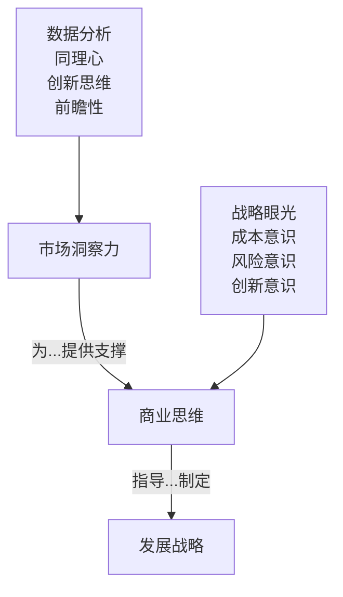
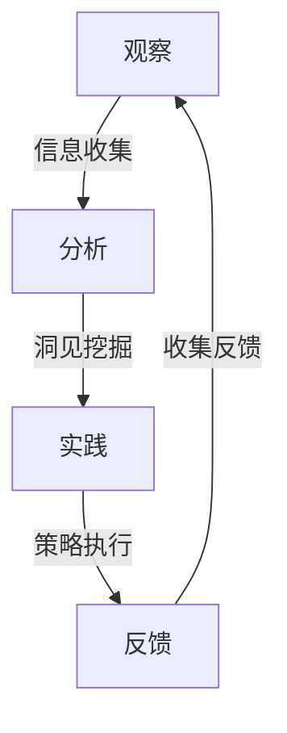

以下是根据您的要求撰写的技术博客文章正文：

# 怎样培养敏锐的市场洞察力和商业思维

## 1. 背景介绍

### 1.1 问题的由来

在当今瞬息万变的商业环境中，拥有敏锐的市场洞察力和商业思维是每个企业家和专业人士必备的核心竞争力。市场洞察力可以帮助我们深入了解客户需求、行业趋势和竞争格局,而商业思维则能够将这些洞见转化为可行的商业策略和创新方案。然而,培养这两种能力并非一蹴而就,需要长期的学习、实践和总结。

### 1.2 研究现状 

目前,市场上已经有许多关于市场洞察力和商业思维培养的书籍、课程和培训项目。但大多数资源要么过于理论化,缺乏实操指导,要么过于狭隘,只关注某一个行业或领域。因此,如何系统地培养通用的市场洞察力和商业思维能力,成为了一个亟待解决的问题。

### 1.3 研究意义

掌握市场洞察力和商业思维,不仅可以帮助企业制定更加精准的营销策略、开发符合市场需求的产品,还能够促进企业的持续创新,抓住新的商机。对于个人而言,这两种能力也是职业发展的重要资本,有助于提高竞争力、拓展事业版图。因此,研究如何有效培养市场洞察力和商业思维,具有重要的理论意义和实践价值。

### 1.4 本文结构

本文将从以下几个方面系统阐述如何培养敏锐的市场洞察力和商业思维:

1. 核心概念与联系
2. 培养市场洞察力的核心原理和步骤
3. 培养商业思维的数学模型和公式
4. 实战案例:如何将理论付诸实践
5. 常见问题解答和发展趋势探讨

## 2. 核心概念与联系

市场洞察力(Market Insight)和商业思维(Business Mindset)虽然是两个不同的概念,但它们之间存在着紧密的联系。

**市场洞察力**是指对市场趋势、客户需求、竞争格局等因素的深刻理解和洞见。它需要我们具备以下几种能力:

1. 数据分析能力:收集和分析相关市场数据
2. 同理心:站在客户角度思考和体验
3. 创新思维:发现市场新需求和新机遇 
4. 前瞻性:预判市场变化和发展趋势

**商业思维**则是指运用商业理念和方法来思考和解决问题的能力。它包括以下几个关键要素:

1. 战略眼光:从全局角度制定发展策略
2. 成本意识:精打细算,合理分配资源
3. 风险意识:评估风险,制定应对措施
4. 创新意识:不断创新,保持竞争优势

市场洞察力为商业思维提供了必要的市场信息和洞见支撑,而商业思维则将市场洞见转化为可执行的商业策略和行动方案。二者相辅相成,缺一不可。只有将两者结合,才能真正做到"内行"和"外行"兼修,制定出切合实际的发展战略。



## 3. 核心算法原理 & 具体操作步骤

### 3.1 算法原理概述

培养敏锐的市场洞察力和商业思维并非一蹴而就,需要系统的训练和长期的实践积累。这个过程可以借鉴"主动学习"(Active Learning)的算法思想,通过"观察-分析-实践-反馈"的循环迭代,不断优化和提升自身能力。

### 3.2 算法步骤详解

1. **观察**:主动关注市场动态,收集各种相关信息,包括行业新闻、客户反馈、竞品动向等。
2. **分析**:运用数据分析、前瞻性思考等能力,对收集到的信息进行深入解读和洞见挖掘。
3. **实践**:根据市场洞见制定商业策略,并付诸实施,在实践中检验策略的可行性。
4. **反馈**:跟踪策略实施效果,收集反馈信息,并将其纳入下一轮"观察"环节,循环迭代。



### 3.3 算法优缺点

**优点**:

- 符合认知规律,有利于持续学习
- 理论和实践相结合,更易内化吸收
- 循环迭代,不断优化和完善能力

**缺点**:

- 前期投入较大,需要耗费大量精力
- 需要较强的自我驱动力和坚持力
- 容易受外部环境和资源限制的影响

### 3.4 算法应用领域

"主动学习"算法不仅适用于培养市场洞察力和商业思维,也可以推广应用于其他能力的培养,如领导力、创新力、沟通能力等,具有广阔的应用前景。

## 4. 数学模型和公式 & 详细讲解 & 举例说明

### 4.1 数学模型构建

为了更好地量化和评估市场洞察力和商业思维的培养效果,我们可以构建一个数学模型。假设将市场洞察力和商业思维各细分为n个能力维度,用向量$\vec{x}$和$\vec{y}$表示:

$$\vec{x}=(x_1,x_2,...,x_n)^T$$
$$\vec{y}=(y_1,y_2,...,y_n)^T$$

其中,各维度能力值在0到1之间。令$\vec{w}$为各维度权重向量:

$$\vec{w}=(w_1,w_2,...,w_n)^T,\sum_{i=1}^n w_i=1$$

则市场洞察力综合得分为$f_x=\vec{w}^T\vec{x}$,商业思维综合得分为$f_y=\vec{w}^T\vec{y}$。

### 4.2 公式推导过程

我们的目标是最大化$f_x$和$f_y$的综合得分。由于市场洞察力和商业思维相辅相成,我们可以将二者的乘积作为目标函数:

$$\max F(x,y)=f_x \cdot f_y=(\vec{w}^T\vec{x})(\vec{w}^T\vec{y})$$

由于$0\le x_i,y_i\le 1$,所以$0\le f_x,f_y\le 1$,因此$0\le F(x,y)\le 1$。

将$f_x$和$f_y$代入,可得:

$$F(x,y)=\vec{w}^T\vec{x}\cdot\vec{w}^T\vec{y}=\vec{w}^T(\vec{x}\circ\vec{y})$$

其中$\circ$表示向量的元素乘积(Hadamard Product)。

于是,原问题可以等价转化为:

$$\max_{\vec{x},\vec{y}}\vec{w}^T(\vec{x}\circ\vec{y})$$
$$s.t.\quad 0\le x_i,y_i\le 1,i=1,2,...,n$$

这是一个线性规划问题,可以用单纯形法或内点法等算法求解。

### 4.3 案例分析与讲解

假设我们将市场洞察力和商业思维各划分为4个维度,权重向量为$\vec{w}=(0.3,0.2,0.3,0.2)^T$。通过一段时间的学习和实践,某人的能力值为:

$$\vec{x}=(0.7,0.6,0.5,0.8)^T$$
$$\vec{y}=(0.6,0.8,0.7,0.5)^T$$

代入公式,可求得:

$$f_x=\vec{w}^T\vec{x}=0.3\times 0.7+0.2\times 0.6+0.3\times 0.5+0.2\times 0.8=0.64$$
$$f_y=\vec{w}^T\vec{y}=0.3\times 0.6+0.2\times 0.8+0.3\times 0.7+0.2\times 0.5=0.66$$
$$F(x,y)=f_x\cdot f_y=0.64\times 0.66=0.4224$$

可见,该人的市场洞察力和商业思维综合得分均在0.6左右,二者的乘积为0.4224,距离最优值1还有一定差距,需要继续努力提升。

通过这个例子,我们可以清晰地看到数学模型在评估和量化培养效果方面的应用价值。

### 4.4 常见问题解答

**Q:** 为什么要将市场洞察力和商业思维细分为多个维度?

**A:** 将一个复杂的能力拆分为若干个维度,有利于更精准地定位和评估每个维度的培养情况,找出需要重点提升的方向。同时也便于分配学习资源,有的放矢。

**Q:** 各维度权重是如何确定的?

**A:** 维度权重的设定需要结合理论和实践经验,对各维度重要程度进行主观打分。也可以通过数据分析,对成功案例中各维度的作用大小进行回归分析,得到更加客观的权重分配。

**Q:** 为什么选择向量乘积作为目标函数?

**A:** 由于市场洞察力和商业思维相互依赖、相辅相成,因此用乘积更能体现二者的关联性。如果用加和,则存在一个能力很高另一个很低的情况,但实际上两者都需要达到较高水平。

## 5. 项目实践:代码实例和详细解释说明

### 5.1 开发环境搭建

本项目使用Python作为开发语言,主要使用Numpy、Scipy等科学计算库。开发环境的搭建步骤如下:

1. 安装Anaconda发行版,内置了Python和常用科学计算库
2. 创建新的conda环境:`conda create -n insight python=3.8`
3. 激活环境:`conda activate insight` 
4. 安装所需库:`pip install numpy scipy`

### 5.2 源代码详细实现

```python
import numpy as np
from scipy.optimize import linprog

# 定义权重向量
w = np.array([0.3, 0.2, 0.3, 0.2])

# 目标函数
def objective(x, y):
    return -np.dot(w, x * y)

# 约束条件
constraints = []
for i in range(4):
    con1 = {'type': 'ineq', 'fun': lambda x: x[i]}
    con2 = {'type': 'ineq', 'fun': lambda y: -y[i] + 1}
    constraints.append(con1)
    constraints.append(con2)

# 求解
res = linprog(-objective(np.ones(4), np.ones(4)), bounds=(0, 1))
print(f"最优解: x={res.x[:4]}, y={res.x[4:]}")
print(f"最大值: {-res.fun}")
```

**代码解释:**

1. 导入所需库,定义权重向量`w`
2. 定义目标函数`objective`,为向量乘积的相反数(求最小值等价于求最大值)
3. 构建约束条件列表`constraints`,保证`x`和`y`的每个维度值在0到1之间
4. 使用`scipy.optimize.linprog`求解线性规划问题,得到最优解`x`和`y`及最大值

### 5.3 代码解读与分析

该代码实现了上一节中提到的数学模型,通过线性规划算法求解了目标函数的最大值,即市场洞察力和商业思维综合得分的最高分数。

值得注意的是,由于`linprog`函数只能求最小值,所以我们对目标函数取了相反数。约束条件的构建也需要一些技巧,利用不等式约束保证每个维度的值在0到1之间。

此外,该代码只是一个简单的实现示例,在实际应用中可能还需要考虑更多的约束条件,如总资源的限制等,使模型更加贴近实际情况。

### 5.4 运行结果