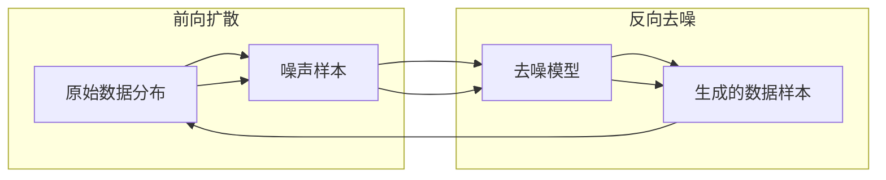

# 扩散模型Diffusion Model原理与代码实例讲解

关键词：扩散模型、生成模型、去噪、马尔可夫链、变分推断、PyTorch

## 1. 背景介绍
### 1.1 问题的由来
近年来，随着深度学习的快速发展，生成模型(Generative Model)成为了人工智能领域的研究热点之一。生成模型旨在学习数据的分布，从而能够生成与训练数据相似的新样本。其在图像生成、语音合成、自然语言处理等领域有广泛的应用前景。而扩散模型(Diffusion Model)作为一种新兴的生成模型，以其优异的生成质量和灵活性受到了学术界和工业界的广泛关注。

### 1.2 研究现状
扩散模型最早由何等人在2015年提出，其灵感来源于非平衡热力学中的扩散过程。此后，Sohl-Dickstein等人提出了去噪扩散概率模型(Denoising Diffusion Probabilistic Models, DDPM)，将扩散模型与去噪自编码器结合，极大地提升了图像生成的质量。近期，Dhariwal和Nichol等人提出了Guided Diffusion和Classifier-Free Guidance等改进方法，进一步提高了扩散模型的生成表现和训练效率。扩散模型已经在图像生成领域取得了媲美甚至超越GAN的效果。

### 1.3 研究意义
扩散模型作为一种有前景的生成模型范式，有望在计算机视觉、语音处理、自然语言处理等领域取得更大的突破。深入理解扩散模型的原理，有助于研究者改进模型、提出创新的应用。同时，扩散模型所蕴含的思想也可以启发其他生成模型的设计。此外，探索扩散模型在实际场景中的应用，有利于推动人工智能技术造福社会。

### 1.4 本文结构
本文将全面介绍扩散模型的原理和代码实现。第2节介绍扩散模型的核心概念；第3节讲解扩散模型的算法原理和步骤；第4节给出扩散模型的数学模型和公式推导；第5节提供基于PyTorch的代码实例；第6节讨论扩散模型的应用场景；第7节推荐相关工具和资源；第8节总结全文并展望未来；第9节附录常见问题解答。

## 2. 核心概念与联系
扩散模型的核心思想是，将数据生成看作一个逐步去噪的过程。具体来说，扩散模型定义了一个前向扩散过程(Forward Diffusion Process)和一个反向去噪过程(Reverse Denoising Process)。

在前向扩散过程中，我们从原始数据出发，通过逐步添加高斯噪声，最终得到一个近似于标准高斯分布的噪声样本。这个过程可以看作在数据空间中的随机游走，每一步都会让数据分布变得更加平滑。前向扩散过程由一系列的扩散步骤组成，每个步骤对应一个噪声水平。

反向去噪过程则是前向扩散的逆过程。我们从一个标准高斯噪声样本出发，通过逐步去噪，最终恢复出原始数据分布。去噪过程同样由一系列步骤组成，每个步骤对应一个去噪水平。去噪过程可以看作是在噪声空间中的有向游走，每一步都会让样本分布更接近真实数据分布。

扩散模型的训练目标是学习反向去噪过程的条件转移概率分布。通过最大化似然估计，我们可以得到一个去噪模型，用于逐步去除样本中的噪声，生成高质量的数据样本。

扩散模型与其他生成模型(如GAN、VAE)的主要区别在于，它将数据生成看作一个渐进的迭代过程，通过逐步去噪实现从随机噪声到真实数据分布的转换。这种渐进式的生成方式使得扩散模型具有更稳定的训练过程和更好的生成样本多样性。

下图是扩散模型的核心概念和流程示意：

## 3. 核心算法原理 & 具体操作步骤
### 3.1 算法原理概述
扩散模型的核心算法包括前向扩散过程和反向去噪过程两部分。前向扩散过程将数据样本逐步转换为高斯噪声，而反向去噪过程则通过逐步去噪，从高斯噪声恢复出数据样本。

前向扩散过程可以表示为一个马尔可夫链：

$$q(x_t|x_{t-1}) = \mathcal{N}(x_t; \sqrt{1-\beta_t} x_{t-1}, \beta_t \mathbf{I})$$

其中，$x_t$表示扩散步骤$t$时的样本，$\beta_t$是一个控制噪声水平的超参数。通过逐步增大$\beta_t$，我们可以将数据样本平滑地转换为高斯噪声。

反向去噪过程同样可以表示为一个马尔可夫链：

$$p_\theta(x_{t-1}|x_t) = \mathcal{N}(x_{t-1}; \mu_\theta(x_t, t), \sigma_\theta(x_t, t)^2\mathbf{I})$$

其中，$\mu_\theta$和$\sigma_\theta$是去噪模型的均值和方差函数，$\theta$表示去噪模型的参数。去噪模型可以用神经网络来参数化。

扩散模型的训练目标是最大化反向去噪过程的似然概率：

$$\max_\theta \mathbb{E}_{x_0 \sim q(x_0)} [\log p_\theta(x_0)]$$

通过最大化似然估计，我们可以学习到一个强大的去噪模型，用于从高斯噪声恢复出高质量的数据样本。

### 3.2 算法步骤详解
扩散模型的算法步骤可以分为训练阶段和生成阶段两部分。

训练阶段：
1. 从数据集中采样一批真实数据样本$x_0$。
2. 对每个样本$x_0$，按照前向扩散过程生成一系列噪声样本$x_1, \dots, x_T$。
3. 对每个噪声样本$x_t$，计算去噪模型的预测均值$\mu_\theta(x_t, t)$和方差$\sigma_\theta(x_t, t)^2$。
4. 计算去噪模型的损失函数，即负对数似然：
$$L_t = \frac{1}{2\sigma_\theta(x_t, t)^2} \lVert x_{t-1} - \mu_\theta(x_t, t) \rVert^2 + \log \sigma_\theta(x_t, t)$$
5. 对所有时间步$t$的损失函数求和，得到总损失：
$$L = \sum_{t=1}^T L_t$$
6. 计算损失函数关于模型参数$\theta$的梯度，并用优化算法(如Adam)更新参数。
7. 重复步骤1-6，直到模型收敛或达到预设的训练轮数。

生成阶段：
1. 从标准高斯分布中采样一个随机噪声$x_T$。
2. 对于$t=T,\dots,1$：
   - 用去噪模型预测均值$\mu_\theta(x_t, t)$和方差$\sigma_\theta(x_t, t)^2$。
   - 从条件高斯分布$\mathcal{N}(\mu_\theta(x_t, t), \sigma_\theta(x_t, t)^2\mathbf{I})$中采样$x_{t-1}$。
3. 最终得到生成的数据样本$x_0$。

### 3.3 算法优缺点
扩散模型的主要优点包括：
- 生成质量高：扩散模型可以生成高质量、高分辨率的图像，媲美甚至超越GAN。
- 训练稳定：扩散模型的训练过程更加稳定，不容易出现模式崩溃等问题。
- 样本多样性好：扩散模型生成的样本多样性更好，能够覆盖数据分布的不同模式。
- 灵活性强：扩散模型可以结合不同的架构(如U-Net)和目标函数，适用于各种任务。

扩散模型的主要缺点包括：
- 推理速度慢：扩散模型的生成过程需要多个去噪步骤，推理速度相对较慢。
- 训练成本高：扩散模型的训练需要大量的噪声样本和去噪步骤，训练成本较高。

### 3.4 算法应用领域
扩散模型在以下领域有广泛的应用：
- 图像生成：扩散模型可以生成高质量的图像，如人脸、动物、风景等。
- 图像编辑：扩散模型可以用于图像去噪、超分辨率、风格迁移等任务。
- 语音合成：扩散模型可以用于生成自然、流畅的语音。
- 视频生成：扩散模型可以扩展到视频领域，生成连贯的视频序列。
- 分子生成：扩散模型可以用于生成新的药物分子结构。

## 4. 数学模型和公式 & 详细讲解 & 举例说明
### 4.1 数学模型构建
扩散模型的数学模型建立在马尔可夫链的基础上。我们定义一个前向扩散过程，将数据样本逐步转换为高斯噪声；然后定义一个反向去噪过程，从高斯噪声逐步恢复数据样本。

前向扩散过程可以表示为一系列的条件概率分布：

$$q(x_1, \dots, x_T | x_0) = \prod_{t=1}^T q(x_t | x_{t-1})$$

其中，$q(x_t | x_{t-1})$是从$x_{t-1}$到$x_t$的转移概率分布，通常选择高斯分布：

$$q(x_t | x_{t-1}) = \mathcal{N}(x_t; \sqrt{1-\beta_t} x_{t-1}, \beta_t \mathbf{I})$$

这里，$\beta_t$是一个控制噪声水平的超参数，满足$0 < \beta_1 < \dots < \beta_T < 1$。

反向去噪过程同样可以表示为一系列的条件概率分布：

$$p_\theta(x_{0:T}) = p(x_T) \prod_{t=1}^T p_\theta(x_{t-1} | x_t)$$

其中，$p(x_T)$是标准高斯分布，$p_\theta(x_{t-1} | x_t)$是从$x_t$到$x_{t-1}$的转移概率分布，通常选择高斯分布：

$$p_\theta(x_{t-1} | x_t) = \mathcal{N}(x_{t-1}; \mu_\theta(x_t, t), \sigma_\theta(x_t, t)^2\mathbf{I})$$

这里，$\mu_\theta$和$\sigma_\theta$是去噪模型的均值和方差函数，可以用神经网络来参数化。

扩散模型的训练目标是最大化反向去噪过程的对数似然：

$$\max_\theta \mathbb{E}_{x_0 \sim q(x_0)} [\log p_\theta(x_0)]$$

通过最大化似然估计，我们可以学习到一个强大的去噪模型，用于从高斯噪声恢复出高质量的数据样本。

### 4.2 公式推导过程
为了推导扩散模型的训练目标，我们首先利用概率链式法则将反向去噪过程的对数似然分解：

$$\log p_\theta(x_0) = \log \int p_\theta(x_{0:T}) dx_{1:T}$$

$$= \log \int p(x_T) \prod_{t=1}^T p_\theta(x_{t-1} | x_t) dx_{1:T}$$

然后，我们引入前向扩散过程的联合分布$q(x_{1:T}|x_0)$，并利用Jensen不等式：

$$\log p_\theta(x_0) \geq \int q(x_{1:T}|x_0) \log \frac{p(x_T) \prod_{t=1}^T p_\theta(x_{t-1} | x_t)