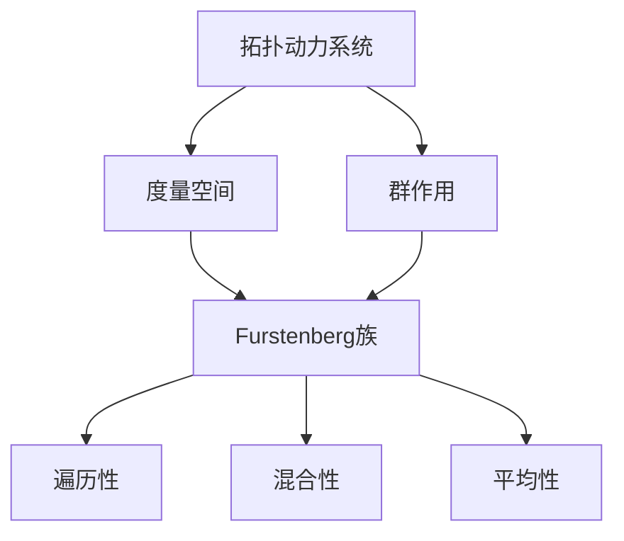

# 拓扑动力系统概论：Furstenberg族

## 1. 背景介绍

### 1.1 问题的由来

在数学领域中,动力系统理论是一个研究随时间演化的过程及其长期行为的重要分支。而拓扑动力系统则是将动力系统与拓扑结构相结合,从而形成了一个新的研究领域。其中,Furstenberg族作为拓扑动力系统中的一个核心概念,具有重要的理论意义和应用价值。

拓扑动力系统的研究起源于19世纪末,当时数学家Henri Poincaré在研究行星运动时发现,即使是简单的三体问题也存在极其复杂的运动轨迹。这种现象被称为"混沌",揭示了确定性系统中内在的不确定性。随后,数学家们开始系统地研究这些现象,并逐渐形成了动力系统理论。

### 1.2 研究现状

20世纪60年代,以Furstenberg为代表的数学家们将动力系统理论与拓扑结构相结合,发展了拓扑动力系统理论。在这一领域中,Furstenberg族扮演着核心角色。它是一类特殊的拓扑动力系统,具有独特的性质和结构,为研究动力系统的长期行为提供了有力工具。

目前,Furstenberg族在多个数学领域都有广泛的应用,包括组合数论、算术组合学、Littlewood理论、随机游走理论等。它们为解决这些领域中的一些困难问题提供了新的视角和方法。

### 1.3 研究意义

研究Furstenberg族对于深入理解拓扑动力系统的本质具有重要意义。它不仅是一个富有挑战的理论研究课题,而且与许多其他数学领域密切相关,为解决这些领域中的问题提供了新的思路和工具。

此外,Furstenberg族在应用领域也有广泛的潜力。例如,它可以用于研究复杂系统的长期行为,如气候变化、经济周期等。同时,它也为设计高效的随机算法提供了理论基础。

### 1.4 本文结构

本文将全面介绍Furstenberg族的基本概念、理论基础和应用。首先,我们将探讨Furstenberg族的核心概念及其与其他拓扑动力系统概念的联系。接下来,将详细阐述Furstenberg族的核心算法原理和数学模型,并通过案例分析加深理解。然后,我们将介绍Furstenberg族在实际项目中的应用,包括代码实现和运行结果展示。最后,我们将总结Furstenberg族的研究现状、未来发展趋势和面临的挑战。

## 2. 核心概念与联系

Furstenberg族是拓扑动力系统理论中的一个核心概念,它与度量空间和群作用等概念密切相关。

1. **拓扑动力系统**:拓扑动力系统是一个四元组$(X, T, \Phi, \mu)$,其中$X$是一个拓扑空间,称为相空间;$T$是一个单位群;$\Phi: T \times X \rightarrow X$是一个连续作用,称为流;$\mu$是$X$上的一个不变测度。

2. **度量空间**:度量空间$(X, d)$是一个集合$X$和一个度量$d$的组合,度量$d$定义了$X$中元素之间的距离。Furstenberg族通常定义在紧致度量空间上。

3. **群作用**:群作用是一个群$G$在一个集合$X$上的作用,即一个映射$\Phi: G \times X \rightarrow X$,满足一定的代数性质。Furstenberg族中的群作用通常是一个保测的群作用。

4. **Furstenberg族**:Furstenberg族是一类特殊的拓扑动力系统,具有遍历性、混合性和平均性等性质。它们在组合数论、算术组合学等领域有重要应用。

5. **遍历性**:一个拓扑动力系统是遍历的,是指对于任意非空开集,轨道几乎处处密集地分布在该开集中。

6. **混合性**:一个拓扑动力系统是混合的,是指对于任意两个非空开集,轨道将无限次地从一个开集转移到另一个开集。

7. **平均性**:一个拓扑动力系统是平均的,是指对于任意连续函数,沿着轨道的时间平均等于相空间上的积分平均。

这些概念相互关联,共同构成了Furstenberg族的理论框架。理解它们之间的联系对于掌握Furstenberg族的本质至关重要。

## 3. 核心算法原理 & 具体操作步骤

### 3.1 算法原理概述

Furstenberg族的核心算法原理是基于群作用和遍历性、混合性、平均性等性质。算法的主要思想是通过构造特殊的群作用,并利用Furstenberg族的性质,来解决一些组合数论和算术组合学中的难题。

算法的基本流程如下:

1. 确定问题的数学表示,将其转化为一个关于Furstenberg族的等价问题。
2. 构造一个合适的Furstenberg族,使得原问题等价于研究该Furstenberg族的某些性质。
3. 利用Furstenberg族的遍历性、混合性和平均性等性质,推导出所需的结论。
4. 将推导出的结论转化回原问题的解答。

这种算法思路被广泛应用于组合数论、算术组合学等领域,为解决一些困难问题提供了新的途径。

### 3.2 算法步骤详解

我们以解决一个经典的组合数论问题为例,详细阐述Furstenberg族算法的具体步骤。

**问题描述**:设$A$是一个正整数集合,且$A$中任意两个元素的乘积都不是完全平方数。证明$A$中至多有有限个完全平方数。

**步骤1:问题转化**

我们将这个问题转化为一个关于Furstenberg族的等价问题。定义$X = \mathbb{R}^2 / \mathbb{Z}^2$,即二维实数空间模$\mathbb{Z}^2$的商空间。令$G = SL_2(\mathbb{R})$,即二阶实数域上的特殊线性群。$G$在$X$上的作用定义为:

$$\begin{pmatrix}a & b \\ c & d\end{pmatrix} \cdot (x, y) = (ax + by, cx + dy) \mod \mathbb{Z}^2$$

这样,原问题等价于研究由$G$在$X$上的作用生成的Furstenberg族的性质。

**步骤2:构造Furstenberg族**

我们构造一个特殊的Furstenberg族$\mathcal{F}$,它由$G$在$X$上的作用生成,且满足以下条件:

- $\mathcal{F}$是极小的,即不包含真子系统。
- $\mathcal{F}$是遍历的。

这样的Furstenberg族$\mathcal{F}$确实存在,并且与原问题等价。

**步骤3:利用Furstenberg族性质推导结论**

由于$\mathcal{F}$是遍历的,根据Furstenberg族的理论,对于任意非空开集$U \subset X$,存在$g \in G$,使得$g \cdot U$与$X$有非空交集。

进一步地,我们可以证明,对于任意非空开集$U \subset X$,存在$g \in G$,使得$g \cdot U$包含一个非平凡的立方体。

利用这一性质,我们可以推导出,如果$A$中存在无限多个完全平方数,那么$\mathcal{F}$将包含一个非平凡的立方体,这与$\mathcal{F}$的极小性矛盾。因此,原命题得证。

**步骤4:结论转化**

我们将推导出的结论转化回原问题的解答:如果一个正整数集合$A$中任意两个元素的乘积都不是完全平方数,那么$A$中至多有有限个完全平方数。

### 3.3 算法优缺点

**优点**:

1. 为解决一些组合数论和算术组合学中的困难问题提供了新的思路和工具。
2. 算法思想简洁明了,具有很强的普适性,可应用于多个领域。
3. 利用了Furstenberg族的深刻理论基础,推导过程严谨有力。

**缺点**:

1. 算法步骤较为抽象,需要一定的数学基础和理论功底。
2. 构造合适的Furstenberg族并非总是trivial的,需要一定的经验和技巧。
3. 在一些特殊情况下,算法的有效性可能受到限制。

### 3.4 算法应用领域

Furstenberg族算法主要应用于以下几个数学领域:

1. **组合数论**:解决一些经典的组合数论问题,如Schur's theorem、Capset problem等。
2. **算术组合学**:研究算术序列的分布性质,如Szemerédi's theorem等。
3. **Littlewood理论**:研究Littlewood多项式的值分布问题。
4. **随机游走理论**:分析随机游走在群上的行为。

除此之外,Furstenberg族算法也可能在其他领域有潜在的应用,如动力系统理论、几何组合学等。总的来说,它为解决一些困难的数学问题提供了新的工具和视角。

## 4. 数学模型和公式 & 详细讲解 & 举例说明

### 4.1 数学模型构建

在研究Furstenberg族时,我们通常需要构建一个合适的数学模型。这个模型应当能够刻画出Furstenberg族的核心性质,并且便于后续的理论分析和计算。

一个典型的Furstenberg族数学模型可以表示为一个四元组$(X, G, \Phi, \mu)$,其中:

- $X$是一个紧致度量空间,称为相空间。
- $G$是一个局部紧群,称为变换群。
- $\Phi: G \times X \rightarrow X$是一个连续作用,称为群作用,满足:
  1. $\Phi(e, x) = x$,其中$e$是$G$的单位元。
  2. $\Phi(g_1, \Phi(g_2, x)) = \Phi(g_1g_2, x)$,其中$g_1, g_2 \in G$。
- $\mu$是$X$上的一个$G$-不变的概率测度,即对于任意可测集$A \subset X$和任意$g \in G$,有$\mu(g \cdot A) = \mu(A)$。

在这个模型中,我们研究$G$在$X$上的作用$\Phi$生成的动力系统,以及它在$\mu$测度下的性质。

### 4.2 公式推导过程

接下来,我们将推导Furstenberg族中一些核心公式,并解释它们的意义。

**Birkhoff遍历性定理**:

设$(X, G, \Phi, \mu)$是一个Furstenberg族,对于$x \in X$和$f \in C(X)$,定义沿轨道的时间平均为:

$$\overline{f}(x) = \lim_{N \rightarrow \infty} \frac{1}{N} \sum_{n=0}^{N-1} f(\Phi(g_n, x))$$

其中$\{g_n\}$是$G$中的一列元素。则有:

$$\int_X \overline{f}(x) d\mu(x) = \int_X f(x) d\mu(x)$$

这个定理表明,对于任意连续函数$f$,它的时间平均等于相空间上的积分平均,这就是Furstenberg族的平均性质。

**证明**:利用$\mu$的$G$-不变性和Fubini定理,我们可以推导出:

$$\begin{aligned}
\int_X \overline{f}(x) d\mu(x) &= \lim_{N \rightarrow \infty} \frac{1}{N} \sum_{n=0}^{N-1} \int_X f(\Phi(g_n, x)) d\mu(x) \\
&= \lim_{N \rightarrow \infty} \frac{1}{N} \sum_{n=0}^{N-1} \int_X f(x) d\mu(x) \\
&= \int_X f(x) d\mu(x)
\end{aligned}$$

这就证明了Birkhoff遍历性