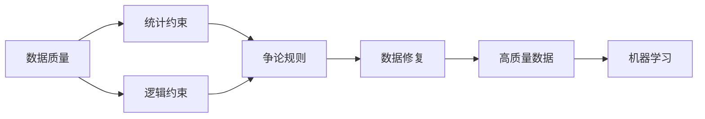

# 数据争论 (Data Argumentation) 原理与代码实例讲解

关键词：数据争论、机器学习、数据质量、特征工程、模型评估

## 1. 背景介绍

### 1.1 问题的由来

随着大数据时代的到来,海量数据正在快速积累。然而,原始数据往往存在噪声、缺失值、异常值等质量问题,直接用于机器学习模型训练会影响模型性能。传统的数据预处理方法依赖人工设计特征和清洗规则,效率低且主观性强。因此,亟需一种自动化的数据质量改进方法。

### 1.2 研究现状

近年来,一些学者提出利用数据本身的内在联系,通过数据之间的"争论"来提升数据质量的思路,称为数据争论(Data Argumentation)。Rekatsinas等人提出了HoloClean框架,利用统计与逻辑约束来检测和修复脏数据。Chu等人提出了DBoost算法,基于模式频繁度和一致性来识别异常值。但现有方法对领域知识依赖较强,泛化能力不足。

### 1.3 研究意义

数据争论技术可显著提升机器学习数据质量,减少人工处理成本,具有重要研究意义:

1. 自动化提升数据质量,为机器学习提供高质量训练数据。
2. 减轻人工设计特征工程负担,提高数据处理效率。 
3. 降低对领域知识依赖,增强方法泛化能力。
4. 为数据治理提供新思路,促进大数据应用发展。

### 1.4 本文结构

本文将重点介绍数据争论的核心概念、原理、算法、模型和代码实现。第2部分阐述数据争论的核心概念。第3部分讲解数据争论算法原理和步骤。第4部分建立数据争论数学模型并给出公式推导。第5部分提供数据争论的代码实例。第6部分探讨数据争论的应用场景。第7部分推荐相关工具和资源。第8部分总结全文并展望未来。第9部分列举常见问题解答。

## 2. 核心概念与联系

数据争论的核心概念包括:

- 数据质量:数据的完整性、一致性、准确性、及时性等特征。
- 数据修复:检测并纠正脏数据,提升数据质量的过程。  
- 统计约束:利用数据内在统计规律构建的约束条件。
- 逻辑约束:基于先验知识定义的数据间逻辑关系。
- 争论规则:数据之间基于统计与逻辑约束产生的修复规则。

数据争论基于数据质量问题,利用统计与逻辑约束构建争论规则,通过数据修复来提升数据质量,最终为机器学习提供高质量数据。其核心概念联系如下:



## 3. 核心算法原理 & 具体操作步骤

### 3.1 算法原理概述

数据争论算法通过构建统计约束和逻辑约束,利用数据内在联系,生成数据修复的争论规则。基于规则对数据进行修复,提升数据质量。算法以迭代方式不断优化争论规则,直至数据质量收敛。

### 3.2 算法步骤详解

输入:原始数据集 $D=\{D_1,\cdots,D_n\}$
输出:修复后数据集 $\hat{D}=\{\hat{D}_1,\cdots,\hat{D}_n\}$

1. 统计约束构建。对数据集 $D$ 进行统计分析,挖掘数据内在分布规律,构建统计约束集 $\mathcal{C}_s$。

2. 逻辑约束定义。结合领域知识,定义数据间逻辑关系,形成逻辑约束集 $\mathcal{C}_l$。

3. 争论规则生成。利用统计约束 $\mathcal{C}_s$ 与逻辑约束 $\mathcal{C}_l$,通过规则挖掘算法(如Apriori),生成数据间的争论规则集 $\mathcal{R}$。

4. 数据修复。对每条数据 $D_i$,利用争论规则 $\mathcal{R}$ 进行检测。若命中规则,则按照规则定义的修复策略对 $D_i$ 进行修复为 $\hat{D}_i$。

5. 迭代优化。重复步骤1-4,根据修复后的数据集 $\hat{D}$ 更新统计约束,进而优化争论规则,直至数据质量评估指标收敛。

6. 输出。返回修复后的高质量数据集 $\hat{D}$。

### 3.3 算法优缺点

优点:
- 自动化生成数据修复规则,减少人工规则设计。  
- 利用数据内在联系修复数据,提升数据一致性。
- 通过迭代优化提升规则和修复的质量。

缺点:  
- 依赖数据质量评估指标,评估指标的选取影响修复效果。
- 对隐藏较深的数据规律挖掘能力有限。
- 规则的可解释性有待进一步提升。

### 3.4 算法应用领域

数据争论算法可广泛应用于以下领域:

- 企业数据治理:提升业务数据质量,支撑数据分析与决策。
- 科学数据分析:修复科学实验数据中的缺失、异常值。  
- 社会调查数据:识别和修正调查数据的逻辑错误。
- 机器学习数据:为模型训练提供高质量数据。

## 4. 数学模型和公式 & 详细讲解 & 举例说明

### 4.1 数学模型构建

定义数据集 $D=\{D_1,\cdots,D_n\}$,每条数据 $D_i$ 包含 $m$ 个属性 $\{A_1,\cdots,A_m\}$。

统计约束 $\mathcal{C}_s$ 定义为属性间的条件概率分布:

$$
\mathcal{C}_s=\{P(A_j|A_1,\cdots,A_m):j=1,\cdots,m\}
$$

逻辑约束 $\mathcal{C}_l$ 定义为属性间的逻辑关系:

$$
\mathcal{C}_l=\{A_i\rightarrow A_j,A_i\wedge A_j\rightarrow A_k,\cdots\}
$$

争论规则定义为约束的合取式:

$$
\mathcal{R}=\{r_k:r_k\in \mathcal{C}_s \cup \mathcal{C}_l \}
$$

数据修复目标为最小化违反争论规则的数据个数:

$$
\min \limits_{\hat{D}} \sum_{i=1}^n \sum_{r_k \in \mathcal{R}} \mathbb{I}(\hat{D}_i \nRightarrow r_k) 
$$

其中 $\mathbb{I}(\cdot)$ 为示性函数,当 $\hat{D}_i$ 满足 $r_k$ 时取0,否则取1。$\hat{D}=\{\hat{D}_1,\cdots,\hat{D}_n\}$ 为修复后的数据集。

### 4.2 公式推导过程

对于每条数据 $D_i$,其违反争论规则 $r_k$ 的概率为:

$$
P(D_i \nRightarrow r_k)=1-P(D_i \Rightarrow r_k)
$$

假设不同数据违反争论规则相互独立,则数据集 $D$ 违反规则 $r_k$ 的概率为:

$$
\begin{aligned}
P(D \nRightarrow r_k) &=1-\prod_{i=1}^n P(D_i \Rightarrow r_k)\\
&=1-\prod_{i=1}^n (1-P(D_i \nRightarrow r_k))
\end{aligned}
$$

进一步假设不同规则之间相互独立,则数据集 $D$ 违反所有规则的概率为:

$$
P(D \nRightarrow \mathcal{R})=1-\prod_{r_k \in \mathcal{R}} (1-P(D \nRightarrow r_k))
$$

数据修复的目标就是最小化上式,即:

$$
\hat{D}=\arg\min \limits_{D'} P(D' \nRightarrow \mathcal{R})
$$

### 4.3 案例分析与讲解

考虑一个学生信息数据集,包含属性:姓名、年龄、年级、身高、体重。其中存在以下数据质量问题:

1. 年龄和年级不一致,如15岁读高三。
2. 身高和体重不匹配,如身高180cm体重只有50kg。

针对问题1,可构建逻辑约束:

$$
r_1: 年龄 \in [6,12] \rightarrow 年级 \in [1,6]
$$

针对问题2,可构建统计约束:

$$
r_2: P(体重|身高) \sim \mathcal{N}(\mu, \sigma^2)
$$

其中 $\mu=\alpha \times 身高+\beta$,表示身高和体重的线性关系。$\alpha$ 和 $\beta$ 可通过回归估计。

结合 $r_1$ 和 $r_2$ 对数据进行检测和修复,如将15岁高三学生的年级修正为初三,将180cm50kg的体重修正为70kg。

通过迭代优化,不断提升数据的一致性,最终得到高质量的学生信息数据集。

### 4.4 常见问题解答

Q1:统计约束和逻辑约束有何区别?

A1:统计约束刻画数据的概率分布特性,如条件概率。逻辑约束刻画确定性的数据依赖关系,violation of which明确说明数据存在错误。两者互补,共同指导数据修复。

Q2:如何评估数据修复的质量?

A2:可使用留出法,将数据集划分为训练集和测试集。在训练集上学习争论规则,在测试集上评估修复的准确率、召回率等指标。也可引入人工评估,抽样人工检查修复后的数据正确性。

Q3:数据修复能否做到完全自动化?

A3:数据修复需要综合利用数据自身特点和领域知识。统计约束可自动从数据中学习得到,但逻辑约束通常需要人工定义。此外,人工检查对保证修复质量也不可或缺。因此,数据修复只能半自动化,难以做到完全自动化。

## 5. 项目实践：代码实例和详细解释说明

### 5.1 开发环境搭建

本项目使用Python3语言,需要安装以下库:

- pandas: 数据处理库
- scikit-learn: 机器学习库  
- mlxtend: 关联规则挖掘库

使用pip安装:

```
pip install pandas scikit-learn mlxtend
```

### 5.2 源代码详细实现

```python
import pandas as pd
from sklearn.model_selection import train_test_split
from mlxtend.frequent_patterns import apriori
from mlxtend.frequent_patterns import association_rules

class DataArgumentation:
    def __init__(self, data, min_support=0.5, min_threshold=0.8):
        self.data = data  # 数据集
        self.min_support = min_support  # 最小支持度
        self.min_threshold = min_threshold  # 最小置信度阈值
        self.rules = None  # 争论规则
        
    def fit(self):
        """学习争论规则"""
        # 构建统计约束(使用Apriori算法挖掘频繁项集和关联规则)
        frequent_itemsets = apriori(self.data, min_support=self.min_support, use_colnames=True)
        rules = association_rules(frequent_itemsets, metric="confidence", min_threshold=self.min_threshold)
        
        # 构建逻辑约束(人工定义)
        logic_rules = self.define_logic_rules()
        
        # 合并统计约束与逻辑约束
        self.rules = pd.concat([rules, logic_rules])
        
    def transform(self):
        """应用争论规则修复数据"""
        data = self.data.copy()
        for _, rule in self.rules.iterrows():
            antecedents = rule["antecedents"]  # 规则前项
            consequents = rule["consequents"]  # 规则后项
            confidence = rule["confidence"]  # 规则置信度
            
            # 检测违反规则的数据
            invalid_data = data[data[antecedents].all(axis=1) & ~data[consequents].all(axis=1)]
            
            # 按置