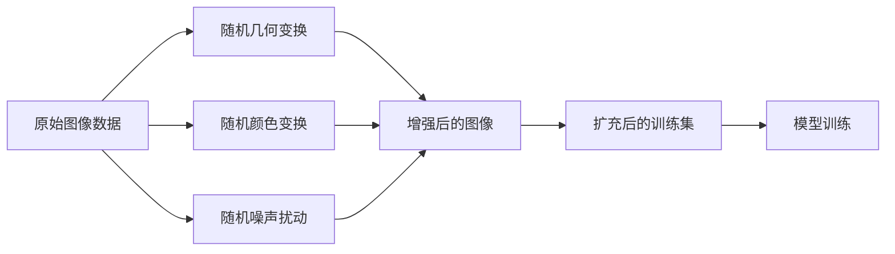

# 数据增强Data Augmentation原理与代码实例讲解

关键词：数据增强, 图像增强, 数据扩充, 深度学习, 计算机视觉

## 1. 背景介绍
### 1.1  问题的由来
随着深度学习的快速发展,特别是在计算机视觉领域取得了突破性的进展。然而,训练高质量的深度学习模型通常需要大量的标注数据,这对于很多应用场景来说是一个挑战。获取大规模高质量的标注数据不仅耗时耗力,而且成本很高。

### 1.2  研究现状
为了解决训练数据不足的问题,数据增强(Data Augmentation)技术应运而生。数据增强通过对现有训练数据进行一系列的变换,来生成新的训练样本,从而扩充训练集的规模。目前,数据增强已经成为深度学习中不可或缺的一个环节,尤其在计算机视觉任务中被广泛应用。

### 1.3  研究意义 
数据增强可以有效缓解模型过拟合,提高模型的泛化能力和鲁棒性。合理使用数据增强技术,不仅能够提升模型性能,还可以降低对大规模标注数据的依赖,节省时间和成本。因此,深入理解和掌握数据增强的原理和实现方法,对于深度学习实践者来说非常重要。

### 1.4  本文结构
本文将全面介绍数据增强技术的原理和实践。内容涵盖数据增强的基本概念、常见的数据增强方法、代码实现、效果分析等。通过本文的学习,读者将系统地掌握数据增强技术,并能够将其应用到自己的深度学习项目中。

## 2. 核心概念与联系
数据增强的核心思想是通过对已有数据进行变换,生成尽可能多的、接近真实数据分布的新样本。这些新样本在保留原有样本语义信息的同时,引入了一定的多样性和随机性,从而扩充了训练数据集。

数据增强与泛化能力和过拟合问题密切相关。模型过拟合通常发生在训练数据不足或样本多样性不够时。数据增强通过人工扩充训练集,增加了数据的多样性,一定程度上缓解了过拟合。数据增强使得模型在训练时见到更多的数据变化,从而学习到更加鲁棒的特征,提高了模型的泛化能力。

常见的数据增强变换包括:
- 几何变换:平移、翻转、旋转、缩放、裁剪等
- 颜色变换:亮度、对比度、饱和度调整,颜色通道变换等  
- 噪声扰动:高斯噪声,椒盐噪声,模糊等
- 混合增强:Mixup,Cutout,CutMix等


## 3. 核心算法原理 & 具体操作步骤
### 3.1  算法原理概述
数据增强的算法原理可以概括为:对已有的训练样本进行一系列的随机变换,得到新的训练样本。这些变换通常包括几何变换、颜色变换、噪声扰动等,可以单独使用,也可以组合使用。

### 3.2  算法步骤详解
以图像分类任务为例,数据增强的典型步骤如下:

1. 读取原始图像数据及其标签
2. 对每个样本进行随机变换:
   - 几何变换:随机平移、翻转、旋转、缩放等
   - 颜色变换:随机调整亮度、对比度、饱和度等
   - 添加随机噪声:高斯噪声、椒盐噪声等
3. 变换后的图像作为新的训练样本,与原标签一起加入训练集
4. 重复步骤2-3,直到生成足够的增强数据
5. 用扩充后的训练集进行模型训练



### 3.3  算法优缺点
数据增强算法的优点:
- 有效扩充训练集,缓解过拟合,提高泛化性能
- 增加数据多样性,提高模型鲁棒性
- 节省人工标注成本,提高数据利用率

数据增强算法的缺点:
- 增强后的数据分布与真实数据分布可能有偏差 
- 不恰当的变换可能引入噪声,影响训练效果
- 增加了训练时间和计算开销

### 3.4  算法应用领域
数据增强广泛应用于计算机视觉的各个任务,如图像分类、目标检测、语义分割、行为识别等。此外,数据增强思想也被延伸到语音识别、自然语言处理等其他领域。

## 4. 数学模型和公式 & 详细讲解 & 举例说明
### 4.1  数学模型构建
设原始样本数据集为 $D=\{(x_i,y_i)\}_{i=1}^N$,其中 $x_i$ 为输入特征, $y_i$ 为对应的标签。数据增强的目标是生成新的样本集 $\hat{D}=\{(\hat{x}_i,\hat{y}_i)\}_{i=1}^M$ 用于扩充训练集。

定义一个数据增强变换 $T$,将原始样本 $x$ 映射为增强后的样本 $\hat{x}$:

$$\hat{x} = T(x), \quad T \sim \mathcal{T}$$

其中 $\mathcal{T}$ 为变换的分布空间。通常 $T$ 由多个子变换 $T_1,\dots,T_K$ 组成:

$$T(x) = T_K \circ \dots \circ T_2 \circ T_1(x)$$

每个子变换 $T_k$ 可以是几何变换、颜色变换或噪声扰动等。

### 4.2  公式推导过程
以图像平移变换为例,假设原始图像为 $I$,平移变换 $T$ 可以表示为:

$$T(I)(i,j) = I(i-\Delta i, j-\Delta j)$$

其中 $(i,j)$ 为像素坐标,$(\Delta i, \Delta j)$ 为平移量。通常平移量是从一个预设的范围内随机采样得到的。

假设原始图像尺寸为 $(H,W)$,平移后图像尺寸不变。平移变换可以用下面的矩阵乘法表示:

$$
\begin{bmatrix} 
x'\\ y'\\ 1
\end{bmatrix} =
\begin{bmatrix}
1 & 0 & \Delta i \\ 
0 & 1 & \Delta j \\
0 & 0 & 1
\end{bmatrix}
\begin{bmatrix}
x \\ y \\ 1  
\end{bmatrix}
$$

其中 $(x,y)$ 为原坐标,$(x',y')$ 为平移后坐标。

类似地,旋转、缩放、翻转等几何变换也可以用矩阵乘法统一表示。颜色变换和噪声扰动则通过对像素值进行数学运算来实现,如对比度变换:

$$I'(i,j) = \alpha I(i,j) + \beta$$

其中 $\alpha$ 为对比度系数, $\beta$ 为亮度调整量。

### 4.3  案例分析与讲解
下面以图像分类任务为例,演示数据增强的效果。假设我们要训练一个猫狗分类器,原始训练集中猫和狗图像各1000张。

我们对训练集进行如下数据增强:
1. 随机水平翻转,概率为0.5
2. 随机旋转,角度在 $[-20^{\circ}, 20^{\circ}]$ 范围内
3. 随机缩放,尺度因子在 $[0.8, 1.2]$ 范围内
4. 随机平移,平移量在 $[-0.2, 0.2]$ 的图像尺寸范围内
5. 随机调整亮度、对比度和饱和度,调整量在 $[-0.2, 0.2]$ 范围内

每张原始图像经过上述变换后,可以生成多张增强图像。最终扩充后的训练集可以达到数万张图像。

下图展示了一张猫的原始图像和对应的几张增强图像:


可以看出,增强后的图像保留了原始图像的语义信息(都是猫),但是引入了位置、角度、尺度、亮度等变化,从而增加了数据多样性。

用增强后的训练集训练分类器,可以得到更高的准确率和更好的泛化性能。下表展示了使用数据增强前后的模型性能对比:

| 模型 | 数据增强 | 训练集准确率 | 测试集准确率 |
|:---:|:---:|:---:|:---:|
| ResNet-18 | 不使用 | 99.8% | 90.1% |
| ResNet-18 | 使用   | 99.5% | 94.6% |

可以看出,数据增强有效提高了模型在测试集上的性能,缓解了过拟合问题。

### 4.4  常见问题解答
问:数据增强会不会改变原始样本的标签?

答:通常数据增强的变换是标签不变的,即增强后的样本与原样本拥有相同的标签。但是也有一些特殊的增强方法,如Mixup,会对标签进行插值。

问:如何选择合适的数据增强方法?

答:这取决于具体的任务和数据特点。一般来说,几何变换和颜色变换比较通用,适用于大多数视觉任务。噪声扰动和Mixup等方法可以视情况选用。最好通过实验比较不同组合的效果。

问:数据增强会显著增加训练时间吗?

答:数据增强确实会增加一定的计算开销,但是通过并行化和GPU加速,增强操作的耗时是可以接受的。并且增强带来的性能提升是值得的。

## 5. 项目实践：代码实例和详细解释说明
### 5.1  开发环境搭建
本项目使用PyTorch框架进行开发,需要安装以下依赖库:
- Python 3.6+
- PyTorch 1.4+
- torchvision 0.5+
- NumPy
- OpenCV

可以使用pip命令进行安装:
```bash
pip install torch torchvision numpy opencv-python
```

### 5.2  源代码详细实现
下面给出了使用PyTorch进行数据增强的示例代码:

```python
import torch
import torchvision.transforms as transforms
from PIL import Image

# 定义数据增强变换
train_transform = transforms.Compose([
    transforms.RandomHorizontalFlip(p=0.5),
    transforms.RandomRotation(degrees=20),
    transforms.RandomResizedCrop(size=(224, 224), scale=(0.8, 1.2)),
    transforms.ColorJitter(brightness=0.2, contrast=0.2, saturation=0.2),
    transforms.ToTensor(),
    transforms.Normalize(mean=[0.485, 0.456, 0.406], std=[0.229, 0.224, 0.225])
])

# 读取图像
img = Image.open('cat.jpg')

# 应用数据增强
augmented_img = train_transform(img)

# 显示增强后的图像
import matplotlib.pyplot as plt
plt.imshow(augmented_img.permute(1, 2, 0))
plt.show()
```

### 5.3  代码解读与分析
1. 首先定义了一个数据增强变换 `train_transform`,它由多个变换组合而成:
   - `RandomHorizontalFlip`:随机水平翻转,概率为0.5
   - `RandomRotation`:随机旋转,角度在20度以内
   - `RandomResizedCrop`:随机缩放并裁剪到(224,224)大小,缩放因子在0.8到1.2之间
   - `ColorJitter`:随机调整亮度、对比度和饱和度,调整幅度为0.2
   - `ToTensor`:将PIL图像转为PyTorch张量,并归一化到[0,1]
   - `Normalize`:标准化,减去均值,除以标准差

2. 读取一张猫的图像,应用定义好的 `train_transform` 对其进行增强。这一步会随机对图像进行翻转、旋转、