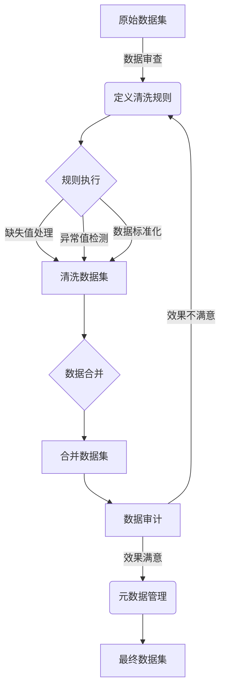

# 数据清洗与统计分析原理与代码实战案例讲解

## 1. 背景介绍

### 1.1 问题的由来

在当今的数据驱动时代，数据无疑是企业和组织的关键资产。然而,原始数据通常存在着各种各样的问题,如缺失值、重复数据、不一致性等,这些问题会严重影响后续的数据分析和决策过程。因此,对原始数据进行清洗和预处理是确保数据质量和可靠性分析的关键步骤。

### 1.2 研究现状

数据清洗是数据处理过程中的一个重要环节,已有大量的研究和方法被提出。然而,由于数据来源的多样性和复杂性,现有的清洗方法往往无法完全解决所有问题。此外,不同领域和场景下的数据清洗需求也存在差异,需要针对性地设计和优化清洗策略。

### 1.3 研究意义

高质量的数据是进行有效统计分析和建模的前提条件。通过对原始数据进行适当的清洗和预处理,可以极大地提高数据的质量和一致性,从而为后续的分析工作奠定坚实的基础。同时,合理的数据清洗策略也可以减少数据处理过程中的时间和计算资源消耗。

### 1.4 本文结构

本文将首先介绍数据清洗和统计分析的核心概念,然后详细阐述数据清洗的算法原理和具体操作步骤。接下来,将构建数学模型并推导相关公式,并通过案例分析进行详细说明。此外,本文还将提供实际的代码实现示例,并对其进行解读和分析。最后,将探讨数据清洗和统计分析在实际应用场景中的应用,并总结未来的发展趋势和挑战。

## 2. 核心概念与联系

数据清洗(Data Cleaning)是指通过各种方法和技术,识别并修复原始数据中存在的错误、不完整或不一致的部分,从而提高数据质量和可靠性的过程。常见的数据清洗任务包括:

1. **缺失值处理**: 填充或删除缺失的数据记录。
2. **噪声数据识别**: 检测和移除异常值或错误数据。
3. **数据标准化**: 将数据转换为统一的格式或单位。
4. **数据去重**: 识别并删除重复的数据记录。
5. **数据映射**: 将不同来源的数据映射到统一的模式或结构中。

统计分析(Statistical Analysis)是指通过应用统计学理论和方法,从数据中提取有用信息、发现数据模式和规律的过程。常见的统计分析任务包括:

1. **描述性统计分析**: 计算数据的中心趋势、离散程度等描述性统计量。
2. **推断性统计分析**: 基于样本数据推断总体特征,如假设检验、回归分析等。
3. **探索性数据分析**: 发现数据中隐藏的模式和关系。
4. **预测性建模**: 基于历史数据构建预测模型,用于预测未来趋势。

数据清洗和统计分析密切相关,前者为后者提供了高质量的数据输入,而后者则依赖于清洗后的数据进行分析和建模。它们共同构成了数据处理和分析的完整流程,对于提高数据价值和支持数据驱动决策至关重要。

## 3. 核心算法原理与具体操作步骤

### 3.1 算法原理概述

数据清洗过程通常涉及多种算法和技术,包括规则based、机器学习based、以及它们的混合方法。其核心思想是通过预定义的规则或训练模型,自动识别和修复原始数据中的各种问题。

1. **规则based方法**: 基于领域知识和数据特征,手动定义一系列清洗规则,如正则表达式、约束条件等,对数据进行过滤和转换。这种方法简单直观,但需要大量的人工努力,且难以处理复杂情况。

2. **机器学习based方法**: 利用机器学习算法(如分类、聚类等)从历史数据中自动学习数据模式,然后应用于新数据的清洗。这种方法具有较强的泛化能力,但需要大量的训练数据,且模型的解释性较差。

3. **混合方法**: 结合规则based和机器学习based的优点,首先使用规则过滤出明显的错误数据,然后应用机器学习模型处理剩余的复杂情况,两者互为补充。

### 3.2 算法步骤详解

数据清洗过程通常包括以下几个主要步骤:

1. **数据审查(Data Auditing)**: 通过数据探索和分析,了解数据的整体质量、存在的问题类型及严重程度。这一步骤有助于制定合理的清洗策略。

2. **定义清洗规则(Define Cleaning Rules)**: 根据审查结果和领域知识,定义适当的清洗规则,包括缺失值处理、异常值检测、数据标准化等规则。

3. **规则执行(Rule Execution)**: 将定义好的清洗规则应用于原始数据集,自动执行相应的清洗操作。

4. **数据合并(Data Merging)**: 如果存在多个数据源,需要将经过清洗的数据集进行合并和集成,以获得一个完整的数据集。

5. **数据审计(Data Auditing)**: 对清洗后的数据集进行审计,评估清洗效果,并根据需要进行进一步的优化和调整。

6. **元数据管理(Metadata Management)**: 记录和管理整个清洗过程中所采用的规则、操作和决策,以确保可追溯性和可重复性。

在实际应用中,上述步骤通常需要多次迭代,直到达到满意的清洗效果。同时,不同的数据集和场景可能需要调整和优化具体的清洗策略。

### 3.3 算法优缺点

数据清洗算法的优点包括:

1. **自动化**: 能够自动化地执行清洗任务,大大减少了人工劳动。
2. **可扩展性**: 对于大规模的数据集,算法具有良好的可扩展性。
3. **一致性**: 算法可以确保清洗过程的一致性,避免人为差错。

但同时也存在一些缺点和局限性:

1. **规则依赖**: 规则based方法严重依赖于人工定义的规则质量。
2. **数据质量要求**: 机器学习based方法需要大量高质量的训练数据。
3. **可解释性差**: 某些机器学习模型缺乏可解释性,难以理解其决策过程。
4. **领域依赖**: 不同领域和场景可能需要调整和优化清洗策略。

### 3.4 算法应用领域

数据清洗算法在各个领域都有广泛的应用,包括但不限于:

1. **金融**: 处理交易数据、客户数据等,支持风险管理和反欺诈。
2. **医疗保健**: 清洗电子病历数据,提高数据质量和患者安全。
3. **制造业**: 清洗传感器数据、生产数据,优化制造流程。
4. **电子商务**: 处理订单数据、用户评论数据,改善客户体验。
5. **社交媒体**: 清洗用户生成内容,过滤垃圾信息和不当内容。
6. **政府**: 整合和清洗各部门的数据,支持决策和公共服务。

## 4. 数学模型和公式详细讲解与举例说明

### 4.1 数学模型构建

在数据清洗过程中,常常需要构建数学模型来描述和解决相关问题。以缺失值填充为例,我们可以构建如下回归模型:

$$y = f(X) + \epsilon$$

其中:
- $y$是待预测的缺失值
- $X = (x_1, x_2, \dots, x_p)$是已知的特征变量
- $f$是未知的回归函数
- $\epsilon$是随机误差项,服从某种概率分布

根据不同的假设,可以得到不同的回归模型,如线性回归、逻辑回归等。模型的目标是通过已知数据拟合回归函数$f$,从而预测缺失值$y$。

### 4.2 公式推导过程

以线性回归为例,我们假设回归函数$f$是线性的,即:

$$f(X) = \beta_0 + \beta_1 x_1 + \beta_2 x_2 + \dots + \beta_p x_p$$

其中$\beta_0, \beta_1, \dots, \beta_p$是未知的回归系数。我们的目标是估计这些系数,使得预测值$\hat{y} = f(X)$与真实值$y$之间的差异最小。

通过最小二乘法,我们可以将目标函数建模为:

$$\min_{\beta_0, \beta_1, \dots, \beta_p} \sum_{i=1}^n (y_i - \beta_0 - \beta_1 x_{i1} - \dots - \beta_p x_{ip})^2$$

对该目标函数求导并令其等于0,可以得到normal方程组:

$$
\begin{cases}
\sum_{i=1}^n (y_i - \beta_0 - \beta_1 x_{i1} - \dots - \beta_p x_{ip}) = 0\\
\sum_{i=1}^n x_{i1}(y_i - \beta_0 - \beta_1 x_{i1} - \dots - \beta_p x_{ip}) = 0\\
\vdots\\
\sum_{i=1}^n x_{ip}(y_i - \beta_0 - \beta_1 x_{i1} - \dots - \beta_p x_{ip}) = 0
\end{cases}
$$

解这个方程组即可获得回归系数$\beta_0, \beta_1, \dots, \beta_p$的估计值,进而拟合出回归函数$f(X)$,用于预测缺失值。

### 4.3 案例分析与讲解

假设我们有一个包含房屋信息的数据集,其中部分房屋的价格缺失。我们希望利用其他特征(如房屋面积、卧室数量等)来预测缺失的房价。

首先,我们将数据集分为训练集和测试集。在训练集上,我们可以构建线性回归模型:

$$
\text{Price} = \beta_0 + \beta_1 \times \text{Area} + \beta_2 \times \text{Bedrooms} + \epsilon
$$

其中:
- Price是房屋价格(目标变量)
- Area是房屋面积
- Bedrooms是卧室数量
- $\beta_0, \beta_1, \beta_2$是待估计的回归系数
- $\epsilon$是随机误差项

利用最小二乘法,我们可以在训练集上估计出回归系数$\hat{\beta}_0, \hat{\beta}_1, \hat{\beta}_2$。然后,对于测试集中缺失价格的房屋,我们可以使用估计的回归函数:

$$
\widehat{\text{Price}} = \hat{\beta}_0 + \hat{\beta}_1 \times \text{Area} + \hat{\beta}_2 \times \text{Bedrooms}
$$

来预测其价格。这样,我们就可以填补测试集中的缺失值。

当然,线性回归只是一种简单的示例,在实际应用中,我们可以尝试更复杂的回归模型(如多项式回归、决策树回归等),或者结合其他机器学习技术(如多重插补、矩阵分解等),以获得更好的预测性能。

### 4.4 常见问题解答

1. **如何选择合适的回归模型?**

   选择回归模型时,需要考虑数据的特征、分布情况,以及模型的复杂度和可解释性。通常可以先尝试简单的线性模型,如果效果不佳,再尝试更复杂的非线性模型。同时,也可以使用交叉验证等技术来评估和比较不同模型的性能。

2. **如何处理异常值?**

   异常值会严重影响回归模型的拟合效果。常见的处理方法包括:基于统计