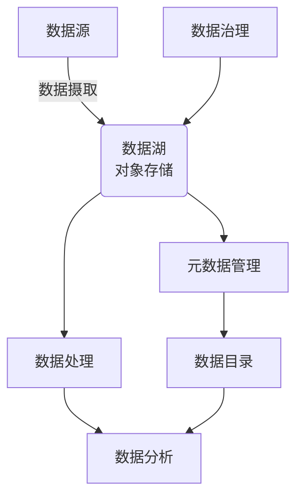

# 数据湖 原理与代码实例讲解

## 1. 背景介绍

### 1.1 问题的由来

在当今大数据时代，数据已经成为企业最宝贵的资源之一。传统的数据存储和管理方式已经无法满足现代企业对于海量异构数据的处理需求。随着数据量的不断增长和数据类型的多样化,企业面临着如何高效、经济地存储和处理这些数据的挑战。

### 1.2 研究现状

为了解决这一问题,数据湖(Data Lake)作为一种新兴的大数据存储和处理架构应运而生。数据湖允许企业以原始格式存储各种结构化、半结构化和非结构化数据,无需进行预先转换或建模。这种灵活的数据存储方式使得数据湖能够容纳各种类型的数据,为数据分析和机器学习等应用提供了丰富的数据源。

### 1.3 研究意义

数据湖架构的出现为企业带来了诸多好处:

1. **数据集中存储**:数据湖将企业内部和外部的各种数据集中存储在一个中央存储库中,方便数据访问和管理。

2. **数据保真**:数据湖以原始格式存储数据,保留了数据的完整性和语义信息,为后续的数据分析和处理提供了坚实的基础。

3. **成本效益**:与传统的数据仓库相比,数据湖采用廉价的对象存储技术,降低了存储成本。

4. **灵活性**:数据湖支持各种数据格式,能够适应不断变化的业务需求,提高了数据处理的灵活性。

5. **数据可视化**:数据湖为企业提供了一个统一的数据视图,有助于发现数据之间的关联关系,促进数据驱动的决策。

### 1.4 本文结构

本文将从以下几个方面全面介绍数据湖的原理和实践:

1. 核心概念与联系
2. 核心算法原理与具体操作步骤
3. 数学模型和公式详细讲解与举例说明
4. 项目实践:代码实例和详细解释说明
5. 实际应用场景
6. 工具和资源推荐
7. 总结:未来发展趋势与挑战
8. 附录:常见问题与解答

## 2. 核心概念与联系

数据湖涉及了多个核心概念,这些概念相互关联,共同构建了数据湖的整体架构。以下是数据湖的核心概念及其联系:

1. **对象存储(Object Storage)**:数据湖的底层存储系统,通常采用廉价的对象存储技术(如HDFS、AWS S3、Azure Blob Storage等)来存储海量数据。

2. **数据摄取(Data Ingestion)**:将来自各种数据源(如日志文件、传感器数据、社交媒体数据等)的数据导入到数据湖中的过程。常用的数据摄取工具包括Apache Kafka、Apache NiFi等。

3. **元数据管理(Metadata Management)**:记录数据湖中数据的元信息(如数据格式、schema、位置等),为数据治理和数据发现提供支持。常用的元数据管理工具包括Apache Atlas、AWS Glue等。

4. **数据处理(Data Processing)**:对数据湖中的原始数据进行清洗、转换和加载(ETL/ELT)等处理,以满足不同的分析需求。常用的数据处理框架包括Apache Spark、Apache Hive等。

5. **数据分析(Data Analytics)**:利用数据湖中的处理后数据进行各种分析,如数据可视化、机器学习、业务智能(BI)等。常用的分析工具包括Apache Zeppelin、Apache Superset、Tableau等。

6. **数据治理(Data Governance)**:确保数据湖中的数据符合企业的安全性、隐私性和合规性要求,包括数据访问控制、数据加密、数据审计等。常用的数据治理工具包括Apache Ranger、AWS Lake Formation等。

7. **数据目录(Data Catalog)**:提供数据湖中数据的元数据信息和数据发现功能,帮助用户快速找到所需的数据。常用的数据目录工具包括Apache Atlas、AWS Glue Data Catalog等。

这些核心概念相互关联、互为支撑,共同构建了数据湖的完整架构。数据湖架构的灵活性和可扩展性使其能够适应不断变化的数据需求,为企业提供了强大的数据处理和分析能力。

## 3. 核心算法原理与具体操作步骤

### 3.1 算法原理概述

数据湖架构中涉及多种算法和技术,以下是一些核心算法原理的概述:

1. **分布式文件系统(Distributed File System)**:数据湖底层通常采用分布式文件系统(如HDFS)来存储海量数据。分布式文件系统将文件分割成多个数据块,并将这些数据块分布存储在多个节点上,提高了数据存储的可靠性和可扩展性。

2. **数据摄取(Data Ingestion)**:数据摄取过程涉及到流式数据处理和批量数据处理两种模式。流式数据处理通常采用基于Kafka等消息队列的技术,实现低延迟、高吞吐量的数据传输;批量数据处理则常采用MapReduce等分布式计算框架,对大规模数据进行并行处理。

3. **元数据管理(Metadata Management)**:元数据管理系统通常采用图数据库或关系数据库等技术来存储和管理元数据信息。图数据库擅长表示复杂的实体关系,而关系数据库则更适合存储结构化的元数据。

4. **数据处理(Data Processing)**:数据处理过程中常采用Apache Spark等分布式计算框架,利用其高效的内存计算和容错能力处理海量数据。Spark提供了多种高级API,如RDD、DataFrame和Dataset,支持批量处理和流式处理。

5. **数据分析(Data Analytics)**:数据分析过程涉及多种算法,如机器学习算法(如决策树、聚类、深度学习等)、统计算法、图算法等。这些算法通常在Spark、TensorFlow等框架上实现,利用分布式计算和GPU加速技术提高计算效率。

6. **数据治理(Data Governance)**:数据治理过程中常采用基于角色的访问控制(RBAC)、数据加密、数据审计等技术,确保数据安全和合规性。

这些核心算法原理为数据湖架构提供了强大的数据处理和分析能力,支撑了数据湖的各项功能。

### 3.2 算法步骤详解

以下是数据湖架构中一些核心算法的具体操作步骤:

1. **分布式文件系统(HDFS)**:
   - 客户端将文件划分为一个个数据块(默认128MB)
   - 将数据块复制到多个DataNode节点上(默认3份副本)
   - NameNode负责维护文件到数据块及其位置的映射
   - 客户端从NameNode获取文件元数据,并与DataNode直接交互读写数据

2. **数据摄取(Kafka)**:
   - 生产者(Producer)将数据发送到Kafka集群
   - Kafka将数据持久化到分区(Partition)中
   - 消费者(Consumer)从分区中拉取数据进行消费
   - 分区数据通过日志压缩等机制实现高吞吐和持久化

3. **元数据管理(Apache Atlas)**:
   - 定义元数据模型(类型、实体、属性、关系等)
   - 数据源(如Hive、Kafka)将元数据推送到Atlas
   - Atlas解析并存储元数据,建立数据资产和元数据的关联
   - 用户通过Atlas查询、搜索和浏览元数据

4. **数据处理(Apache Spark)**:
   - 将输入数据加载为RDD/DataFrame/Dataset
   - 对RDD/DataFrame/Dataset应用转换操作(map、filter等)
   - 对转换后的RDD/DataFrame/Dataset进行行动操作(count、save等)
   - Spark自动进行任务划分、调度和容错处理

5. **机器学习(MLlib)**:
   - 从数据源加载训练数据
   - 数据预处理(特征提取、标准化等)
   - 选择合适的算法(如逻辑回归、决策树等)
   - 模型训练和评估
   - 模型持久化和部署

6. **数据治理(Apache Ranger)**:
   - 定义访问控制策略(用户、组、角色、权限等)
   - 集成Ranger插件到组件中(如HDFS、Hive、Kafka等)
   - 组件在访问数据时向Ranger发起授权请求
   - Ranger根据策略做出许可或拒绝决策

这些算法步骤详细阐述了数据湖架构中各个核心模块的工作原理,为实现数据湖的各项功能奠定了基础。

### 3.3 算法优缺点

上述算法在数据湖架构中发挥着重要作用,但也存在一些优缺点:

1. **分布式文件系统(HDFS)**:
   - 优点:高容错性、高吞吐率、可扩展性强
   - 缺点:不适合低延迟数据访问,元数据操作效率较低

2. **数据摄取(Kafka)**:
   - 优点:高吞吐量、低延迟、容错性好
   - 缺点:消息顺序性依赖分区,难以精确控制

3. **元数据管理(Apache Atlas)**:
   - 优点:统一的元数据视图,支持丰富的元数据类型
   - 缺点:性能瓶颈,元数据同步延迟

4. **数据处理(Apache Spark)**:
   - 优点:内存计算、高性能、易用性强
   - 缺点:资源占用较高,调优复杂度高

5. **机器学习(MLlib)**:
   - 优点:算法丰富,与Spark无缝集成
   - 缺点:相比专业的ML框架功能较弱

6. **数据治理(Apache Ranger)**:
   - 优点:集中式访问控制,细粒度授权
   - 缺点:部署复杂,对性能有一定影响

在实际应用中,需要根据具体场景选择合适的算法和工具,并充分利用它们的优势,规避潜在的缺陷。

### 3.4 算法应用领域

上述算法在数据湖架构中发挥着核心作用,支撑了数据湖的各项功能,可应用于多个领域:

1. **大数据处理**:分布式文件系统、数据摄取、数据处理等算法为海量数据的存储和计算提供了基础设施。

2. **数据分析**:机器学习、统计算法等为数据挖掘、预测分析、商业智能等应用提供了算法支持。

3. **元数据管理**:元数据管理算法帮助构建数据资产目录,支持数据发现和数据治理。

4. **数据安全**:数据治理算法确保了数据访问的安全性和合规性,保护了企业的核心数据资产。

5. **物联网**:数据摄取算法能高效处理来自各种传感器的海量数据流,支持物联网应用。

6. **金融风控**:机器学习算法可用于欺诈检测、风险评估等金融风控应用。

7. **推荐系统**:协同过滤、深度学习等算法为个性化推荐提供了技术基础。

8. **自然语言处理**:分布式计算框架为大规模文本数据处理提供了计算能力。

总之,数据湖架构中的核心算法为各种大数据应用提供了算力支持,是实现数据价值的关键所在。

## 4. 数学模型和公式详细讲解与举例说明

在数据湖架构中,许多算法和技术都基于一些数学模型和公式。本节将详细讲解其中一些核心的数学模型和公式,并结合实例进行说明。

### 4.1 数学模型构建

#### 4.1.1 MapReduce模型

MapReduce是一种分布式计算模型,广泛应用于大数据处理领域。它将计算过程分为两个阶段:Map阶段和Reduce阶段。

Map阶段的输入是一组键值对(key/value pairs),通过用户编写的Map函数,将输入数据转换为另一组键