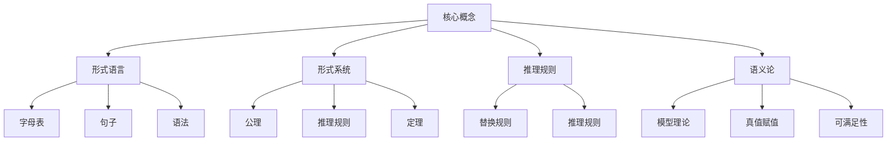

# 数理逻辑：第二章 逻辑演算的系统特征

## 1. 背景介绍

### 1.1 问题的由来

在数理逻辑领域中,逻辑演算是一种形式化的推理系统,用于检验论证的有效性和推论的正确性。逻辑演算的系统特征是指逻辑演算在形式化推理过程中所具备的一些基本性质和特点,这些特征决定了逻辑演算的可靠性、一致性和完备性。

随着计算机科学和人工智能技术的快速发展,逻辑演算在自动推理、知识表示、程序验证等领域发挥着越来越重要的作用。因此,深入研究逻辑演算的系统特征,对于构建可靠、高效的推理系统和智能系统具有重要意义。

### 1.2 研究现状

经典逻辑演算的系统特征研究可以追溯到20世纪初期,当时数理逻辑学家们对命题逻辑和谓词逻辑的形式化系统进行了深入探索。戈德尔(Gödel)等人的不完备性定理和其他重要结果,为逻辑演算的系统特征奠定了坚实的理论基础。

近年来,随着非经典逻辑(如模态逻辑、模糊逻辑等)的兴起,逻辑演算的系统特征研究也得到了进一步拓展。同时,计算机科学和人工智能领域对逻辑演算提出了新的需求和挑战,促进了相关理论和方法的不断创新。

### 1.3 研究意义

深入研究逻辑演算的系统特征,对于以下几个方面具有重要意义:

1. **理论基础**:为构建可靠、一致和完备的形式化推理系统提供坚实的理论支撑。
2. **应用价值**:逻辑演算广泛应用于自动推理、知识表示、程序验证等领域,研究其系统特征有助于提高这些应用的效率和可靠性。
3. **智能系统**:人工智能系统通常需要进行复杂的推理和决策,研究逻辑演算的系统特征有助于构建更加智能和可靠的人工智能系统。
4. **计算复杂性**:逻辑演算的系统特征与计算复杂性密切相关,对于优化算法和提高计算效率具有重要意义。

### 1.4 本文结构

本文将全面探讨逻辑演算的系统特征,内容安排如下:

1. 介绍逻辑演算的基本概念和核心理论。
2. 详细阐述逻辑演算的系统特征,包括可靠性、一致性、完备性等。
3. 分析逻辑演算系统特征在实际应用中的作用和影响。
4. 探讨逻辑演算系统特征的未来发展趋势和挑战。

## 2. 核心概念与联系

在深入探讨逻辑演算的系统特征之前,我们需要先了解一些核心概念和理论基础。

1. **形式语言**:逻辑演算是基于形式语言进行操作的。形式语言由字母表、句子和语法规则组成,用于表示逻辑表达式和公式。

2. **形式系统**:逻辑演算是一种形式系统,由一组公理、推理规则和定理组成。公理是系统的基础假设,推理规则用于从公理和已证明的定理推导出新的定理。

3. **推理规则**:推理规则是逻辑演算中的核心部分,它规定了如何从前提推导出结论。常见的推理规则包括替换规则(如模合式推理)和推理规则(如归谬法)。

4. **语义论**:语义论研究逻辑表达式和公式的意义,包括模型理论、真值赋值和可满足性等概念。它为逻辑演算提供了语义基础,确保推理过程的正确性和有效性。

这些核心概念相互关联,共同构成了逻辑演算的理论基础。掌握这些概念对于理解逻辑演算的系统特征至关重要。

## 3. 核心算法原理 & 具体操作步骤

### 3.1 算法原理概述

逻辑演算的核心算法原理是基于形式系统和推理规则进行推导和验证。算法的主要步骤包括:

1. 构建形式语言,定义字母表、句子和语法规则。
2. 建立形式系统,确定公理和推理规则。
3. 使用推理规则从公理和已证明的定理推导出新的定理。
4. 验证推导过程的正确性,确保遵循形式系统的规则。
5. 对推导结果进行语义解释,确保其符合预期的逻辑意义。

该算法的关键在于正确应用推理规则,并保证推导过程的一致性和完备性。算法的输入是形式系统和初始公理,输出是一系列推导出的定理。

### 3.2 算法步骤详解

1. **构建形式语言**

   - 定义字母表,包括逻辑连接词、量词、变元等符号。
   - 确定句子的语法规则,规定如何组合符号形成合法的逻辑公式。
   - 建立语法分析器,用于验证句子的合法性。

2. **建立形式系统**

   - 选择合适的逻辑系统,如命题逻辑、谓词逻辑或其他非经典逻辑。
   - 确定公理集合,作为推理的起点。
   - 规定推理规则,如模合式推理、归谬法等。

3. **推导定理**

   - 从公理开始,应用推理规则推导出新的定理。
   - 每一步推导都必须严格遵循推理规则。
   - 记录推导过程,形成推导序列。

4. **验证正确性**

   - 检查推导序列中每一步是否符合推理规则。
   - 确保推导过程的一致性,避免出现矛盾。
   - 使用元理论(如Cut消去定理)验证推导的正确性。

5. **语义解释**

   - 构建逻辑公式的语义模型。
   - 对推导结果进行真值赋值和可满足性分析。
   - 确保推导结果符合预期的逻辑意义。

该算法可以通过计算机程序实现自动化推理,也可以由人工进行推导和验证。算法的正确性和效率对于构建可靠的推理系统至关重要。

### 3.3 算法优缺点

**优点:**

1. **形式化**:算法基于严格的形式系统和推理规则,确保推导过程的严谨性和一致性。
2. **可靠性**:通过验证推导正确性,算法可以产生可靠的推理结果。
3. **自动化**:算法可以通过计算机程序实现自动推理,提高效率。
4. **通用性**:算法适用于不同的逻辑系统,如命题逻辑、谓词逻辑等。

**缺点:**

1. **复杂性**:对于复杂的逻辑公式和推理过程,算法可能会变得非常复杂和低效。
2. **局限性**:算法只能在给定的形式系统内进行推理,无法处理一些非形式化的推理问题。
3. **可解释性**:推导过程可能难以为人类理解,特别是对于复杂的推理序列。
4. **语义缺失**:算法本身无法直接处理语义信息,需要额外的语义模型和解释。

总的来说,逻辑演算算法在形式化推理领域具有重要作用,但也存在一定局限性。在实际应用中,需要根据具体问题选择合适的算法和优化策略。

### 3.4 算法应用领域

逻辑演算算法在以下领域有着广泛的应用:

1. **自动定理证明**:在数学、逻辑和计算机科学领域,自动定理证明系统可以使用逻辑演算算法来证明定理和验证程序正确性。

2. **知识表示与推理**:在人工智能领域,逻辑演算算法被用于构建知识表示系统和推理引擎,支持智能决策和问答系统。

3. **程序验证**:在软件工程领域,逻辑演算算法可以用于形式化验证程序的正确性,确保软件系统的可靠性。

4. **硬件验证**:在计算机硬件设计中,逻辑演算算法被用于验证数字电路和处理器设计的正确性。

5. **形式化方法**:在系统建模和分析领域,逻辑演算算法是形式化方法的重要组成部分,用于建立系统模型并进行验证和推理。

6. **非单调推理**:在人工智能推理领域,逻辑演算算法被应用于非单调推理系统,处理不完全信息和可修订的知识库。

7. **计算复杂性理论**:逻辑演算算法在计算复杂性理论中发挥着重要作用,用于分析和证明算法的计算复杂性。

总之,逻辑演算算法在许多涉及形式化推理和验证的领域都有着广泛的应用,是构建可靠和智能系统的重要工具。

## 4. 数学模型和公式 & 详细讲解 & 举例说明

### 4.1 数学模型构建

在逻辑演算中,我们需要构建数学模型来表示和操作逻辑公式。常见的数学模型包括:

1. **语法树**:将逻辑公式表示为树状结构,每个节点代表一个逻辑运算符或原子公式。

2. **序列表示**:使用序列或字符串来表示逻辑公式,如前缀表示法(Polish Notation)或后缀表示法(Reverse Polish Notation)。

3. **集合论模型**:将逻辑公式看作集合论中的集合操作,如并集、交集和补集等。

4. **关系模型**:使用关系代数和关系演算来表示和操作逻辑公式。

5. **图模型**:将逻辑公式表示为有向无环图或其他图形结构。

这些数学模型为逻辑演算提供了形式化的表示和操作方式,使得推理过程可以通过数学运算和算法来实现。选择合适的数学模型对于算法的效率和可扩展性至关重要。

### 4.2 公式推导过程

在逻辑演算中,公式推导过程是通过应用推理规则从已知公式推导出新公式的过程。常见的推理规则包括:

1. **模合式推理**:根据模合式推理规则,从前提推导出结论。例如,在命题逻辑中,从 $P \rightarrow Q$ 和 $P$ 可以推导出 $Q$。

2. **归谬法**:假设结论的否定为真,通过推导出矛盾来证明结论的正确性。

3. **全称实例化**:从全称量词公式推导出特定实例的公式。

4. **存在实例化**:从存在量词公式推导出特定实例的公式。

5. **等词消去**:通过消去两个相同的词项来简化公式。

6. **重言式引入**:引入一个等价的重言式(冗余公式)来辅助推理。

7. **替换规则**:根据等价变换规则,用等价的公式替换部分公式。

推导过程可以表示为一系列应用推理规则的步骤,形成一个推导序列。推导序列的正确性需要通过验证每一步都符合相应的推理规则来确保。

以命题逻辑为例,我们可以使用模合式推理规则推导出新的定理:

$$
\begin{align*}
&(1) &&P \rightarrow Q &&\text{前提} \\
&(2) &&Q \rightarrow R &&\text{前提} \\
&(3) &&P &&\text{前提} \\
&(4) &&Q &&\text{从 (1) 和 (3) 应用模合式推理} \\
&(5) &&R &&\text{从 (2) 和 (4) 应用模合式推理} \\