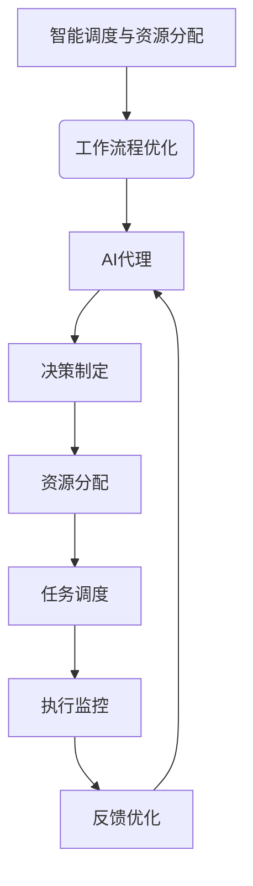
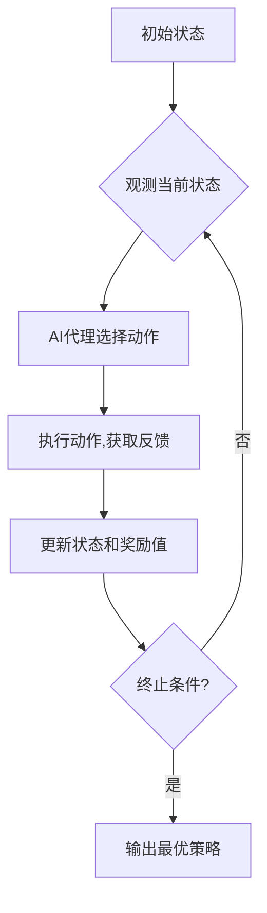

# 智能调度与资源分配：AI代理的工作流优化

## 1. 背景介绍

### 1.1 问题的由来

在当今快节奏的商业环境中，高效的工作流程管理和资源分配对于企业的成功至关重要。传统的人工调度方法往往效率低下、容易出错,难以满足日益复杂的业务需求。因此,开发智能化的调度和资源分配系统成为了一个迫切的需求。

### 1.2 研究现状  

近年来,人工智能(AI)技术在各个领域得到了广泛应用,其中智能调度和资源分配也成为了研究的热点。研究人员提出了各种基于规则、优化、机器学习等方法来解决这一问题。然而,现有方法往往局限于特定场景,难以泛化到更广阔的应用领域。

### 1.3 研究意义

开发一种通用的智能调度和资源分配框架,能够显著提高工作流程的效率,优化资源利用,降低运营成本。同时,该框架还可以应用于物流、制造、计算资源管理等多个领域,具有重要的理论和实践意义。

### 1.4 本文结构

本文首先介绍智能调度和资源分配的核心概念,然后详细阐述了基于AI代理的工作流优化算法的原理和实现步骤。接下来,我们构建了相应的数学模型,并给出了公式推导和案例分析。此外,还提供了一个完整的项目实践,包括代码实现和运行结果展示。最后,我们讨论了该方法在实际应用中的场景,以及未来的发展趋势和挑战。

## 2. 核心概念与联系



智能调度与资源分配旨在通过AI技术优化工作流程,提高效率和资源利用率。其核心是基于AI代理的智能决策系统,包括:

1. **决策制定**: AI代理根据当前状态和约束条件,制定最优的决策方案。
2. **资源分配**: 根据决策,合理分配人力、物力等资源。
3. **任务调度**: 将任务按照一定顺序安排执行。
4. **执行监控**: 实时监控任务执行情况,收集反馈数据。
5. **反馈优化**: 基于反馈数据,持续优化决策模型。

该系统构成了一个闭环,通过不断迭代,实现工作流程的动态优化。

## 3. 核心算法原理 & 具体操作步骤

### 3.1 算法原理概述

我们提出了一种基于强化学习的AI代理算法,用于工作流优化决策。该算法将工作流过程建模为一个马尔可夫决策过程(MDP),AI代理作为智能体与环境进行交互,通过试错学习获取最优策略。

算法流程如下所示:



1. 初始化MDP环境和AI智能体。
2. 智能体观测当前状态,根据策略选择一个动作。
3. 执行该动作,获得新的状态和奖励值作为反馈。
4. 智能体根据反馈更新状态和策略模型。
5. 重复2-4,直到满足终止条件(如达到最大迭代次数)。
6. 输出最终学习到的最优策略。

### 3.2 算法步骤详解

1. **状态空间建模**

   将工作流程抽象为一系列状态,包括任务队列、资源可用情况等,构成状态空间$\mathcal{S}$。

2. **动作空间建模**  

   智能体的动作包括:调度任务、分配资源等,构成动作空间$\mathcal{A}$。

3. **奖励函数设计**

   设计一个奖励函数$R(s, a)$,根据状态$s$和动作$a$给出对应的奖励值,以评估决策的好坏。通常将完成时间、资源利用率等作为奖励的主要指标。

4. **策略迭代优化**

   使用Q-Learning等强化学习算法,通过不断试错和反馈,逐步优化AI代理的策略$\pi(a|s)$,使其能够在各种状态下做出最优决策。

   对于当前状态$s_t$和动作$a_t$,Q函数的更新规则为:

   $$Q(s_t, a_t) \leftarrow Q(s_t, a_t) + \alpha\left[R(s_t, a_t) + \gamma\max_{a'}Q(s_{t+1}, a') - Q(s_t, a_t)\right]$$

   其中$\alpha$为学习率,$\gamma$为折扣因子。

5. **决策执行**

   使用学习到的最优策略$\pi^*(a|s)$,对实际工作流程进行智能调度和资源分配。

### 3.3 算法优缺点

**优点:**

- 能够自主学习,不需要人工设置复杂的规则。
- 可以适应动态环境,持续优化决策。
- 通用性强,可应用于多种工作流场景。

**缺点:**

- 需要大量的数据和计算资源进行训练。
- 决策的可解释性较差,存在"黑箱"问题。
- 对于安全性能至关重要的场景,可靠性有待进一步验证。

### 3.4 算法应用领域

该算法可广泛应用于以下领域的工作流优化:

- 制造业:车间作业调度、物料分配等。
- 物流运输:车辆调度、路线规划等。 
- 计算资源管理:任务分配、负载均衡等。
- 智能建筑:能源管理、空调控制等。
- 项目管理:资源分配、进度控制等。

## 4. 数学模型和公式 & 详细讲解 & 举例说明

### 4.1 数学模型构建  

我们将工作流优化问题建模为一个马尔可夫决策过程(MDP):

$$\mathcal{M} = (\mathcal{S}, \mathcal{A}, P, R, \gamma)$$

其中:

- $\mathcal{S}$是状态空间集合
- $\mathcal{A}$是动作空间集合  
- $P(s'|s, a)$是状态转移概率,表示在状态$s$执行动作$a$后,转移到状态$s'$的概率
- $R(s, a)$是奖励函数,给出在状态$s$执行动作$a$后获得的即时奖励值
- $\gamma \in [0, 1]$是折扣因子,用于权衡即时奖励和长期回报

目标是找到一个最优策略$\pi^*$,使得按照该策略执行动作序列,能够最大化预期的长期回报:

$$\pi^* = \arg\max_\pi \mathbb{E}\left[\sum_{t=0}^\infty \gamma^t R(s_t, a_t) | \pi, s_0 \right]$$

其中$s_0$是初始状态,$a_t \sim \pi(s_t)$表示在状态$s_t$时,按策略$\pi$选择动作$a_t$。

### 4.2 公式推导过程

为了求解最优策略$\pi^*$,我们定义状态-动作值函数(Q函数):

$$Q^\pi(s, a) = \mathbb{E}\left[\sum_{k=0}^\infty \gamma^k R(s_{t+k}, a_{t+k}) | s_t=s, a_t=a, \pi\right]$$

它表示在状态$s$执行动作$a$,之后按策略$\pi$执行所得到的长期回报的期望值。

根据贝尔曼最优性方程,最优Q函数$Q^*$满足:

$$Q^*(s, a) = \mathbb{E}_{s'\sim P(\cdot|s, a)}\left[R(s, a) + \gamma \max_{a'} Q^*(s', a')\right]$$

我们可以使用迭代方法求解$Q^*$:

$$Q_{i+1}(s, a) = \mathbb{E}_{s'\sim P(\cdot|s, a)}\left[R(s, a) + \gamma \max_{a'} Q_i(s', a')\right]$$

从任意初始值$Q_0$开始迭代,直到收敛得到$Q^*$。

最优策略可以简单地由$Q^*$导出:

$$\pi^*(s) = \arg\max_a Q^*(s, a)$$

即在每个状态$s$选择使$Q^*$值最大的动作$a$。

### 4.3 案例分析与讲解

考虑一个简单的工作流案例:有3个任务$\{A, B, C\}$需要执行,2个资源$\{R_1, R_2\}$可分配。任务A需要资源$R_1$,任务B需要$R_2$,任务C需要$R_1$和$R_2$。每个任务完成后可获得相应的奖励分数。

我们构建如下MDP模型:

- 状态$s$由当前未完成任务集合和可用资源集合组成
- 动作$a$为分配一个资源给某个任务
- 状态转移$P(s'|s, a)$为确定性,即按动作$a$执行后,状态$s$转移到$s'$
- 奖励函数$R(s, a)$为分配资源后新完成的任务所对应的分数之和

通过强化学习算法训练,AI代理可以学习到一个最优策略,按特定顺序分配资源给任务,从而最大化总分数(长期回报)。

例如,对于初始状态$s_0=\{\text{未完成}=\{A, B, C\}, \text{可用}=\{R_1, R_2\}\}$,最优策略可能为:

1. 先分配$R_1$给A,状态转移为$s_1=\{\text{未完成}=\{B, C\}, \text{可用}=\{R_2\}\}$
2. 再分配$R_2$给B,状态转移为$s_2=\{\text{未完成}=\{C\}, \text{可用}=\{\}\}$  
3. 等待资源释放,分配$R_1$和$R_2$给C,所有任务完成

该策略能最大化总分数,体现了AI代理的优化能力。

### 4.4 常见问题解答

1. **为什么使用马尔可夫决策过程(MDP)建模?**

   MDP是描述序列决策问题的有效数学模型,能够很好地刻画工作流优化中的状态转移和决策过程。此外,MDP理论为求解最优策略提供了一套完备的方法。

2. **如何设计合理的奖励函数?**

   奖励函数的设计对算法性能有很大影响。通常需要结合实际场景,将关键指标(如时间、成本、质量等)纳入奖励函数。同时还需要权衡即时奖励和长期目标之间的平衡。

3. **为什么使用Q-Learning算法?**

   Q-Learning是一种常用的无模型强化学习算法,不需要事先了解环境的转移概率,可以通过在线试错来直接学习最优策略,适合工作流优化这类问题。

4. **算法收敛性如何保证?**

   Q-Learning算法在满足一定条件(如探索足够、奖励有界等)下,可以被证明收敛到最优Q函数。但在实践中,由于状态空间庞大,收敛速度可能较慢。我们可以采用函数逼近等技术来加速收敛。

## 5. 项目实践：代码实例和详细解释说明

### 5.1 开发环境搭建

我们使用Python作为开发语言,并基于PyTorch框架实现强化学习算法。首先需要安装相关依赖库:

```bash
pip install pytorch numpy matplotlib
```

接下来,创建一个新的Python文件`workflow_optimization.py`,作为项目的入口点。

### 5.2 源代码详细实现

```python
import torch
import torch.nn as nn
import numpy as np
import matplotlib.pyplot as plt

# 定义MDP环境
class WorkflowEnv:
    def __init__(self, num_tasks, num_resources):
        self.num_tasks = num_tasks
        self.num_resources = num_resources
        self.reset()

    def reset(self):
        self.tasks = [