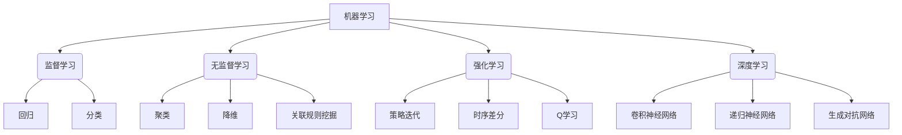

以下是《机器学习 原理与代码实例讲解》的正文内容，严格遵循了您提供的约束条件和文章结构模板:

# 机器学习 原理与代码实例讲解

## 1. 背景介绍

### 1.1 问题的由来

在当今的数据时代,海量数据的产生和积累已经成为一种常态。如何从这些原始数据中发现有价值的信息和知识,并将其应用于实际问题的解决,成为了各行业亟待突破的瓶颈。传统的基于规则的方法在处理复杂数据时往往力不从心,而机器学习作为一种数据驱动的方法,凭借其强大的模式识别和预测能力,为解决这一难题带来了全新的契机。

### 1.2 研究现状  

机器学习作为人工智能的一个重要分支,近年来发展迅猛,在语音识别、计算机视觉、自然语言处理、推荐系统等诸多领域取得了突破性的进展。随着深度学习等新型算法的不断涌现,机器学习的能力也在不断扩展,展现出广阔的应用前景。然而,机器学习算法的原理和实现细节往往较为复杂,给学习者带来了一定的挑战。

### 1.3 研究意义

本文旨在为读者提供一个全面而深入的机器学习导论,系统阐述机器学习的核心概念、算法原理、数学基础,并辅以大量的代码实例,力求通过理论和实践的紧密结合,帮助读者牢固掌握机器学习的方方面面。无论您是机器学习的初学者,还是经验丰富的从业者,相信都能在本文中获益匪浅。

### 1.4 本文结构

本文共分为九个部分:第一部分介绍机器学习的背景和研究意义;第二部分阐述机器学习的核心概念及其内在联系;第三部分深入探讨常见机器学习算法的原理和实现步骤;第四部分着重解析机器学习中的数学模型和公式推导;第五部分提供详细的代码实例及解释说明;第六部分介绍机器学习在实际应用中的场景;第七部分推荐相关的学习资源和开发工具;第八部分总结机器学习的发展趋势和面临的挑战;最后一部分则列出常见问题及其解答。

## 2. 核心概念与联系



机器学习可以分为监督学习、无监督学习、强化学习和深度学习四大类:

1. **监督学习**是机器学习中最常见的一种范式,其目标是基于已知的输入和输出数据,学习一个从输入到输出的映射函数。监督学习可以进一步分为回归和分类两种任务。

2. **无监督学习**则是从未标记的原始数据中发现隐藏的模式或内在结构,常见的无监督学习任务包括聚类、降维和关联规则挖掘等。

3. **强化学习**是一种基于环境交互的学习范式,智能体通过不断尝试并根据环境反馈调整策略,最终学习到一个在给定环境中表现良好的策略。强化学习常用于决策过程控制、游戏AI等领域。

4. **深度学习**是机器学习的一个新兴热点方向,它基于人工神经网络,通过构建深层次的网络结构对数据建模,在计算机视觉、自然语言处理等领域表现出了卓越的性能。

这四大类机器学习方法相互关联、相辅相成,共同推动着机器学习技术的发展和应用。

## 3. 核心算法原理 & 具体操作步骤  

### 3.1 算法原理概述

机器学习算法的核心思想是从数据中习得一个模型,使其能够对未知的新数据做出准确的预测或判断。根据所使用的模型形式的不同,机器学习算法可以分为多种类型,包括:

- **线性模型**: 利用线性函数对数据建模,如线性回归、逻辑回归等。
- **树模型**: 基于决策树的算法,如随机森林、梯度提升树等。  
- **核方法**: 通过核技巧将数据隐式映射到高维空间,如支持向量机。
- **贝叶斯方法**: 基于贝叶斯理论对数据进行概率建模,如朴素贝叶斯、高斯过程等。
- **实例方法**: 直接基于训练数据对新数据进行预测,如k近邻算法。
- **神经网络**: 模仿生物神经网络对数据建模,如前馈神经网络、卷积神经网络等。

不同的算法适用于不同的任务和数据类型,需要根据具体问题选择合适的算法。

### 3.2 算法步骤详解

以线性回归为例,我们来详细介绍一个典型机器学习算法的工作流程:

1. **数据预处理**: 对原始数据进行清洗、标准化等预处理,确保数据质量。
2. **特征工程**: 从原始数据中提取或构造对问题有意义的特征向量。  
3. **拆分数据集**: 将数据集拆分为训练集和测试集两部分。
4. **模型训练**: 使用训练集数据,通过最小化损失函数(如均方误差)的方式,学习线性回归模型的参数(权重和偏置)。
5. **模型评估**: 在测试集上评估训练好的模型的性能指标,如均方根误差。
6. **模型调优**: 根据评估结果,通过调整超参数、特征选择等方式优化模型。
7. **模型应用**: 将训练好的模型应用于新的未知数据,对其做出预测。

上述步骤反映了机器学习算法的一般工作流程,具体的算法细节和优化策略因算法而异。

### 3.3 算法优缺点

每种机器学习算法都有其适用场景和局限性:

- **线性模型**简单易学,可解释性强,但只能学习线性模式。
- **树模型**能自动捕获特征之间的非线性关系和交互作用,但容易过拟合。
- **核方法**通过核技巧能学习非线性模式,但计算代价较高且选择合适的核函数较为困难。
- **贝叶斯方法**能很好地处理数据噪声和缺失值,但往往需要做出一些先验假设。
- **实例方法**直观易懂,无需训练过程,但对数据质量和维度敏感。
- **神经网络**具有强大的拟合能力,能自动从数据中学习特征表示,但需要大量数据并易陷入过拟合。

因此,在实际应用中需要根据具体问题的特点和数据的性质,选择合适的机器学习算法并进行调优。

### 3.4 算法应用领域

机器学习算法在诸多领域得到了广泛应用,主要包括但不限于:

- **计算机视觉**: 图像分类、目标检测、语义分割等。
- **自然语言处理**: 机器翻译、文本分类、情感分析等。
- **推荐系统**: 个性化推荐、协同过滤等。
- **金融**: 信用评分、欺诈检测、风险管理等。
- **医疗健康**: 疾病诊断、药物发现、医疗影像分析等。
- **制造业**: 预测性维护、质量控制、工艺优化等。
- **交通运输**: 智能交通系统、路径规划、自动驾驶等。

可以说,机器学习已经深深地融入到了我们生活和工作的方方面面,并将持续推动着人工智能技术的发展。

## 4. 数学模型和公式 & 详细讲解 & 举例说明

### 4.1 数学模型构建

机器学习算法通常基于一定的数学模型对数据进行建模和分析。以线性回归为例,我们可以将其数学模型表示为:

$$y = w_1x_1 + w_2x_2 + ... + w_nx_n + b$$

其中:
- $y$是连续的目标变量或响应变量
- $x_1, x_2, ..., x_n$是自变量或特征变量
- $w_1, w_2, ..., w_n$是各个特征对应的权重系数
- $b$是偏置项或截距项

该模型的目标是通过从训练数据中学习最优的权重系数$w_i$和偏置项$b$,使得模型对新数据的预测值$\hat{y}$尽可能接近真实值$y$。

### 4.2 公式推导过程

在线性回归中,我们通常采用最小二乘法来学习模型参数,即最小化预测值与真实值之间的均方误差:

$$J(w,b) = \frac{1}{2m}\sum_{i=1}^{m}(y^{(i)} - \hat{y}^{(i)})^2$$

其中$m$是训练样本的数量。通过对$J(w,b)$关于$w$和$b$分别求偏导,并令偏导数等于0,我们可以得到如下公式:

$$w = (X^TX)^{-1}X^Ty\\b = \frac{1}{m}\sum_{i=1}^{m}(y^{(i)} - w^Tx^{(i)})$$

这里$X$是特征矩阵,$y$是目标变量向量。上式给出了学习最优参数$w$和$b$的解析解。

### 4.3 案例分析与讲解

为了更好地理解线性回归模型,我们来看一个实际案例。假设我们想根据一个城市的人口数量和平均年收入,预测该城市的房价中位数。

设$x_1$为人口数量(单位:万人),$x_2$为平均年收入(单位:千美元),则线性回归模型可以写作:

$$\text{房价中位数} = w_1 \times x_1 + w_2 \times x_2 + b$$

利用某城市的历史数据,我们可以学习到最优参数:$w_1 = 0.23, w_2 = 0.58, b = 180$。那么对于一个新城市,人口数量为50万,平均年收入为65千美元,根据模型预测的房价中位数为:

$$\hat{y} = 0.23 \times 50 + 0.58 \times 65 + 180 = 248.5 (千美元)$$

通过这个例子,我们可以直观地感受到线性回归模型的工作原理和应用场景。

### 4.4 常见问题解答

**Q: 为什么要最小化均方误差?**

A: 均方误差(MSE)是一种常用的评估回归模型性能的指标,它对于异常值较为敏感。最小化MSE可以确保模型对大多数样本的预测都较为准确,从而获得较好的泛化性能。

**Q: 线性回归的局限性是什么?**

A: 线性回归模型只能学习特征与目标变量之间的线性关系,如果它们之间存在非线性关系,线性回归的性能将受到限制。此外,线性回归对异常值也较为敏感。

**Q: 如何处理特征之间的多重共线性问题?**

A: 可以采取如下策略:1)特征选择,移除冗余特征;2)主成分分析,将原特征线性组合为新的正交特征;3)岭回归或Lasso回归,引入正则化项对共线性问题进行缓解。

## 5. 项目实践:代码实例和详细解释说明

### 5.1 开发环境搭建

在实现线性回归算法之前,我们需要先搭建开发环境。本例使用Python作为编程语言,并利用NumPy、Matplotlib等常用科学计算库。你可以通过Anaconda发行版一站式安装所需的Python环境。

### 5.2 源代码详细实现 

```python
import numpy as np
import matplotlib.pyplot as plt

# 生成模拟数据
X = 2 * np.random.rand(100, 1)
y = 4 + 3 * X + np.random.randn(100, 1)