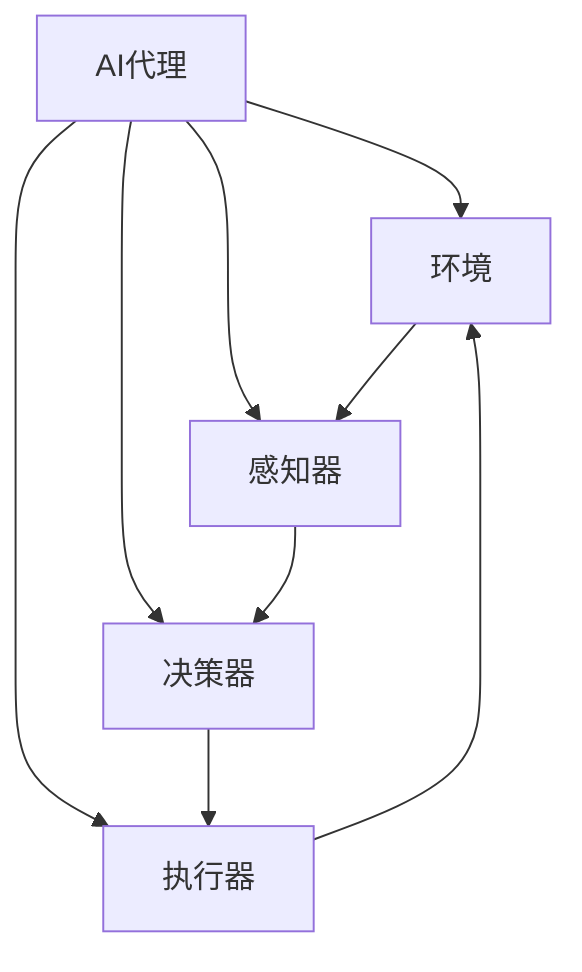

# 构建AI代理：从需求收集到工作流实现

## 1. 背景介绍

### 1.1 问题的由来

在当今数字化时代，人工智能(AI)技术已经渗透到各个领域,成为推动创新和提高效率的关键驱动力。随着AI系统的复杂性与应用场景的多样化,有效地构建和管理AI代理(AI Agent)变得至关重要。AI代理是一种自主系统,能够感知环境、处理信息、做出决策并采取行动,以完成特定任务。然而,从需求收集到工作流实现的过程中,存在诸多挑战和复杂性。

### 1.2 研究现状

目前,AI代理的构建主要依赖于传统的软件工程方法,结合机器学习和人工智能技术。研究人员已经提出了各种架构模式、开发框架和工具,以简化AI代理的设计和实现过程。然而,由于AI系统的动态性和不确定性,传统的软件工程实践往往难以完全满足AI代理的需求。

### 1.3 研究意义

构建高质量、可靠和可扩展的AI代理对于实现智能系统的全面发展至关重要。通过深入研究AI代理的需求收集、设计、实现和部署过程,我们可以更好地理解和应对相关挑战,提高AI系统的性能、安全性和可维护性。此外,建立一个系统化的AI代理构建方法论,将有助于推动AI技术在各个领域的广泛应用。

### 1.4 本文结构

本文将全面探讨AI代理的构建过程,从需求收集到工作流实现。我们将介绍AI代理的核心概念、算法原理、数学模型,并通过实际案例和代码示例,详细阐述AI代理的设计和实现方法。最后,我们将分析AI代理的实际应用场景、未来发展趋势和面临的挑战。

## 2. 核心概念与联系

在构建AI代理之前,我们需要了解一些核心概念及其相互关系。这些概念为AI代理的设计和实现奠定了基础。



1. **AI代理(AI Agent)**: AI代理是一种自主系统,能够感知环境、处理信息、做出决策并采取行动,以完成特定任务。它是AI系统的核心组成部分。

2. **环境(Environment)**: 环境是AI代理所处的外部世界,包括物理环境和虚拟环境。AI代理需要与环境进行交互,感知环境状态并对环境产生影响。

3. **感知器(Sensor)**: 感知器是AI代理用于获取环境信息的组件。它可以是物理传感器(如相机、雷达等)或虚拟传感器(如数据流、API等)。

4. **决策器(Decision Maker)**: 决策器是AI代理的大脑,负责根据感知到的环境信息和内部状态,做出合理的决策。它通常采用机器学习、规则引擎或其他决策算法来实现。

5. **执行器(Actuator)**: 执行器是AI代理用于对环境产生影响的组件。它可以是物理执行器(如机器人手臂、无人机等)或虚拟执行器(如API调用、数据写入等)。

这些核心概念紧密相连,构成了AI代理与环境之间的交互循环。AI代理通过感知器获取环境信息,决策器根据这些信息做出决策,执行器则根据决策对环境产生影响,从而形成一个闭环系统。

## 3. 核心算法原理 & 具体操作步骤

### 3.1 算法原理概述

构建AI代理涉及多种算法和技术,其中一些核心算法原理如下:

1. **感知算法**: 用于从环境中获取和处理数据,如计算机视觉、自然语言处理、信号处理等。

2. **决策算法**: 用于根据感知到的信息做出决策,如机器学习、规则引擎、优化算法等。

3. **规划算法**: 用于生成行动序列以实现目标,如启发式搜索、动态规划、强化学习等。

4. **执行算法**: 用于将决策转化为对环境的实际操作,如运动规划、控制算法等。

5. **学习算法**: 用于从经验中提取知识,改进决策和行动,如监督学习、无监督学习、强化学习等。

这些算法通常会相互结合,形成一个完整的AI代理系统。

### 3.2 算法步骤详解

构建AI代理的算法步骤可概括为以下几个阶段:

1. **感知阶段**:
   - 从环境中获取原始数据(如图像、语音、传感器读数等)
   - 预处理数据(如降噪、特征提取等)
   - 将预处理后的数据转换为AI代理可理解的形式

2. **决策阶段**:
   - 根据感知到的信息和内部状态,运行决策算法(如机器学习模型、规则引擎等)
   - 生成行动计划或决策

3. **规划阶段**:
   - 根据决策,运行规划算法(如搜索算法、动态规划等)
   - 生成一系列行动序列以实现目标

4. **执行阶段**:
   - 将行动序列转换为对环境的具体操作
   - 通过执行器(如机器人手臂、API调用等)对环境产生影响

5. **学习阶段**:
   - 从与环境的交互中收集经验数据
   - 运行学习算法(如监督学习、强化学习等)
   - 更新决策模型、规划策略或其他组件,以改进未来的行为

这些步骤形成一个闭环过程,AI代理不断地感知、决策、规划、执行和学习,以适应动态环境并完成任务。

### 3.3 算法优缺点

上述算法具有以下优缺点:

**优点**:
- 模块化设计,各个组件相对独立,易于维护和扩展
- 可以结合多种算法和技术,提高系统的灵活性和性能
- 支持在线学习,使AI代理能够不断适应环境变化

**缺点**:
- 算法之间的接口和数据转换可能会增加系统复杂性
- 决策和规划算法的计算成本可能较高,影响实时性
- 需要大量的训练数据和计算资源来支持学习算法

### 3.4 算法应用领域

上述算法原理和步骤可应用于各种AI代理场景,包括但不限于:

- 机器人系统(如工业机器人、服务机器人、无人驾驶等)
- 智能助理(如语音助手、聊天机器人等)
- 游戏AI(如游戏AI代理、AI对手等)
- 决策支持系统(如医疗诊断、金融投资等)
- 自动化系统(如流程自动化、智能制造等)

## 4. 数学模型和公式 & 详细讲解 & 举例说明

### 4.1 数学模型构建

在构建AI代理时,我们通常需要使用数学模型来描述和解决相关问题。以下是一些常见的数学模型:

1. **马尔可夫决策过程(MDP)模型**:
   - 用于描述一个完全可观测的、随机的决策过程
   - 可用于规划和强化学习算法
   - 由一组状态 $S$、一组行动 $A$、状态转移概率 $P(s'|s,a)$ 和奖励函数 $R(s,a,s')$ 组成

2. **部分可观测马尔可夫决策过程(POMDP)模型**:
   - 用于描述一个部分可观测的、随机的决策过程
   - 适用于存在观测噪声或隐藏状态的情况
   - 在MDP模型的基础上增加了观测集合 $\Omega$ 和观测概率 $P(o|s',a)$

3. **贝叶斯网络模型**:
   - 用于表示随机变量之间的条件独立性和因果关系
   - 可用于推理、决策和学习
   - 由一组随机变量 $X_1, X_2, \ldots, X_n$ 和有向无环图 $G$ 组成

4. **神经网络模型**:
   - 用于近似任意连续函数,常用于感知、决策和学习任务
   - 包括前馈神经网络、卷积神经网络、递归神经网络等
   - 由输入层、隐藏层和输出层组成,通过权重和激活函数连接

这些数学模型为AI代理的算法和系统提供了理论基础,并指导了具体的实现方法。

### 4.2 公式推导过程

下面以马尔可夫决策过程(MDP)为例,推导一些核心公式:

1. **状态值函数 $V(s)$**:
   - 表示在状态 $s$ 下,按照某策略 $\pi$ 行动所能获得的期望总奖励
   - 满足贝尔曼方程: $$V^{\pi}(s) = \sum_{a \in A}\pi(a|s)\left(R(s,a) + \gamma\sum_{s' \in S}P(s'|s,a)V^{\pi}(s')\right)$$
   - 其中 $\gamma \in [0,1)$ 是折现因子,用于权衡即时奖励和长期奖励

2. **行动值函数 $Q(s,a)$**:
   - 表示在状态 $s$ 下执行行动 $a$,然后按照某策略 $\pi$ 行动所能获得的期望总奖励
   - 满足贝尔曼方程: $$Q^{\pi}(s,a) = R(s,a) + \gamma\sum_{s' \in S}P(s'|s,a)\sum_{a' \in A}\pi(a'|s')Q^{\pi}(s',a')$$
   - 与状态值函数相比,行动值函数包含了执行初始行动 $a$ 的即时奖励

3. **最优策略 $\pi^*(s)$**:
   - 表示在每个状态 $s$ 下,选择能够最大化期望总奖励的行动
   - 满足: $$\pi^*(s) = \arg\max_{a \in A}Q^*(s,a)$$
   - 其中 $Q^*(s,a)$ 是最优行动值函数,满足: $$Q^*(s,a) = R(s,a) + \gamma\max_{a' \in A}\sum_{s' \in S}P(s'|s,a)Q^*(s',a')$$

这些公式为求解MDP问题、寻找最优策略奠定了理论基础。在实际应用中,我们可以使用动态规划、蒙特卡罗方法或其他算法来近似求解这些公式。

### 4.3 案例分析与讲解

考虑一个简单的机器人导航问题,机器人需要在一个二维网格世界中从起点移动到终点。每个网格单元可能有障碍物,机器人需要规划一条安全的路径到达目标。

我们可以将这个问题建模为一个MDP:

- 状态集合 $S$ 是所有可能的网格位置
- 行动集合 $A$ 是 \{上,下,左,右\} 四个移动方向
- 状态转移概率 $P(s'|s,a)$ 是机器人执行行动 $a$ 从状态 $s$ 转移到 $s'$ 的概率(考虑障碍物的影响)
- 奖励函数 $R(s,a,s')$ 可以设置为:
  - 到达终点时获得大的正奖励(如 +100)
  - 撞到障碍物时获得大的负奖励(如 -100)
  - 其他情况获得小的负奖励(如 -1,表示路径长度成本)

我们可以使用值迭代或策略迭代算法求解最优行动值函数 $Q^*(s,a)$,然后根据 $\pi^*(s) = \arg\max_{a \in A}Q^*(s,a)$ 得到最优策略。

例如,对于下面的网格世界:

```
###########
#S#       #
# # ##### #
# #   #   #
# ### # ###
#     #G  #
###########
```

其中 `S` 表示起点, `G` 表示终点, `#` 表示障碍物。使用值迭代算法求解后,我们可以得到如下最优路径:

```
###########
#S#-->-->-#
# # ##### #
# #-+-#-+-#
# ### # ###
#-<--#-#G #
###########
```

这