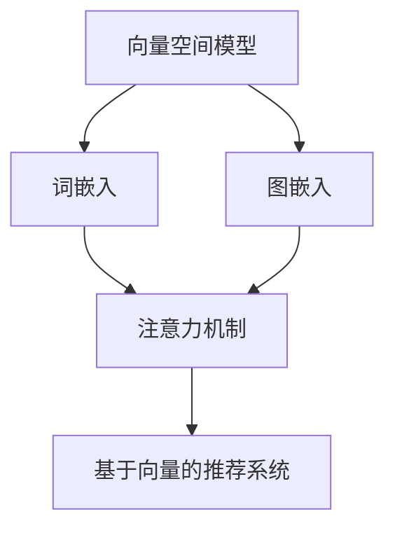

# 构建基于向量的推荐系统：提供个性化用户体验

## 1. 背景介绍

### 1.1 问题的由来

在当今信息过载的时代，用户面临着海量的选择。无论是在线购物、音乐流媒体还是视频点播服务，用户都被淹没在大量的选项中。这种信息过载不仅会导致用户遭受"选择恐惧症"的困扰,还会降低他们对产品或服务的满意度。因此,为用户提供个性化的推荐,帮助他们发现感兴趣的内容,成为了一个迫切的需求。

传统的推荐系统通常基于协同过滤算法,利用用户的历史行为数据(如浏览记录、购买记录等)来预测用户的偏好。然而,这种方法存在一些固有的缺陷,例如:

1. **冷启动问题**: 对于新用户或新产品,由于缺乏足够的历史数据,很难做出准确的推荐。
2. **数据稀疏性**: 由于用户行为数据的稀疏性,协同过滤算法的准确性会受到影响。
3. **解释能力差**: 协同过滤算法通常无法解释为什么会做出某些推荐,缺乏透明度。

为了解决这些问题,基于向量的推荐系统(Vector-based Recommendation Systems)应运而生。它利用自然语言处理(NLP)和机器学习技术,将用户和产品表示为向量,从而捕捉它们之间的语义相似性,为用户提供更加个性化和解释性的推荐。

### 1.2 研究现状

基于向量的推荐系统是一个相对新兴的研究领域,近年来受到了广泛关注。研究人员已经提出了多种基于向量的推荐算法,例如:

- **Word2Vec**: 将产品描述或用户评论等文本数据映射到向量空间,捕捉语义相似性。
- **Doc2Vec**: 将整个文档(如产品描述)映射为一个向量,用于相似性计算。
- **Node2Vec**: 将用户-产品交互数据表示为图,并将节点(用户或产品)映射为向量。
- **基于注意力机制的模型**: 利用注意力机制捕捉用户和产品之间的相关性。

这些算法已经在多个领域取得了不错的表现,如电子商务推荐、新闻推荐和社交媒体推荐等。然而,它们也面临一些挑战,例如:

1. **数据质量**: 向量表示的质量很大程度上依赖于训练数据的质量和数量。
2. **计算复杂度**: 一些复杂的模型(如基于注意力机制的模型)计算成本较高,难以应用于大规模数据集。
3. **可解释性**: 虽然比传统协同过滤算法更具解释能力,但一些模型的内在机制仍然是一个黑箱。

因此,设计更加高效和可解释的基于向量的推荐算法,是当前研究的一个重点方向。

### 1.3 研究意义

构建基于向量的推荐系统,对于提高用户体验和企业收益具有重要意义:

1. **提高用户满意度**: 个性化推荐可以帮助用户发现感兴趣的内容,提高他们的满意度和粘性。
2. **增加收入**: 准确的推荐可以提高转化率,从而为企业带来更多收入。
3. **提高决策效率**: 基于向量的推荐系统可以为用户提供解释性的推荐理由,提高他们的决策效率。
4. **降低获客成本**: 通过个性化推荐,企业可以更好地留住现有用户,降低获取新用户的成本。

此外,基于向量的推荐系统在其他领域也有广泛的应用前景,如个性化教育、医疗健康等。

### 1.4 本文结构

本文将详细介绍如何构建一个基于向量的推荐系统。文章主要内容包括:

1. 核心概念与联系
2. 核心算法原理及具体操作步骤
3. 数学模型和公式详细讲解及案例分析
4. 项目实践:代码实例和详细解释说明
5. 实际应用场景
6. 工具和资源推荐
7. 总结:未来发展趋势与挑战
8. 附录:常见问题与解答

接下来,我们将逐步深入探讨基于向量的推荐系统的方方面面。

## 2. 核心概念与联系

在深入探讨算法细节之前,我们先来了解一些核心概念及它们之间的联系。

### 2.1 向量空间模型

向量空间模型(Vector Space Model)是基于向量的推荐系统的基础。在这个模型中,每个文本文档(如产品描述、用户评论等)都被表示为一个向量,其中每个维度对应于一个特定的词项(term)。向量中的值通常是词项的加权统计值,如TF-IDF(Term Frequency-Inverse Document Frequency)。

通过将文档映射到向量空间,我们可以计算不同文档之间的相似度,从而发现相关的产品或用户。这种基于内容的相似性计算是基于向量的推荐系统的核心。

### 2.2 词嵌入

词嵌入(Word Embedding)是一种将单词映射到低维度向量空间的技术,它能够捕捉单词之间的语义相似性。常见的词嵌入模型包括Word2Vec、GloVe等。

在基于向量的推荐系统中,词嵌入被广泛用于表示用户评论、产品描述等文本数据。通过将文本映射为向量,我们可以更好地捕捉语义相似性,从而提高推荐的准确性。

### 2.3 图嵌入

图嵌入(Graph Embedding)是将图结构数据(如用户-产品交互图)映射到低维度向量空间的技术。常见的图嵌入模型包括Node2Vec、DeepWalk等。

在推荐系统中,我们可以将用户-产品交互数据建模为一个异构图,其中节点代表用户和产品,边代表它们之间的交互行为(如购买、浏览等)。通过图嵌入,我们可以获得用户和产品的向量表示,从而捕捉它们之间的潜在关系,并进行相似性计算和推荐。

### 2.4 注意力机制

注意力机制(Attention Mechanism)是一种允许模型动态地关注输入的不同部分的技术,它已被广泛应用于自然语言处理和计算机视觉等领域。

在基于向量的推荐系统中,注意力机制可以用于捕捉用户和产品之间的相关性。例如,在推荐过程中,模型可以动态地关注用户历史行为中与当前推荐场景相关的部分,从而提高推荐的准确性和个性化程度。

### 2.5 核心概念联系

上述核心概念密切相关,并在基于向量的推荐系统中发挥着重要作用:

1. 向量空间模型为基于向量的推荐系统奠定了基础,将文本数据映射为向量。
2. 词嵌入和图嵌入技术用于获取用户、产品等实体的向量表示,捕捉它们之间的语义相似性。
3. 注意力机制可以与词嵌入、图嵌入等技术相结合,提高模型对用户偏好和推荐场景的关注度,从而提升推荐的个性化水平。

这些概念的有机结合,使得基于向量的推荐系统能够提供更加准确、个性化和可解释的推荐服务。

## 3. 核心算法原理与具体操作步骤

### 3.1 算法原理概述

基于向量的推荐系统通常包括以下几个关键步骤:

1. **数据预处理**: 对用户行为数据、产品元数据等原始数据进行清洗和预处理,为后续的向量表示奠定基础。

2. **向量表示**: 利用词嵌入、图嵌入等技术,将用户、产品等实体映射为向量表示,捕捉它们之间的语义相似性。

3. **相似性计算**: 基于向量表示,计算用户与产品之间的相似度,作为推荐的依据。常用的相似度度量包括余弦相似度、欧几里得距离等。

4. **排序和过滤**: 根据相似度得分,对候选产品进行排序和过滤,选择最相关的产品作为推荐结果。

5. **模型优化**: 通过监督学习或者强化学习等方法,优化模型参数,提高推荐的准确性和个性化程度。

6. **在线服务**: 将训练好的模型部署到在线服务中,为用户提供实时的个性化推荐。

在实际应用中,基于向量的推荐系统可能会采用不同的架构和算法组合,以满足特定的业务需求和场景约束。下面我们将详细介绍一些常见的算法原理和具体操作步骤。

### 3.2 算法步骤详解

#### 3.2.1 数据预处理

数据预处理是构建高质量推荐系统的关键环节。常见的预处理步骤包括:

1. **数据清洗**: 去除重复数据、填充缺失值、处理异常值等。

2. **文本预处理**: 对产品描述、用户评论等文本数据进行分词、去停用词、词形还原等预处理。

3. **特征工程**: 从原始数据中提取有用的特征,如用户demographic信息、产品类别等,以丰富向量表示。

4. **数据切分**: 将数据集切分为训练集、验证集和测试集,用于模型训练和评估。

5. **负采样**: 由于用户行为数据通常是正样本(如购买记录),我们需要通过负采样生成负样本(如未购买的产品),以构建完整的训练数据集。

经过预处理后,我们可以获得高质量的数据集,为后续的向量表示和模型训练奠定基础。

#### 3.2.2 向量表示

向量表示是基于向量的推荐系统的核心环节,它决定了推荐的准确性和个性化程度。常见的向量表示技术包括:

1. **词嵌入(Word Embedding)**: 利用Word2Vec、GloVe等模型,将产品描述、用户评论等文本数据映射为向量表示,捕捉词项之间的语义相似性。

2. **图嵌入(Graph Embedding)**: 将用户-产品交互数据建模为异构图,利用Node2Vec、DeepWalk等模型,将用户和产品映射为向量表示,捕捉它们之间的潜在关系。

3. **融合表示(Fusion Representation)**: 将多种表示方式(如词嵌入、图嵌入、手工特征等)融合,形成更加丰富的向量表示。

在实际应用中,我们可以根据数据的特点和业务需求,选择合适的向量表示技术或者组合多种技术,以获取高质量的向量表示。

#### 3.2.3 相似性计算

获得向量表示后,我们需要计算用户和产品之间的相似度,作为推荐的依据。常用的相似度度量包括:

1. **余弦相似度(Cosine Similarity)**: 计算两个向量之间的夹角余弦值,值越大表示越相似。

2. **欧几里得距离(Euclidean Distance)**: 计算两个向量之间的欧几里得距离,距离越小表示越相似。

3. **皮尔逊相关系数(Pearson Correlation Coefficient)**: 计算两个向量之间的线性相关程度,值越接近1表示越相似。

4. **其他相似度度量**: 如Jaccard相似系数、Tanimoto系数等,可根据具体场景选择合适的度量方式。

除了传统的相似度度量,我们还可以利用深度学习模型直接学习用户和产品之间的相关性得分,作为推荐的依据。例如,基于注意力机制的模型可以动态地关注用户历史行为中与当前推荐场景相关的部分,从而提高推荐的个性化水平。

#### 3.2.4 排序和过滤

计算出用户与候选产品的相似度后,我们需要对候选产品进行排序和过滤,选择最相关的产品