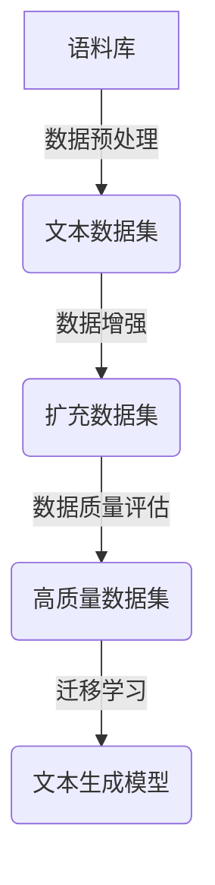

# 构建文本生成任务的数据集

## 1. 背景介绍

### 1.1 问题的由来

在自然语言处理(NLP)领域中,文本生成任务是一个极具挑战的课题。随着深度学习技术的不断发展,生成式模型已经能够产生令人惊叹的文本输出。然而,训练这些模型需要大量高质量的数据集,而构建这种数据集本身就是一个艰巨的任务。

传统的数据集构建方式通常依赖于人工标注,这种方式不仅成本高昂,而且效率低下。此外,人工标注的数据集往往存在偏差和噪声,影响模型的泛化能力。因此,如何高效、经济地构建大规模、高质量的文本生成数据集,成为了当前研究的重点课题。

### 1.2 研究现状

为了解决上述问题,研究人员提出了多种自动构建文本生成数据集的方法,包括:

1. **基于规则的方法**: 利用一系列预定义的规则来生成文本,如语法规则、模板等。这种方法生成的数据质量较高,但覆盖面较窄,难以捕捉自然语言的丰富性。

2. **基于检索的方法**: 从现有的大规模语料库中检索相关文本,并进行适当的处理和过滤。这种方法可以获取大量真实数据,但需要耗费大量人力进行筛选和清洗。

3. **基于生成的方法**: 利用现有的文本生成模型生成新的文本作为数据集。这种方法可以快速生成大量数据,但生成的数据质量难以保证,可能存在不自然和偏差的问题。

4. **基于游戏的方法**: 设计一些有趣的游戏场景,让人类参与者自然地生成文本数据。这种方法可以获取高质量的数据,但构建成本较高,且数据量有限。

5. **基于众包的方法**: 通过众包平台招募大量参与者,为特定任务生成文本数据。这种方法可以快速获取大量数据,但数据质量参差不齐,需要进一步的筛选和处理。

上述方法各有优缺点,研究人员正在探索将它们相结合的混合方案,以期获得更高质量、更大规模的文本生成数据集。

### 1.3 研究意义

构建高质量的文本生成数据集对于推动NLP技术的发展至关重要,具有以下重要意义:

1. **提高模型性能**: 高质量的数据集可以有效提升文本生成模型的训练效果,从而生成更加自然、流畅的文本输出。

2. **促进模型泛化**: 多样化的数据集有助于模型捕捉自然语言的丰富特征,提高模型在不同领域和场景的泛化能力。

3. **推动应用落地**: 文本生成技术在诸多领域都有广泛的应用前景,如机器写作、对话系统、创意写作等。高质量的数据集是实现这些应用的关键基础。

4. **降低数据成本**: 自动化的数据集构建方法可以显著降低人工标注的成本,为大规模数据集的构建提供了可能。

5. **促进算法创新**: 数据集构建过程中遇到的各种挑战,将促使研究人员开发出新颖的算法和方法,推动整个NLP领域的发展。

综上所述,构建高质量的文本生成数据集不仅是NLP研究的当务之急,也是推动人工智能技术发展的重要一环。

### 1.4 本文结构

本文将全面介绍构建文本生成任务数据集的方法和技术。首先阐述核心概念和原理,然后详细讲解核心算法的原理和步骤。接着介绍相关的数学模型和公式,并通过案例进行说明和分析。随后,我们将展示一个实际的项目实践,包括代码实现和运行结果。最后,探讨实际应用场景、工具和资源推荐,并总结未来发展趋势和面临的挑战。

## 2. 核心概念与联系

在构建文本生成任务的数据集时,需要理解以下几个核心概念及其相互关系:

1. **文本生成任务(Text Generation Task)**: 指的是让机器自动生成一段连贯、自然的文本,以满足特定的需求或目的。常见的文本生成任务包括机器写作、对话生成、文本续写、文本摘要等。

2. **语料库(Corpus)**: 指一大批已有的文本数据集合,可以作为构建文本生成数据集的原始素材。常见的语料库包括新闻文章、小说、论文、社交媒体数据等。

3. **数据预处理(Data Preprocessing)**: 指对原始语料库进行清洗、标注、切分等操作,以提取出适合特定任务的数据。预处理是构建高质量数据集的关键环节。

4. **数据增强(Data Augmentation)**: 指通过各种技术手段,在有限的语料库基础上,生成更多样化的文本数据,以扩充数据集的规模和覆盖面。

5. **数据质量评估(Data Quality Evaluation)**: 指通过一系列指标和方法,评估构建出的数据集在多样性、一致性、相关性等方面的质量,以确保数据集的有效性。

6. **迁移学习(Transfer Learning)**: 指利用在大规模通用语料库上预训练的语言模型,作为文本生成任务数据集构建的基础,以提高效率和性能。

上述概念相互关联、环环相扣,构成了构建文本生成数据集的完整流程。下面我们将详细介绍其中的核心算法原理和具体操作步骤。



## 3. 核心算法原理 & 具体操作步骤

### 3.1 算法原理概述

构建文本生成任务的数据集,主要包括以下几个核心步骤:

1. **数据采集**: 从各种来源采集原始语料库,作为数据集构建的基础。

2. **数据预处理**: 对原始语料库进行清洗、标注、切分等预处理操作,提取出适合任务的文本数据。

3. **数据增强**: 通过各种技术手段,在有限的语料库基础上,生成更多样化的文本数据,扩充数据集的规模和覆盖面。

4. **数据质量评估**: 评估构建出的数据集在多样性、一致性、相关性等方面的质量,并进行必要的筛选和优化。

5. **迁移学习**: 利用在大规模通用语料库上预训练的语言模型,作为文本生成任务数据集构建的基础,提高效率和性能。

6. **模型训练与评估**: 使用构建出的高质量数据集,训练文本生成模型,并对模型进行评估和优化。

上述步骤相互关联、循环迭代,构成了一个完整的数据集构建流程。接下来,我们将详细介绍其中的核心算法原理和具体操作步骤。

### 3.2 算法步骤详解

#### 步骤1: 数据采集

数据采集是构建数据集的基础,主要包括以下几个方面:

1. **确定数据来源**: 根据任务需求,确定合适的数据来源,如新闻网站、社交媒体平台、在线图书馆等。

2. **数据爬取**: 使用网络爬虫技术,从确定的数据来源采集原始数据。

3. **版权处理**: 处理数据的版权问题,获取必要的使用授权。

4. **数据存储**: 将采集到的原始数据存储到适当的存储介质中,如本地硬盘或云存储。

示例代码(使用Python的Scrapy框架进行网络数据爬取):

```python
import scrapy

class NewsSpider(scrapy.Spider):
    name = 'news'
    start_urls = ['https://www.example.com/news/']

    def parse(self, response):
        for article in response.css('div.article'):
            yield {
                'title': article.css('h2::text').get(),
                'content': article.css('div.content::text').getall(),
                'date': article.css('span.date::text').get(),
            }

        next_page = response.css('a.next::attr(href)').get()
        if next_page is not None:
            yield response.follow(next_page, self.parse)
```

#### 步骤2: 数据预处理

数据预处理是将原始数据转换为适合任务的格式,主要包括以下操作:

1. **数据清洗**: 去除原始数据中的噪声、错误、重复等无效信息。

2. **数据标注**: 根据任务需求,对原始数据进行人工或自动标注,如命名实体识别、情感分析等。

3. **数据切分**: 将原始数据切分为合适的格式,如将长文本切分为多个段落或句子。

4. **数据格式化**: 将处理后的数据转换为统一的格式,如JSON、CSV等,方便后续处理。

示例代码(使用Python的NLTK库进行文本预处理):

```python
import nltk
from nltk.corpus import stopwords
from nltk.stem import PorterStemmer

def preprocess_text(text):
    # 转换为小写
    text = text.lower()
    
    # 去除标点符号
    text = ''.join(c for c in text if c.isalnum() or c == ' ')
    
    # 分词
    tokens = nltk.word_tokenize(text)
    
    # 去除停用词
    stop_words = set(stopwords.words('english'))
    tokens = [w for w in tokens if w not in stop_words]
    
    # 词干提取
    stemmer = PorterStemmer()
    tokens = [stemmer.stem(w) for w in tokens]
    
    return ' '.join(tokens)
```

#### 步骤3: 数据增强

数据增强旨在通过各种技术手段,在有限的语料库基础上,生成更多样化的文本数据,扩充数据集的规模和覆盖面。常见的数据增强技术包括:

1. **数据噪声注入**: 在原始文本中注入一些噪声,如随机插入、删除、替换字符或词语,以增加数据的多样性。

2. **数据混合**: 将多个原始文本进行混合和拼接,生成新的文本数据。

3. **上采样(Over-sampling)**: 对少数类别的数据进行复制和变换,以平衡不同类别的数据分布。

4. **下采样(Under-sampling)**: 对多数类别的数据进行删减,以平衡不同类别的数据分布。

5. **生成式增强**: 利用现有的文本生成模型,生成新的文本数据。

6. **规则增强**: 根据一系列预定义的规则,对原始文本进行变换和生成。

7. **语义增强**: 通过同义词替换、句式变换等方式,生成语义相似但表达不同的文本数据。

示例代码(使用Python的nlpaug库进行数据增强):

```python
import nlpaug.augmenter.word as naw

# 初始化增强器
aug = naw.SynonymAug(aug_src='wordnet')

# 原始文本
text = 'The quick brown fox jumps over the lazy dog.'

# 进行同义词替换增强
augmented_text = aug.augment(text)
print(augmented_text)
# 输出: The fast brown fox leaps over the lazy dog.
```

#### 步骤4: 数据质量评估

数据质量评估旨在评估构建出的数据集在多样性、一致性、相关性等方面的质量,并进行必要的筛选和优化。常见的评估指标和方法包括:

1. **多样性评估**: 评估数据集中文本的多样性程度,包括词汇多样性、主题多样性等。常用的指标有词汇丰富度、信息熵等。

2. **一致性评估**: 评估数据集中文本的一致性程度,包括语法一致性、语义一致性等。常用的方法有语言模型评分、人工评估等。

3. **相关性评估**: 评估数据集中文本与任务目标的相关程度。常用的方法有主题相关性分析、人工标注等。

4. **数据分布评估**: 评估数据集中不同类别数据的分布情况,确保数据集的平衡性。常用的指标有类别分布熵、类别不平衡度等。

5. **噪声检测**: 检测数据集中存在的噪声数据,如低质量文本、错误标注等,并