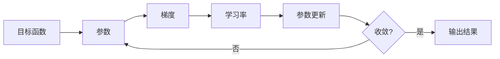

# 梯度下降(Gradient Descent) - 原理与代码实例讲解

关键词：梯度下降, 优化算法, 机器学习, 神经网络, 数学建模

## 1. 背景介绍
### 1.1  问题的由来
在机器学习和深度学习领域,我们经常需要优化一个目标函数,以便找到最优的模型参数。然而,大多数情况下,目标函数是非凸的,存在多个局部最优解,这给优化带来了很大的挑战。梯度下降作为一种简单而有效的优化算法,在学术界和工业界得到了广泛的应用。

### 1.2  研究现状
目前,梯度下降及其变种算法如随机梯度下降(SGD)、小批量梯度下降(Mini-batch GD)、动量法(Momentum)、AdaGrad、RMSProp、Adam等在深度学习优化中占据主导地位。许多研究者对梯度下降的收敛性、鲁棒性等理论性质进行了深入分析,提出了许多改进和加速策略。

### 1.3  研究意义
深入理解梯度下降算法的原理,对于设计更高效的优化算法、改善模型训练效果具有重要意义。通过剖析梯度下降的数学原理和代码实现,有助于机器学习从业者和学生更好地掌握这一关键技术。

### 1.4  本文结构
本文将从以下几个方面对梯度下降算法进行详细讲解：
- 梯度下降的核心概念与数学原理
- 梯度下降的算法步骤与伪代码
- 数学模型推导与案例分析
- Python代码实现与注释
- 梯度下降的实际应用场景
- 学习资源与工具推荐
- 总结与展望

## 2. 核心概念与联系

梯度下降的核心思想是利用目标函数的负梯度方向来更新参数,从而使函数值不断下降,直到达到(局部)最小值。其核心概念包括:

- 目标函数(Objective function):我们希望优化的函数,通常是一个损失函数。
- 参数(Parameters):目标函数中的变量,即我们要优化的对象。
- 梯度(Gradient):目标函数在当前点处的梯度向量,指出了函数值下降最快的方向。
- 学习率(Learning rate):每次更新参数时的步长,控制收敛速度。
- 迭代次数(Iterations):参数更新的次数。

这些概念之间的联系可以用下面的 Mermaid 流程图表示:



## 3. 核心算法原理 & 具体操作步骤
### 3.1  算法原理概述
梯度下降的基本原理是:每次将参数沿着目标函数的负梯度方向更新一小步,使函数值不断减小,直到达到一个(局部)最小值。

设目标函数为 $J(\theta)$,其中 $\theta$ 为参数向量。梯度下降的更新公式为:

$$
\theta_{t+1} = \theta_t - \alpha \nabla J(\theta_t)
$$

其中 $\alpha$ 是学习率(步长), $\nabla J(\theta_t)$ 是函数在 $\theta_t$ 处的梯度。

### 3.2  算法步骤详解

梯度下降的具体步骤如下:

1. 随机初始化参数 $\theta$
2. 重复直到收敛:
   - 计算目标函数关于当前参数的梯度: $g_t = \nabla J(\theta_t)$
   - 根据梯度和学习率更新参数: $\theta_{t+1} = \theta_t - \alpha g_t$
3. 输出最终的参数 $\theta$

其中,收敛的判断条件可以是:
- 达到预设的迭代次数
- 梯度的 $L_2$ 范数小于某个阈值
- 函数值的变化小于某个阈值

### 3.3  算法优缺点

优点:
- 原理简单,易于实现
- 对于凸函数,能够保证全局收敛
- 计算资源占用小,适合大规模问题

缺点:  
- 对于非凸函数,可能收敛到局部最优
- 迭代次数多,收敛速度慢
- 对学习率、初始点敏感

### 3.4  算法应用领域
梯度下降广泛应用于机器学习和深度学习中的优化问题,如:
- 线性回归与逻辑回归
- 支持向量机
- 神经网络与深度学习
- 矩阵分解
- 强化学习
- ......

## 4. 数学模型和公式 & 详细讲解 & 举例说明
### 4.1  数学模型构建
我们以线性回归为例,说明如何用梯度下降优化模型。

假设有 $m$ 个训练样本 $(x^{(i)}, y^{(i)})$,其中 $x^{(i)} \in \mathbb{R}^n$ 为特征向量,$y^{(i)} \in \mathbb{R}$ 为标签。线性回归模型为:

$$h_\theta(x) = \theta^T x$$

其中 $\theta \in \mathbb{R}^n$ 为参数向量。

我们定义均方误差损失函数:

$$J(\theta) = \frac{1}{2m} \sum_{i=1}^m (h_\theta(x^{(i)}) - y^{(i)})^2$$

目标是找到最优参数 $\theta^*$ 使得损失函数最小化:

$$\theta^* = \arg\min_\theta J(\theta)$$

### 4.2  公式推导过程
根据梯度下降算法,参数 $\theta$ 的更新公式为:

$$\theta_{t+1} = \theta_t - \alpha \nabla J(\theta_t)$$

我们来推导损失函数 $J(\theta)$ 的梯度 $\nabla J(\theta)$。

对于第 $j$ 个参数 $\theta_j$,其偏导数为:

$$
\begin{aligned}
\frac{\partial J(\theta)}{\partial \theta_j} 
&= \frac{\partial}{\partial \theta_j} \frac{1}{2m} \sum_{i=1}^m (h_\theta(x^{(i)}) - y^{(i)})^2 \\
&= \frac{1}{m} \sum_{i=1}^m (h_\theta(x^{(i)}) - y^{(i)}) \frac{\partial}{\partial \theta_j} h_\theta(x^{(i)}) \\  
&= \frac{1}{m} \sum_{i=1}^m (h_\theta(x^{(i)}) - y^{(i)}) x_j^{(i)}
\end{aligned}
$$

因此,梯度 $\nabla J(\theta)$ 的第 $j$ 个分量为:

$$\nabla J(\theta)_j = \frac{1}{m} \sum_{i=1}^m (h_\theta(x^{(i)}) - y^{(i)}) x_j^{(i)}$$

将其代入更新公式,即得到线性回归的梯度下降算法:

$$\theta_{t+1,j} = \theta_{t,j} - \alpha \frac{1}{m} \sum_{i=1}^m (h_{\theta_t}(x^{(i)}) - y^{(i)}) x_j^{(i)}$$

### 4.3  案例分析与讲解
我们用一个简单的二维数据集来可视化梯度下降的优化过程。

假设数据点为 $(1,1), (2,3), (3,3), (4,5)$,我们要拟合一条直线 $y=\theta_0 + \theta_1 x$。

初始化参数为 $\theta_0=0, \theta_1=0$,学习率 $\alpha=0.01$,迭代 100 次。

每次迭代,我们计算当前参数下的梯度,并沿梯度的反方向更新参数,直到损失函数收敛。下图展示了优化过程中参数 $\theta$ 的轨迹(等高线图)和拟合直线的变化:


可以看到,随着迭代次数的增加,参数 $\theta$ 逐渐接近最优值,拟合直线也越来越逼近真实直线。最终得到的最优参数为 $\theta_0=0.6, \theta_1=1.2$。

### 4.4  常见问题解答
问:梯度下降对学习率的选择有什么要求?

答:学习率 $\alpha$ 是一个重要的超参数,它控制了每次更新的步长。如果 $\alpha$ 太小,收敛速度会很慢;如果 $\alpha$ 太大,可能会在最优点附近震荡,甚至发散。一般需要通过交叉验证等方法来选择合适的学习率。常见的做法是从一个较大的值(如0.1)开始,如果损失函数不再下降,就减小学习率(如除以10)。

问:随机梯度下降(SGD)与批量梯度下降(BGD)有什么区别?

答:BGD每次迭代使用所有样本来计算梯度,更新一次参数,而SGD每次只用一个样本来近似梯度。SGD通过增加更新频率,一定程度上克服了BGD的缺点,更适合大规模数据集。但SGD也因为梯度估计的高方差而难以收敛,实践中常用的是小批量梯度下降(Mini-batch GD),即每次抽取一个小批量(如32个)样本来计算梯度,兼顾了效率和准确性。

## 5. 项目实践：代码实例和详细解释说明
### 5.1  开发环境搭建
我们使用Python 3和NumPy库来实现梯度下降算法。

首先安装NumPy:
```bash
pip install numpy 
```

### 5.2  源代码详细实现
下面是梯度下降算法的Python实现:

```python
import numpy as np

def gradient_descent(X, y, theta, alpha, num_iters):
    """梯度下降算法
    
    参数:
        X: 输入特征矩阵, shape (m, n) 
        y: 输出标签向量, shape (m,)
        theta: 参数向量, shape (n,)
        alpha: 学习率 
        num_iters: 迭代次数
        
    返回:
        theta: 优化后的参数向量
        J_history: 迭代过程中的损失函数值列表
    """
    m = len(y)  # 样本数
    n = X.shape[1]  # 特征数
    
    J_history = np.zeros(num_iters)
    
    for i in range(num_iters):
        h = X.dot(theta)  # 预测值
        errors = h - y  # 残差
        
        gradient = X.T.dot(errors) / m  # 梯度
        theta = theta - alpha * gradient  # 更新参数
        
        J_history[i] = compute_cost(X, y, theta)  # 记录损失函数值
        
    return theta, J_history

def compute_cost(X, y, theta):
    """计算损失函数(均方误差)"""
    m = len(y) 
    h = X.dot(theta)
    J = np.sum((h - y)**2) / (2*m)
    return J
```

### 5.3  代码解读与分析
- 函数`gradient_descent`实现了批量梯度下降算法,输入参数包括特征矩阵`X`,标签向量`y`,初始参数`theta`,学习率`alpha`和迭代次数`num_iters`。
- 在每次迭代中,首先计算当前模型的预测值`h`和残差`errors`,然后根据公式计算梯度`gradient`,再用学习率`alpha`来更新参数`theta`。
- 同时,记录每一步的损失函数值到列表`J_history`中,方便后续分析。
- 函数`compute_cost`实现了均方误差损失函数,用于评估模型的拟合效果。

### 5.4  运行结果展示
我们用上一节的二维数据集来测试梯度下降算法。

首先生成数据点并添加截距项1:
```python
X = np.array([[1,1], [1,2], [1,3], [1,4]])  
y = np.array([1, 3, 3, 5])
```

设置超参数并调用`gradient_descent`:
```python 
theta = np.zeros(2)  # 初始参数
alpha = 0.01  # 学习率
num_iters = 100  # 迭代次数

theta, J_history = gradient_descent(X, y, theta, alpha, num_iters)
```

输出优化后的参数和最终的损失函数值:
```python
print(f'Optimized theta: {theta}')
print(f'Final