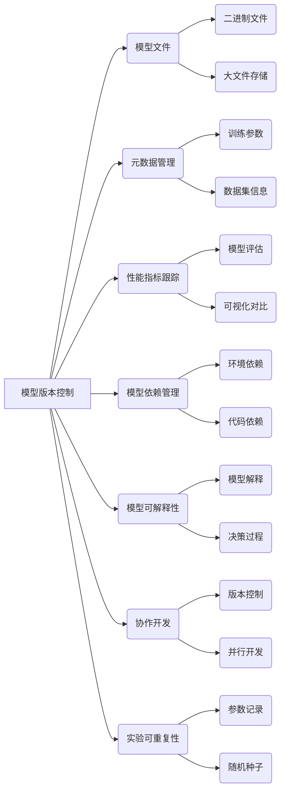

# 模型版本控制原理与代码实战案例讲解

## 1. 背景介绍

### 1.1 问题的由来

在机器学习和深度学习领域，模型是非常宝贵的资产。训练一个高质量的模型需要大量的计算资源、时间和人力。然而，在模型的开发过程中,我们经常需要尝试不同的架构、超参数和数据集,并对模型进行频繁的更新和迭代。如果没有一个有效的版本控制系统,很容易导致模型文件混乱、难以管理和回溯。

此外,在团队协作开发模型时,多个研究人员可能同时在不同的分支上工作,如果没有一个集中的版本控制系统,就很难跟踪和合并每个人的工作。这不仅会降低开发效率,还可能导致代码冲突和模型不一致的问题。

### 1.2 研究现状

目前,大多数机器学习团队仍然依赖于传统的文件系统或基本的版本控制工具(如Git)来管理模型文件。然而,这些工具并不能很好地满足机器学习模型的特殊需求,例如:

- 模型文件通常是二进制格式,无法直接进行文本比较和合并操作。
- 模型文件往往体积庞大,传统版本控制系统在存储和传输方面效率较低。
- 缺乏对模型元数据(如训练超参数、数据集信息等)的有效管理。
- 无法方便地比较和可视化不同版本模型的性能指标。

为了解决这些问题,一些公司和开源社区开始探索专门为机器学习模型设计的版本控制系统。其中,一些流行的解决方案包括DVC(Data Version Control)、MLFlow、Weights & Biases等。

### 1.3 研究意义

建立一个高效、可靠的模型版本控制系统,对于机器学习项目的顺利进行至关重要。它可以带来以下主要好处:

1. **提高开发效率**:通过自动化模型管理流程,减少手动操作,节省时间和精力。
2. **确保可重复性**:准确记录模型的所有依赖项和配置,确保实验可以被重复。
3. **促进协作**:团队成员可以方便地共享和合并彼此的工作,避免冲突。
4. **回溯历史**:可以轻松回溯到任何历史版本的模型,方便调试和复现。
5. **模型可解释性**:通过元数据管理和可视化,更好地理解模型的行为和性能。

因此,建立一个完善的模型版本控制系统,对于提高机器学习项目的质量和效率至关重要。

### 1.4 本文结构

本文将从以下几个方面全面介绍模型版本控制的原理和实践:

1. 核心概念与联系
2. 核心算法原理与具体操作步骤
3. 数学模型和公式详细讲解与案例分析  
4. 项目实践:代码实例和详细解释说明
5. 实际应用场景
6. 工具和资源推荐
7. 总结:未来发展趋势与挑战
8. 附录:常见问题与解答

接下来,我们将逐一探讨这些内容。

## 2. 核心概念与联系

在深入探讨模型版本控制的细节之前,我们先来了解一些核心概念及它们之间的联系。

**模型文件 (B)**: 机器学习模型的核心是模型文件,通常是二进制格式 (I),体积较大 (J)。模型文件包含了模型的权重、架构等信息。

**元数据管理 (C)**: 除了模型文件本身,我们还需要记录模型的元数据,如训练参数 (K)、数据集信息 (L)等,以确保实验的可重复性。

**性能指标跟踪 (D)**: 为了评估和比较不同版本的模型,我们需要跟踪和记录模型的性能指标 (M),并提供可视化对比 (N)的功能。

**模型依赖管理 (E)**: 机器学习模型通常依赖于特定的环境 (O)和代码库 (P),因此需要对这些依赖项进行管理和版本控制。

**模型可解释性 (F)**: 除了模型的性能,我们还需要关注模型的可解释性,即了解模型的内部决策过程 (R),并提供模型解释 (Q)的功能。

**协作开发 (G)**: 在团队开发环境中,需要支持版本控制 (S)和并行开发 (T)功能,以便多人协作。

**实验可重复性 (H)**: 为了确保实验的可重复性,我们需要准确记录所有训练参数 (U)和随机种子 (V)。

这些核心概念相互关联、环环相扣,共同构建了一个完整的模型版本控制系统。接下来,我们将详细探讨系统的核心算法原理和实现细节。

## 3. 核心算法原理与具体操作步骤

### 3.1 算法原理概述

模型版本控制系统的核心算法原理可以概括为以下几个关键步骤:

1. **模型文件存储**:将模型文件及其元数据存储在版本控制系统中,并对文件进行唯一标识和版本化管理。
2. **模型依赖捕获**:自动捕获和记录模型所依赖的环境、代码库和数据集等信息。
3. **模型指纹计算**:基于模型文件内容和元数据,计算出一个唯一的指纹(例如哈希值),用于快速比较和查找模型。
4. **指标跟踪和可视化**:记录和可视化每个模型版本的性能指标,以便进行对比和分析。
5. **版本管理和协作**:支持模型版本的创建、切换、合并等操作,并允许多人并行开发。
6. **模型解释和决策过程分析**:提供模型解释和决策过程分析的功能,增强模型的可解释性。

这些步骤有机结合,构成了一个完整的模型版本控制流程。接下来,我们将详细介绍每个步骤的具体实现细节。

### 3.2 算法步骤详解

#### 3.2.1 模型文件存储

模型文件存储是整个系统的基础。由于模型文件通常是二进制格式,无法直接进行文本比较和合并操作,因此我们需要采用特殊的存储和版本化策略。

一种常见的做法是将模型文件存储在对象存储系统(如Amazon S3、Google Cloud Storage等)中,并使用内容可寻址的方式进行版本化管理。具体来说,对于每个新的模型文件,我们计算其内容的哈希值(如SHA-256),并将该哈希值作为文件的唯一标识符。这样,即使文件名相同,只要内容不同,它们就会被视为不同的版本。

此外,我们还需要存储模型的元数据,如训练参数、数据集信息等。这些元数据通常以JSON或YAML格式存储,并与模型文件建立关联。

#### 3.2.2 模型依赖捕获

为了确保实验的可重复性,我们需要准确记录模型所依赖的环境、代码库和数据集等信息。这可以通过以下几种方式实现:

1. **环境依赖捕获**:使用虚拟环境工具(如conda、virtualenv)来隔离和管理模型的Python环境依赖。系统可以自动捕获和记录环境配置文件(如requirements.txt、environment.yml)。

2. **代码依赖捕获**:对于自定义的代码库,可以使用Git等版本控制系统来管理代码。系统可以自动记录当前的Git提交哈希值,以唯一标识代码版本。

3. **数据集依赖捕获**:对于训练和评估所使用的数据集,可以计算其哈希值或存储在对象存储系统中,并在元数据中记录其位置和版本信息。

通过捕获这些依赖信息,我们可以确保在任何时候都能重现模型的训练和评估环境,从而保证实验的可重复性。

#### 3.2.3 模型指纹计算

为了快速比较和查找模型,我们需要为每个模型版本计算一个唯一的指纹(fingerprint)。这个指纹通常是基于模型文件内容和元数据计算出的哈希值。

具体来说,我们可以采用以下步骤计算模型指纹:

1. 计算模型文件内容的哈希值,例如使用SHA-256算法。
2. 从元数据中提取关键信息,如训练参数、数据集版本等,并将它们连接成一个字符串。
3. 计算元数据字符串的哈希值。
4. 将模型文件哈希值和元数据哈希值连接,计算最终的模型指纹。

通过这种方式,即使模型文件名相同,只要内容或元数据发生变化,模型指纹也会发生改变。这为快速比较和查找模型版本提供了基础。

#### 3.2.4 指标跟踪和可视化

为了评估和比较不同版本的模型,我们需要跟踪和记录每个模型版本的性能指标,如准确率、损失函数值等。这些指标可以在训练和评估阶段自动记录,并与对应的模型版本建立关联。

除了记录原始的数值指标,我们还可以提供可视化功能,如折线图、散点图等,以便直观地比较不同模型版本的性能表现。这对于快速发现模型的优化空间和潜在问题非常有帮助。

#### 3.2.5 版本管理和协作

版本管理和协作是模型版本控制系统的核心功能之一。我们需要支持以下操作:

1. **创建新版本**:当训练出新的模型时,可以创建一个新的版本,并关联相应的模型文件、元数据和性能指标。
2. **切换版本**:用户可以方便地在不同版本的模型之间切换,以便进行比较和分析。
3. **合并版本**:允许将多个模型版本的改动合并到一个新的版本中,类似于Git的合并操作。
4. **版本线**:维护一个版本线(类似于Git分支),允许多人并行开发不同的模型版本。
5. **协作开发**:支持多人协作开发模型,包括版本合并、冲突解决等功能。

通过这些版本管理和协作功能,我们可以有效地组织和管理模型的开发过程,提高团队的工作效率。

#### 3.2.6 模型解释和决策过程分析

除了模型的性能指标,我们还需要关注模型的可解释性,即了解模型的内部决策过程和原理。这对于建立对模型的信任、发现潜在偏差和漏洞至关重要。

模型版本控制系统可以提供以下功能来增强模型的可解释性:

1. **模型解释**:使用各种解释技术(如SHAP、LIME等)来解释模型的决策过程,并以可视化的方式呈现。
2. **决策过程分析**:分析模型在特定输入下的决策路径,了解它是如何得出最终预测结果的。
3. **特征重要性分析**:识别对模型决策有重大影响的特征,并量化它们的重要性程度。
4. **偏差和公平性分析**:检测模型在不同人口统计群体上的表现差异,识别潜在的偏差和不公平现象。

通过这些功能,我们可以更好地理解模型的行为,从而进一步优化和调整模型,提高其性能和可靠性。

### 3.3 算法优缺点

模型版本控制系统的核心算法