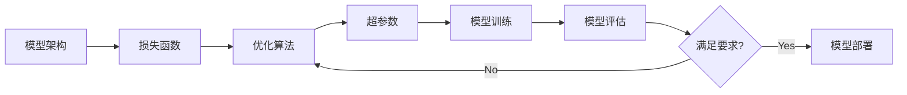

# 模型训练与优化技术原理与代码实战案例讲解

关键词：机器学习、深度学习、模型训练、优化算法、超参数调优、正则化

## 1. 背景介绍
### 1.1 问题的由来
随着人工智能技术的飞速发展,机器学习和深度学习在各个领域得到了广泛应用。而模型训练作为机器学习的核心环节,直接决定了最终模型的性能表现。然而,面对日益复杂的应用场景和海量数据,如何高效地训练出性能优异的模型,成为了一个亟待解决的问题。
### 1.2 研究现状
目前,学术界和工业界都在模型训练和优化技术上投入了大量精力。一方面,各种新的优化算法不断涌现,如Adam、AdaGrad、RMSprop等,极大地提升了模型训练的效率和效果。另一方面,正则化、Early Stopping、Dropout等技巧在控制模型复杂度、防止过拟合方面发挥了重要作用。
### 1.3 研究意义 
深入研究模型训练与优化技术,对于提升机器学习模型的性能,加速模型的迭代优化过程,具有重要的理论意义和实践价值。一方面,优化后的模型能够更好地拟合数据,挖掘出数据中蕴含的规律和价值。另一方面,高效的训练优化技术能够大幅度缩短模型上线时间,为企业节约大量成本。
### 1.4 本文结构
本文将全面阐述模型训练与优化的原理、方法和实践。第2部分介绍相关核心概念;第3部分重点讲解主流优化算法的原理和步骤;第4部分建立优化问题的数学模型并给出公式推导;第5部分通过代码实例演示各种优化技术的使用;第6部分总结在实际场景中的最佳实践;第7部分推荐相关工具和学习资源;第8部分展望未来的研究方向和挑战;第9部分为常见问题解答。

## 2. 核心概念与联系
在深入探讨模型训练和优化技术之前,我们有必要明确一些核心概念:
- 损失函数(Loss Function):衡量模型预测值与真实值之间差异的函数,是优化的目标函数。
- 优化算法(Optimization Algorithm):通过不断迭代、调整模型参数以最小化损失函数的算法。 
- 学习率(Learning Rate):每次迭代优化时,参数调整的步长。学习率过大会导致优化发散,过小会导致收敛速度慢。
- Batch Size:每次迭代时,参与训练的样本数量。Batch Size的选择需要权衡内存占用和训练速度。
- 正则化(Regularization):通过在损失函数中引入惩罚项,限制模型复杂度,防止过拟合的技术。
- 超参数(Hyper-parameter):控制模型训练过程的一系列参数,如学习率、Batch Size、正则化系数等,需要根据具体问题进行调优。

这些概念之间环环相扣,共同构成了模型训练与优化的基本框架。损失函数决定了优化的目标,优化算法是达成目标的途径,而超参数则影响优化的方向和效率。下图展示了这些概念之间的关系:

## 3. 核心算法原理 & 具体操作步骤
### 3.1 算法原理概述
在众多优化算法中,梯度下降(Gradient Descent)可以说是最经典和应用最广泛的一类。梯度下降的核心思想是:沿着损失函数梯度的反方向,不断调整模型参数,直到找到损失函数的局部最小值。常见的梯度下降变体有:
- 批量梯度下降(Batch Gradient Descent,BGD):每次迭代使用全量数据集计算梯度,更新参数。
- 随机梯度下降(Stochastic Gradient Descent,SGD):每次迭代随机抽取一个样本计算梯度,更新参数。
- 小批量梯度下降(Mini-batch Gradient Descent,MBGD):每次迭代随机抽取一个小批量样本计算梯度,更新参数。

除经典的梯度下降外,还有很多优秀的优化算法,如牛顿法、共轭梯度法等,但由于梯度下降简单高效,仍是当前主流的选择。在此基础上,又衍生出了一系列自适应学习率的优化算法,如Adagrad、Adadelta、RMSprop、Adam等,能够根据梯度的历史信息自动调节学习率,加速收敛。
### 3.2 算法步骤详解
下面我们以小批量梯度下降为例,详细讲解其优化步骤:

输入:训练集 $\{(x_1,y_1),...,(x_N,y_N)\}$,损失函数 $J(\theta)$,学习率 $\alpha$,Batch Size $B$,迭代次数 $T$
输出:模型参数 $\theta$
1. 随机初始化参数 $\theta$
2. for $t=1$ to $T$:
3. 从训练集中随机抽取 $B$ 个样本 $\{(x_{i_1},y_{i_1}),...,(x_{i_B},y_{i_B})\}$
4. 计算损失函数关于参数的梯度:
$$
g_t=\frac{1}{B}\nabla_{\theta}J(\theta) = \frac{1}{B}\sum_{j=1}^B\nabla_{\theta}J(x_{i_j},y_{i_j};\theta)
$$
5. 更新参数:
$$
\theta=\theta-\alpha \cdot g_t
$$
6. end for

可见,小批量梯度下降在每次迭代时,随机抽取一批样本,计算它们的平均梯度,然后沿梯度反方向更新参数。相比BGD,MBGD 避免了使用全量数据集,降低了计算开销。相比SGD,MBGD 通过一次计算多个样本的梯度,减少了参数更新的波动性,使收敛更加平稳。
### 3.3 算法优缺点
小批量梯度下降兼顾了收敛速度和计算效率,是目前使用最广泛的优化算法。但它仍然存在一些局限:
- 容易陷入局部最优,难以跳出
- 对所有参数使用相同的学习率,无法自适应
- 超参数(学习率、Batch Size等)选择困难,需要反复调试

因此,在实践中,我们往往会使用Adam、RMSprop等自适应优化算法来克服这些缺陷。
### 3.4 算法应用领域
小批量梯度下降及其变体在机器学习和深度学习中得到了广泛应用,尤其在以下场景:
- 大规模分类和回归问题:如垃圾邮件识别、推荐系统、股价预测等
- 复杂非凸优化问题:如深度神经网络的训练
- 在线学习:如实时数据流的处理

## 4. 数学模型和公式 & 详细讲解 & 举例说明 
### 4.1 数学模型构建
为了使用梯度下降优化算法,我们首先要建立优化问题的数学模型。以线性回归为例,假设我们有 $N$ 个样本 $\{(x_1,y_1),...,(x_N,y_N)\}$,其中 $x_i \in \mathbb{R}^d$,$y_i \in \mathbb{R}$。我们的目标是学习一个线性模型:
$$
f(x)=w^Tx+b
$$
使得预测值 $f(x_i)$ 与真实值 $y_i$ 尽可能接近。为此,我们定义均方误差损失函数:
$$
J(w,b)=\frac{1}{N}\sum_{i=1}^N(f(x_i)-y_i)^2=\frac{1}{N}\sum_{i=1}^N(w^Tx_i+b-y_i)^2
$$
现在,优化问题转化为求解损失函数 $J(w,b)$ 的最小值,即:
$$
\min_{w,b} J(w,b)
$$
### 4.2 公式推导过程
要使用梯度下降法优化上述问题,关键是计算损失函数 $J(w,b)$ 关于参数 $w,b$ 的梯度。利用矩阵微积分,我们可以推导出:
$$
\begin{aligned}
\frac{\partial J}{\partial w} &= \frac{2}{N}\sum_{i=1}^N(w^Tx_i+b-y_i)x_i \\
\frac{\partial J}{\partial b} &= \frac{2}{N}\sum_{i=1}^N(w^Tx_i+b-y_i)
\end{aligned}
$$
进一步,我们可以将 $N$ 个样本的梯度统一表示为:
$$
\nabla J(w,b)=\begin{bmatrix}
\frac{\partial J}{\partial w} \\ 
\frac{\partial J}{\partial b}
\end{bmatrix}=\frac{2}{N}\sum_{i=1}^N(w^Tx_i+b-y_i)\begin{bmatrix}
x_i \\ 
1
\end{bmatrix}
$$
有了梯度表达式,我们就可以应用梯度下降公式迭代更新参数:
$$
\begin{aligned}
w &:= w - \alpha \frac{\partial J}{\partial w} \\
b &:= b - \alpha \frac{\partial J}{\partial b}
\end{aligned}
$$
其中 $\alpha$ 为学习率。重复迭代直到损失函数收敛或达到预设的迭代次数。
### 4.3 案例分析与讲解
下面我们以一个简单的一元线性回归为例,直观地展示梯度下降的过程。假设我们有5个样本点:$(1,1),(2,3),(3,2),(4,4),(5,3)$,我们要拟合一条直线 $y=wx+b$ 来预测 $y$ 值。

首先,随机初始化参数,例如取 $w=1,b=0$,此时拟合直线为 $y=x$。

在第一次迭代中,我们随机选择3个样本 $(1,1),(3,2),(4,4)$ 计算梯度:
$$
\begin{aligned}
\frac{\partial J}{\partial w} &= \frac{2}{3}((1+0-1)\times1+(3+0-2)\times3+(4+0-4)\times4)=4 \\
\frac{\partial J}{\partial b} &= \frac{2}{3}((1+0-1)+(3+0-2)+(4+0-4))=\frac{2}{3}
\end{aligned}
$$
取学习率 $\alpha=0.1$,则参数更新为:
$$
\begin{aligned}
w &:= 1 - 0.1 \times 4 = 0.6 \\
b &:= 0 - 0.1 \times \frac{2}{3} = -0.067
\end{aligned}
$$
此时,拟合直线变为 $y=0.6x-0.067$,可以看出,直线向样本点的方向移动了一步。

如此迭代下去,经过多次更新后,拟合直线会不断逼近样本点,最终收敛到最优解。
### 4.4 常见问题解答
Q:梯度下降法一定能收敛到全局最优解吗?
A:不一定。梯度下降法容易陷入局部最优,当目标函数非凸时,梯度下降找到的只是局部最优解。但对于凸函数(如线性回归的损失函数),梯度下降可以保证收敛到全局最优。

Q:如何选择合适的学习率?
A:选择合适的学习率是梯度下降的关键。学习率过大,算法可能会发散;学习率过小,收敛速度会很慢。一般建议通过交叉验证等方法对学习率进行调优。自适应学习率算法如Adam、Adadelta等可以一定程度上减轻学习率选择的难度。

Q:梯度下降对数据规模有什么要求?
A:当数据规模很大时,批量梯度下降的计算开销会非常高。此时,小批量梯度下降可以很好地平衡计算效率和收敛速度。实践中,Batch Size的选择需要权衡内存限制、并行加速效果等因素。

## 5. 项目实践：代码实例和详细解释说明
### 5.1 开发环境搭建
本项目使用Python 3和PyTorch深度