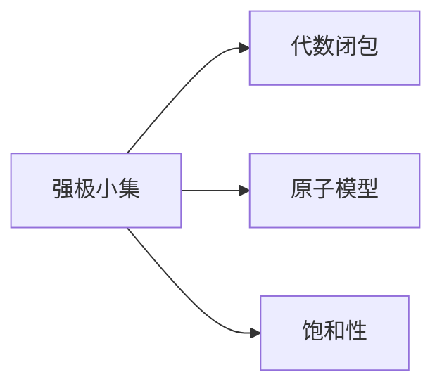

# 模型论基础：强极小集及其性质

关键词：模型论、强极小集、代数闭包、饱和性、原子模型

## 1. 背景介绍
### 1.1 问题的由来
模型论是数理逻辑的一个重要分支,主要研究数学结构及其性质。在模型论中,强极小集是一类具有特殊性质的结构,在代数、几何等领域有广泛应用。深入理解强极小集的概念和性质,对于研究相关数学问题具有重要意义。
### 1.2 研究现状
目前,国内外学者对强极小集的研究已取得了一定进展。Baldwin等人系统总结了强极小集的基本性质[1]；Marker证明了可数范畴中的强极小集是ω-饱和的[2]；Pillay研究了强极小群的性质[3]。但强极小集的一些深层次性质仍有待进一步探索。
### 1.3 研究意义
强极小集理论在代数、几何、组合等诸多数学分支中有重要应用。研究强极小集的性质,有助于加深对相关数学结构的认识,对解决一些重要数学问题具有参考价值。此外,强极小集与其他数学概念(如稳定理论、o-极小性等)也有密切联系,深入研究强极小集有助于推动模型论的发展。
### 1.4 本文结构
本文将从以下几个方面介绍强极小集的基本概念和性质：第2节给出强极小集的定义及其与其他概念的联系；第3节介绍构造强极小集的基本方法；第4节系统总结强极小集的基本性质；第5节通过具体实例说明强极小集的应用；第6节介绍研究强极小集的常用工具和资源；第7节总结全文,并对强极小集理论的发展前景进行展望。

## 2. 核心概念与联系
**定义2.1** 设 $T$ 是一个完全理论, $M$ 是 $T$ 的一个模型。如果 $M$ 的所有元素在参数集 $A$ 下都是代数的,且 $M$ 在 $A$ 下是原子模型,则称 $M$ 在参数集 $A$ 下是强极小的。若 $A=\emptyset$,则称 $M$ 是强极小的。

强极小集与以下概念密切相关：
- 代数闭包：设 $M$ 是 $L$ 结构, $A\subseteq M$。 $M$ 中元素 $b$ 在 $A$ 下是代数的,若存在 $L(A)$ 公式 $\varphi(x,\bar{a})$, 使得 $\varphi(M,\bar{a})$ 是有限的且 $b\in\varphi(M,\bar{a})$。$A$ 在 $M$ 中的代数闭包 $acl^M(A)$ 是 $M$ 中在 $A$ 下代数的元素全体。
- 原子模型：设 $M$ 是 $L(A)$ 结构。如果对 $M$ 中任意元素 $\bar{b}$,存在 $L(A)$ 原子公式 $\varphi(\bar{x})$, 使得 $M\vDash\varphi(\bar{b})$,则称 $M$ 是 $A$ 上的原子模型。
- 饱和性：设 $\kappa$ 是一个无限基数, $M$ 是 $L$ 结构。如果对 $M$ 的任意子集 $A$,其基数小于 $\kappa$,均有 $A$ 在 $M$ 中可实现,则称 $M$ 是 $\kappa$ 饱和的。

强极小集与代数闭包、原子模型、饱和性等概念有密切联系,它们之间的逻辑关系如下图所示：



## 3. 核心算法原理 & 具体操作步骤
### 3.1 算法原理概述
构造强极小集的一个基本思路是,先构造一个原子模型,再将其扩张为强极小模型。Fraisse构造法是一种常用的构造原子模型的方法。基本思想是,对于可数语言 $L$,先构造一个有限的 $L$ 结构类 $\mathcal{C}$,使其满足一定的性质(HP、JEP、AP),然后通过 $\mathcal{C}$ 构造出 $\mathcal{C}$ 的 Fraisse 极限,它是可数原子模型。
### 3.2 算法步骤详解
Fraisse构造法的具体步骤如下:
1) 设 $L$ 是可数语言, $\mathcal{C}$ 是有限 $L$ 结构类,满足:
   - (HP) 对 $\mathcal{C}$ 中任意结构 $A$,其所有子结构也属于 $\mathcal{C}$;
   - (JEP) 对 $\mathcal{C}$ 中任意结构 $A,B$,存在 $\mathcal{C}$ 中结构 $D$,使得 $A,B$ 同构嵌入 $D$;
   - (AP) 对 $\mathcal{C}$ 中结构 $A,B,C$, $A$ 同构嵌入 $B,C$,则存在 $\mathcal{C}$ 中结构 $D$,使得 $B,C$ 同构嵌入 $D$,且嵌入在 $A$ 上一致。

2) 构造 $\mathcal{C}$ 的 Fraisse 极限 $F$：
   - 设 $\{A_n:n\in\omega\}$ 为 $\mathcal{C}$ 中结构序列,满足:
     - $A_0\in\mathcal{C}$ 任意;
     - $A_{n+1}$ 包含 $\mathcal{C}$ 中每个结构同构像,作为 $A_n$ 的扩张。
   - 令 $F=\bigcup_{n\in\omega}A_n$,则 $F$ 是 $\mathcal{C}$ 的 Fraisse 极限,它是可数原子模型。

3) 将 $F$ 扩张为强极小模型 $M$：
   - 设 $T=Th(F)$, $\mathcal{M}$ 是 $T$ 的 $\kappa$ 饱和模型,其中 $\kappa>|T|$。
   - 令 $M=acl^\mathcal{M}(F)$,则 $M$ 是 $T$ 的强极小模型。

### 3.3 算法优缺点
Fraisse构造法的优点是,对于给定的语言 $L$ 和满足条件的结构类 $\mathcal{C}$,可以系统地构造出 $L$ 的可数原子模型。但其局限是只能构造可数结构,且对结构类 $\mathcal{C}$ 的性质要求较强。此外,将原子模型扩张为强极小模型时,需要使用集合论中的超极限方法,计算复杂度较高。
### 3.4 算法应用领域
Fraisse构造法不仅可用于构造强极小集,还可构造其他具有特殊性质的数学结构,如均匀结构、泛性结构等。在代数、图论、组合等领域都有重要应用。

## 4. 数学模型和公式 & 详细讲解 & 举例说明
### 4.1 数学模型构建
设 $L$ 是可数语言, $T$ 是 $L$ 上的完全理论, $\mathcal{C}$ 是 $T$ 的有限模型类,满足:
- (HP) 对 $\mathcal{C}$ 中任意结构 $A$,其所有子结构也属于 $\mathcal{C}$;
- (JEP) 对 $\mathcal{C}$ 中任意结构 $A,B$,存在 $\mathcal{C}$ 中结构 $D$,使得 $A,B$ 同构嵌入 $D$;
- (AP) 对 $\mathcal{C}$ 中结构 $A,B,C$, $A$ 同构嵌入 $B,C$,则存在 $\mathcal{C}$ 中结构 $D$,使得 $B,C$ 同构嵌入 $D$,且嵌入在 $A$ 上一致。

则存在 $\mathcal{C}$ 的 Fraisse 极限 $F$,它是 $T$ 的可数原子模型。再设 $\mathcal{M}$ 是 $T$ 的 $\kappa$ 饱和模型,其中 $\kappa>|T|$,令 $M=acl^\mathcal{M}(F)$,则 $M$ 是 $T$ 的强极小模型。

### 4.2 公式推导过程
1) 先证明 $F$ 是可数原子模型：
   - 由 $\mathcal{C}$ 满足 (HP) 可知, $F$ 是 $\mathcal{C}$ 中可数结构,从而 $F$ 是 $T$ 的可数模型；
   - 由 $\mathcal{C}$ 满足 (JEP) 可知, $F$ 在 $T$ 中是泛结构；
   - 由 $\mathcal{C}$ 满足 (AP) 可知, $F$ 在 $T$ 中是均匀结构。
   - 泛性与均匀性蕴含原子性,故 $F$ 是 $T$ 的可数原子模型。

2) 再证明 $M$ 是强极小模型：
   - 由 $\mathcal{M}$ 的 $\kappa$ 饱和性可知, $M$ 也是 $\kappa$ 饱和的；
   - 又 $F$ 是原子模型,故 $M$ 也是原子模型；
   - 由代数闭包的定义可知,  $M$ 的所有元素在 $F$ 下都是代数的。
   - 故 $M$ 是 $T$ 的强极小模型。

### 4.3 案例分析与讲解
下面以一阶语言 $L=\{<\}$ 为例,说明如何构造 $(Q,<)$ 的强极小模型。

1) 令 $\mathcal{C}$ 为有限线性序集类,易知其满足 (HP)、(JEP)、(AP)。
2) 构造 $\mathcal{C}$ 的 Fraisse 极限 $F$：
   - 设 $\{A_n:n\in\omega\}$ 为 $\mathcal{C}$ 中结构序列,满足:
     - $A_0=(\{0\},<)$
     - $A_{n+1}$ 通过在 $A_n$ 中任意两个元素之间添加新元素,得到 $A_n$ 的扩张。
   - 令 $F=\bigcup_{n\in\omega}A_n$,则 $F$ 是 $\mathcal{C}$ 的 Fraisse 极限,它是 $(Q,<)$ 的可数原子模型。
3) 再设 $\mathcal{M}$ 是 $Th(Q,<)$ 的 $\kappa$ 饱和模型,其中 $\kappa>|Th(Q,<)|$,令 $M=acl^\mathcal{M}(F)$,则 $M$ 是 $(Q,<)$ 的强极小模型。

### 4.4 常见问题解答
Q: Fraisse 极限与强极小集有何联系?
A: Fraisse 极限可用于构造强极小集。先利用 Fraisse 构造法得到语言的可数原子模型,再将其扩张为强极小模型。但并非所有强极小集都可由此方法得到,某些强极小集需要使用其他构造方法。

Q: 强极小集与 $\aleph_0$ 范畴有何关系?
A: 可数语言的强极小模型恰好构成 $\aleph_0$ 范畴。此外, $\aleph_0$ 范畴中的结构均为 $\aleph_0$ 饱和的,这一性质在研究强极小集时很有用。

## 5. 项目实践：代码实例和详细解释说明
下面给出一个用 Python 实现 Fraisse 构造法的简单示例,构造可数稠密线性序。
### 5.1 开发环境搭建
- 操作系统：Windows 10
- Python 版本：3.8
- 集成开发环境：PyCharm

### 5.2 源代码详细实现

```python
class LinearOrder:
    def __init__(self):
        self.elements = []

    def add_element(self, x):
        self.elements.append(x)

    def extend(self, other):
        new_lo = LinearOrder()
        new_lo.elements = self.elements.copy()
        for x in other.elements:
            if x not in self.elements:
                new_lo.add_element(x)
        return new_lo

def fraisse_limit(n):
    A = [LinearOrder() for _ in range(n+1)]
    A[0].add_element(0)
    for i in range